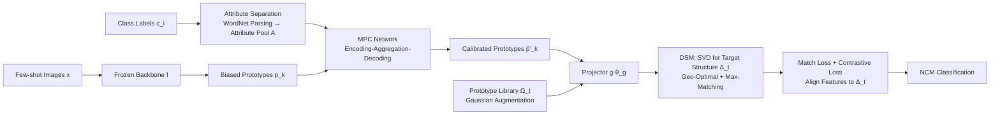

# Consistency-Driven Calibration and Matching for Few-Shot Class Incremental Learning

**Conference**: ICLR 2026  
**OpenReview**: [https://openreview.net/forum?id=LxO83jNZKk](https://openreview.net/forum?id=LxO83jNZKk)  
**Code**: [https://github.com/wire-wqz/ConCM](https://github.com/wire-wqz/ConCM)  
**Area**: Few-Shot Class Incremental Learning / Continual Learning  
**Keywords**: FSCIL, Prototype Calibration, Neural Collapse, Dynamic Structure Matching, Meta-learning, Associative Memory  

## TL;DR
ConCM reformulates the core dilemma of Few-Shot Class Incremental Learning (FSCIL) as a "feature-structure dual consistency" problem. It first corrects few-shot prototype shifts using Memory-aware Prototype Calibration (MPC) inspired by hippocampal associative memory, and then solves for an evolvable embedding structure that simultaneously satisfies geometric optimality and maximum matching via Dynamic Structure Matching (DSM) in each incremental session. This approach achieves SOTA harmonic mean performance on mini-ImageNet, CIFAR100, and CUB200.

## Background & Motivation
- **Background**: FSCIL requires models to extend to new classes with only 5 samples per session after training on a base session with sufficient data, without forgetting old knowledge. Prevailing methods typically freeze the backbone and use prototype classifiers or "prospective learning" to reserve space for new classes, such as FACT's virtual prototypes, NC-FSCIL's Equiangular Tight Frames (ETF), or OrCo's orthogonal spaces.
- **Limitations of Prior Work**: Preliminary experiments on mini-ImageNet reveal two critical issues. First, **feature inconsistency**: few-shot prototypes deviate from true class centers (the larger the prototype bias $1-\cos(p,p_{real})$, the lower the accuracy). Second, **structure inconsistency**: even with calibrated prototypes, new class samples are frequently misclassified as old classes (false positives) because fixed structures impose rigid priors that limit matching flexibility.
- **Key Challenge**: Prospective learning methods often trade new class performance by "compressing old class embeddings," lacking global structural optimization across sessions. Fixed structures like ETF or orthogonal spaces lock new classes into predefined geometries, and neither fully resolves the conflict between old and new knowledge.
- **Goal**: To achieve robust continual learning from a unified "Consistency-Driven Structured Learning" perspective, addressing both prototype bias (feature-side) and structural rigidity (structure-side) inconsistencies.
- **Core Idea**: **Dual Consistency Perspective**—reformulating FSCIL optimization as a joint guarantee of feature and structural consistency. **Memory-driven**—mimicking the two-stage "separation-completion" of hippocampal associative memory for semantic calibration. **Evolvable Structure**—dynamically solving for a target structure in each session that is theoretically guaranteed to be geometrically optimal and maximally matched without requiring a prior on the total number of sessions.

## Method

### Overall Architecture
ConCM connects two modules above a frozen backbone: MPC corrects the prototypes of new classes, and the calibrated features are fed into a trainable projector $g(\cdot;\theta_g)$. DSM then generates a target geometric structure for the current session and aligns the features accordingly. Inference uses a Nearest Class Mean (NCM) classifier based on the distance between features and geometric vectors.

### Key Designs

**1. Memory-aware Prototype Calibration (MPC): Transferring semantic attributes from base classes to new classes.** 
Hippocampal associative memory encodes sensory info into high-level representations for indexing and retrieves/integrates them upon receiving partial signals. MPC follows two steps: **Attribute Separation** uses WordNet to parse base class labels and extract synonyms/hypernyms into an attribute pool $A=\{a_i\}$. A visual prototype $f_{a_i}$ is calculated for each attribute. **Attribute Completion** uses an encoding-aggregation-decoding network with cross-attention: correlation weights $w_{a_i}^k$ fuse semantic association (word embedding similarity) and visual association (prototype distance), controlled by a mask $r_{a_i,k}$. The network is trained via meta-learning on base sessions to minimize $L_{MSE}=\mathrm{MSE}(h(p_k^{meta},\Pi_0;\theta_h),p_k^{base})$, learning to "complete missing attributes." Final prototypes are fused as $\hat p'_k=\alpha p_k+(1-\alpha)\hat p_k$ and augmented via Gaussian sampling.

**2. Dynamic Structure Matching (DSM): Solving for an optimal evolvable structure on-the-fly.** 
The target geometric structure $\Delta_t=[\delta_1,\dots,\delta_{N_t}]$ is constrained by two properties. **Geometric Optimality** requires equidistant separation (Neural Collapse theory): $\delta_i^\top\delta_j=\frac{N_t}{N_t-1}\lambda_{i,j}-\frac{1}{N_t-1}$. **Maximum Matching** requires minimal structural change when embedding new classes, maximizing similarity $\arg\max\sum_i\langle\delta'_i,\delta_i\rangle$ between the target structure and the internal structure $\Delta'_t$ containing new classes. Theorem 1 provides a closed-form solution: applying SVD to $\Delta'_t(I_{N_t}-\frac{1}{N_t}\mathbf{1}\mathbf{1}^\top)$ yields $W\Lambda V^\top$. Setting $U_t=WV^\top$, then $\Delta_t=\sqrt{\frac{N_t}{N_t-1}}U_t(I_{N_t}-\frac{1}{N_t}\mathbf{1}\mathbf{1}^\top)$. This allows the structure to "grow" with sessions rather than being pre-defined.

**3. Feature-Structure Joint Optimization: Pulling projected features toward the current structure.** 
With the target structure $\Delta_t$, the projector is trained using two losses. **Match Loss** is a classification loss using structural vectors as class centers: $L_{Match}(z_i)=-\log\frac{\exp(\langle z_i,\delta_k\rangle)}{\sum_j\exp(\langle z_i,\delta_j\rangle)}$. **Supervised Contrastive Loss** uses $\delta_k$ as anchors in the positive set to explicitly inject structural information and enhance intra-class compactness. Training data is generated from a prototype library $\Omega_t$ containing base class prototypes and covariance diagonals to mitigate data absence.

## Key Experimental Results

### Main Results (Harmonic Mean HM / Average HM AHM / Final Accuracy FA)

mini-ImageNet (Selection):

| Method | AHM↑ | FA↑ |
|------|------|-----|
| NC-FSCIL (2023) | 52.62 | 57.97 |
| OrCo (2024) | 57.30 | 56.04 |
| **Ours (ConCM)** | **59.78** | **59.92** |

CIFAR100 (Selection):

| Method | AHM↑ | FA↑ |
|------|------|-----|
| NC-FSCIL | 47.89 | 56.11 |
| OrCo | 57.12 | 52.19 |
| **Ours (ConCM)** | **59.05** | **58.33** |

ConCM leads across all datasets. Relative to the static-structured NC-FSCIL, AHM improves by 5.04%–11.16%.

### Ablation Study (mini-ImageNet)

| g(·) | MPC | DSM | AHM↑ | FA↑ | NAcc↑ | PD↓ |
|------|-----|-----|------|-----|-------|-----|
| - | - | - | 22.00 | 52.62 | 12.84 | 31.35 |
| ✓ | - | - | 47.83 | 56.22 | 35.17 | 27.75 |
| ✓ | ✓ | - | 52.35 | 57.23 | 40.65 | 26.74 |
| ✓ | - | ✓ | 56.79 | 58.29 | 46.81 | 26.68 |
| ✓ | ✓ | ✓ | **59.78** | **59.92** | **51.74** | 24.05 |

MPC and DSM contribute +4.52% and +8.96% AHM respectively, and their combination (dual consistency) achieves +11.95%.

### Key Findings
- **Mitigating Knowledge Conflict**: Using Balanced Error Rate (BER) to quantify conflicts, ConCM achieves the lowest misclassification rate and highest new class accuracy (NAcc), outperforming the runner-up by 2.8% on average.
- **Structure Consistency**: Using a Structure Matching Rate (SMR) metric, ConCM achieves higher SMR and HM than random or greedy matching, realizing "maximum matching with minimal structural adjustment."
- **Visualization**: Calibrated prototypes are significantly closer to true class centers, and the embedding space transitions from cluttered to compact distributions.

## Highlights & Insights
- Diagnoses the FSCIL stability-plasticity trade-off as quantifiable **Feature Inconsistency + Structure Inconsistency**.
- DSM provides an elegant SVD-based closed-form solution that unifies geometric optimality and maximum matching without iteration or class-count priors.
- MPC utilizes WordNet and visual prototypes for fine-grained attribute-level retrieval, offering better explainability than coarse semantic fusion (TEEN) or family-level transfer (PA).

## Limitations & Future Work
- Attribute separation depends on WordNet; domains with poor dictionary coverage or sparse semantics (e.g., specialized industrial parts) might see performance degradation.
- DSM requires the projection dimension $d_g > N_t$; storage costs may rise as the total number of classes becomes extremely large.
- The "minimal structural change" objective in DSM needs further validation across diverse task distributions.

## Related Work & Insights
- **Prospective Learning** (FACT, NC-FSCIL, OrCo) uses fixed/orthogonal/ETF spaces. ConCM demonstrates that fixed priors can be a hidden driver of misclassification in FSCIL, advocating for "evolvable structures."
- **Feature Fusion** (TEEN, PA) uses semantic relations. MPC refines this to the attribute level rather than class or family levels.
- **Insight**: Solving optimization dilemmas through quantifiable "multi-consistency" metrics and closed-form solutions is a paradigm transferable to other continual learning scenarios.

## Rating
- **Novelty**: ⭐⭐⭐⭐ Dual consistency perspective + DSM's SVD solution is a solid contribution.
- **Experimental Thoroughness**: ⭐⭐⭐⭐ SOTA on three benchmarks; comprehensive ablation and BER/SMR quantification.
- **Writing Quality**: ⭐⭐⭐⭐ Clear logical chain from diagnosis to theory; preliminary experiments effectively ground the motivation.
- **Value**: ⭐⭐⭐⭐ Significant improvement (+3% AHM) on strong FSCIL baselines with open-source code.

<!-- RELATED:START -->

## Related Papers

- [\[ICLR 2026\] Neural Force Field: Few-shot Learning of Generalized Physical Reasoning](neural_force_field_few-shot_learning_of_generalized_physical_reasoning.md)
- [\[ICLR 2026\] Random Anchors with Low-rank Decorrelated Learning: A Minimalist Pipeline for Class-Incremental Medical Image Classification](random_anchors_with_low-rank_decorrelated_learning_a_minimalist_pipeline_for_cla.md)
- [\[CVPR 2026\] Data-Centric Meta-Learning for Robust Few-Shot Generalization](../../CVPR2026/others/data-centric_meta-learning_for_robust_few-shot_generalization.md)
- [\[AAAI 2026\] DcMatch: Unsupervised Multi-Shape Matching with Dual-Level Consistency](../../AAAI2026/others/dcmatch_unsupervised_multi-shape_matching_with_dual-level_consistency.md)
- [\[ICLR 2026\] Measuring Uncertainty Calibration](measuring_uncertainty_calibration.md)

<!-- RELATED:END -->
