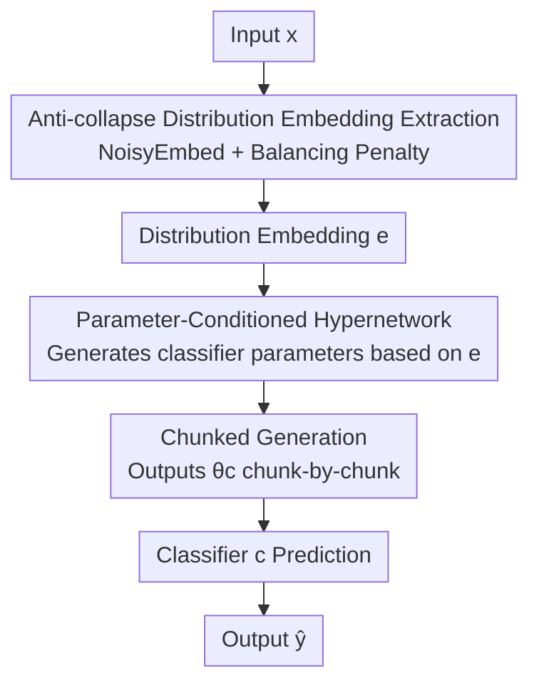

# Deploying Models to Non-participating Clients in Federated Learning without Fine-tuning: A Hypernetwork-based Approach

**Conference**: ICLR2026  
**OpenReview**: [https://openreview.net/forum?id=9XkmuBR0r1](https://openreview.net/forum?id=9XkmuBR0r1)  
**Code**: https://github.com/Soptq/hyperfedzero-public  
**Area**: Federated Learning / Distributional Generalization  
**Keywords**: Federated Learning, Hypernetwork, Zero-shot Personalization, Intra-domain Distribution Shift, Non-participating Clients

## TL;DR
HyperFedZero utilizes a hypernetwork conditioned on "distribution embeddings" to **dynamically generate classifier parameters** for new, non-participating clients with intra-domain distribution shifts. It achieves localized personalization with zero fine-tuning and minimal overhead, consistently outperforming existing methods across 7 datasets and 5 models.

## Background & Motivation
**Background**: Federated Learning (FL) enables multiple clients to train models collaboratively without sharing raw data, with the primary challenge being data heterogeneity (non-i.i.d.). Existing methods focus on "participating clients"—either learning personalized models (pFedMe, Ditto) or fine-tuning global models (basic, regularized, or selective fine-tuning) to fit local data.

**Limitations of Prior Work**: This paradigm assumes that "active users must have participated in training or have the capacity to fine-tune." In real-world deployment, models are often pushed to **non-participating edge devices**, which face two rigid constraints: (1) Their data, while from the same domain, exhibits different distributions from those seen during training (category frequency shifts, feature shifts, i.e., **intra-domain distribution shifts**); (2) They have limited compute/communication resources and cannot afford local fine-tuning. The authors observe in Figure 1a a critical phenomenon: SOTA personalized FL methods perform excellently on known clients but suffer **catastrophic failure** when applied to new clients with intra-domain shifts, indicating a lack of "zero-shot personalization" capability.

**Key Challenge**: Existing methods treat personalization as a one-time, fine-tuning-dependent "post-hoc adaptation," whereas deployment scenarios require **instant adaptation to unseen distributions**. MoE approaches (FedJets) can achieve zero-shot personalization through expert specialization, but maintaining and synchronizing many experts on the server/client is too costly for practical use.

**Goal**: Deploy trained models to non-participating clients under strict resource constraints without fine-tuning or significantly increasing overhead, while maintaining robustness against intra-domain distribution shifts.

**Key Insight**: Instead of "fine-tuning for each client's data," why not **encode distribution awareness directly into the model's forward pass?** That is, the model skips the rigid "input $\to$ label" mapping and instead learns "input $\to$ optimal model parameters $\to$ label," allowing parameters to vary with the input distribution.

**Core Idea**: Use a hypernetwork conditioned on the "distribution embedding" of the input to **generate** classifier parameters tailored to that distribution on-the-fly. This injects a distribution-aware inductive bias directly into the forward propagation, enabling zero-shot personalization without fine-tuning.

## Method

### Overall Architecture
HyperFedZero places two **shared** modules on each client: a distribution extractor $f: \mathcal{X}\to\mathcal{E}$ (parameters $\theta_f$) and a hypernetwork $h: \mathcal{E}\to\Theta_c$ (parameters $\theta_h$). The forward pass involves three steps: ① The extractor encodes the input $x_i$ into a normalized distribution embedding $e_i$ (similar embeddings imply similar distributions), using NoisyEmbed and Balancing Penalty to prevent feature collapse; ② The hypernetwork, conditioned on $e_i$, **generates classifier parameters $\theta^c_i$ chunk-by-chunk**; ③ These generated parameters initialize the classifier $c$ to output the predicted label $\hat{y}$ for $x_i$. During the training phase, all three modules are jointly optimized (Cross-Entropy + Balancing Penalty); when deployed to non-participating clients, $f$ and $h$ are frozen, allowing the classifier to be generated locally based solely on the new client's data without ever uploading personalized weights.

The key paradigm shift: Traditional FL learns $\arg\min_{\theta_c}\sum_i w_i F_i((x_i,y_i),\theta_c)$, applying one set of global parameters $\theta_c$ to all distributions; HyperFedZero rewrites the objective as $\arg\min_{\theta_c}\sum_i w_i F_i((x_i,y_i),\theta_c, e_i)$, making predictions explicitly conditional on the input distribution $e_i$.

### Key Designs

**1. Parameter-Conditioned Distribution-Aware Prediction: Letting parameters vary with distribution, rather than forcing one classifier to handle all distributions.**

There are two ways to implement "conditioning on distribution $e$": Opt.1 concatenates $e$ with the classifier input ($\Pr(y_i=\hat{y}_i\mid\{x_i,e_i\};\theta_c)$), and Opt.2 applies $e$ to the classifier parameters ($\Pr(y_i=\hat{y}_i\mid x_i;\theta_c\mid e_i)$). HyperFedZero chooses Opt.2 for two reasons: First, in Opt.1, a **single** classifier must serve all inputs, leading to a bottleneck on the Pareto frontier with limited expressivity; second, the classifier in Opt.1 can simply **ignore** $e_i$. Opt.2 is equivalent to "explicitly activating different models for different $e_i$," offering exponential parameter efficiency. Opt.2 consistently outperforms Opt.1 in experiments. Formally, the goal becomes $\arg\max_{\theta_c}\sum_i w_i \Pr(y_i=\hat{y}_i\mid x_i; h(e_i;\theta_h))$.

**2. NoisyEmbed + Balancing Penalty: Curing Feature Collapse in Distribution Embeddings.**

Using $f(x_i)$ directly as a distribution embedding leads to **feature collapse**: all $e_i$ crowd into a very narrow region of the embedding space. This happens because during training, all client distributions are seen (there are no "non-participating clients" at this stage). Since all distributions are visible, the incentive to customize models for unseen distributions is near zero, causing the extractor to collapse into a trivial solution where all $x_i$ map to nearly identical $e_i$. Borrowing from MoE load-balancing: NoisyEmbed explicitly injects learnable noise into $f(x_i)$ to increase robustness: $e=\mathrm{softmax}(f(x_i;\theta_f)+z\cdot\mathrm{softplus}(\mathrm{noisy}(x_i)))$, where $z\sim\mathcal{N}(0,1)$ and $\mathrm{noisy}(\cdot)$ is a global noise network. The Balancing Penalty implicitly encourages exploration of the embedding space by adding a regularization term to the loss:

$$F_i(\cdot, e_i) = F_i(\cdot) + \alpha\,\frac{\mathrm{var}(P e_i)}{\mathrm{mean}(P e_i)} + \beta\,\mathbb{E}(-e_i\log e_i)$$

The first term (coefficient of variation) encourages $e_i$ to spread uniformly across the space; the second term (entropy) encourages embeddings to cluster along specific dimensions for clearer structure.

**3. Chunked Hypernetwork: Balancing Flexibility and Device Overhead.**

Opt.2 naturally introduces two issues: classifiers become independent (losing knowledge sharing), and maintaining multiple models contradicts FL resource constraints. HyperFedZero resolves this with a **chunked hypernetwork**: $h$ is a simple MLP that partitions the target classifier parameters into fixed-size groups (chunks). A unique chunk embedding is assigned to each group. Instead of spitting out all parameters at once, $h$ **generates them chunk-by-chunk**, guided by the chunk embeddings. This allows for personalized models while maintaining global knowledge sharing through the shared $h$ and keeping the parameter count low. Time complexity remains on par with FedAvg ($O(NEK)$), and since $|\theta_f|+|\theta_h|\approx|\theta_c|$, the space complexity remains $O(N)$.

### Loss & Training
During training, each client optimizes the Cross-Entropy loss alongside the Balancing Penalty. The global components $f$ and $h$ are aggregated on the server via standard FedAvg. No raw data is shared, and the privacy profile is identical to FedAvg, making it compatible with secure aggregation and differential privacy. During deployment, $f$ and $h$ are frozen, and personalized weights are generated locally and never uploaded.

## Key Experimental Results

### Main Results
Evaluated across 7 datasets and 5 models. The core metric is **zACC (Zero-shot Accuracy on non-participating clients)**, alongside gACC (Global) and pACC (Personalized). Results for $N=10$:

| Dataset / Model | Metric | HyperFedZero | FedAvg | FedJets (MoE) |
|--------------|------|--------------|--------|---------------|
| MNIST / MLP | zACC | **95.49** | 93.06 | 93.75 |
| EMNIST / MLP | zACC | **76.82** | 70.18 | 69.14 |
| Cifar100 / ResNet | zACC | **57.24** | 43.32 | 54.69 |
| Tiny-ImageNet / ResNet | zACC | **16.06** | 13.41 | 13.15 |

HyperFedZero consistently leads in zACC across all baselines; the Gain over FedAvg is particularly significant on complex datasets (e.g., ~14 point increase on Cifar100 ResNet).

### Ablation Study

| Configuration | Key Role | Description |
|------|---------|------|
| Full model | Complete HyperFedZero | NoisyEmbed + Balancing Penalty + Chunked Hypernetwork (Opt.2) |
| w/o NoisyEmbed | No explicit noise | Embeddings collapse easily, degrading zero-shot adaptation. |
| w/o Balancing Penalty | No uniform/cluster reg. | Insufficient exploration of embedding space, lower discriminative power. |
| Opt.1 (Input cond.) | Concatenated $e$ in input | Consistently weaker than Opt.2, verifying the necessity of parameter conditioning. |

### Key Findings
- **Feature collapse is the primary hurdle**: Removing NoisyEmbed or Balancing Penalty causes embeddings to collapse into narrow regions, degrading zero-shot personalization. Both are essential.
- **Parameter Conditioning > Input Conditioning**: Opt.2 (generating parameters) is consistently superior to Opt.1 (concatenating inputs), confirming that "letting parameters vary with distribution" is more effective than "forcing one classifier to handle all distributions."
- **Near-zero overhead**: Time complexity matches FedAvg. Total parameter count is comparable to a single classifier, avoiding the high synchronization costs of MoE routes (FedJets).

## Highlights & Insights
- **Embedding "Distribution Awareness" into the Forward Pass**: By shifting from post-hoc fine-tuning to parameter generation during forward propagation, the model bypasses the bottleneck where non-participating clients cannot fine-tune.
- **Attribution of Feature Collapse**: The insight that "visibility of all distributions during training" leads to trivial solutions for the extractor explains the necessity of the proposed regularization components.
- **Chunked Hypernetwork as a Reusable Trick**: This approach for generating large model parameters while maintaining sharing and controlling memory is transferable to other scenarios requiring massive personalization under resource constraints.
- **Privacy Parity with FedAvg**: Only global parameters for $f$ and $h$ are shared. Personalized weights remain local, making the method deployment-friendly.

## Limitations & Future Work
- **Focus on Intra-domain Shifts**: The method targets non-participating clients within the same domain. Effectiveness in true Out-of-Domain (OOD) generalization requires further exploration.
- **Classifier-centric Generation**: The hypernetwork primarily generates classifier (head) parameters. Scalability to dynamic backbone generation for larger models remains to be verified.
- **Dataset Scale**: Experiments use classical datasets (MNIST, Cifar, Tiny-ImageNet). Performance in huge-scale or complex multi-modal scenarios (e.g., LLM fine-tuning) is a potential future direction.

## Related Work & Insights
- **vs. Personalized FL (pFedMe / Ditto / FedProx)**: These methods learn personalized models for participants. Ours targets **non-participants** without fine-tuning, shifting personalization from "adaptation" to "inference."
- **vs. MoE (FedJets)**: While both allow zero-shot personalization, FedJets requires managing many experts. HyperFedZero uses a compact hypernetwork to generate **sample-level** weights locally with lower complexity.
- **vs. Client-weight Generating Hypernets (PeFLL)**: Those generate client-level weights, which may introduce privacy risks or higher communication costs. HyperFedZero generates weights locally and keeps personalization purely on-device.

## Rating
- Novelty: ⭐⭐⭐⭐⭐ Encoding distribution-aware inductive bias into the forward pass via hypernetworks is an innovative entry point for FL deployment.
- Experimental Thoroughness: ⭐⭐⭐⭐ Broad coverage of datasets and models, including collapse analysis, though benchmarks are somewhat classical.
- Writing Quality: ⭐⭐⭐⭐ Clear problem definition (intra-domain vs. cross-domain) and well-grounded attribution of feature collapse.
- Value: ⭐⭐⭐⭐⭐ Addresses the core pain point of deploying trained FL models to unseen devices at zero additional cost.

<!-- RELATED:START -->

## Related Papers

- [\[ICLR 2026\] Layerwise Federated Learning for Heterogeneous Quantum Clients using Quorus](layerwise_federated_learning_for_heterogeneous_quantum_clients_using_quorus.md)
- [\[ICML 2026\] Advantages of Non-Smooth Components in Vision Transformer Fine-Tuning](../../ICML2026/others/vision_transformer_finetuning_benefits_from_non-smooth_components.md)
- [\[ICLR 2026\] HippoTune: A Hippocampal Associative Loop–Inspired Fine-Tuning Method for Continual Learning](hippotune_a_hippocampal_associative_loopinspired_fine-tuning_method_for_continua.md)
- [\[ICLR 2026\] Federated ADMM from Bayesian Duality](federated_admm_from_bayesian_duality.md)
- [\[ICLR 2026\] A Federated Generalized Expectation-Maximization Algorithm for Mixture Models with an Unknown Number of Components](a_federated_generalized_expectation-maximization_algorithm_for_mixture_models_wi.md)

<!-- RELATED:END -->
