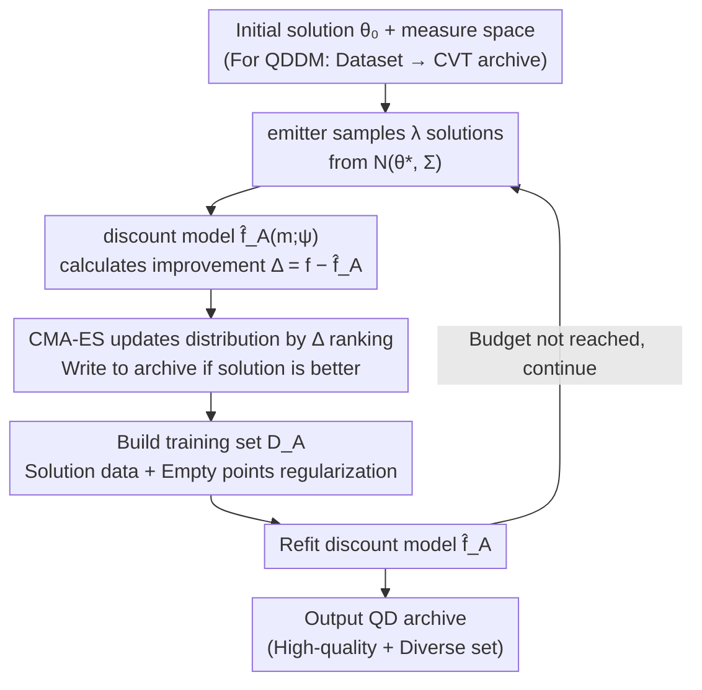

# Discount Model Search for Quality Diversity Optimization in High-Dimensional Measure Spaces

**Conference**: ICLR2026 Oral  
**arXiv**: [2601.01082](https://arxiv.org/abs/2601.01082)  
**Code**: [discount-models.github.io](https://discount-models.github.io)  
**Area**: LLM Evaluation  
**Keywords**: Quality Diversity, MAP-Elites, CMA-MAE, Discount Model, High-Dimensional Measure Space  

## TL;DR

Ours proposes Discount Model Search (DMS), which utilizes neural networks to fit continuous smooth discount functions instead of the histogram-based discrete representations in CMA-MAE. This addresses the search stagnation caused by distortion in high-dimensional measure spaces and introduces the QDDM paradigm for defining measure spaces directly via image datasets.

## Background & Motivation

Quality Diversity (QD) optimization aims to find a set of solutions that are both high-quality and diverse: each solution must not only maximize an objective function $f$ but also cover as much of the user-defined measure function $\bm{m}$ output space as possible. Classic applications include robot control policy search, generative modeling, and LLM red-teaming.

The current state-of-the-art black-box QD algorithm, CMA-MAE, uses a histogram to partition the measure space into discrete cells, storing scalar discount values in each cell to guide the search. However, in high-dimensional measure spaces, **distortion** (where many solutions map to a narrow region of the measure space) causes multiple solutions to fall into the same cell. Consequently, they receive identical discount values, leaving the algorithm unable to distinguish the direction of improvement and causing the search to stagnate quickly.

The authors verified this phenomenon through experiments: on a 10D LP (Sphere) benchmark, CMA-MAE samples 540 solutions per iteration, but the number of unique cells occupied per iteration drops sharply from hundreds to approximately 30 over time. This indicates that high-dimensional distortion severely weakens the search signal.

## Core Problem

1.  **Amplification of High-Dimensional Distortion**: As the dimensionality of the measure space increases, the volume of each cell grows exponentially. More solutions with similar measures are grouped into the same cell, where CMA-MAE assigns them identical discount values, preventing CMA-ES from identifying the direction of maximum archive improvement.
2.  **Infeasibility of Increasing Archive Resolution**: Although smaller cells could mitigate distortion, the memory required scales exponentially with dimensionality.
3.  **Lack of Paradigms for High-Dimensional Measures**: Traditional QD typically considers hand-designed measures with $<10$ dimensions, making it difficult to scale to scenarios where high-dimensional data, such as images, define the measures.

## Method

### Overall Architecture

DMS aims to solve the failure of histogram-based scalar discount values in high-dimensional measure spaces due to distortion. The Overall Architecture follows the black-box QD framework of MAP-Elites archives and CMA-ES emitters but replaces the histogram with a neural network $\hat{f}_A(\cdot;\psi)$ that directly fits a continuous discount function. Each iteration loops between a "search" phase and a "discount model training" phase: the emitter first samples a batch of solutions from the current Gaussian distribution, uses the improvement rankings provided by the discount model to update the search direction, and writes better solutions into the archive. Subsequently, the discount model is refit using these new solutions plus a batch of "empty cell samples." Even when dimensions are high and solutions have similar measures, the continuous model provides distinguishable discounts, maintaining a differentiable search signal. When the measure space is defined by a dataset (QDDM), the archive uses CVT partitioning on the data manifold while the rest of the process remains unchanged.

### Key Designs

**1. Continuous Discount Model Replacing Discrete Histograms (Novelty/Design Motivation)**

CMA-MAE partitions the measure space into a grid where all solutions in a cell share a scalar discount. In high dimensions, many solutions with similar measures fall into the same cell, receiving the same discount and causing CMA-ES to stagnate. DMS replaces this with a neural network $\hat{f}_A(\bm{m};\psi)$ that maps measure vectors to discount values. The model output is naturally continuous and smooth; even for very similar measures, it provides slightly different discounts, preserving gradient directions for ranking. This is the root cause of the order-of-magnitude Gain of DMS over histograms in scenarios above 10D. Since the input is the measure itself, the backbone can be flexibly swapped by modality: MLPs for low-dimensional measures, CNNs for image measures, and Transformers for text measures.

**2. Improvement Ranking Driven Emitter Updates (Mechanism)**

With continuous discounts, the search is pulled toward directions of maximum archive improvement. Each emitter samples $\lambda$ solutions from a Gaussian distribution $\mathcal{N}(\bm{\theta}^*,\bm{\Sigma})$, calculates the objective $f(\bm{\theta}_i)$ and measure $\bm{m}(\bm{\theta}_i)$ for each solution $\bm{\theta}_i$, and computes the improvement $\Delta_i = f(\bm{\theta}_i) - \hat{f}_A(\bm{m}(\bm{\theta}_i))$. $\Delta_i$ measures the gain relative to the current archive level. CMA-ES ranks solutions based on $\Delta_i$ to update $(\bm{\theta}^*,\bm{\Sigma})$, pushing the search toward high-improvement areas. If a solution is better than the existing one in its cell, it is replaced.

**3. Empty Points Regularization**

Neural networks may extrapolate excessively high discounts in unobserved measure regions, leading to underestimated improvements and misleading the search away from unexplored areas. DMS adds "empty cell data" to the training set each round: it randomly samples $n_{empty}$ unoccupied cells from the archive, takes their center measures, and sets the target to the minimum objective value $f_{min}$. This acts as clamping for unexplored regions, forcing the model to output reasonably low discounts, ensuring new solutions falling into empty spaces receive large improvements and are favored by the search.

**4. QDDM Paradigm: Defining Measure Space via Datasets**

The continuous discount model allows DMS to support Quality Diversity with Datasets of Measures (QDDM). Instead of hand-designing measure functions, users provide a dataset (e.g., images) to express the desired diversity dimensions. The archive is built using dataset samples as centroids via Centroidal Voronoi Tessellation (CVT). Based on the manifold hypothesis, high-dimensional data actually lie on low-dimensional manifolds; CVT thus only partitions the subspace the user cares about, avoiding the exponential memory cost of grids. Distance functions can be flexible, such as Euclidean distance or CLIP scores.

### Loss & Training

A training set $\mathcal{D}_A$ is constructed each iteration to refit the discount model, consisting of two types of data. First is **solution data**: for each solution sampled by the emitter, an entry $(\bm{m}(\bm{\theta}), t_A)$ is generated. The target $t_A$ follows the CMA-MAE threshold update rule, where the archive learning rate $\alpha$ controls the exploration/exploitation balance ($\alpha=1$ for pure exploration to fill the archive, $\alpha=0$ for pure objective optimization). The target is lifted toward $f(\bm{\theta})$ by $\alpha$ only if the solution exceeds the current level $\hat{f}_A(\bm{s})$:

$$t_A = \begin{cases} \hat{f}_A(\bm{s}) & \text{if } f(\bm{\theta}) \leq \hat{f}_A(\bm{s}) \\ (1-\alpha)\hat{f}_A(\bm{s}) + \alpha f(\bm{\theta}) & \text{if } f(\bm{\theta}) > \hat{f}_A(\bm{s}) \end{cases}$$

Second is **empty cell data**: centers of $n_{empty}$ unoccupied cells are sampled with a target of $f_{min}$. The network undergoes regression training on these $(\text{measure}, \text{target})$ pairs to ensure $\hat{f}_A$ approximates thresholds in explored regions while remaining low in empty ones.

## Key Experimental Results

### Main Results (LP Series, 20 trials)

| Benchmark | Ours QD Score | CMA-MAE QD Score | Ours Coverage | CMA-MAE Coverage |
|---|---|---|---|---|
| 2D LP (Sphere) | **6,978** | 6,328 | **95.9%** | 81.0% |
| 10D LP (Sphere) | **6,410** | 609 | **89.2%** | 7.0% |
| 20D LP (Sphere) | **7,406** | 882 | **96.0%** | 9.1% |
| 50D LP (Sphere) | **6,991** | 2,327 | **87.0%** | 24.2% |
| 10D LP (Rastrigin) | **5,139** | 247 | **88.2%** | 3.0% |

In high-dimensional scenarios, the advantage of Ours is significant: on 10D LP (Sphere), the QD Score is **10.5x** higher than CMA-MAE, and Coverage increases from 7% to 89%.

### QDDM Domains (5 trials)

| Domain | Ours QD Score | CMA-MAE QD Score | Ours Coverage | CMA-MAE Coverage |
|---|---|---|---|---|
| TA (MNIST) | 951.56 | **954.27** | **99.84%** | 99.48% |
| TA (F-MNIST) | **701.14** | 625.65 | **72.28%** | 63.92% |
| LSI (Hiker) | **214.91** | 14.61 | **3.77%** | 1.56% |

- High coverage in TA (MNIST) indicates not all QDDM domains suffer from strong distortion.
- In LSI (Hiker), Ours significantly outperforms CMA-MAE (QD Score 215 vs 15), though absolute coverage remains low (3.77%), reflecting the challenge of complex QDDM domains.
- Ours even surpassed DDS, which is designed specifically for diversity, in the diversity-only LP (Flat) domain.

### Computational Overhead

DMS is 2-3 times slower than CMA-MAE on LP benchmarks due to training the discount model. However, in QDDM domains where solution evaluation (e.g., StyleGAN3 rendering) is the bottleneck, the algorithmic overhead difference is negligible.

## Highlights & Insights

1.  **Powerful and Clear Insight**: Replacing discrete histograms with continuous models is simple yet highly effective, yielding order-of-magnitude improvements in dimensions over 10D.
2.  **Innovation in QDDM Paradigm**: Ours is the first to propose defining measure spaces directly with image datasets, lowering the barrier for QD. Users only need to provide a dataset rather than hand-designing functions.
3.  **Compelling LSI (Hiker) Demonstration**: Generated images correctly matched clothing styles to terrains (e.g., heavy jackets for snowy mountains, light gear for beaches), visually demonstrating value.
4.  **Experimental Thoroughness**: Covers 9 benchmarks and 3 QDDM domains with rigorous statistical testing (Welch ANOVA + Games-Howell).
5.  **Complete Ablation Study**: Verified the critical roles of $\alpha$ and $n_{empty}$.

## Limitations & Future Work

1.  **Discount Model Noise**: In domains requiring precise objective optimization (e.g., TA (MNIST)), model error serves as noise interfering with improvement rankings, preventing Ours from outperforming exact histograms.
2.  **Extremely Low Coverage in LSI (Hiker)**: At only 3.77%, exploration in extremely high-dimensional complex QDDM domains is still insufficient.
3.  **Computational Cost**: Slower than CMA-MAE by roughly 2-3x on LP benchmarks; training costs cannot be ignored for large-scale applications.
4.  **Distance Function for CVT Archive**: Current exploration is limited to Euclidean and CLIP scores; better distance metrics might improve performance.
5.  **DDS Incompatibility**: DDS cannot run in QDDM domains as KDE runtime scales linearly with dimensionality, limiting comparison completeness.

## Related Work & Insights

| Method | Mechanism | High-Dim Support | Optimization Target |
|---|---|---|---|
| MAP-Elites | Random Mutation + Grid Archive | Poor (Exp. Memory) | QD |
| CMA-MAE | CMA-ES + Histogram Discount | Poor (Cell Stagnation) | QD |
| DDS | KDE Density Estimation | Medium (Slow KDE) | Diversity Only |
| **DMS** | CMA-ES + Neural Discount Model | **Strong** | QD |

DMS inherits the archive improvement framework of CMA-MAE but replaces discrete histograms with continuous models, incorporating the insight from DDS that smooth signals facilitate exploration. Unlike DDS, DMS accounts for both objective values and diversity.

## Rating
- Novelty: ⭐⭐⭐⭐ (Continuous discount model + QDDM paradigm are original contributions)
- Experimental Thoroughness: ⭐⭐⭐⭐⭐ (12 domains, rigorous statistics, full ablations)
- Writing Quality: ⭐⭐⭐⭐ (Motivation is clear, Figure 1 provides intuitive comparison)
- Value: ⭐⭐⭐⭐ (Strong potential for high-dimensional QD and QDDM paradigms)

<!-- RELATED:START -->

## Related Papers

- [\[ICLR 2026\] Soft Quality-Diversity Optimization](soft_quality-diversity_optimization.md)
- [\[ICML 2025\] Diversity By Design: Leveraging Distribution Matching for Offline Model-Based Optimization](../../ICML2025/others/diversity_by_design_leveraging_distribution_matching_for_offline_model-based_opt.md)
- [\[CVPR 2026\] Revisiting F-measure Optimization in Multi-Label Classification: A Sampling-based Approach](../../CVPR2026/others/revisiting_f-measure_optimization_in_multi-label_classification_a_sampling-based.md)
- [\[ICML 2026\] GOTabPFN: From Feature Ordering to Compact Tokenization for Tabular Foundation Models on High-Dimensional Data](../../ICML2026/others/gotabpfn_from_feature_ordering_to_compact_tokenization_for_tabular_foundation_mo.md)
- [\[AAAI 2026\] Theoretical and Empirical Analysis of Lehmer Codes to Search Permutation Spaces with Evolutionary Algorithms](../../AAAI2026/others/theoretical_and_empirical_analysis_of_lehmer_codes_to_search_permutation_spaces_.md)

<!-- RELATED:END -->
