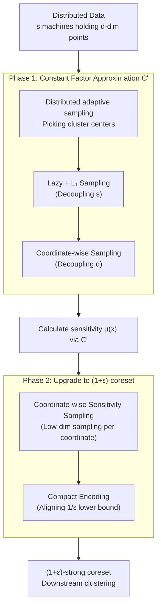

# Distributed Algorithms for Euclidean Clustering

**Conference**: ICLR2026  
**arXiv**: [2603.08615](https://arxiv.org/abs/2603.08615)  
**Code**: None (Theoretical Work)  
**Area**: Others  
**Keywords**: distributed clustering, coreset, communication complexity, k-means, k-median

## TL;DR

Constructs $(1+\varepsilon)$-coresets for Euclidean $(k,z)$-clustering in distributed environments, achieving optimal communication complexity lower bounds (up to polylog factors) in both the coordinator and blackboard models.

## Background & Motivation

- **Euclidean $(k,z)$-clustering** is a classic clustering problem: given $n$ points in $d$ dimensions, find $k$ centers to minimize the sum of the $z$-th power of distances from all points to their nearest centers. $z=1$ corresponds to $k$-median, and $z=2$ corresponds to $k$-means.
- Modern datasets are massive and naturally distributed across multiple machines, making centralized processing impossible. **Distributed clustering** has become a core requirement: $n$ points are distributed across $s$ machines, which collaborate via concise summaries (coresets) to complete clustering while minimizing communication.
- Existing distributed methods (e.g., merge-and-reduce) have coupled factors such as $s$, $d$, and $1/\varepsilon$ in their communication complexity (e.g., $\tilde{O}(skd/\varepsilon^4 \cdot \log(n\Delta))$), which is far from known theoretical lower bounds.
- **Key Motivation**: Can a communication-optimal protocol be designed such that $s$ (number of machines), $d$ (dimension), and $1/\varepsilon$ (precision) are decoupled, reaching theoretical lower bounds?

## Core Problem

Construct a $(1+\varepsilon)$-strong coreset for $(k,z)$-clustering in two classic distributed communication models while achieving optimal communication complexity:

1. **Coordinator Model**: $s$ machines communicate only through a central coordinator using private channels and private randomness.
2. **Blackboard Model**: $s$ machines communicate via a shared blackboard, where any message written by a machine is visible to all others.

## Method

### Overall Architecture

The protocol follows a "coarse-to-fine" two-step paradigm: first, compute a constant approximation $C'$ on distributed data with minimal communication, then calculate the sensitivity $\mu(x)$ for each point based on $C'$ and perform importance sampling to upgrade the summary to a $(1+\varepsilon)$-strong coreset. Finally, any centralized clustering algorithm can be run on the coreset. The framework itself is not new; the true difficulty lies in decoupling the communication bits from three variables—the number of machines $s$, dimension $d$, and precision $1/\varepsilon$—to avoid large terms like $\tilde O(skd/\varepsilon^4)$ found in previous methods. The four core techniques of this paper address these decoupling goals: Phase 1 uses Lazy + $L_1$ Sampling to decouple $s$ and coordinate-wise sampling to decouple $d$ for the constant approximation; Phase 2 uses coordinate-wise sensitivity sampling and compact encoding to control $d$ and $1/\varepsilon$ for the upgrade. Ultimately, the Coordinator model reaches $\tilde{O}(sk + dk/\min(\varepsilon^4, \varepsilon^{2+z}) + dk\log(n\Delta))$ and the Blackboard model reaches $\tilde{O}(s\log(n\Delta) + dk\log(n\Delta) + dk/\min(\varepsilon^4, \varepsilon^{2+z}))$, both matching known lower bounds within polylog factors.

### Key Designs

**1. Lazy + $L_1$ Sampling: Decoupling "Machine Number $s$" from Each Round**

Phase 1 seeks a constant approximation in the Blackboard model. A natural approach is distributed $k$-means++ style adaptive sampling, but this requires all $s$ machines to report their distances $D_i$ for every center sampled, costing $O(sk\log n)$ bits—where $s$ and $k$ are multiplied. This paper uses two layers of "sampling instead of broadcasting" to decouple $s$. Layer 1, Lazy Sampling: the blackboard maintains only stale approximations $\widehat{D_i}$ of the machines' distances, and machines are picked for sampling proportional to $\widehat{D_i}$. As long as $\widehat{D_i}$ remains a constant approximation of $D_i$, the failure probability is constant, and the total rounds remain $O(k)$. A failure implies $D_i$ has dropped significantly, at which point machine $i$ updates the blackboard. Since total distance is monotonically decreasing, each machine updates at most $O(\log n)$ times, transmitting only $O(\log\log n)$ bits (an exponent). Layer 2, $L_1$ Sampling, addresses the issue that global update triggers themselves cause universal communication: a machine $i$ is chosen randomly (probability $\propto \widehat{D_i}$) to use an unbiased estimator $D_i/p_i$ to determine if the total sum $\sum_i D_i$ has dropped below a threshold of $1/64$. Combined with exponentially growing batch sampling, the communication rounds are compressed from $O(k)$ to $O(\log n \log k)$. This ensures $s$ only contributes to the final bound via a $\log(n\Delta)$ cost.

**2. Coordinate-wise Sampling: Binary Search to Decouple Dimension $d$**

Naive constant approximation methods transmit full high-dimensional center points, making communication proportional to $d$, which multiplies with $s$. This work avoids transmitting full coordinates: between the coordinator and the machine holding the point, a distributed binary search is performed on the sorted coordinate sequence, eventually transmitting only a small offset to locate the target point. This decouples the communication cost of each sample from the dimension $d$, which is key to removing the $s\cdot d$ product term in the Coordinator model. An important byproduct is that the protocol does not require any machine to broadcast full point coordinates to all others.

**3. Coordinate-wise Sensitivity Sampling: Breaking High-Dim Sampling into Coordinate Problems**

In Phase 2, after calculating $\mu(x)$ using $C'$, $\tilde{O}(k/\min(\varepsilon^4, \varepsilon^{2+z}))$ points must be sampled. Transmitting whole points would reintroduce $d$ into the communication cost. This method decomposes each point by coordinate and samples dimensions based on their importance. The coordinator sends a compact summary, and machines only provide additional information when strictly necessary. High-dimensional sampling is thus transformed into a set of low-dimensional problems. Although the reconstructed samples might not correspond to real points in the dataset, the paper proves the resulting clustering cost distortion is controlled, preserving the coreset's approximation guarantee.

**4. Compact Encoding: Compressing Samples to Align with the $1/\varepsilon$ Lower Bound**

The final step is the representation of sampled points. Each point is encoded as $(c'(x), y)$: $c'(x)$ is the index of its nearest center, and $y$ stores the logarithm of the residual vector components. Each sample requires only $O(\log k + d\log(1/\varepsilon,\, d,\, \log(n\Delta)))$ bits. This prevents the $1/\varepsilon$ term from being multiplied by $\log(n\Delta)$ in the total coreset communication, aligning perfectly with the lower bound—the final piece to isolating the precision term from the data scale.

## Key Experimental Results

This is a purely theoretical work and does not contain an experimental section. Its primary contribution is the proof of the theoretical upper bounds for communication complexity and their alignment with known lower bounds.

| Model | Prev. Best | Ours | Gain |
|------|----------|----------|------|
| Coordinator | $O(skd/\varepsilon^4 \cdot \log(n\Delta))$ | $\tilde{O}(sk + dk/\varepsilon^4 + dk\log(n\Delta))$ | Decouples $s,d,1/\varepsilon$; removes multiplication |
| Blackboard | $\tilde{O}((s+dk)\log^2(n\Delta))$ (Const Approx.) | $\tilde{O}(s\log(n\Delta) + dk\log(n\Delta) + dk/\varepsilon^4)$ | Upgrade from Constant to $(1+\varepsilon)$; removes redundant $\log$ |

## Highlights & Insights

- **Optimal Communication Bound**: Matches the lower bounds from [Chen et al., NeurIPS 2016] and [Huang et al., STOC 2024] in both distributed models, representing a complete theoretical resolution.
- **Parameter Decoupling**: In the Coordinator model, $s$ (machines) no longer multiplies $d$ (dimension) or $1/\varepsilon$ (precision). In the Blackboard model, $1/\varepsilon$ is independent of $\log(n\Delta)$.
- **No "Plaintext" Coordinate Transmission**: In the coordinator model, no station needs to broadcast full coordinates to all others, which is an unexpected and significant result.
- **Lazy Sampling + $L_1$ Sampling**: An elegant variant of distributed adaptive sampling that avoids global communication in every round.
- **Coordinate-wise Sensitivity Sampling**: A new technique that may have value for other problems like distributed regression and low-rank approximation.
- Results generalize to any connected communication topology, beyond just coordinator or blackboard models.

## Limitations & Future Work

- **Purely Theoretical**: Lacks experimental validation of actual communication and runtime improvements; polylog factors can be significant in practice.
- **Communication Rounds**: While communication bits are optimal in the Blackboard model, the rounds are $O(\log n \log k)$, which may be suboptimal for latency-sensitive scenarios.
- **Degradation at Constant $\varepsilon$**: When $\varepsilon$ is a constant, the $1/\varepsilon^4$ term becomes constant, and the dominant term becomes $dk\log(n\Delta)$ (transmitting center coordinates), which cannot be further optimized.
- **Finite Precision Grid Assumption**: Input points are assumed to be on a $\{1,\ldots,\Delta\}^d$ grid; real continuous data requires an additional discretization step.
- **Euclidean Specific**: Non-Euclidean metrics or non-clustering cost functions are outside the scope of this paper.

## Related Work & Insights

| Work | Approx. Ratio | Communication | Remarks |
|------|--------|--------|------|
| Merge-and-reduce + [BCP+24] | $(1+\varepsilon)$ | $\tilde{O}(skd/\varepsilon^4 \cdot \log(n\Delta))$ | Coupled parameters |
| [BEL13] + [BCP+24] | $(1+\varepsilon)$ | $O(dk/\varepsilon^4 \cdot \log(n\Delta) + sdk\log(sk)\log(n\Delta))$ | $s$ still multiplies $dk$ |
| [CSWZ16] (Blackboard) | $O(1)$ | $\tilde{O}((s+dk)\log^2(n\Delta))$ | Constant approximation only |
| **Ours (Coordinator)** | $(1+\varepsilon)$ | $\tilde{O}(sk + dk/\varepsilon^4 + dk\log(n\Delta))$ | **Optimal** |
| **Ours (Blackboard)** | $(1+\varepsilon)$ | $\tilde{O}(s\log(n\Delta) + dk\log(n\Delta) + dk/\varepsilon^4)$ | **Optimal** |

## Related Work & Insights

- **Distributed Algorithms + Coreset**: The paradigm of using low-communication constant approximation followed by sensitivity sampling to upgrade precision can be transferred to other distributed optimization problems (e.g., low-rank approximation, regression).
- **Lazy Sampling Philosophy**: Tolerating stale information and updating only when deviations exceed thresholds is analogous to eventual consistency in distributed systems and can be applied to gradient compression in distributed SGD.
- **Coordinate-wise Sampling**: Decomposing high-dimensional communication into per-coordinate sub-problems is similar to techniques like quantization and sparsification in Federated Learning.
- The authors explicitly note potential connections between these techniques and data quantization/communication compression in LLM training.

## Rating
- Novelty: ⭐⭐⭐⭐⭐ (Resolves the open problem of optimal communication for distributed clustering)
- Experimental Thoroughness: ⭐⭐ (Theoretical work without experiments)
- Writing Quality: ⭐⭐⭐⭐ (Well-structured with clear technical overviews)
- Value: ⭐⭐⭐⭐ (Theoretically definitive with potential for technique transfer)

<!-- RELATED:START -->

## Related Papers

- [\[ICLR 2026\] Non-Clashing Teaching in Graphs: Algorithms, Complexity, and Bounds](non-clashing_teaching_in_graphs_algorithms_complexity_and_bounds.md)
- [\[NeurIPS 2025\] Coresets for Clustering Under Stochastic Noise](../../NeurIPS2025/others/coresets_for_clustering_under_stochastic_noise.md)
- [\[AAAI 2026\] Improved Differentially Private Algorithms for Rank Aggregation](../../AAAI2026/others/improved_differentially_private_algorithms_for_rank_aggregation.md)
- [\[NeurIPS 2025\] Tight Bounds On the Distortion of Randomized and Deterministic Distributed Voting](../../NeurIPS2025/others/tight_bounds_on_the_distortion_of_randomized_and_deterministic_distributed_votin.md)
- [\[AAAI 2026\] GDBA Revisited: Unleashing the Power of Guided Local Search for Distributed Constraint Optimization](../../AAAI2026/others/gdba_revisited_unleashing_the_power_of_guided_local_search_for_distributed_const.md)

<!-- RELATED:END -->
