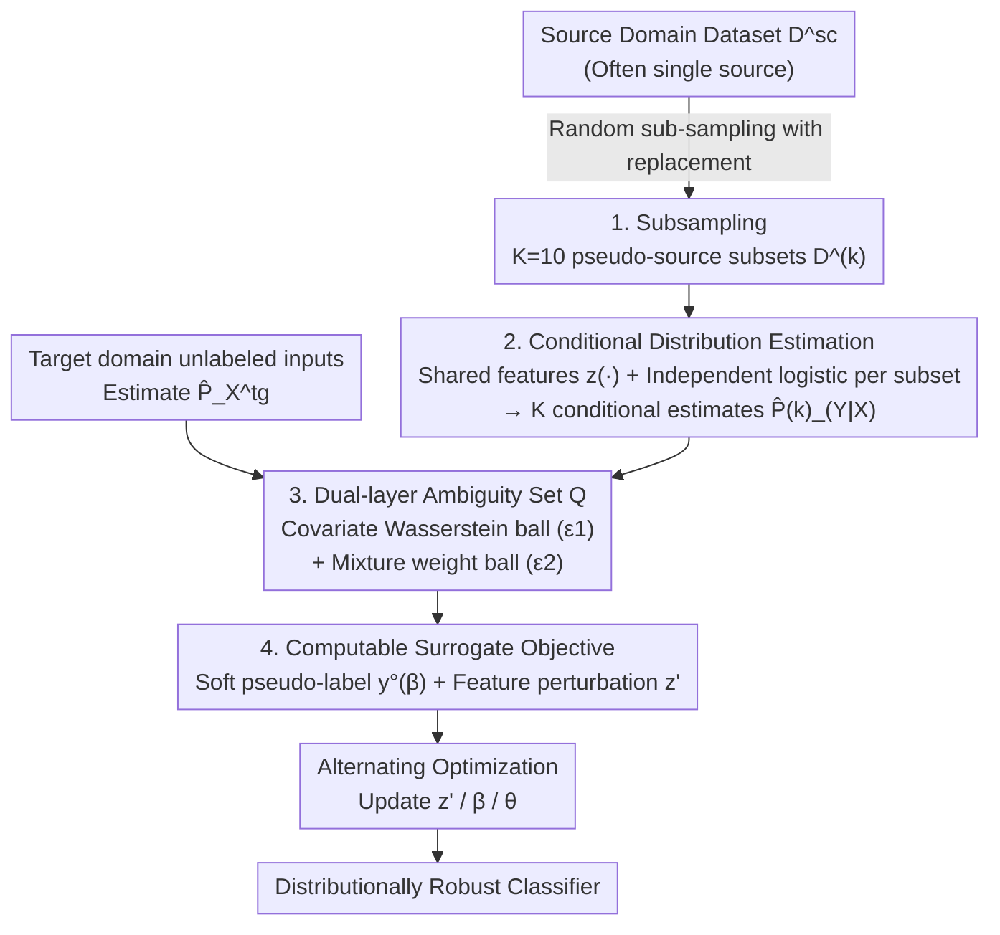

# Distributionally Robust Classification for Multi-Source Unsupervised Domain Adaptation

**Conference**: ICLR 2026  
**arXiv**: [2601.21315](https://arxiv.org/abs/2601.21315)  
**Code**: None  
**Area**: Others  
**Keywords**: Distributionally Robust Optimization, Unsupervised Domain Adaptation, Multi-source Domain Adaptation, Wasserstein Distance, Pseudo-labeling

## TL;DR

A distributionally robust learning framework is proposed to significantly enhance generalization performance in UDA scenarios with extreme target data scarcity or spurious correlations in the source domain by jointly modeling the uncertainty of target covariate distributions and conditional label distributions.

## Background & Motivation

Unsupervised Domain Adaptation (UDA) assumes that the training (source) and test (target) data distributions differ, provided with labeled source data and unlabeled target data. Existing methods are primarily categorized into two types:

**Distribution Alignment Methods** (DANN, CDAN, MK-MMD): These reduce domain discrepancy by aligning source/target distributions but tend to align irrelevant features (e.g., background, color) when spurious correlations exist.

**Pseudo-labeling Methods** (STAR, ATDOC): These utilize models trained on the source domain to generate pseudo-labels for the target domain, but label quality depends heavily on the initial model.

These two types of methods perform poorly in the following two practical scenarios:
- **Target Data Scarcity**: Alignment estimation becomes unreliable, and pseudo-label noise increases.
- **Spurious Correlations**: The model relies on non-causal features (e.g., background, gender, color) that do not transfer to the target domain.

Existing DRO methods (e.g., GroupDRO) typically require group labels and do not utilize unlabeled target data. This paper aims to design a robust framework capable of handling both covariate shift and conditional distribution shift simultaneously.

## Method

### Overall Architecture

This paper addresses two of the most challenging scenarios in Unsupervised Domain Adaptation (UDA): **extreme target data scarcity** and **hidden spurious correlations in the source domain**. Instead of forcing source/target distribution alignment, it acknowledges that "the estimation of the target domain distribution is inherently inaccurate" and constructs an **ambiguity set** $\mathcal{Q}$ that explicitly incorporates this uncertainty, then trains a classifier that holds for the worst-case scenario within that set.

The pipeline operates as follows: First, the source domain (often a single source) is sub-sampled into $K$ pseudo-source subsets; a conditional distribution $\hat{P}_{Y|X}^{(k)}$ is estimated for each subset; the mixture of these conditional estimates (managing label drift) and a Wasserstein ball of the target input distribution (managing covariate drift) are combined into a dual-layer ambiguity set $\mathcal{Q}$. Since directly solving min-max over $\mathcal{Q}$ is intractable, a computable surrogate objective is derived and implemented as an adversarial loss over "soft pseudo-labels + feature perturbations". Finally, adversarial features, mixture weights, and model parameters are updated alternately to obtain the robust classifier.

### Key Designs

**1. Subsampling: Masking Single-Source Problems as Multi-Source**

The framework is built on a "multi-source" assumption, yet many real-world UDA tasks feature only one source domain. The authors address this by performing random sub-sampling with replacement on the single source dataset $\mathbf{D}^{\text{sc}}$ to generate $K=10$ subsets $\mathbf{D}^{(k)}$, each with size $N^{\text{sc}}/5$. This is not arbitrary: when the source distribution is a mixture of heterogeneous sub-populations, repeated sub-sampling allows certain sub-samples to happen to approximate a single sub-population. Consequently, adversarial optimization of mixture weights can cover various "sub-population proportion" scenarios, inherently providing robustness to shifts in mixture ratios. This idea is borrowed from the maximin effect in regression (Meinshausen & Bühlmann, 2015) and adapted for classification.

**2. Conditional Distribution Estimation: Shared Features + Independent Logistic Regression**

To compute the $\hat{P}_{Y|X}^{(k)}$ used in the ambiguity set, the authors first train a classification model on all source data and remove the final classification layer to obtain the feature mapping $z:\mathcal{X}\to\mathcal{Z}$. Then, a linear logistic regression is trained independently on each subset, using the softmax output as the conditional probability estimate for that subset. Shared features ensure the estimates across different subsets are comparable, while independent regression heads allow each $\hat{P}_{Y|X}^{(k)}$ to reflect its respective sub-population bias. This feature extractor is not restricted to internal training—it can be replaced by backbones from existing UDA methods like CDAN or STAR, making the framework a robustness module applicable after existing methods.

**3. Dual-layer Ambiguity Set: A Ball for Covariates and a Ball for Conditionals**

The core of the method is using the $K$ estimated conditional distributions from the previous step to construct an ambiguity set $\mathcal{Q}$ that accommodates both types of drift. Given tolerance parameters $\epsilon_1, \epsilon_2 \geq 0$ and a reference vector $\bar{\beta} \in \Delta_{K-1}$:

$$\mathcal{Q} = \left\{ Q = (Q_X, Q_{Y|X}) \mid Q_{Y|X} = \sum_{k=1}^K \beta_k \hat{P}_{Y|X}^{(k)}, \ D_1(Q_X, \hat{P}_X^{\text{tg}}) \leq \epsilon_1, \ D_2(\beta, \bar{\beta}) \leq \epsilon_2 \right\}$$

The first layer manages the input distribution: it uses the Wasserstein distance $D_1$ to constrain the candidate covariate distribution $Q_X$ within an $\epsilon_1$-ball of the target estimate $\hat{P}_X^{\text{tg}}$. The radius $\epsilon_1$ is particularly critical when target data is scarce and the covariate estimate is unreliable. The second layer manages the conditional distribution: it expresses the target condition $Q_{Y|X}$ as a mixture $\sum_k \beta_k \hat{P}_{Y|X}^{(k)}$ of source conditional estimates and uses the Euclidean distance $D_2$ to constrain the mixture weights $\beta$ within an $\epsilon_2$-ball of the reference $\bar{\beta}$. The two radii correspond to the two types of drift, making it more general than single-form DRO (which only perturbs covariates or only labels).

**4. Computable Surrogate Objective: Expressing Minimax as Adversarial Loss on Soft Pseudo-labels**

Directly optimizing the original $\min_\theta \max_{Q\in\mathcal{Q}}$ is infeasible. The authors provide a computable upper bound via Proposition 3.1, transforming the Wasserstein supremum over $Q_X$ into local feature perturbations and the supremum over $Q_{Y|X}$ into an optimization over mixture weights $\beta$:

$$\sup_{\beta} \mathbb{E}_{\hat{P}_X^{\text{tg}}} \left[ \sup_{\|z' - z(X)\|_2 \leq \epsilon_1} \ell(f_Z^\theta(z'), y^\circ(\beta, X)) \right]$$

Here $y^\circ(\beta, x) = \sum_{k=1}^K \beta_k \hat{p}_{Y|X}^{(k)}(\cdot|x)$ is a **soft pseudo-label vector**—not a 0/1 hard label, but a probability distribution weighted by $\beta$. Thus, the robust objective becomes: finding the worst-case perturbation $z'$ within the feature $\epsilon_1$-ball and the worst-case soft label $y^\circ$ within the weight $\epsilon_2$-ball, then ensuring the classifier correctly categorizes even this worst-case pair.

### Loss & Training

Three variables are optimized alternately (Algorithm 1):

1. **Update Adversarial Features $z'$**: Fixing $\theta, \beta$, perform projected gradient ascent on features to find the loss-maximizing perturbation within the $\epsilon_1$-ball (similar to adversarial training).
2. **Update Mixture Weights $\beta$**: Fixing $\theta, z'$, use exponentiated gradient ascent + projection onto the $\epsilon_2$-ball to assign higher weights to conditional estimates with larger losses.
3. **Update Model Parameters $\theta$**: Fixing $z', \beta$, use standard gradient descent to minimize the loss.

Core Intuition: Updating $\beta$ creates an adversarial mixture of conditional distributions, and updating $\theta$ forces the classifier to be robust against this adversarial mixture.

## Key Experimental Results

### Main Results

**Experiment 1: Digit Recognition Tasks (MNIST/SVHN/USPS)**

| Method | SVHN→MNIST (100) | SVHN→MNIST (10) | MNIST→USPS (100) | USPS→MNIST (100) |
|------|:-:|:-:|:-:|:-:|
| ERM | 59.6 | - | 63.4 | 60.4 |
| DANN | 66.0 | 61.2 | 82.0 | 74.8 |
| CDAN | 63.4 | 56.9 | 80.8 | 58.3 |
| MCD | 79.1 | 61.3 | 89.3 | 96.1 |
| **Ours (STAR)** | **94.4** | **91.3** | **95.6** | **97.3** |

When target data is just 10 samples per class, Ours(STAR) still reaches 91.3% (SVHN→MNIST), far exceeding all baselines.

**Experiment 2: Spurious Correlation Benchmarks (Waterbirds/CelebA/CMNIST)**

| Method | Waterbirds | CelebA | CMNIST |
|------|:-:|:-:|:-:|
| ERM | 48.4 | 35.5 | 0.9 |
| CORAL | 50.9 | 31.7 | 1.7 |
| MCD | 59.0 | 30.7 | 1.9 |
| GroupDRO (needs group labels) | 61.4 | 63.0 | 3.4 |
| **Ours (ERM)** | **87.3** | **85.0** | **7.5** |

Compared to ERM, Waterbirds +38.9%, CelebA +49.5%. It significantly outperforms GroupDRO without requiring group labels.

### Ablation Study

- **Hyperparameter Sensitivity**: Heatmaps of $\epsilon_1$ and $\epsilon_2$ show stable performance with moderate uncertainty ($\epsilon_1 \in \{0.2,0.4\}$, $\epsilon_2 \geq 0.2$), exhibiting a broad optimal plateau.
- **Extreme Target Data Scarcity**: The influence of $\epsilon_1$ is more significant as covariate distribution estimation is less reliable; $\epsilon_2$ can be set to larger values without affecting stability.
- **LODO-CV Validation**: A version of Ours that does not rely on labeled target validation data is slightly lower but still outperforms all baselines.

### Key Findings

1. Integration with CDAN improves performance on SVHN→MNIST by +29.1%.
2. When target data drops from 100 to 10 samples, the performance decline of the proposed method is much smaller than that of baseline methods.
3. The covariate robustness radius $\epsilon_1$ is vital during data scarcity, while the conditional mixture radius $\epsilon_2$ is relatively stable.

## Highlights & Insights

1. **Dual-layer Uncertainty Modeling**: Simultaneously considering uncertainty in both covariate and conditional distributions is a significant generalization of single-DRO methods.
2. **No Group Labels Required**: Unlike GroupDRO, this method does not require knowledge of groups or sub-population information in the data.
3. **Plug-and-play**: It can be seamlessly integrated with existing UDA methods like CDAN and STAR as a post-processing robustness module.
4. **Unity of Single-Source and Multi-Source**: Random sub-sampling skillfully transforms single-source problems into a multi-source framework.

## Limitations & Future Work

1. Experiments only cover vision benchmarks (digits, spurious correlation), without validation on NLP or time-series data.
2. Small amounts of labeled target validation data are needed for hyperparameter selection (though LODO-CV can serve as a substitute).
3. Conditional distribution estimation depends on the quality of the pre-trained feature extractor.
4. The choice of $K=10$ sub-samples is fixed; adaptive selection strategies might further improve performance.
5. Computational overhead arises from $K$ independent logistic regressions + alternating iterations of minimax optimization.

## Related Work & Insights

- **Maximin Effect** (Meinshausen & Bühlmann, 2015): The direct inspiration for this work, generalizing the DRO from regression settings to classification.
- **GroupDRO** (Sagawa et al., 2019): Handles sub-population shifts but requires group labels.
- **Wasserstein DRO** (Gao et al., 2024): Provides the theoretical foundation for covariate perturbations.
- Can inspire robust aggregation strategies for heterogeneous clients in **Federated Learning**.

## Rating

| Dimension | Score |
|------|------|
| Novelty | ★★★★☆ |
| Technical Depth | ★★★★☆ |
| Experimental Thoroughness | ★★★★☆ |
| Writing Quality | ★★★★☆ |
| Value | ★★★★☆ |

<!-- RELATED:START -->

## Related Papers

- [\[ICLR 2026\] Mitigating Spurious Correlation via Distributionally Robust Learning with Hierarchical Ambiguity Sets](mitigating_spurious_correlation_via_distributionally_robust_learning_with_hierar.md)
- [\[NeurIPS 2025\] Distributionally Robust Feature Selection](../../NeurIPS2025/others/distributionally_robust_feature_selection.md)
- [\[ICLR 2026\] Learning Structure-Semantic Evolution Trajectories for Graph Domain Adaptation](learning_structure-semantic_evolution_trajectories_for_graph_domain_adaptation.md)
- [\[ICLR 2026\] Learning Adaptive Distribution Alignment with Neural Characteristic Function for Graph Domain Adaptation](learning_adaptive_distribution_alignment_with_neural_characteristic_function_for.md)
- [\[ICLR 2026\] Noise-Aware Generalization: Robustness to In-Domain Noise and Out-of-Domain Generalization](noise-aware_generalization_robustness_to_in-domain_noise_and_out-of-domain_gener.md)

<!-- RELATED:END -->
