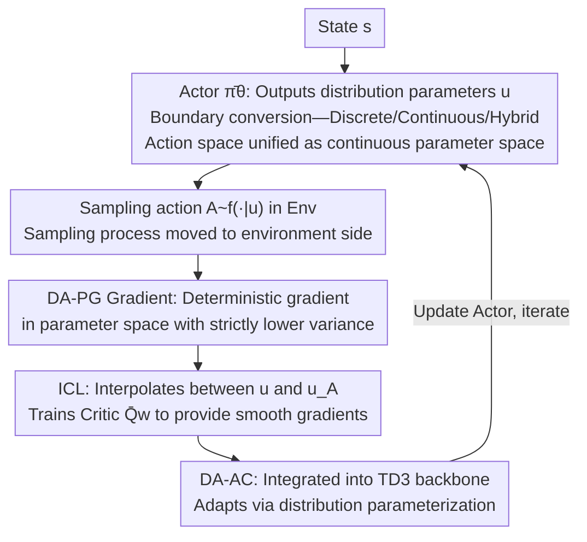

# DA-AC: Distributions as Actions — A Unified RL Framework for Diverse Action Spaces

**Conference**: ICLR 2026  
**arXiv**: [2506.16608](https://arxiv.org/abs/2506.16608)  
**Code**: [GitHub](https://github.com/hejm37/da-ac)  
**Area**: Others  
**Keywords**: Unified action space, distribution parameterization, deterministic policy gradient, discrete-continuous hybrid control, variance reduction  

## TL;DR
DA-AC proposes treating the parameters of action distributions (such as softmax probabilities or Gaussian mean/variance) as the "actions" output by the agent, moving the action sampling process into the environment. This allows a unified deterministic policy gradient framework to handle discrete, continuous, and hybrid action spaces. The method theoretically guarantees strictly lower variance than LR and RP estimators and achieves competitive or SOTA performance across 40+ environments.

## Background & Motivation
**Background**: Current RL algorithms are tightly coupled with action space types—discrete spaces use DQN/DSAC, continuous spaces use DDPG/TD3/SAC, and hybrid action spaces require specialized algorithms like PADDPG. These distinct estimator architectures make it difficult to design universal algorithms across domains.

**Limitations of Prior Work**:
   - LR (Likelihood Ratio) estimators are general but suffer from high variance, requiring carefully designed baselines.
   - DPG/RP estimators offer low variance but are restricted to continuous action spaces.
   - Hybrid action spaces (simultaneously containing discrete and continuous dimensions) require extra engineering effort.

**Key Challenge**: Low-variance gradient estimators are needed, but DPG/RP requires continuous action spaces—how can the low-variance advantages of DPG be extended to discrete actions?

**Goal**: Design a unified actor-critic algorithm that works on any type of action space with theoretical guarantees of low variance.

**Key Insight**: Rethink the agent-environment boundary—the agent's "action" does not necessarily have to be the original action defined by the environment; it can be the **distribution parameters**. A policy can typically be decomposed into $\bar{\pi}_\theta$ (outputting distribution parameters) + $f$ (sampling from the distribution). If $f$ is moved to the environment side, the agent's action space becomes a continuous parameter space $\mathcal{U}$, regardless of the original action space type.

**Core Idea**: Distributions-as-Actions—distribution parameters are the actions, and sampling is part of the environment.

## Method

### Overall Architecture
This paper addresses the issue where RL algorithms are strictly tied to action space types. The breakthrough is re-partitioning the boundary between the agent and the environment. In classical RL, a policy $\pi_\theta$ consists of two steps: first, $\bar{\pi}_\theta$ maps the state to a set of distribution parameters (e.g., mean/variance for Gaussian, class probabilities for Softmax); then, a sampling function $f$ draws the actual action. The DA framework moves the second step $f$ entirely into the environment. The agent no longer outputs an action but directly outputs distribution parameters $u=\bar{\pi}_\theta(s)$, making sampling part of the environment's stochastic transition.

Regardless of whether the underlying space is discrete, continuous, or hybrid, the agent faces a unified continuous parameter space $\mathcal{U}$, allowing the same continuous control algorithm to handle all cases. This defines a new MDP—DA-MDP $\langle \mathcal{S}, \mathcal{U}, \bar{p}, d_0, \bar{r}, \gamma \rangle$, where transitions and rewards are expectations over original actions:

$$\bar{p}(s'|s,u) = \mathbb{E}_{A \sim f(\cdot|u)}[p(s'|s,A)], \quad \bar{r}(s,u) = \mathbb{E}_{A \sim f(\cdot|u)}[r(s,A)]$$

This transformation preserves value: $\bar{v}_{\bar{\pi}}(s)=v_\pi(s)$, while the Q-value of distribution parameters is the expectation of original Q-values: $\bar{q}_{\bar{\pi}}(s,u)=\mathbb{E}_{A\sim f(\cdot|u)}[q_\pi(s,A)]$. Based on this, the paper introduces the DA-PG gradient estimator, an ICL critic learning method, and integrates them into TD3 to form the DA-AC algorithm. The training loop is shown below:

### Key Designs

**1. DA-PG Gradient Estimator: Deterministic gradients for any action space with lower variance**

After converting the action space into a continuous parameter space, the challenge is computing policy gradients. Traditional low-variance DPG/RP-style estimators only apply to continuous actions. Discrete actions usually rely on high-variance LR estimators. Since the agent's output $U=\bar{\pi}_\theta(S_t)$ is continuous, DA-PG applies DPG-style deterministic gradients directly:

$$\hat{\nabla}_\theta^{\text{DA-PG}} = \nabla_\theta \bar{\pi}_\theta(S_t)^\top \nabla_U \bar{Q}_w(S_t, U)\big|_{U=\bar{\pi}_\theta(S_t)}$$

The key difference is semantic—$\bar{\pi}$ outputs distribution parameters instead of a single action, and $\bar{Q}$ estimates expected return under the distribution. This bypasses the restriction that DPG is "continuous only." A significant theoretical result shows that DA-PG is the conditional expectation of LR and RP estimators:

$$\hat{\nabla}_\theta^{\text{DA-PG}} = \mathbb{E}_{A}\big[\hat{\nabla}_\theta^{\text{LR}}\big] = \mathbb{E}_{\epsilon}\big[\hat{\nabla}_\theta^{\text{RP}}\big]$$

By the law of total variance, DA-PG variance is strictly lower than LR and RP. This provides an unbiased, RP-style low-variance estimator for discrete action spaces for the first time.

**2. ICL (Interpolated Critic Learning): Improving critic accuracy across the parameter space**

DA-PG requires the critic $\nabla_U \bar{Q}_w$ to be reliable throughout the parameter space. However, standard TD updates only train the critic at parameters $U_t$ produced by the current policy. ICL performs random linear interpolation between the current parameters $U_t$ and the deterministic parameters $U_{A_t}$ corresponding to the sampled action:

$$\hat{U}_t = \omega_t U_t + (1-\omega_t) U_{A_t}, \quad \omega_t \sim \text{Uniform}[0,1]$$

This forces the critic to remain accurate across the interval from $U_t$ to $U_{A_t}$, capturing smoother curvature and allowing DA-PG gradients to point towards high-value regions more effectively.

**3. DA-AC Algorithm: A unified actor-critic framework**

DA-AC uses TD3 as a backbone, retaining twin critics, delayed policy updates, and target noise. It replaces the DPG actor update with DA-PG and the standard TD critic update with ICL. The algorithm accommodates different action spaces simply by changing distribution parameterization (Gaussian for continuous, Softmax for discrete, concatenated for hybrid) without changing the core code.

## Key Experimental Results

### Main Results — Continuous Control (MuJoCo + DMC, 20 Environments, 1M steps)

| Algorithm | MuJoCo (Norm.) | DMC (Norm.) |
|-----------|----------------|-------------|
| TD3 | ~0.82 | ~0.70 |
| SAC | ~0.78 | ~0.65 |
| RP-AC | ~0.80 | ~0.72 |
| PPO | ~0.55 | ~0.48 |
| **DA-AC** | **~0.85** | **~0.78** |

DA-AC outperforms TD3 in most environments, particularly in high-dimensional action spaces (e.g., Humanoid, Dog).

### Discrete Control (Classic Control + MinAtar, 9 Environments)
DA-AC is comparable to DQN on Classic Control and MinAtar, and significantly outperforms LR-AC and ST-AC.

### High-dimensional Discrete Control ($7^{17}$ action space Humanoid)
DQN, DSAC, and EAC fail completely due to the inability to enumerate the action space. DA-AC maintains performance comparable to its continuous version.

### Hybrid Control (7 PAMDPs Environments)
DA-AC is comparable to or better than PATD3 (algorithm specifically designed for hybrid actions).

### Ablation Study — Contribution of ICL

| Configuration | MuJoCo | DMC | MinAtar | Hybrid |
|---------------|--------|-----|---------|--------|
| DA-AC (w/ ICL) | **0.85** | **0.78** | **0.73** | **0.82** |
| DA-AC w/o ICL | 0.80 | 0.72 | 0.68 | 0.77 |

ICL consistently improves performance across all settings.

### Key Findings
- **Unification**: One algorithm is competitive across discrete, continuous, and hybrid spaces—a first in RL.
- **DA-PG Variance Advantage**: Bias-variance analysis confirms DA-PG has lower variance than LR and RP.
- **ICL Importance**: Visualization shows ICL provides superior gradient signals in the distribution parameter space.

## Highlights & Insights
- The **rethinking of the agent-environment boundary** is elegant—not just a trick, but a profound conceptual shift for unification.
- **DA-PG as a conditional expectation of LR and RP** is a rigorous theoretical result proving variance reduction via the law of total variance.
- **ICL Intuition**: Standard critics only accurate near the current policy; ICL allows the critic to "see further" through interpolation in distribution space.
- The **high-dimensional discrete control** experiment is extremely compelling, as it breaks methods that rely on action enumeration.

## Limitations & Future Work
- ICL introduces bias (lacking importance sampling correction), and its effect on convergence requires further theoretical analysis.
- Currently implemented on TD3; integration with maximum entropy (SAC) or on-policy (PPO) methods is a natural next step.
- Critic learning may be harder in high-dimensional parameter spaces (e.g., Gaussian input size doubles with mean and variance).
- Model-based RL and hierarchical control extensions have not been explored.

## Related Work & Insights
- **vs TD3/DDPG**: DA-AC is a natural generalization of TD3; DPG is a special case of DA-PG.
- **vs SAC**: SAC uses RP estimators with entropy regularization; DA-AC uses DA-PG (lower variance) without entropy.
- **vs EPG (Expected Policy Gradient)**: EPG pursues zero variance but is only feasible in low-dimensional discrete cases; DA-AC generalizes to any high-dimensional space.
- **vs Gumbel-Softmax/ST**: These are biased discrete relaxation methods; DA-PG provides the first unbiased low-variance estimator for discrete spaces.

## Rating
- Novelty: ⭐⭐⭐⭐⭐ The boundary rethinking is highly elegant and profound.
- Experimental Thoroughness: ⭐⭐⭐⭐⭐ 40+ environments covering 4 action space types.
- Writing Quality: ⭐⭐⭐⭐ Clear derivations and effective visualizations.
- Value: ⭐⭐⭐⭐⭐ A significant step towards a unified RL framework.

<!-- RELATED:START -->

## Related Papers

- [\[ICML 2026\] iWorld-Bench: A Benchmark for Interactive World Models with a Unified Action Generation Framework](../../ICML2026/others/iworld-bench_a_benchmark_for_interactive_world_models_with_a_unified_action_gene.md)
- [\[ICLR 2026\] GoR: A Unified and Extensible Generative Framework for Ordinal Regression](gor_a_unified_and_extensible_generative_framework_for_ordinal_regression.md)
- [\[ICLR 2026\] IC-Custom: Diverse Image Customization via In-Context Learning](ic-custom_diverse_image_customization_via_in-context_learning.md)
- [\[ICLR 2026\] Learning Distributions over Permutations and Rankings with Factorized Representations](learning_distributions_over_permutations_and_rankings_with_factorized_representa.md)
- [\[ICLR 2026\] Learning Survival Distributions with Individually Calibrated Asymmetric Laplace Distribution](learning_survival_distributions_with_individually_calibrated_asymmetric_laplace_.md)

<!-- RELATED:END -->
