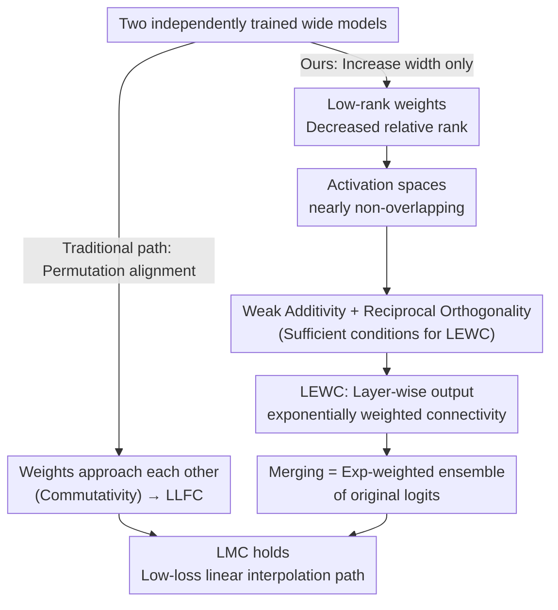

# Do We Really Need Permutations? Impact of Model Width on Linear Mode Connectivity

**Conference**: ICLR 2026  
**arXiv**: [2510.08023](https://arxiv.org/abs/2510.08023)  
**Code**: None  
**Area**: LLM Evaluation  
**Keywords**: Linear Mode Connectivity, model merging, permutation symmetry, model width, loss landscape

## TL;DR

Empirical evidence suggests that Linear Mode Connectivity (LMC) between independently trained models can be achieved solely by increasing model width without parameter permutations. The study proposes "Layer-wise Exponentially Weighted Connectivity" (LEWC) to explain the underlying mechanism.

## Background & Motivation

**Linear Mode Connectivity (LMC)** refers to the existence of a low-loss linear path between the parameters of two independently trained models, meaning that linear interpolation of parameters does not significantly increase loss. LMC is crucial for understanding the structure of loss landscapes and model merging (e.g., federated learning).

### Background

Entezari et al. (2022) hypothesized that for sufficiently wide models, there always exists a permutation $\pi$ such that LMC holds. Ainsworth et al. (2023) empirically validated this using Weight Matching (WM) but found it required very large width multipliers (e.g., 32× for ResNet-20, 4× for VGG-16). It was previously believed that:
- The role of width is to expand the candidate permutation space, increasing the probability of finding a good permutation.
- Without permutations, LMC does not hold.

### Core Idea

Even **without any permutations**, simply averaging the weights of two independently trained models can achieve test accuracy comparable to the original models, provided they are sufficiently wide. This challenges the conventional wisdom that "permutation is a necessary condition for LMC."

## Method

### Overall Architecture

This is an **analytical work** that does not propose new training or merging algorithms. Instead, it answers a counter-intuitive question: why does direct averaging of weights from two independently trained wide models—without any permutation alignment—hardly degrade test accuracy? The authors provide a three-step explanation: first, characterizing what happens after merging via a property called LEWC; second, providing two sufficient conditions for LEWC; and finally, showing how width satisfies both conditions through low-rank structures, completing the causal chain from "width $\to$ permutation-free LMC." Notably, there are two mutually exclusive paths to LMC: the traditional "permutation alignment" makes weights approach each other (leading to LLFC), while "increasing width" makes weights low-rank and orthogonal (leading to LEWC). Both paths lead to LMC but through opposite mechanisms.

### Key Designs

**1. Layer-wise Exponentially Weighted Connectivity (LEWC): Characterizing layer outputs of merged models**

To explain why merging does not degrade accuracy, the study first defines what each layer of the merged model computes. The authors define LEWC as: two models with parameters $\boldsymbol{\theta}_a, \boldsymbol{\theta}_b$ satisfy LEWC if, for any layer $\ell$ and interpolation coefficient $\lambda \in [0,1]$, the output of the $\ell$-th layer of the merged model is exactly an exponentially decayed weighted sum of the original models' outputs:

$$f_\ell(\mathbf{x}; \lambda\boldsymbol{\theta}_a + (1-\lambda)\boldsymbol{\theta}_b) = \lambda^\ell f_\ell(\mathbf{x}; \boldsymbol{\theta}_a) + (1-\lambda)^\ell f_\ell(\mathbf{x}; \boldsymbol{\theta}_b)$$

The exponent $\lambda^\ell$ is critical: the deeper the layer, the faster the decay. In the final layer, the output becomes equivalent to a weighted ensemble of the original logits. Since scaling logits does not change the argmax prediction, LEWC directly implies LMC.

**2. Sufficient Conditions for LEWC: Weak Additivity + Reciprocal Orthogonality**

LEWC is guaranteed by two basic conditions. First, **ReLU Weak Additivity**, requiring ReLU to behave linearly along the interpolation path:

$$\sigma(\lambda \tilde{\mathbf{z}}_\ell^{(a)} + (1-\lambda)\tilde{\mathbf{z}}_\ell^{(b)}) = \lambda\sigma(\tilde{\mathbf{z}}_\ell^{(a)}) + (1-\lambda)\sigma(\tilde{\mathbf{z}}_\ell^{(b)})$$

This holds in wide models due to the **curse of dimensionality** (cosine similarity of pre-activations tends to 0.93) and **low-rank induced non-overlap**, where activations fall on different dimensions. Second, **Reciprocal Orthogonality**, requiring one model's weights to yield zero when applied to another's activations:

$$\mathbf{W}_\ell^{(b)} \mathbf{z}_{\ell-1}^{(a)} = 0 \quad \text{and} \quad \mathbf{W}_\ell^{(a)} \mathbf{z}_{\ell-1}^{(b)} = 0$$

Effectively, the two models occupy disjoint features spaces. **Theorem 5.3** states that for bias-free models, Weak Additivity and Reciprocal Orthogonality together imply LEWC.

**3. Distinction from LLFC: Proximity vs. Orthogonality**

Unlike LLFC (Layer-wise Linear Feature Connectivity) which relies on **commutativity** and weight *proximity* via permutation, LEWC relies on **reciprocal orthogonality** and weight *diversity*. These are distinct mechanisms: LLFC explains LMC after permutation, while LEWC explains LMC from width alone.

**4. Low-rank Structure as the Link**

Width increases lead to a decrease in the relative rank of weight matrices, reducing the effective dimensionality of activations. This ensures non-overlapping activation spaces, satisfying both Weak Additivity and Reciprocal Orthogonality.

### Loss & Training

Standard training (SGD + weight decay 0.003) is used. A crucial engineering detail is **temperature calibration**: since LEWC causes logit norms to decay exponentially, the merged model's logits must be recalibrated using inverse temperature to ensure the loss barrier approaches zero.

## Key Experimental Results

### Main Results

**Table 1: Barrier values with/without permutation ($\lambda=1/2$)**

| Network | Dataset | No permutation Acc barrier | No permutation Loss barrier | WM permutation Acc barrier | WM permutation Loss barrier |
|------|--------|:-:|:-:|:-:|:-:|
| MLP (16×) | MNIST | 0.519% | 0.013 | -0.027% | -0.003 |
| VGG-11 (16×) | CIFAR-10 | 1.308% | 0.066 | 7.000% | 0.177 |
| ResNet-20 (32×) | CIFAR-10 | 2.694% | 0.087 | 5.135% | 0.173 |

Sufficiently wide models achieve small barriers without permutations. In some cases (VGG-11, ResNet-20), WM permutations even resulted in larger barriers than no permutation.

**Random Permutation Experiment**: Applying random permutations to wide models prior to merging still preserves accuracy, indicating that for wide models, fixed alignment is irrelevant.

### Ablation Study

**Impact of Weak Weight Decay ($10^{-4}$)**

| Condition | VGG-11 LEWC | VGG-11 Weak Additivity | VGG-11 Reciprocal Orthogonality |
|------|:-:|:-:|:-:|
| Std WD (0.003) | ✓ (High Cosine) | ✓ | ✓ (Low Ratio) |
| Weak WD ($10^{-4}$) | ✗ (Low Cosine) | ✗ | ✗ (High Ratio) |

Weak weight decay leads to high-rank weights, causing LEWC conditions to fail and LMC to break. This confirms the low-rank structure as the driver.

### Key Findings

1. **Width monotonically improves merging**: Accuracy of merged models increases with width until matching the original models.
2. **Temperature calibration is necessary**: LEWC results in exponential logit decay; calibration is needed for loss barriers to approach zero.
3. **LEWC $\neq$ Flatness**: LMC cannot be explained solely by loss landscape flatness; LEWC is an independent mechanism.
4. Approximately 2× the standard width is required for permutation-free LMC.

## Highlights & Insights

1. **Paradigm Shift**: Disproves the necessity of permutations for LMC, showing width is a more fundamental factor.
2. **LEWC Framework**: Explains model merging as an exponentially weighted ensemble, bridging merging and ensemble learning.
3. **Orthogonality vs. Commutativity**: Distinguishes two different LMC mechanisms, deepening understanding of loss landscapes.
4. **Causal Chain**: Width $\to$ Low-rank $\to$ Non-overlapping activations $\to$ LEWC $\to$ LMC.

## Limitations & Future Work

1. Experiments are limited to simpler datasets (MNIST, CIFAR-10) due to width multiplier requirements.
2. Standard architectures (MLP, VGG, ResNet) were used; Transformers remain unverified.
3. As an analytical work, it lacks new practical merging or federated learning methods.
4. LEWC requires BN recalibration and temperature scaling, increasing complexity.
5. Analysis focuses on sufficient rather than necessary conditions.
6. Complex datasets (CIFAR-100, ImageNet) may require prohibitively large widths.

## Related Work & Insights

- **Ainsworth et al. (2023)**: Weight Matching framework, the primary point of comparison.
- **Zhou et al. (2023)**: Proposes LLFC, which complements LEWC in explaining LMC.
- **Federated Learning**: Suggests that for wide clients, simple FedAvg may suffice without complex alignment.
- **Model Merging**: Wider models with appropriate weight decay provide the simplest strategy for successful merging.

## Rating

| Dimension | Score |
|------|------|
| Novelty | ★★★★★ |
| Technical Depth | ★★★★☆ |
| Experimental Thoroughness | ★★★★☆ |
| Writing Quality | ★★★★★ |
| Value | ★★★☆☆ |

<!-- RELATED:START -->

## Related Papers

- [\[NeurIPS 2025\] Generalized Linear Mode Connectivity for Transformers](../../NeurIPS2025/others/generalized_linear_mode_connectivity_for_transformers.md)
- [\[ICML 2026\] Functional Equivalence in Attention: A Comprehensive Study with Applications to Linear Mode Connectivity](../../ICML2026/others/functional_equivalence_in_attention_a_comprehensive_study_with_applications_to_l.md)
- [\[ICLR 2026\] Learning Distributions over Permutations and Rankings with Factorized Representations](learning_distributions_over_permutations_and_rankings_with_factorized_representa.md)
- [\[ICLR 2026\] On the Impact of the Utility in Semivalue-based Data Valuation](on_the_impact_of_the_utility_in_semivalue-based_data_valuation.md)
- [\[CVPR 2025\] PLeaS: Merging Models with Permutations and Least Squares](../../CVPR2025/others/pleas_-_merging_models_with_permutations_and_least_squares.md)

<!-- RELATED:END -->
