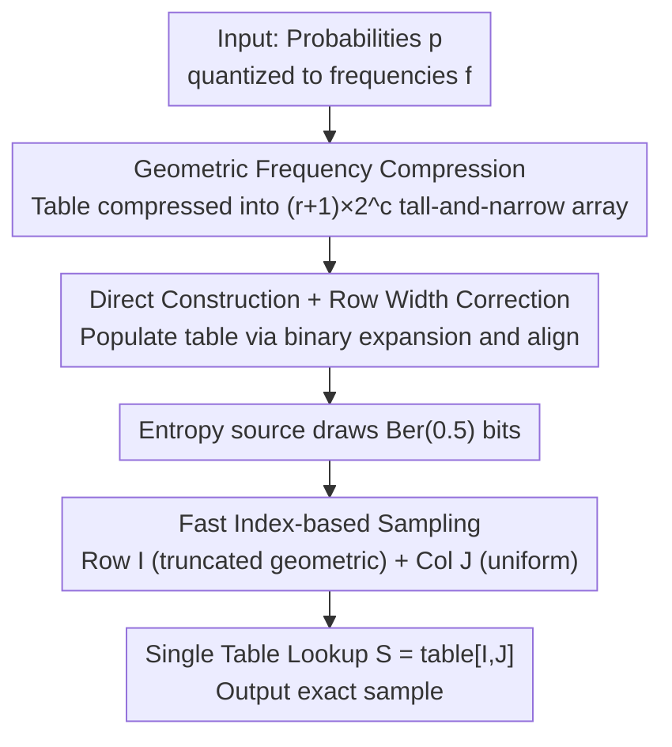

# Energy-Efficient Random Variate Generation via Compressed Lookup Tables

**Conference**: ICLR 2026  
**OpenReview**: [https://openreview.net/forum?id=hRY0ytSn00](https://openreview.net/forum?id=hRY0ytSnM0)  
**Code**: None  
**Area**: Efficient Sampling / Probabilistic Machine Learning / System & Hardware Energy Efficiency  
**Keywords**: Random Variate Generation, Compressed Lookup Tables, Energy Efficiency, Entropy-Optimal Sampling, Exact Sampling

## TL;DR
This paper proposes the cLUT (compressed lookup table) method: a "geometric frequency" scheme for lossless lookup table compression that compresses a naive table into a "tall and narrow" 2D array. Combined with a sampling step requiring only a few random bits and a single memory lookup, it achieves exact sampling for any finite discrete distribution, with speeds 10–100$\times$ faster than mainstream Python samplers and 25–50% lower energy consumption than SOTA C implementations.

## Background & Motivation

**Background**: Sampling from probability distributions is a fundamental operation for nearly all probabilistic machine learning methods, including Variational Autoencoders (VAEs), negative sampling in contrastive learning, diffusion models, and Bayesian inference. Discrete sampling in mainstream libraries (NumPy / PyTorch / JAX) is generally based on methods like Inversion, which are called extensively in data centers and edge devices.

**Limitations of Prior Work**: Sampling is a major bottleneck for throughput and energy consumption in many tasks, yet the academic community has long focused on "sampling quality" while neglecting the "energy cost per sample." A more subtle issue is precision: standard library algorithms are built on the "Real RAM" assumption and the theoretical premise of "infinite precision uniform samples from the unit interval." Real hardware uses finite-precision floating-point numbers, causing generated distributions to deviate from target distributions in unquantifiable ways, thus failing to provide theoretical guarantees—they are effectively **approximate samplers**.

**Key Challenge**: Tension exists between exact sampling and high efficiency. Theoretically, entropy-optimal discrete sampling (Knuth-Yao generating trees) requires only $H(p)$ to $H(p)+2$ bits per sample but necessitates memory that grows **exponentially** with distribution precision. Subsequent works (Interval Algorithm, FLDR, ALDR) reduced memory to linear scales but require expensive binary searches or multi-table searches during sampling, limiting practical efficiency. Naive lookup tables provide single-lookup speed but necessitate $N=2^b$ entries for $b$-bit precision, leading to exponential memory explosion.

**Goal**: To create a sampler suitable for any finite discrete distribution that simultaneously achieves "exactness + speed + energy efficiency + controllable precision," specifically by bypassing the issues of "exponential memory explosion" and "expensive searches during sampling."

**Key Insight**: The authors observed significant redundancy in naive lookup tables—an element with frequency $f_i$ is stored $f_i$ times. By organizing the table according to the binary expansion of frequencies, this redundancy can be losslessly compressed such that "one row represents one power-of-two frequency," compressing a table of size $N=2^{r+c}$ into $(r+1)\cdot 2^c$. The compression ratio grows exponentially with the number of rows $r$.

**Core Idea**: Use "geometric frequency compression" to compress the lookup table into a tall-and-narrow 2D array. Sampling then only requires "drawing a row index via a truncated geometric distribution + drawing a column index uniformly" followed by a single direct indexing—maintaining the speed of a single lookup, eliminating memory explosion, and ensuring exact sampling.

## Method

### Overall Architecture
cLUT splits sampling into a one-time **preprocessing (table construction)** phase and a high-frequency **sampling** phase. The input consists of $n$ outcomes $x_1, \dots, x_n$ and their probabilities $p_1, \dots, p_n$. Preprocessing quantifies probabilities into frequencies $f_i = \mathrm{round}(p_i \cdot 2^b)$ (subject to $\sum_i f_i = 2^b = N$) and constructs the **compressed lookup table** directly from the binary expansion of frequencies, avoiding the construction of a memory-intensive naive table. During sampling, several i.i.d. $\mathrm{Ber}(0.5)$ bits are drawn from an entropy source to calculate a row index $I$ and a column index $J$. A single lookup $S = \mathrm{compressedTable}[I, J]$ yields an exact sample.

The table is organized into $r+1$ rows and $2^c$ columns, where $2^{r+c} = 2^b = N$. In the first $r$ rows, the $i$-th row corresponds to frequency $2^{r-i}$, and the $(r+1)$-th row matches the $r$-th row with frequency 1. Since row index $I$ follows a truncated geometric distribution and column index $J$ follows a uniform distribution (independent of $I$), the probability of selecting an entry $(I, J) = (i, j)$ is exactly $2^{-\min(i, r)-c}$, accurately replicating the target distribution.

### Key Designs

**1. Geometric Frequency Compression: Losslessly compressing exponential tables using binary expansion**

This addresses the "exponential memory explosion" of naive lookup tables. The core observation is that an element with frequency $f_i$ is redundantly copied $f_i$ times, and any frequency can be written as a sum of powers of two (binary expansion). The table is organized into $r+1$ rows, where the $i$-th row represents frequency $2^{r-i}$. An element $x_i$ appears in row $j$ if and only if the $j$-th bit of $f_i$ is 1. Thus, a table originally of size $N=2^{r+c}$ is compressed to $(r+1) \cdot 2^c$ entries, with a compression ratio:

$$\rho = \frac{2^r}{r+1}.$$

The compression ratio $\rho$ grows exponentially with $r$. For a standard Gaussian discretized at 16-bit precision ($b=20$) with $n=20136$ values, the compressed table contains only 114,688 entries ($\approx 229$ kB, $\rho \approx 9.14\times$); for a Gamma distribution at $b=24$, $\rho$ can reach $\approx 170.67\times$. This compression is lossless as the total frequency of each element in the compressed table equals its frequency in the naive table.

**2. Fast Index-based Sampling: Truncated geometric + uniform indices to replace expensive searches**

This addresses the "expensive binary or multi-table searches" in FLDR/ALDR. The "row-by-power-of-two" structure allows the row index $I$ to be drawn via a very cheap process: $I$ follows a truncated geometric distribution 

$$P(I=i)=\max(2^{-i},2^{-r}),\quad i=1,\dots,r+1,$$

implemented by flipping fair coins until a 1 appears, requiring no lookups. The column index $J$ is sampled uniformly over $\{1,\dots,2^c\}$. The probability of any entry being selected is exactly $2^{-\min(i,r)-c}$, restoring the target distribution. Ultimately, only **one memory lookup** is performed, with no conditional branches or cross-table searches. This is the root cause of its energy efficiency compared to ALDR (which visits flattened search trees multiple times): a single index-based memory access flips fewer transistors.

**3. Direct Construction and Row Width Correction: Avoiding naive tables and rectifying asymmetric rows**

Two engineering problems are solved here. First, table construction avoids building the exponential naive table first; instead, it populates entries directly from binary expansions of $f_i$, using a "sum-preserving rounding" scheme to ensure $\sum f = 2^b$, making sampling **rejection-free**. Second, initial construction yields rows of unequal widths because different elements have bits set at different positions. **Row width correction** (Algorithm 2 / Figure 2) is applied: elements from higher rows are moved to lower rows, doubling in count as frequency halves (e.g., one 'a' at frequency 8 becomes one 'a' in row 2 + four 'a's in the bottom row). This maintains total frequency while creating a regular $(r+1) \times 2^c$ rectangular table, enabling uniform column sampling.

### A Complete Example
Consider distribution $x=(a,b,c,d)$ with $p=(7/16,5/16,3/16,1/16)$ and $b=4$. Frequencies are $f=(7,5,3,1)$. A naive table requires 16 entries. Binary expansion compression yields a 4-row ($r=3$), 2-column ($c=1$) table with only 8 entries. To sample: flip a coin to determine the row (50% chance for row 1 where high-frequency elements cluster), then sample the column uniformly from that row's 2 slots, then perform a single lookup. Verification: 'a' is in rows with frequencies 4, 2, and 1, totaling 7—matching the naive frequency.

## Key Experimental Results

### Main Results
Evaluated on an Intel i7-1255U with RAPL hardware counters. The test distribution was a discretized Exponential distribution with $n \in [10^1, 10^7]$.

Wall-clock time (seconds) to generate $10^7$ samples compared to Python samplers:

| Method | Sampling $n\in[10^1,10^5)$ | Sampling $n\in[10^6,10^7)$ |
|--------|------|------|
| NumPy | 0.668 | 9.625 |
| PyTorch | 0.607 | 3.377 |
| JAX | 0.365 | 0.798 |
| **cLUT** | **0.037** | **0.102** |

cLUT provides $\approx 10\times$ speedup for small distributions and $>100\times$ for $10^6 \sim 10^7$ magnitudes, all while being exact.

Energy, time, and power for single sampling ($n \in [10^7, 10^8)$) compared to SOTA C implementations:

| Method | Energy (nJ) | Time (ns) |
|--------|------|------|
| ALDR | 1223.5 | 102.8 |
| Alias | 887.7 | 55.9 |
| FLDR | 1214.4 | 101.4 |
| **cLUT** | **450.2** | **33.0** |

cLUT has the shortest sampling time across all sizes, saving 25–50% energy and being 30–40% faster than SOTA.

### Ablation / Analysis Study

| Analysis Dimension | Key Results | Description |
|------|---------|------|
| Bit Efficiency | Exp. $b-r+2-2^{-(r-1)}$ bits/sample | Approaches the information-theoretic lower bound $H(p)$. |
| Peak Memory | Slightly higher than other SOTA | Larger memory footprint during the preprocessing phase. |
| Compressed Table Size | Much smaller than rivals for low-entropy | High compression ratio leads to small resident memory. |
| Time Break-even $n^*$ | Approx. linear with distribution size | cLUT has high preprocessing cost requiring amortization. |
| Energy Break-even | 1 to $<10^3$ | Energy gains quickly offset preprocessing costs. |

In a TrueSkill application (extending to arbitrary priors via importance sampling), cLUT reduced total execution time by 72% and energy by 34% compared to NumPy. Compared to a specialized Gaussian mixture sampler, it saved 48% sampling time and 17% total energy with nearly identical posterior distributions.

### Key Findings
- **Energy is not proportional to time**: Energy is the integral of dynamic power over time. cLUT's single-index memory access flips fewer transistors, making energy savings more significant than time savings.
- **Large distributions are the "sweet spot"**: Larger distributions and higher precision lead to lower efficiency for traditional samplers, whereas cLUT’s table lookup and compression advantages become more prominent.
- **Preprocessing is the only bottleneck**: cLUT's table construction time is the highest among compared methods, but as a one-time cost, it is quickly amortized by subsequent massive sampling.

## Highlights & Insights
- **Using "binary expansion of frequency" as the physical table structure**: Mapping rows to power-of-two frequencies provides both lossless compression and support for cheap "truncated geometric row + uniform column" sampling, elegantly solving both memory and search issues.
- **Randomness consumption near the entropy lower bound**: Consuming an expected $b-r+2-2^{-(r-1)}$ bits per sample, with 50% of samples costing only $b-r+1$ bits, successfully achieving both "exactness" and "entropy efficiency."
- **Treating energy as a first-class metric**: Measuring CPU and wall-plug energy via RAPL/wattmeters rather than just execution time highlights the value of optimizing high-frequency operations for energy efficiency.
- **Extending indices to floating-point uniform sampling**: Interpreting row and column indices as exponents and mantissas allows for truly uniform sampling across the unit interval, bypassing statistical failures in uniform testing of classical methods.

## Limitations & Future Work
- **High preprocessing time and peak memory**: It is not cost-effective for scenarios with very few samples (the break-even point in time grows linearly with distribution size).
- **Restricted to finite discrete distributions**: Continuous or infinite discrete distributions require discretization and tail-truncation, necessitating a tradeoff between error and precision $b$.
- **Single-threaded CPU focus**: Evaluated on single-core CPU without SIMD to ensure fairness; relative advantages in multi-threaded or GPU environments require further verification.
- **High-entropy dependence**: For distributions nearing uniform, $r$ is small and compression gains are limited; advantages then stem from sampling paths rather than memory reduction.

## Related Work & Insights
- **vs Knuth-Yao Trees**: Both pursue entropy-optimal exact sampling, but trees require exponential memory relative to precision; cLUT reduces memory to $(r+1) \cdot 2^c$ while remaining near the entropy lower bound.
- **vs FLDR / ALDR**: These use linear memory but require multiple memory accesses or binary searches; cLUT uses a single compressed table and direct indexing without conditional branches.
- **vs Alias Method**: Alias is fast in preprocessing and sampling but produces **approximate** samples with no controllable error bound; cLUT is exact with controllable precision at the cost of higher preprocessing.
- **vs Marsaglia's Compressed Tables**: Previous compression schemes required conditional branches and searches across multiple tables; cLUT eliminates these overheads with a single table and direct indexing.

## Rating
- Novelty: ⭐⭐⭐⭐ The combination of geometric compression via binary expansion and truncated geometric row sampling is elegant and novel.
- Experimental Thoroughness: ⭐⭐⭐⭐ Multi-dimensional comparison (speed/energy/memory/bit efficiency) plus a TrueSkill application.
- Writing Quality: ⭐⭐⭐⭐ Figures 1 and 2 intuitively explain compression and correction.
- Value: ⭐⭐⭐⭐ High practical value for optimizing energy efficiency in ubiquitous low-level sampling operations.

<!-- RELATED:START -->

## Related Papers

- [\[ICLR 2026\] From Fields to Random Trees](from_fields_to_random_trees.md)
- [\[AAAI 2026\] Deadline-Aware, Energy-Efficient Control of Domestic Immersion Hot Water Heaters](../../AAAI2026/others/deadline-aware_energy-efficient_control_of_domestic_immersion_hot_water_heater.md)
- [\[ICLR 2026\] Deterministic Bounds and Random Estimates of Metric Tensors on Neuromanifolds](deterministic_bounds_and_random_estimates_of_metric_tensors_on_neuromanifolds.md)
- [\[CVPR 2026\] Learning Long-term Motion Embeddings for Efficient Kinematics Generation](../../CVPR2026/others/learning_long-term_motion_embeddings_for_efficient_kinematics_generation.md)
- [\[ACL 2025\] ERU-KG: Efficient Reference-aligned Unsupervised Keyphrase Generation](../../ACL2025/others/eru-kg_efficient_reference-aligned_unsupervised_keyphrase_generation.md)

<!-- RELATED:END -->
