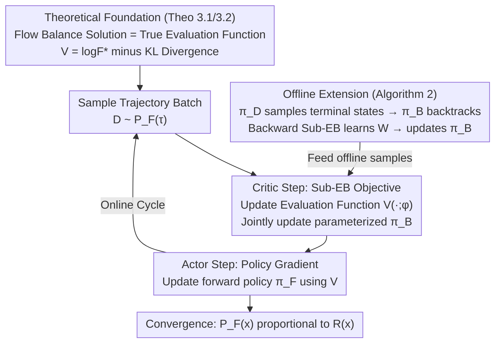

# Evaluating GFlowNet from Partial Episodes for Stable and Flexible Policy-Based Training

**Conference**: ICLR 2026  
**arXiv**: [2603.01047](https://arxiv.org/abs/2603.01047)  
**Code**: [github.com/niupuhua1234/Sub-EB](https://github.com/niupuhua1234/Sub-EB)  
**Area**: Others  
**Keywords**: GFlowNet, Policy Gradient, Evaluation Function, Flow Balance, Combinatorial Optimization

## TL;DR

Establish the theoretical connection between the state flow function and the policy evaluation function in GFlowNet, and propose the Subtrajectory Evaluation Balance (Sub-EB) objective for reliable learning of the evaluation function, enhancing the stability and flexibility of policy-based GFlowNet training.

## Background & Motivation

### GFlowNet Introduction

Generative Flow Network (GFlowNet) is a generative model that samples from a combinatorial space $\mathcal{X}$. The goal is to sample $x \in \mathcal{X}$ with a probability proportional to a reward function $R(x)$. The generation process is decomposed into incremental trajectories on a Directed Acyclic Graph (DAG), where the forward policy $\pi_F$ constructs the object step-by-step.

### Two Training Paradigms

**Value-based methods**: Introduce a flow function $F(s)$ and implicitly minimize distributional discrepancies through flow balance conditions (e.g., Sub-TB). The advantage is support for off-policy sampling, but flow balance does not directly reflect the true information of the rewards.

**Policy-based methods**: Borrowing from the Actor-Critic framework in RL, an evaluation function $V(s)$ is introduced to estimate the KL divergence of the policy at state $s$, followed by updating $\pi_F$ using policy gradients. The advantage is more efficient on-policy training.

### Key Challenge

The critical bottleneck of policy-based methods lies in **how to reliably learn the evaluation function $V(s)$**. Existing methods ($\lambda$-TD targets) are based on edge-level mismatches, considering only events after state $s$ and edge-level discrepancies. This provides insufficient learning signals and requires a fixed backward policy $\pi_B$. The key insight of this paper is: there is a deep connection between the flow function $F(s)$ and the evaluation function $V(s)$—for a fixed $\pi_F$, the solution to the flow balance condition is exactly equal to the true evaluation function.

## Method

### Overall Architecture

This paper addresses the long-standing problem of "how to stably learn the evaluation function $V(s)$" in policy-based GFlowNet. Existing $\lambda$-TD targets focus only on single-edge mismatches, leading to weak signals and forced fixing of the backward policy $\pi_B$. The authors break through by porting the effective "flow balance" idea from value-based methods into the policy-based framework, proposing the **Sub-EB (Subtrajectory Evaluation Balance)** condition and objective.

The overall training follows a two-step Actor-Critic cycle: in each round, a batch of trajectories is sampled from the current forward policy. The Critic step optimizes the evaluation function $V(\cdot;\phi)$ using the Sub-EB objective, and the Actor step then uses the learned $V$ to calculate policy gradients to update the forward policy $\pi_F(\cdot;\theta)$. This cycle repeats until the $\pi_F$ sampling distribution is proportional to the reward. The entire loop stands on a theoretical foundation: since the flow balance solution is proven to be equal to the true evaluation function, "learning $V$" is equivalent to "solving for optimal flow," ensuring stable policy updates. Under this framework, Sub-EB also relaxes two old constraints: the backward policy $\pi_B$ can be parameterized and updated alongside $V$, and off-policy data can be integrated into training via a backward evaluation function $W$ (Offline version, Algorithm 2).

### Key Designs

**1. Theoretical connection between flow function and evaluation function: Anchoring $V$ to optimal flow**

This is the foundation of the paper, corresponding to the top block of the framework diagram. Value-based methods learn the flow function $F(s)$, while policy-based methods learn the evaluation function $V(s)$. In the past, these were treated as two independent mechanisms. Theorem 3.1 points out they only differ by a KL divergence—for any $V$, it satisfies the Sub-EB condition if and only if

$$V(s_h) = \log F^*(s_h) - D_{\text{KL}}(P_F(\tau_{h:}|s_h) \| P_B(\tau_{h:}|s_h))$$

In simple terms, the evaluation function equals the logarithm of the optimal flow minus the current policy deviation starting from $s_h$. Thus, $V(s)$ serves two roles: encoding "how important this state is" (flow magnitude) and "how far the current policy deviates" (KL). Theorem 3.2 provides the symmetric view: the flow function $F$ and optimal policy $\pi_F^*$ satisfy Sub-TB if and only if $\log F(s_h) = \log F^*(s_h) - D_{\text{KL}}(P_{F^*}(\tau_{h:}|s_h) \| P_B(\tau_{h:}|s_h))$ and $\pi_F = \pi_F^*$. These theorems confirm that "the flow balance solution = true evaluation function," providing theoretical permission to use flow balance objectives to learn $V$.

**2. Sub-EB condition and training objective: Upgrading from single-edge mismatch to squared loss over subtrajectories**

With the theoretical link established, the authors formulate it as an alignable balance equation and translate it into an optimizable loss—the task of the Critic step. The Sub-EB condition requires that for all $i < j \in [H+1]$:

$$\mathbb{E}_{P_F(\tau_{i:j})} \left[ \log(P_F(\tau_{i:j}|s_i) \exp V(s_i)) \right] = \mathbb{E}_{P_F(\tau_{i:j})} \left[ \log(P_B(\tau_{i:j}|s_j) \exp V(s_j)) \right]$$

This states that the difference $V(s_i)-V(s_j)$ should exactly equal the true divergence accumulated by the subtrajectory $\tau_{i:j}$ moving from $s_i$ to $s_j$. Unlike $\lambda$-TD which only looks at the mismatch of one edge after $s_h$, Sub-EB ties the evaluation values at both ends of any subtrajectory together as a constraint, absorbing events both before and after $h$. The learning signal covers entire segments rather than single steps, making it more reliable than edge-level targets. By taking the difference, squaring it, and applying weighted summation, the Critic's training objective is obtained:

$$\mathcal{L}_V(\phi) = \mathbb{E}_{P_F(\tau)} \left[ \sum_{\tau_{i:j}} w_{j-i} \left( \log \frac{P_F(\tau_{i:j}|s_i) \exp V(s_i; \phi)}{P_B(\tau_{i:j}|s_j) \exp V(s_j; \phi)} \right)^2 \right]$$

This is almost identical in form to the Sub-TB objective in value-based methods but differs in role: Sub-EB only updates $\phi$ to learn $V$ given a fixed $\pi_F$, whereas Sub-TB jointly optimizes $(\pi_F, \log F)$ to update $\theta$. Furthermore, Sub-EB's expectation is taken over the current $P_F$ (on-policy), while Sub-TB can be taken over a data distribution $P_\mathcal{D}$ (off-policy). This "isomorphic but distinct roles" correspondence is the basis for the claim that Sub-EB is to policy-based methods what Sub-TB is to value-based methods.

**3. Support for parameterized backward policy: Unfreezing $\pi_B$**

The $\lambda$-TD objective has a hard constraint: the backward policy $\pi_B$ must be fixed; otherwise, the evaluation function learning fails. Niu et al. (2024) had to design an extra two-stage (forward/backward) algorithm for this. Sub-EB (and Sub-TB) naturally lacks this limitation. In the objective, $\pi_B$ appears in differentiable logarithmic terms, allowing it to be updated jointly with $V$ following the Sub-EB gradient (noted as "Jointly update parameterized $\pi_B$" in the Critic step). This eliminates the need for separate backward training phases or auxiliary objectives and allows $\pi_B$ to adapt dynamically. It turns flexibility from a slogan into trainable parameters, enabling high-level policy-based methods like TRPO, which originally required a fixed $\pi_B$, to utilize parameterized $\pi_B$.

**4. Offline policy-based training: Integrating off-policy data via backward evaluation functions**

Policy-based methods are usually considered strictly on-policy, unable to use a data collection policy $\pi_\mathcal{D}$ different from $\pi_F$. This paper bridges the offline path using a backward evaluation function $W$ (evaluating $\pi_B$, defined such that $W^\dagger(s_0):=\log F(s_0)$). This corresponds to the right branch of the framework: first, $\pi_\mathcal{D}$ samples terminal states $x$; then $\pi_B$ backtracks to generate trajectories; next, a backward version of the Sub-EB objective is used to learn $W$; finally, the policy gradient of $W$ updates $\pi_B$. When both $\pi_B$ and $\pi_F$ reach optimality, the KL term disappears and $F(x)=R(x)$, achieving the GFlowNet goal. This chain feeds offline samples into a framework that previously only accepted online data, allowing policy-based methods to reuse experience replay and local search exploration techniques.

### Loss & Training

Online training (Algorithm 1) consists of three steps per round: ① Sample batch $\mathcal{D} \sim P_F(\tau)$; ② Update the evaluation function $V$ using $\nabla_\phi \hat{\mathcal{L}}_V(\phi)$; ③ Update $\pi_F$ using the policy gradient $\hat{\nabla}_\theta V^\dagger(s_0;\theta)$. Offline training (Algorithm 2) reverses the direction: $\pi_\mathcal{D}$ samples terminal states → $\pi_B$ backtracks trajectories → Backward Sub-EB updates $W$ → Update $\pi_B$. Both share the weight coefficient $w_{j-i} = \lambda^{j-i} / \sum_{i<j} \lambda^{j-i}$, where $\lambda$ controls preference for short vs. long subtrajectories—highlighting Sub-EB's flexibility over $\lambda$-TD, which is restricted to $\lambda$-decay forms.

## Key Experimental Results

### Main Results

**Hypergrid Experiments (Exact $D_{\text{TV}}$ calculation)**

| Method | 256×256 Convergence | 128×128×128 Stability | 64×64×64 Final Performance |
|------|:-:|:-:|:-:|
| CV (Empirical Grad) | Poor | Poor | Average |
| RL ($\lambda$-TD) | Medium (Unstable) | Unstable | Good |
| **Sub-EB** | **Good (Stable & Fast)** | **Stable & Fast** | **Good** |
| Sub-TB (Value-based) | Medium | Average | Average |

Sub-EB significantly improves the stability and convergence speed of policy-based methods, especially in high-dimensional or large-scale grids.

**Bayesian Network Structure Learning (Real task, 10/15 nodes)**

| Method | 10-node Avg Reward | 10-node Diversity | 10-node FCS |
|------|:-:|:-:|:-:|
| Sub-TB | Medium | Medium | Average |
| Q-Much | Medium | Medium | Average |
| RL | High | Good | Good |
| **Sub-EB** | **Highest** | **Good** | **Good** |
| **Sub-EB-B** | **Highest (+Offline Enh.)** | Slightly Lower | - |

### Ablation Study

**Parameterized $\pi_B$ Ablation (256×256, 128×128, 64×64×64)**

| Method | Performance |
|------|---------|
| Sub-EB-P (Parameterized $\pi_B$) | Best across all methods, most stable training |
| RL-P (Two-stage) | Second best, additional complexity due to backward stage |
| RL-MLE (Max Likelihood) | Inferior to Sub-EB-P |
| Sub-TB-P (Parameterized $\pi_B$) | Similar to Sub-TB |

Confirms the inherent advantage of Sub-EB in supporting parameterized backward policies.

### Key Findings

1. **Sub-EB vs $\lambda$-TD**: Utilizing balance information at the subtrajectory level (rather than just edge level) significantly improves the reliability of learning the evaluation function.
2. **Policy-based vs Value-based**: Policy-based methods (RL, Sub-EB) generally outperform value-based methods (Sub-TB, Q-Much) in convergence speed and distribution modeling quality.
3. **Effectiveness of Offline Enhancement**: Sub-EB-B (integrating local search) achieves the highest reward in BN structure learning, validating Sub-EB's compatibility with offline techniques.
4. **Molecular Graph Design** ($|\mathcal{X}| \approx 10^{16}$): Sub-EB performs robustly in large-scale tasks, achieving higher average rewards and faster convergence.

## Highlights & Insights

1. **Theoretical Elegance**: Reveals the relationship between the flow function and the evaluation function as being "offset by a KL divergence," unifying value-based and policy-based perspectives.
2. **Plug-and-Play**: The Sub-EB objective can directly replace the $\lambda$-TD objective with almost no change to the training pipeline.
3. **Triple Flexibility**: Supports (1) parameterized backward policies, (2) offline data collection, and (3) flexible subtrajectory weighting schemes.
4. **Deep Correspondence**: Sub-EB is to policy-based methods what Sub-TB is to value-based methods—symmetrical in form and complementary in semantics.

## Limitations & Future Work

1. The strategy for choosing weight coefficients $w_{j-i}$ can be further optimized (currently using fixed $\lambda$-decay).
2. Theoretical analysis is based on layered DAG assumptions; actual implementations require adding dummy states.
3. Integration into more advanced policy-based methods (e.g., full TRPO implementation) has yet to be done.
4. Hypergrid experiments rely on exact calculations; larger scales require approximate metrics like FCS.
5. Theoretical guidance on the optimal $\gamma$ selection for the variance-bias trade-off in policy gradients is currently lacking.

## Related Work & Insights

- **Sub-TB** (Madan et al., 2023): Sub-trajectory balance objective for value-based methods, providing the formal inspiration for Sub-EB.
- **GFlowNet Policy Gradient** (Niu et al., 2024): Proposed the Actor-Critic framework and $\lambda$-TD target; Sub-EB directly improves its Critic learning.
- **Q-Much / RFI**: RL variants of value-based methods, used as baselines in the BN experiments.
- Insight: Can the "balance condition → evaluation function" logic of Sub-EB be generalized to value function learning in general RL?

## Rating

| Dimension | Score |
|------|------|
| Novelty | ★★★★☆ |
| Tech Depth | ★★★★★ |
| Experimental Thoroughness | ★★★★☆ |
| Writing Quality | ★★★★☆ |
| Value | ★★★★☆ |

<!-- RELATED:START -->

## Related Papers

- [\[ICLR 2026\] Fast and Stable Riemannian Metrics on SPD Manifolds via Cholesky Product Geometry](fast_and_stable_riemannian_metrics_on_spd_manifolds_via_cholesky_product_geometr.md)
- [\[ICLR 2026\] Stable and Scalable Deep Predictive Coding Networks with Meta-Prediction Errors](stable_and_scalable_deep_predictive_coding_networks_with_meta-prediction_errors.md)
- [\[NeurIPS 2025\] Hybrid-Balance GFlowNet for Solving Vehicle Routing Problems](../../NeurIPS2025/others/hybrid-balance_gflownet_for_solving_vehicle_routing_problems.md)
- [\[ICML 2026\] Private and Stable Test-Time Adaptation with Differential Privacy](../../ICML2026/others/private_and_stable_test-time_adaptation_with_differential_privacy.md)
- [\[NeurIPS 2025\] Uncertainty Estimation by Flexible Evidential Deep Learning](../../NeurIPS2025/others/uncertainty_estimation_by_flexible_evidential_deep_learning.md)

<!-- RELATED:END -->
