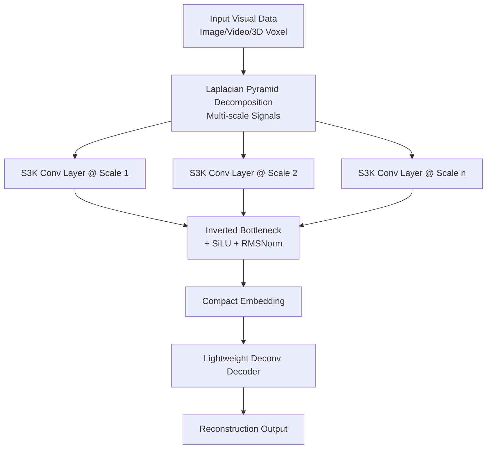

# Exploring State-Space Models for Data-Specific Neural Representations

**Conference**: ICLR 2026  
**OpenReview**: [https://openreview.net/forum?id=R5xBLfD9Dv](https://openreview.net/forum?id=R5xBLfD9Dv)  
**Code**: To be confirmed  
**Area**: Implicit Neural Representation / Data-Specific Neural Representation  
**Keywords**: State-Space Models, Implicit Neural Representation, Neural Compression, S3K, NeRV, Laplacian Pyramid  

## TL;DR
This paper introduces State-Space Models (SSMs) to "data-specific neural representations" for the first time (overfitting a compact network to a single image/video/3D instance). It theoretically demonstrates that the hidden states of SSMs inherently encode the input signal itself and proposes the Structured State-Space Kernel (S3K). By distilling SSMs into convolutional kernels to support multi-dimensional inputs and downsampling, the method outperforms existing approaches in image, video, and 3D reconstruction.

## Background & Motivation
- **Background**: The core goal of data-specific neural representations (INR, neural compression) is to store individual visual data with **minimum parameters** and **maximum reconstruction quality**. A classic approach treats visual data as continuous signals sampled at discrete points, projecting signals onto a set of basis functions and storing only the coefficients—the foundation of traditional compression like Fourier and Wavelets.
- **Limitations of Prior Work**: Modern INR methods **lose the essence of "projecting to basis functions"**, degenerating into simple coordinate-to-RGB mappings, bit quantization, or relying on capacity stacking for implicit redundancy removal, lacking architectures that internalize the "basis function projection" idea.
- **Key Challenge**: SSMs naturally align with this approach—their hidden states were originally designed as "coefficients for reconstructing observed data using a set of orthogonal polynomial bases." However, **directly applying SSMs face two major hurdles**: (1) they only handle 1D sequences, requiring unnatural flattening/scanning for multi-dimensional data; (2) they are **length-preserving** (output length equals input length), making them inherently incapable of compression.
- **Goal**: Systematically explore the potential of SSMs in data-specific neural representation and design a module that preserves SSM signal-modeling capabilities while enabling multi-dimensional processing and downsampling.
- **Core Idea**: **[Signal Modeling Perspective]** SSM hidden states encode the input signal itself (rather than semantic patterns), making them naturally suited for reconstruction; **[Kernel Distillation Perspective]** Folding SSM state recurrence into a convolutional kernel and taking only the final hidden state achieves both "compression + downsampling."

## Method

### Overall Architecture
The paper proceeds in two stages: exploration and implementation. The first stage (exploration) uses a minimalist structure of an SSM encoder + lightweight decoder to verify that various SSMs **generally outperform Transformers** in image reconstruction. Architecture comparisons conclude that a "multi-scale + Laplacian pyramid" setup is most suitable for SSMs. The second stage (implementation) proposes S3K to distill SSMs into convolutional kernels, extending them to multiple dimensions and enhancing expressiveness, resulting in LPNet-S3K.

### Key Designs

**1. SSMs encode the "input signal itself"—a proof for reconstruction-friendliness**: Starting from the classic sinusoidal estimation problem, the authors prove (Theorem 4.1) that when the state transition matrix $\mathbf{A}$ is diagonalizable with non-zero distinct eigenvalues $\{\lambda_i\}$, there exists a mapping $f:(\mathbf{A},\mathbf{B})\mapsto\mathbf{F}$ such that the input function can be decomposed into a linear combination of complex exponentials $\phi(t)=\sum_{n=1}^{N} c_n \overline{e^{\lambda_n(L-t)}}$, where coefficients $c_n$ are derived from the hidden state $h$. This indicates that SSM parameters $\mathbf{A}, \mathbf{B}$ and hidden states collectively capture input signal features—encoding $\phi(t)$ itself rather than semantic relationships between tokens like Transformers. This explains the counter-intuitive observation: SSMs **comprehensively outperform Transformers** in short-sequence reconstruction because "signal modeling" is more valuable than "semantic relations" in this task.

**2. Architectural Exploration: Stacking is harmful, Laplacian Pyramid is optimal**: Three variants were compared using a fixed decoder. **Stacked variants** (alternating SSMs and convolutions in deep networks) performed worse because SSMs project inputs onto implicit basis functions; multi-layer stacking equates to repeated projection, amplifying artifacts like "generation loss" in information theory and suppressing reconstruction rates. **Image Pyramids** (one SSM per resolution) were effective by increasing capacity across scales without stacking. **Laplacian Pyramids** (common in traditional compression) performed best—they have less cross-scale redundancy, allowing independent SSMs at each level to be fully utilized. These findings determined the final architecture.

**3. Structured State-Space Kernel (S3K): Folding SSMs into "Compression + Downsampling" Convolutional Kernels**: The discretized SSM state recurrence $h_i \approx \bar{\mathbf{A}}h_{i-1}+\bar{\mathbf{B}}\phi_i$ can be expanded into a convolutional form. The final hidden state $h_{L-1}=[\bar{\mathbf{A}}^{L-1}\bar{\mathbf{B}}\ \cdots\ \bar{\mathbf{A}}\bar{\mathbf{B}}\ \bar{\mathbf{B}}][\phi_0\ \cdots\ \phi_{L-1}]^\top$ represents the projection of the entire sequence onto the basis functions. Since prior work showed the final hidden state alone can reconstruct the input, the authors explicitly construct the kernel as $\mathbf{K}=[\bar{\mathbf{A}}^{L-1}\bar{\mathbf{B}}\ \cdots\ \bar{\mathbf{B}}]\in\mathbb{C}^{N\times L\times C}$. A single convolution **skips all intermediate states to directly obtain a compressed representation**. Theorem 5.1 ensures that given the final state, there exists a reconstruction function $R(\mathbf{A},\mathbf{B},h)$ to recover the original sequence, making S3K a theoretically guaranteed lossy compression mechanism. Calculation is simplified via $\mathbf{A}$ diagonalization and a MIMO framework ($\bar{\mathbf{B}}\in\mathbb{C}^{N\times C}$) to handle multiple channels.

**4. Multi-dimensional Expansion and Expressiveness Enhancement**: Based on the property that "nD basis functions = outer products of 1D basis functions," nD kernels are obtained by taking outer products of independent 1D S3Ks (dimensions $L^{(1)}\times\cdots\times L^{(n)}\times N\times C$). This allows direct processing of images, videos, and 3D voxels like standard convolutions. To combat limited expressiveness due to few learnable parameters in structural kernels, three techniques are added: **Input-adaptive $\mathbf{B}$** (kernel parameters adjust dynamically with input, inspired by Mamba), **Real-valued SSM parameters** (improving numerical stability), and **trailing $1\times1$ convolutions** (decoupling state dimension $N$ from output channels for capacity). Finally, S3K is embedded into each level of the Laplacian Pyramid with inverted bottlenecks, SiLU, and RMSNorm to form LPNet-S3K.

## Key Experimental Results

### Main Results
Image (Kodak/CLIC2020, PSNR/MS-SSIM) and 3D (Objaverse voxels):

| Method | Kodak | CLIC2020 | Objaverse |
|------|-------|----------|-----------|
| ConvNeXt | 25.99/0.8830 | 24.39/0.8280 | 17.17/0.7536 |
| LPNet-Conv | 27.44/0.9132 | 25.41/0.8505 | 17.67/0.7815 |
| LPNet-Mamba | 27.51/0.9227 | 26.16/0.8694 | 17.74/0.7732 |
| **LPNet-S3K (Ours)** | **28.09/0.9331** | **26.33/0.8692** | **18.34/0.8492** |

Video NeRV (UVG, PSNR): Ours-S achieves 33.66 with only 3.0M parameters, exceeding larger DNeRV (3.4M) and PNeRV (3.3M); Ours-P achieves 34.36 at 3.3M, the highest average across seven sequences. On Bunny, the model ranks first across all sizes (0.35M~3.0M), reaching 32.93 PSNR at 0.35M, significantly leading SNeRV's 30.88.

### Ablation Study
SSM Type × Encoder Variant (CIFAR-100 image reconstruction PSNR), selected results:

| SSM Block | Baseline | (a) Stacked | (b) Image Pyramid | (c) Laplacian Pyramid |
|-----------|----------|-------------|-------------------|-----------------------|
| Transformer | 24.75 | 24.87 | 23.96 | 24.67 |
| S4ND | 26.00 | 25.25 | 25.75 | **26.61** |
| Mamba | 24.90 | 24.82 | 24.78 | 26.58 |
| S4D | 25.49 | 24.99 | 25.48 | 26.06 |

- In the Baseline, **all SSMs outperform Transformers**; stacking generally leads to performance drops; Laplacian Pyramids yield the highest scores.

### Key Findings
- LPNet-S3K leads across image, 3D, and video modalities, with the **performance gain entirely attributed to the SSM encoder**. Video experiments reused decoders from HNeRV/SNeRV/PNeRV, maintaining identical decoding speed (FPS), making it friendly for real-time streaming.
- **Decoupled Architecture and Module Gains**: LPNet-Conv's Gain over ConvNeXt proves the LPNet architecture is effective; LPNet-S3K's Gain over LPNet-Conv proves the S3K convolution itself is effective. LPNet-S3K also outperforms LPNet-Mamba, indicating S3K is a better fit as a "compression-specific SSM."
- **Leader in Rate-Distortion**: LPNet-S3K outperforms baselines across various bpp (bits per pixel) on Bunny/UVG, showing robust compression capability across different ratios.
- The method is **orthogonal** to bit quantization and large-scale prior learning, offering complementary potential.
- Qualitative results show the model preserves high-frequency textures, text on signs, and 3D geometric details even at smaller sizes.

## Highlights & Insights
- **Clarifying why SSMs suit reconstruction**: Theorem 4.1 shows SSM hidden states represent complex exponential decomposition of the input signal, explaining why SSMs beat Transformers from a signal processing perspective and reconnecting modern INR to traditional basis function compression (Fourier/Wavelets).
- **Two-in-one S3K**: Constructing a kernel using the final hidden state achieves compression and downsampling simultaneously, eliminating intermediate state computations and providing theoretical guarantees for reconstruction.
- **Plug-and-play**: Improves performance on standard NeRV benchmarks by only swapping the encoder without increasing inference costs.

## Limitations & Future Work
- **High Encoding Overhead**: Constructing the kernel for the input size requires approx. 20× memory and 4× FLOPs compared to standard convolutions, limiting scalability. This can be mitigated through hardware optimization or equivalent formulas that avoid explicit kernel construction.
- **Unoptimized Decoder**: Currently uses simple upsampling or off-the-shelf decoders; customizing decoders for SSM-encoded features may provide further Gains.
- **Generalization to Autoencoders**: S3K's compression properties could be used for compressed autoencoders in generative models, encoding inputs with fewer tokens.

## Related Work & Insights
- **SSM Lineage**: HiPPO → LSSL → S4/S4D/S4ND → S5 → Mamba; this work differs by focusing on "compression-style compact representation" rather than classification or sequence translation.
- **INR and Neural Compression**: Inherits the "parameterized continuous signal" and "encoder-decoder" traditions, embedding SSMs as a new architectural component.
- **Insight**: When the internal mechanism of a new architecture (SSM) corresponds directly to a classic mathematical tool (basis function projection), returning to first principles to derive closed-form solutions (like the S3K kernel construction) is often more effective than black-box stacking.

## Rating
- **Novelty**: ⭐⭐⭐⭐⭐ First systematic integration of SSMs and data-specific neural representation, with original theory (Theorems 4.1/5.1) and architecture (S3K).
- **Experimental Thoroughness**: ⭐⭐⭐⭐ Covers image, video, and 3D modalities, including ablation of multiple SSM variants; however, encoding overhead analysis and large-scale model validation are slightly brief.
- **Writing Quality**: ⭐⭐⭐⭐ Clear narrative moving from exploration to implementation, natural transition between theory and experiments.
- **Value**: ⭐⭐⭐⭐ Provides a theoretically grounded new architectural direction for INR/neural compression that is orthogonal to existing quantization/prior techniques.

<!-- RELATED:START -->

## Related Papers

- [\[ICLR 2026\] Out of the Shadows: Exploring a Latent Space for Neural Network Verification](out_of_the_shadows_exploring_a_latent_space_for_neural_network_verification.md)
- [\[ICLR 2026\] Beyond Uniformity: Regularizing Implicit Neural Representations through a Lipschitz Lens](beyond_uniformity_regularizing_implicit_neural_representations_through_a_lipschi.md)
- [\[ICML 2025\] UnHiPPO: Uncertainty-Aware Initialization for State Space Models](../../ICML2025/others/unhippo_uncertainty-aware_initialization_for_state_space_models.md)
- [\[NeurIPS 2025\] Deep Continuous-Time State-Space Models for Marked Event Sequences](../../NeurIPS2025/others/deep_continuous-time_state-space_models_for_marked_event_sequences.md)
- [\[ACL 2026\] Neural Induction of Finite-State Transducers](../../ACL2026/others/neural_induction_of_finite-state_transducers.md)

<!-- RELATED:END -->
