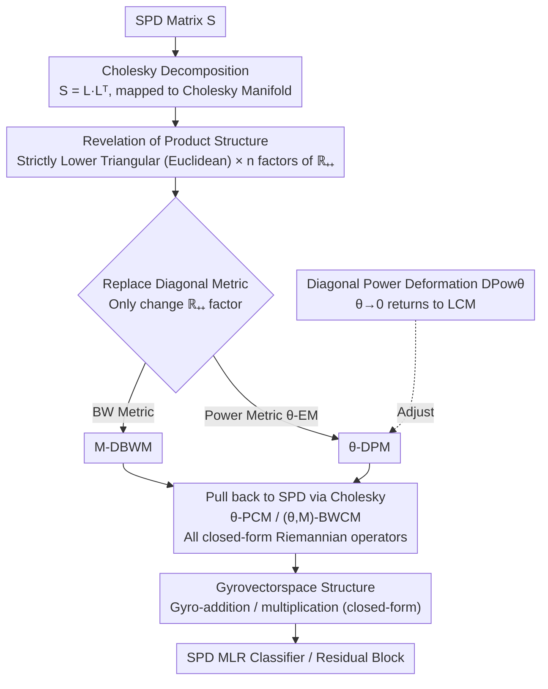

# Fast and Stable Riemannian Metrics on SPD Manifolds via Cholesky Product Geometry

**Conference**: ICLR 2026  
**arXiv**: [2407.02607](https://arxiv.org/abs/2407.02607)  
**Code**: [github.com/GitZH-Chen/PCM_BWCM](https://github.com/GitZH-Chen/PCM_BWCM)  
**Area**: Others  
**Keywords**: SPD manifolds, Riemannian metrics, Cholesky decomposition, product geometry, SPD neural networks

## TL;DR

This work reveals a simple product structure on Cholesky manifolds, leading to two fast and numerically stable SPD metrics (PCM and BWCM). All Riemannian operators possess closed-form expressions, achieving triple improvements in performance, efficiency, and stability for SPD deep learning.

## Background & Motivation

### SPD Matrix Learning

Symmetric Positive Definite (SPD) matrices are widely used in medical imaging, EEG analysis, signal processing, and computer vision. SPD matrices form a non-Euclidean manifold $\mathcal{S}_{++}^n$. Conventional Euclidean methods are inapplicable, necessitating Riemannian metrics to define fundamental operations such as distances, geodesics, and logarithmic/exponential mappings.

### Existing SPD Metrics

Mainstream metrics currently include:
- **AIM** (Affine-Invariant Metric): Good theoretical properties but computationally expensive (requires SVD), with $O(n^3)$ complexity.
- **LEM** (Log-Euclidean Metric): Requires matrix logarithms, leading to numerical instability.
- **PEM** (Power-Euclidean Metric): Requires matrix powers, offering some flexibility.
- **LCM** (Log-Cholesky Metric): Based on Cholesky decomposition, fast and stable; a common choice in practice.
- **BWM** (Bures-Wasserstein Metric): Derived from optimal transport, though some operators lack closed-form solutions.
- **GBWM** (Generalized BWM): A generalization of BWM.

### Advantages and Limitations of LCM

LCM transforms SPD operations into lower triangular matrix operations via Cholesky decomposition, offering closed-form operators, high efficiency, and numerical stability. However, the diagonal part of LCM uses the **logarithmic mapping** (log/exp); when diagonal elements are very small, it leads to numerical overflow (e.g., $\log(10^{-15})$) or excessive stretching.

### Key Insight

The Cholesky metric corresponding to LCM (diagonal log metric) actually possesses a **product structure**: the strictly lower triangular part uses the Euclidean metric, while the diagonal part is a product of $n$ Riemannian metrics on $\mathbb{R}_{++}$. This implies that **simply by replacing the metric on $\mathbb{R}_{++}$**, one can derive new Cholesky metrics and SPD metrics.

## Method

### Overall Architecture

The paper addresses the challenge of creating "fast and stable" Riemannian metrics on SPD manifolds. Existing metrics are either slow (AIM requires SVD) or suffer from numerical explosion when diagonal elements approach 0 (LCM's log mapping). The breakthrough lies in performing a Cholesky decomposition to map the SPD manifold to the Cholesky manifold and observing that the Cholesky manifold is a **product space**: the strictly lower triangular part is a trivial Euclidean space, and the diagonal part is a product of $n$ one-dimensional positive real manifolds $\mathbb{R}_{++}$. The pipeline thus becomes: decompose the SPD matrix to the Cholesky manifold, replace the metric only on the diagonal $\mathbb{R}_{++}$ factors with more stable ones (a power metric yields $\theta$-DPM, and the BW metric yields M-DBWM), and pull back the new metric along the Cholesky mapping to the SPD manifold. This results in two new families of metrics: $\theta$-PCM and $(\theta, M)$-BWCM. Since only the one-dimensional diagonal factors are modified, all Riemannian operators inherit closed-form expressions, further supplemented by a gyrovectorspace structure for SPD networks.

### Key Designs

**1. Revelation of Product Structure: Reducing metric design to a choice on $\mathbb{R}_{++}$**

The foundation of the method is the observation that the Cholesky metric behind LCM (diagonal log metric) is not monolithic but can be decomposed into a product manifold:

$$\{\mathcal{L}_{++}^n, g^{\text{DL}}\} = \{\mathcal{SL}^n, g^E\} \times \underbrace{\{\mathbb{R}_{++}, g^{\mathbb{R}_{++}}\} \times \cdots \times \{\mathbb{R}_{++}, g^{\mathbb{R}_{++}}\}}_{n}$$

where $\mathcal{SL}^n$ is the space of strictly lower triangular matrices (equipped with the Euclidean metric $g^E$), and each $\mathbb{R}_{++}$ corresponds to a diagonal element. The metric LCM uses on the diagonal is $g_p(v,w) = p^{-2}vw$, which is the unified form of AIM/LEM/LCM when degenerated to the 1D $\mathcal{S}_{++}^1$. This decomposition is crucial because it reduces the high-dimensional problem of "designing a new SPD metric" to the 1D problem of "picking a metric on $\mathbb{R}_{++}$"—replacing the diagonal factor metric automatically yields a new family of Cholesky and SPD metrics.

**2. Replacing Diagonal Metrics: Two families of fast and stable new metrics with all closed-form operators**

Based on the product structure, the authors replace the diagonal $\mathbb{R}_{++}$ metric with two friendlier choices. The first is $\theta$-DPM (Diagonal Power Metric), which uses the power-Euclidean metric ($\theta$-EM) on the diagonal:

$$g_L^{\theta\text{-DE}}(X,Y) = \langle \lfloor X \rfloor, \lfloor Y \rfloor \rangle + \langle \mathbb{L}^{\theta-1}\mathbb{X}, \mathbb{L}^{\theta-1}\mathbb{Y} \rangle$$

The second is M-DBWM (Diagonal Bures-Wasserstein Metric), which uses the BW metric from optimal transport on the diagonal:

$$g_L^{\mathbb{M}\text{-DBW}}(X,Y) = \langle \lfloor X \rfloor, \lfloor Y \rfloor \rangle + \frac{1}{4}\langle \mathbb{L}^{-1}\mathbb{X}, \mathbb{M}^{-1}\mathbb{Y} \rangle$$

Here, $\lfloor\cdot\rfloor$ denotes the strictly lower triangular part, and $\mathbb{L}/\mathbb{X}$ denotes the diagonal part. The strictly lower triangular terms in both equations maintain the static Euclidean inner product; the difference lies only in the diagonal terms—a modular benefit of the product structure.

Pulling back $\theta$-DPM and M-DBWM to the SPD manifold yields $\theta$-PCM and $(\theta, M)$-BWCM. Geodesics, log maps, exp maps, parallel transport, distances, and weighted Fréchet means all retain closed-form expressions, eliminating the need for iterative solvers. Taking the distance under $\theta$-DPM as an example:

$$d^2(L,K) = \|\lfloor K \rfloor - \lfloor L \rfloor\|_F^2 + \frac{1}{\theta^2}\|\mathbb{K}^\theta - \mathbb{L}^\theta\|_F^2$$

Comparing this to LCM reveals the source of numerical stability: LCM's diagonal term uses $\log(\mathbb{K}) - \log(\mathbb{L})$, while $\theta$-DPM uses $\mathbb{K}^\theta - \mathbb{L}^\theta$. As diagonal elements $x \to 0^+$, $\log(x)$ plunges toward $-\infty$ (causing overflow at $10^{-15}$), whereas $x^\theta$ gracefully approaches 0. Using power functions instead of logs/exps is the fundamental reason why the method is both stable (no overflow for small eigenvalues) and fast (no SVD).

**3. Diagonal Power Deformation: A knob for continuous interpolation between new and old metrics**

To unify the new metrics with existing ones, the authors define a diagonal power deformation $\text{DPow}_\theta$. By tuning $\theta$, one can interpolate: as $\theta \to 0$, the deformed metric approaches the log-Cholesky metric (returning to LCM); at $\theta = 1$, it recovers the proposed metric. This makes $\theta$ an adjustable knob, allowing users to balance between "close to LCM" and the "proposed metric" based on data characteristics (e.g., whether diagonal elements are balanced) without choosing between two disconnected frameworks.

**4. Gyrovectorspace Structure: Providing an algebraic foundation for SPD networks**

To integrate these metrics into SPD neural networks, an algebraic structure for "addition/multiplication" is required. The authors provide closed-form expressions for gyro-addition and gyro-scalar multiplication under the new metrics. For instance, gyro-addition is defined as:

$$L \oplus K = \lfloor L \rfloor + \lfloor K \rfloor + (\mathbb{L}^\beta + \mathbb{K}^\beta - I)^{1/\beta}$$

They prove it satisfies all axioms of gyrocommutative groups and gyrovectorspaces. With this closed-form group operation, network components like SPD MLR classifiers and SPD residual blocks can be constructed using the new metrics.

### Loss & Training

The new metrics are applied to two SPD network components:

**SPD MLR Classifier** (a Riemannian generalization based on point-to-hyperplane distance):

$$p(y=k|S) \propto \exp\left[\langle \lfloor K \rfloor - \lfloor L_k \rfloor, \lfloor A_k \rfloor \rangle + \frac{1}{2\theta}\langle \mathbb{K}^\theta - \mathbb{L}_k^\theta, \mathbb{A}_k \rangle\right]$$

**SPD Residual Block** (a generalization based on Riemannian exponential maps):
$$Y = \text{Exp}_X(Q \cdot \text{diag}(f(\text{spec}(X))) \cdot Q^T)$$

## Key Experimental Results

### Main Results

**Table 2: SPDNet + SPD MLR Classifier**

| Metric | Radar (Acc/Time) | HDM05 3-Block (Acc/Time) | FPHA (Acc/Time) |
|------|:-:|:-:|:-:|
| AIM | 94.53 / 0.80s | 61.14 / 19.23s | 85.57 / 7.14s |
| LEM | 93.55 / 0.76s | 60.28 / 3.50s | 85.90 / 0.98s |
| LCM | 93.49 / 0.72s | 62.33 / 2.90s | 86.37 / 0.74s |
| **θ-PCM** | **95.79 / 0.72s** | **65.75 / 2.76s** | **89.40 / 0.69s** |
| θ-BWCM | 93.93 / 0.71s | 67.40 / 2.87s | 86.27 / 0.70s |

**Table 3: GyroSPD Backbone**

| Metric | Radar | HDM05 | FPHA |
|------|:-:|:-:|:-:|
| LCM | 96.29 | 68.37 | 89.83 |
| **θ-PCM** | **97.04** | **71.93** | **91.17** |
| **θ-BWCM** | 96.21 | **72.74** | **91.00** |

On HDM05 (action recognition), $\theta$-BWCM improves accuracy by +5.1% over LCM (+4.37% with the GyroSPD backbone).

### Ablation Study

**Numerical Stability: Small Eigenvalue Test (Table 5)**

| $\epsilon$ (Min Eigenvalue) | DLM Failure Rate | θ-DPM Failure Rate | θ-DBWM Failure Rate |
|:-:|:-:|:-:|:-:|
| $10^{-1}$ | 0.62% | **0%** | **0%** |
| $10^{-3}$ | 51.32% | **0%** | **0%** |
| $10^{-5}$ | 99.39% | **0%** | **0%** |
| $10^{-10}$ | 100% | **0%** | **0%** |
| $10^{-20}$ | 100% | **0%** | **0%** |

Log-Cholesky metrics (DLM/LCM) fail almost 100% of the time with small eigenvalues (producing Inf/NaN), while the proposed metrics **do not fail**.

**Ablation of Deformation Parameter $\theta$**: Scanning $\theta$ from $-2$ to $1.5$ shows a clear optimal $\theta$ for HDM05 (a dataset with highly imbalanced Cholesky diagonal elements), while the impact is smaller for Radar/FPHA where elements are more balanced.

### Key Findings

1. $\theta$-PCM and $\theta$-BWCM generally exceed LCM in accuracy, despite their shared Cholesky product structure.
2. The computational speed of the new metrics is comparable to LCM (10-25x faster than AIM) and performs better in high dimensions (256×256).
3. In residual block experiments (Table 4), $\theta$-PCM achieves the highest accuracy across all datasets.
4. Numerical stability is a decisive advantage—zero failure rate across any eigenvalue range.

## Highlights & Insights

1. **Revelation of Product Structure**: Simple but highly instructive—reducing metric design to a choice on $\mathbb{R}_{++}$.
2. **Power Functions vs. Logarithms**: Core numerical insight—$x^\theta$ is much more stable than $\log(x)$ as $x \to 0^+$.
3. **Theoretical Completeness**: Provides full closed-form Riemannian operators, gyrovectorspace axiom verification, and deformation continuity.
4. **Value in Practice**: Can be directly plugged into existing SPD network frameworks (SPDNet, GyroSPD, RResNet) without architectural changes.

## Limitations & Future Work

1. Experiments are limited to small-to-mid scale SPD matrices ($n \leq 93$); performance on large scales (e.g., $n > 1000$) remains to be verified.
2. Focused only on classification; other tasks like regression or generation were not covered.
3. Selection of $\theta$ and $\mathbb{M}$ currently relies on grid search; theoretical guidance for optimal selection is lacking.
4. The product structure assumes a standard Euclidean metric for the strictly lower triangular part; could more flexible metrics be used?
5. Comparison with BWM on full SPD matrices is not entirely fair (as BWM is not Cholesky-based).

## Related Work & Insights

- **LCM** (Lin, 2019): The direct basis of this work; its product structure essence was revealed here.
- **GyroSPD** (Nguyen & Yang, 2023): Provided the gyrovectorspace framework, which this work extends.
- **SPD ResNet** (Katsman et al., 2024): Provided the residual block framework, which this work adapts.
- **Thanwerdas & Pennec (2022)**: Theoretical framework for SPD deformation metrics; this work implements similar ideas at the Cholesky level.
- Insight: **Identifying product structures on arbitrary manifolds** may be a general strategy for designing efficient metrics.

## Rating

| Dimension | Score |
|------|------|
| Novelty | ★★★★☆ |
| Technical Depth | ★★★★★ |
| Experimental Thoroughness | ★★★★☆ |
| Writing Quality | ★★★★★ |
| Value | ★★★★☆ |

<!-- RELATED:START -->

## Related Papers

- [\[ICLR 2026\] Evaluating GFlowNet from Partial Episodes for Stable and Flexible Policy-Based Training](evaluating_gflownet_from_partial_episodes_for_stable_and_flexible_policy-based_t.md)
- [\[ICLR 2026\] Stable and Scalable Deep Predictive Coding Networks with Meta-Prediction Errors](stable_and_scalable_deep_predictive_coding_networks_with_meta-prediction_errors.md)
- [\[ICML 2026\] Decision Tree Learning on Product Spaces](../../ICML2026/others/decision_tree_learning_on_product_spaces.md)
- [\[ICLR 2026\] Probabilistic Kernel Function for Fast Angle Testing](probabilistic_kernel_function_for_fast_angle_testing.md)
- [\[ICLR 2026\] Refine Now, Query Fast: A Decoupled Refinement Paradigm for Implicit Neural Fields](refine_now_query_fast_a_decoupled_refinement_paradigm_for_implicit_neural_fields.md)

<!-- RELATED:END -->
