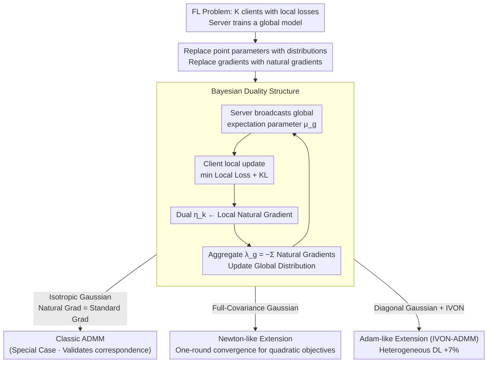

# Federated ADMM from Bayesian Duality

**Conference**: ICLR 2026  
**arXiv**: [2506.13150](https://arxiv.org/abs/2506.13150)  
**Code**: [Available](https://github.com/xxx)  
**Area**: Others  
**Keywords**: ADMM, Variational Bayes, Natural Gradient, Federated Learning, Bayesian Duality

## TL;DR
The Bayesian duality structure of ADMM is derived from a Variational Bayes (VB) perspective, proving that classic ADMM is a special case of VB on the isotropic Gaussian family. Two new extensions are derived: Newton-like (one-round convergence for quadratic objectives) and Adam-like (+7% accuracy in deep heterogeneous scenarios).

## Background & Motivation

**Background**: ADMM serves as a core algorithmic framework for federated learning. Since its introduction in the 1970s, its form has remained largely unchanged. Its robust algorithmic structure raises the question of whether a more general formalization exists that encompasses it.

**Limitations of Prior Work**: Existing accelerated variants of ADMM (over-relaxation, momentum, scaled norms, etc.) merely introduced additional variables without changing the fundamental form of the algorithm. Swaroop et al. biological observed line-by-line similarities between VB and ADMM but were unable to derive an exact correspondence.

**Key Challenge**: ADMM is a deterministic optimization framework, making it difficult to naturally extend to heterogeneous deep learning scenarios. Therefore, a more general framework is needed to unify and generalize it.

**Key Insight**: The key insight is that the solution to the VB objective function itself possesses a dual structure, which not only resembles the ADMM fixed-point structure but also naturally generalizes it. The critical missing link was the **natural gradient**.

**Core Idea**: The natural parameter-expectation parameter duality of the exponential family of distributions is used to establish a "Bayesian duality" structure. ADMM is exactly the special case of VB under the isotropic Gaussian family.

## Method

### Overall Architecture
This paper addresses whether classic ADMM can be placed within a more general probabilistic framework. The authors "translate" the entire primal-dual structure of ADMM into the language of Variational Bayes (VB). While classic ADMM solves for the primal-dual fixed point consisting of the parameter quadruple $(\theta_g^*, \theta_k^*, \mathbf{v}_k^*, \mathbf{v}_g^*)$, Bayesian ADMM upgrades this to an expectation-natural parameter duality consisting of the distribution parameter quadruple $(\mu_g^*, \mu_k^*, \eta_k^*, \lambda_g^*)$. The two structures correspond line-by-line, with two core differences: gradients are replaced by natural gradients, and point parameters are replaced by distributions.

In terms of the algorithm, this dual structure corresponds to one round of federated communication: the server broadcasts global distribution parameters $\rightarrow$ each client performs local updates and returns the local natural gradient as the dual variable $\rightarrow$ the server sums these natural gradients to obtain the new global natural parameter. The flexibility of the framework lies in the choice of the exponential family distribution: choosing isotropic Gaussians reduces the natural gradient to the standard gradient, exactly recovering classic ADMM; choosing full-covariance Gaussians yields a one-round convergent Newton-like variant; choosing diagonal Gaussians (combined with IVON) yields an Adam-like variant suitable for deep models.

### Key Designs

**1. Bayesian Duality Structure: Replicating ADMM Primal-Dual using Exponential Family Natural-Expectation Parameter Duality**

The fixed-point condition of the VB objective can be written as the global natural parameter being equal to the negative sum of the local loss natural gradients, i.e., $\lambda_g^* = -\sum_{k=0}^{K} \nabla \mathcal{L}_k(\mu_g^*)$. The authors introduce a local distribution $q_k^*$ and dual variable $\eta_k^*$ for each client, expanding this condition into a four-condition structure that aligns line-by-line with the four updates of ADMM (local primal, global primal, local dual, global dual). The key is the use of the natural gradient instead of the standard gradient—this step completes the missing link in Swaroop et al.'s work, upgrading "line-by-line similarity" to an exact correspondence. When $q$ is an isotropic Gaussian, the Fisher Information reduces to the identity matrix, the natural gradient equals the standard gradient, and the structure exactly recovers classic ADMM.

**2. Newton-like Extension: Replacing with Full-Covariance Gaussian for One-Round Convergence on Quadratic Objectives**

Classic ADMM requires multiple iterations to converge even for quadratic objectives. By using a multivariate Gaussian with full covariance for $q$, the natural gradient incorporates the inverse of the Fisher Information matrix. For quadratic objectives, this is equivalent to a single Newton step, thus converging to the optimum in just one communication round. This compresses the linear convergence of ADMM on quadratic objectives to a single step, serving as an "at no cost" acceleration from the dual structure and validating the theoretical correspondence.

**3. Adam-like Extension (IVON-ADMM): Replacing with Diagonal Gaussian for Adaptive Learning Rates in Deep Learning**

Full-covariance Fisher matrices are computationally prohibitive for deep models. The authors utilize diagonal covariance Gaussians and the IVON method to efficiently estimate the diagonal Fisher Information. This grants each parameter dimension its own adaptive step size, similar to Adam. This retains the structural advantages of Bayesian duality while keeping computational overhead comparable to standard FL, enabling the framework to function in heterogeneous deep learning scenarios.

### Loss & Training
- Client: Minimize local loss + KL regularization (the Bayesian version of the local objective).
- Server: Aggregates natural gradient parameters (natural parameters of the distribution) rather than the gradients themselves.

## Key Experimental Results

### Main Results
Deep Heterogeneous Federated Learning:

| Method | Accuracy | Runtime | Note |
|------|--------|---------|------|
| FedADMM | Baseline | Baseline | Classic ADMM |
| FedAvg | Baseline-level | Baseline-level | Standard FL |
| IVON-ADMM | **+7%** | **Comparable** | Adam-like extension |

### Ablation Study (Theory Verification on Quadratic Objectives)

| Method | Convergence Rounds | Note |
|------|---------|------|
| Classic ADMM | Multiple | Linear convergence |
| Newton-like ADMM | **1 round** | Immediate convergence |

### Key Findings
- IVON-ADMM achieves +7% accuracy in deep heterogeneous scenarios (non-IID data) without increasing communication or computational overhead.
- The Newton-like variant indeed converges in one round for quadratic objectives, validating theoretical predictions.
- The natural gradient is the key connection between VB and ADMM—the specific link missing in previous work.

## Highlights & Insights
- **Mathematical Beauty**: Classic ADMM is revealed to be a special case of Bayesian methods on the simplest distribution family. This connection is elegant and opens a path for generalizing optimization algorithms using probability distribution families.
- **The Critical Role of the Natural Gradient**: Previous works could not establish an exact correspondence using standard gradients; using natural gradients makes the derivation seamless. This illustrates the deep role of information geometry in algorithm design.
- **Free Lunch**: IVON-ADMM uses an efficient diagonal Fisher implementation, which does not increase runtime but significantly improves performance in heterogeneous scenarios.

## Limitations & Future Work
- Deep learning experiments were conducted on a small scale (7-layer CNN); performance on larger models (e.g., LLM) remains unknown.
- The diagonal Fisher approximation may be inaccurate for certain models.
- The choice of the exponential family distribution serves as a prior assumption, and clear guidance for distribution selection is lacking.
- Communication efficiency analysis is relatively simplistic.

## Related Work & Insights
- **vs FedADMM**: Classic ADMM is a special case; Bayesian ADMM provides a rigorous generalization.
- **vs FedAvg**: IVON-ADMM shows significant advantages in heterogeneous scenarios.
- **vs PVI (Swaroop 2025)**: Resolves the missing exact correspondence between PVI and ADMM.

## Rating
- Novelty: ⭐⭐⭐⭐⭐ The Bayesian duality structure is original, elegant, and unifies two major paradigms.
- Experimental Thoroughness: ⭐⭐⭐ Theoretical verification is strong, but deep learning experiments are small-scale.
- Writing Quality: ⭐⭐⭐⭐⭐ Theoretical derivations are clear, and the duality diagrams are intuitive.
- Value: ⭐⭐⭐⭐ Provides a new theoretical foundation and practical extensions for federated optimization.

<!-- RELATED:START -->

## Related Papers

- [\[ICLR 2026\] Layerwise Federated Learning for Heterogeneous Quantum Clients using Quorus](layerwise_federated_learning_for_heterogeneous_quantum_clients_using_quorus.md)
- [\[ICLR 2026\] Bayesian Influence Functions for Hessian-Free Data Attribution](bayesian_influence_functions_for_hessian-free_data_attribution.md)
- [\[NeurIPS 2025\] Rethinking PCA Through Duality](../../NeurIPS2025/others/rethinking_pca_through_duality.md)
- [\[ICLR 2026\] Bayesian Post Training Enhancement of Regression Models with Calibrated Rankings](bayesian_post_training_enhancement_of_regression_models_with_calibrated_rankings.md)
- [\[ICLR 2026\] A Federated Generalized Expectation-Maximization Algorithm for Mixture Models with an Unknown Number of Components](a_federated_generalized_expectation-maximization_algorithm_for_mixture_models_wi.md)

<!-- RELATED:END -->
