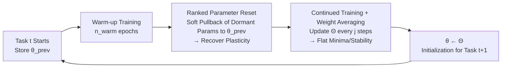

# Forget Forgetting: Continual Learning in a World of Abundant Memory

**Conference**: ICLR 2026  
**OpenReview**: [https://openreview.net/forum?id=fvL8IIEPxG](https://openreview.net/forum?id=fvL8IIEPxG)  
**Code**: To be confirmed  
**Area**: Continual Learning / Lifelong Learning  
**Keywords**: Continual Learning, Abundant Replay Memory, Stability-Plasticity, Weight Space, Parameter Reset, Weight Averaging, Computational Efficiency

## TL;DR
When storage is cheap and the GPU is the bottleneck, the primary challenge of continual learning flips from "preventing forgetting" to "preserving plasticity." This paper proposes a lightweight weight-space method (ranked parameter reset + in-training weight averaging) to recover both stability and plasticity at a cost comparable to naive Replay.

## Background & Motivation
**Background**: Continual Learning (CL) has treated "compressing exemplar memory" as a primary constraint for decades—typical class-IL benchmarks allow only 20 samples per class (approx. 4% of the total data). LLM continual learning also commonly uses limited caches or memory-free mechanisms to avoid long-term storage issues. The entire evaluation and methodology system is built on the premise of "extreme memory scarcity."

**Limitations of Prior Work**: This premise is becoming untenable in real-world deployments. Cloud object storage and local SSDs are both cheap and scalable—storing 1TB of data costs less than \$25 per month. Conversely, GPU training is truly expensive—an AWS instance with 8 A100s costs over \$30 per hour. If the purpose of CL is to "avoid the expensive cost of joint training from scratch," the optimization goal should be reducing GPU costs rather than saving storage. However, existing methods have not been systematically studied in the context of relaxed memory constraints, nor are there corresponding efficient solutions.

**Key Challenge**: As memory transitions from "scarce" to the **middle ground** of "abundant but not full," the authors found that the contradiction **flips**. When memory is sufficient, forgetting (the stability issue) is largely suppressed by replay; however, the model becomes severely biased toward old tasks and struggles to learn new ones—**plasticity instead becomes the new bottleneck**. Even worse, in this regime, naive Replay outperforms several SOTA methods (expansion-based methods like DER/FOSTER/MEMO are expensive and yield only marginal gains) at a fraction of the GPU cost.

**Goal**: Characterize the stability-plasticity trade-off in the realistic regime of "abundant exemplar memory" and provide a method that **does not exceed the cost of Replay** but can restore lost plasticity.

**Core Idea**: **"Perform two complementary actions simultaneously in the weight space."** Use ranked parameter resets to gently nudge "dormant" parameters back to pre-trained values to restore plasticity, and use in-training weight averaging to push the model toward flat minima to consolidate stability. This process does not store multiple model copies or add extra backpropagation, resulting in near-zero overhead.

## Method

### Overall Architecture
The method is called **Weight Space Consolidation**. It operates directly on the weights of a single model and is embedded into the training pipeline of each task. For each new task $t$: first, save the previous solution $\theta_{\text{prev}}$ as a reference; perform normal training with task loss for $n_{\text{warm}}$ warm-up epochs; then perform a **one-time ranked reset** to pull unimportant parameters back toward $\theta_{\text{prev}}$ (restoring plasticity); maintain a **running weight average** $\Theta$ throughout the remaining training (enhancing stability); at the end of the task, replace current weights with $\Theta$ to serve as a stable initialization for the next task. Both steps are derived from the analysis in Section 3 and do not require storing task-level model replicas.

### Key Designs

**1. Redefining the problem in the "abundant memory" coordinate system: Theoretical characterization of rising stability and falling plasticity** — The authors define the memory budget as $K \approx \kappa \sum_{j=1}^{t-1}|D_j|$, where $\kappa\in(0,1]$ determines the proportion of old data that can be stored. When $\kappa$ is sufficiently large, the empirical distribution of the buffer approaches the true distribution of old tasks, and the empirical risk $\tilde{R}_{1:t}$ approaches the ideal joint risk. Consequently, the learned solution $\tilde\theta^*_{1:t}$ moves closer to the joint optimum $\theta^*_{1:t}$—suppressing forgetting naturally (improving stability). However, the training distribution is a mixture $P^{(t)}_{\text{train}}\approx\lambda P_t+(1-\lambda)P^{(t)}_{\text{past}}$. As memory increases, $\lambda$ decreases and the old distribution dominates, leading to $P^{(t)}_{\text{train}}\approx P^{(t-1)}_{\text{train}}$. This causes the gradients of new and old tasks to align closely (cosine similarity $\rho_t\to 1$), compressing the average gradient norm. The parameter update $\|\theta^{(t)}-\theta^{(t-1)}\|=\eta\|\bar g_t\|\le\eta\|\bar g^{(\text{new})}_t\|$ further shrinks as $\lambda\to0$. The model tends to "reuse" old parameters rather than learning new representations, leading to **plasticity degradation**. This characterization explains why Replay becomes stronger with large memory while SOTA methods show diminishing returns, and points to "restoring plasticity" as the solution.

**2. Ranked parameter reset: Picking "dormant" parameters via Adam momentum signals and soft pullback to the old solution** — The key insight is that "abundant memory provides a stable starting point, but staying too close to it prevents learning." After warm-up, a momentum-based importance score $S_l = |\hat m_l|\cdot \hat v_l$ is calculated for each parameter element $l$, reusing Adam’s existing first and second moments $(\hat m_l,\hat v_l)$ with near-zero extra cost. The intuition is: a large $\hat m_l$ indicates consistent gradient direction, while a large $\hat v_l$ indicates high gradient energy; their product captures both "focused" and "sustained" learning signals. Parameters with low $S_l$ are considered dormant. The top-$Q\%$ (default $Q=20$) is kept, and the rest undergo a **soft reset**—mixing with the previous solution via $\theta[l]=\alpha\cdot\theta[l]+(1-\alpha)\cdot\theta_{\text{prev}}[l]$ ($\alpha=0.5$), rather than a hard random initialization. This gently pushes the model out of the basin of the old solution to restore plasticity while maintaining critical parameters for stability. Ablations show that soft reset consistently outperforms random/hard revert/Shrink&Perturb/Continual Backprop.

**3. In-training weight averaging: Converging oscillating trajectories to flat minima for stability** — After the reset, training continues for the remaining epochs while maintaining a moving average $\Theta\leftarrow(n_{\text{avg}}\cdot\Theta+\theta)/(n_{\text{avg}}+1)$ following the SWA approach, updated every $j$ steps. Abundant memory brings high data diversity and consequently high gradient variance; after warm-up, the model often oscillates between multiple low-loss regions. Averaging these regions leads to a flatter, more robust minimum, consolidating knowledge from both new and old tasks. Crucially, this is **performed on-the-fly during single-model training** as a byproduct of the optimization process. Unlike traditional CL model merging, it does not require storing multiple task-specific models for post-hoc merging, making it scalable to long task sequences. At the end of the task, replace $\theta$ with $\Theta$ to initialize the next task.

**4. Two complementary steps: Resetting paves the way for averaging** — The ablation (Table 3) reveals a mechanistic conclusion: reset alone (w/o avg.) is barely better than Replay, and averaging alone (w/o reset) improves stability but fails to learn new tasks. Significant gains are only achieved when both are used together. The authors' interpretation is that "weight reset primarily serves to make weight averaging truly effective"—first pushing the model out of the old basin to create meaningful trajectory diversity, then using averaging to converge this trajectory to a superior minimum.

## Key Experimental Results

### Main Results Table (Class-IL Average Accuracy %, 5 seeds, bold denotes best non-expansionist method)

| Method | CIFAR100 20(4%) | 80(16%) | 200(40%) | 400(80%) | ImageNet100 200(16%) | 400(30%) | 600(46%) |
|---|---|---|---|---|---|---|---|
| Replay | 48.63 | 63.78 | 71.60 | 75.71 | 73.79 | 78.59 | 81.08 |
| iCaRL | 49.95 | 64.81 | 72.69 | 75.49 | 73.57 | 78.45 | 80.87 |
| BiC | 53.65 | 64.74 | 69.15 | 72.50 | 74.14 | 77.51 | 79.29 |
| WA | 61.32 | 66.19 | 71.42 | 73.83 | 75.85 | 78.79 | 80.21 |
| **Ours** | 52.16 | **66.89** | **74.49** | **77.71** | **76.43** | **80.26** | **82.64** |
| *DER (Expansionist)* | 63.95 | 70.13 | 74.64 | 75.60 | 78.59 | 79.61 | 80.53 |
| *FOSTER (Expansionist)*| 66.22 | 67.67 | 73.53 | 77.28 | 76.01 | 80.94 | 82.79 |

Key Points: In constrained memory (4%), traditional methods lead; however, as memory increases, the gap narrows rapidly, with most methods performing similarly to Replay at $\ge 20\%$. Ours consistently outperforms all non-expansionist baselines at $\ge 20\%$ memory, with training costs comparable to Replay. While expansionist methods (DER/FOSTER/MEMO) are strong, their training time is 4–5× that of Replay. On LLM Continual Instruction Tuning (TRACE, 8 tasks, LLaMA-3.2), Ours leads overall when memory > 20%, outperforming Task Arithmetic / MagMax (which require storing all task models, VRAM $\propto|W|\cdot T$) by 2–9%, while using only $|W|\cdot 2$ VRAM.

### Ablation Study Table

| Configuration (CIFAR-100) | mem 20 | 80 | 200 | 400 |
|---|---|---|---|---|
| Replay | 48.92 | 63.30 | 70.84 | 75.38 |
| w/o reset (Avg. only) | 50.23 | 65.01 | 72.33 | 76.98 |
| w/o avg. (Reset only) | 48.73 | 63.43 | 70.81 | 74.99 |
| **Ours (Both)** | **52.00** | **66.51** | **73.57** | **77.42** |

Importance Measures (Table 4): The momentum-based $S_l=|\hat m_l|\hat v_l$ matches the performance of expensive Hessian-based scores at a much lower cost; using only the first or second moment significantly degrades performance. Reset Strategy (Table 5): Soft reset > random/revert/Shrink&Perturb/Continual Backprop, with the advantage becoming more pronounced as memory increases. Regarding frequency, "resetting once after warm-up" is best in most settings; multiple resets only provide extra benefits under constrained memory.

### Key Findings
- **The Contradiction Flips**: Under abundant memory, the challenge shifts from stability to plasticity—this is the core empirical finding of the paper (Figure 1/2).
- **Resetting for Averaging**: The two components are complementary; either one alone performs close to Replay, and only together do they provide significant gains.
- **CL vs. Full Retraining** (Table 6): Under $\le 40\%$ memory, Ours (e.g., 74.49 at 200 memory) even outperforms joint training from scratch (69.96), suggesting that CL with proper plasticity recovery is more cost-effective than expensive retraining in the medium memory range.

## Highlights & Insights
- **Redefining the Problem, Not Just a Trick**: The paper clarifies the implicit assumption of "memory scarcity" held for decades and points out that when the GPU is the bottleneck, the goal should be optimizing GPU cost rather than storage. This turns the "Replay beating SOTA" anomaly into an explainable conclusion.
- **Reusing Adam Momentum for Importance Scoring**: $|\hat m_l|\hat v_l$ requires no extra backpropagation or Hessian calculation but matches Hessian-based accuracy, making it computationally very cheap.
- **In-Training Weight Averaging vs. Post-hoc Merging**: This naturally avoids the need to store multiple task models required by traditional CL model merging and bypasses potential sequential constraints, making it scalable for long sequences.
- **Cross-domain Validation**: Results hold from ResNet class-IL to LLaMA-3.2 continual instruction tuning, with a 3–4× reduction in cost and consistent conclusions across modalities.

## Limitations & Future Work
- **Dependency on the "Abundant but Not Full" Premise**: In truly restricted memory settings (4%), Ours is inferior to WA/BiC; the "sweet spot" of the method is medium-to-large memory. Determining exactly what counts as "abundant" still requires empirical exploration.
- **Conjectural Explanation for Plasticity Loss**: The argument that gradient alignment $\rho_t\to1$ leads to update shrinkage is based on several approximation hypotheses (e.g., $P^{(t)}_{\text{train}}\approx P^{(t-1)}_{\text{train}}$), serving more as a motivating analysis than a rigorous theorem.
- **Hyperparameter Sensitivity**: There are several hyperparameters ($Q$, $\alpha$, reset frequency, averaging interval $j$). Although tuned once on 20% memory and applied elsewhere, robustness when migrating across domains to larger models requires further validation.
- **Lack of Memory-Free/Online Streaming Context**: The method is still fundamentally rehearsal-based and is not applicable to privacy-sensitive scenarios where no data can be stored.

## Related Work & Insights
- **Three Categories of CL** (Regularization: EWC/MAS, Replay: iCaRL, Expansionist: DER/FOSTER/MEMO): This work leans toward Replay but questions the necessity of strict memory constraints, aligning with recent "cost-aware" works like Prabhu/Harun/Chavan.
- **Loss of Plasticity** (Dohare et al. Continual Backprop, Shrink&Perturb, Parameter Reset): Previous works mostly discussed plasticity in the context of full memory/joint training while ignoring forgetting; this paper argues that both stability and plasticity must be managed in realistic regimes.
- **Weight Space Operations** (Model Soups, TIES, Task Arithmetic, SWA/Izmailov): This paper adapts post-hoc merging ideas into "in-training on-the-fly operations," seeking the flat minima of soups while avoiding the cost of storing multiple models.
- **Insight**: When the core constraint of a field (here, storage) is invalidated by hardware evolution, it is worth re-examining the benchmark settings—many SOTA advantages may only exist under obsolete constraints.

## Rating
- **Novelty**: ⭐⭐⭐⭐ — The components (reset + averaging) are not new, but the repositioning of the problem—the flip from stability to plasticity under abundant memory—is insightful and turns a Replay anomaly into a systematic conclusion.
- **Experimental Thoroughness**: ⭐⭐⭐⭐ — Covers a spectrum of memory budgets + Image/LLM domains + comprehensive ablations (components/measures/reset strategies/frequency/vs. full retraining), reporting standard error over 5 seeds.
- **Writing Quality**: ⭐⭐⭐⭐ — The motivation chain is clear, and the charts represent the cost-accuracy trade-offs intuitively. The theoretical analysis, though intuitive, serves the arguments well.
- **Value**: ⭐⭐⭐⭐ — Provides a high-efficiency CL baseline for the "memory is no longer the bottleneck" era. It has direct guidance for real-world deployment and is easy to implement with zero extra overhead.

<!-- RELATED:START -->

## Related Papers

- [\[ICML 2026\] Continual Learning of Domain-Invariant Representations](../../ICML2026/others/continual_learning_of_domain-invariant_representations.md)
- [\[AAAI 2026\] Forget Less by Learning from Parents Through Hierarchical Relationships](../../AAAI2026/others/forget_less_by_learning_from_parents_through_hierarchical_relationships.md)
- [\[ICLR 2026\] HippoTune: A Hippocampal Associative Loop–Inspired Fine-Tuning Method for Continual Learning](hippotune_a_hippocampal_associative_loopinspired_fine-tuning_method_for_continua.md)
- [\[ICLR 2026\] Hippoformer: Integrating Hippocampus-inspired Spatial Memory with Transformers](hippoformer_integrating_hippocampus-inspired_spatial_memory_with_transformers.md)
- [\[AAAI 2026\] Why Isn't Relational Learning Taking Over the World?](../../AAAI2026/others/why_isnt_relational_learning_taking_over_the_world.md)

<!-- RELATED:END -->
