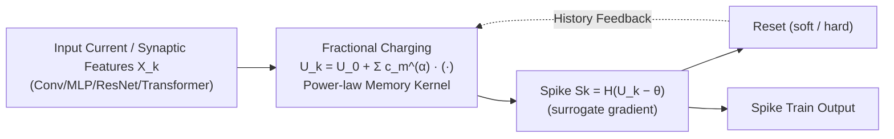

# Fractional-Order Spiking Neural Network

**Conference**: ICLR 2026  
**OpenReview**: [https://openreview.net/forum?id=NJhBSLJ0nL](https://openreview.net/forum?id=NJhBSLJ0nL)  
**Code**: [https://github.com/PhysAGI/spikeDE](https://github.com/PhysAGI/spikeDE)  
**Area**: Spiking Neural Networks / Neuromorphic Computing  
**Keywords**: Spiking Neural Networks, Fractional Calculus, Non-Markovian Dynamics, Long-range Dependence, Robustness  

## TL;DR
This work replaces the first-order ODEs underlying the membrane potential evolution of spiking neurons with Caputo fractional-order ODEs. This endows neurons with an inherent "long memory" characterized by power-law decay, strictly generalizing the classical IF/LIF models (which recover the original models at $\alpha=1$). The approach achieves higher accuracy and stronger noise robustness in both neuromorphic vision and graph learning tasks.

## Background & Motivation
**Background**: Spiking Neural Networks (SNNs) offer extremely low energy consumption on neuromorphic hardware through discrete spike communication and event-driven computing, making them naturally suited for temporal data processing. Currently, almost all SNNs are built upon Integrate-and-Fire (IF) or Leaky Integrate-and-Fire (LIF) neurons, whose dynamics are characterized by **first-order ordinary differential equations (ODEs)**.

**Limitations of Prior Work**: First-order ODEs imply a **Markovian assumption**—the current state of the membrane potential depends only on the value of the previous moment, and historical information is rapidly forgotten at an exponential rate $e^{-t/\tau}$. However, neurophysiological studies demonstrate that real neurons exhibit long-range correlations, fractal dendritic structures, and interactions between multiple membrane conductances. These **non-Markovian** behaviors cannot be expressed by integer-order models, effectively limiting the representation capacity of the network.

**Key Challenge**: Fractional calculus provides mathematical tools to describe systems with "memory." The fractional derivative $d^\alpha/dt^\alpha$ weights the entire history via a power-law kernel. While prior research on single f-LIF neurons proved they can explain frequency adaptation and generate more reliable spikes under noise, the **systematic integration of fractional neurons into deep SNNs remains an unexplored gap**.

**Goal**: To construct a generalized fractional SNN (f-SNN) framework that subsumes IF/LIF and their variants as special cases where $\alpha=1$, while providing theoretical guarantees and an open-source toolbox.

**Core Idea**: **[First-order $\to$ Fractional]** Replace the first-order derivative $d/dt$ in neuron dynamics with the Caputo fractional derivative $D^\alpha$, transforming the membrane potential charging process into a power-law convolution of history to capture long-range temporal dependencies. **[Strict Generalization]** $\alpha$ serves as an additional degree of freedom; $\alpha=1$ recovers classical SNNs, while $\alpha < 1$ introduces persistent memory.

## Method

### Overall Architecture
The f-SNN does not alter the network structure but replaces the "neuron kernel": the first-order ODE describing membrane potential charging in traditional SNNs is replaced by a fractional ODE (f-IF/f-LIF). This is then discretized using the fractional Adams–Bashforth–Moulton (ABM) numerical method, resulting in an iterative formula that performs power-law weighted convolution over all historical inputs. Since only the charging phase is modified—while spike generation and reset rules remain unchanged—f-SNN can be integrated as a plug-and-play module into any backbone such as CNN, ResNet, Transformer, or MLP. The number of trainable parameters remains identical to the original SNN.

### Key Designs

**1. Fractional Neuron Dynamics: Replacing "Instant Forgetting" with "Power-law Memory" via Caputo Derivatives.** The standard LIF model $\tau\,dU/dt = -U + R I_{in}$ is replaced by $\tau\,D^\alpha U(t) = -U(t) + R I_{in}(t)$. The Caputo fractional derivative is defined as $D^\alpha y(t) = \frac{1}{\Gamma(1-\alpha)}\int_0^t (t-\tau)^{-\alpha} y'(\tau)\,d\tau$. The integral kernel $(t-\tau)^{-\alpha}$ implies that the evolution of the current membrane potential depends on the **entire history**, weighted by a power law. Intuitively, the order $\alpha$ acts as a "memory knob": $\alpha=1$ returns to standard LIF, while $\alpha < 1$ introduces increasingly strong temporal correlations. The relaxation solution under constant input changes from exponential decay $e^{-t/\tau}$ to a Mittag–Leffler function $E_\alpha(-t^\alpha/\tau)$, which possesses a power-law long tail $\sim t^{-\alpha}$—the mathematical manifestation of "long memory."

**2. Fractional ABM Discretization: Converting Continuous Memory into Computable Power-law Convolution.** While first-order ODEs use one-step forward Euler iteration, fractional ODEs are non-local and require a weighted sum of all past terms. This work employs the fractional ABM predictor, leading to a unified iteration $y_k = y_0 + \frac{1}{\Gamma(\alpha)}\sum_{j=0}^{k-1}\mu_{j,k}\,f(t_j,y_j)$, where weights $\mu_{j,k} = \frac{h^\alpha}{\alpha}[(k-j)^\alpha - (k-1-j)^\alpha]$. Setting $h=R=1$ yields a stationary power-law kernel $c_m^{(\alpha)} = \frac{1}{\tau^\alpha\,\alpha\Gamma(\alpha)}[(m+1)^\alpha - m^\alpha]$, transforming the charging equation into $U_k = U_0 + \sum_{m=0}^{k-1} c_m^{(\alpha)} X_{k-m}$ (f-IF). As $\alpha \to 1$, $c_m^{(1)}=1/\tau$ degrades to a constant kernel, whose first-order difference exactly recovers the Euler recurrence. Training is handled via surrogate gradients to resolve the non-differentiability of spikes.

**3. Engineering Acceleration: Short-memory Truncation + FFT Convolution.** Direct summation over the entire history incurs an $O(N^2)$ cost. The authors apply the short-memory principle to truncate the summation window to a fixed width $M$ ($\sum_{m=\max(0,k-M)}^{k-1}$), achieving $O(NM)$ complexity. For full memory retention, FFT-based convolution is used to reduce complexity to $O(N\log N)$, ensuring f-SNN remains trainable for long time-step tasks.

**4. Three Theoretical Guarantees: From "Bio-plausibility" to "Superior Representation + Robustness."** The paper provides three essential distinctions: **(i) Persistent Memory**—Proposition 1 shows the f-LIF relaxation solution is a Mittag–Leffler function with a power-law tail, where distant inputs still influence the present algebraically; **(ii) Irreducibility**—Theorem 2 proves that a single f-IF neuron with $\alpha \in (0,1)$ cannot be exactly replicated by any **finite** linear combination of integer-order LIF neurons (error decays slowly at $O(k^{\alpha-1})$), requiring infinitely many integer-order units; **(iii) Robustness**—Theorem 1 proves that under constant input with perturbation $\epsilon$, the membrane potential deviation of f-IF grows **sublinearly** $\Delta U \propto t^\alpha$, whereas integer-order IF is **linear** $\Delta U \propto t$. Furthermore, spike time sensitivity $|\Delta t_s|\propto \epsilon\, I_c^{-(1+1/\alpha)}$ is smaller than the integer-order $I_c^{-2}$, theoretically suppressing long-term error accumulation.

## Key Experimental Results

### Main Results: Neuromorphic Data Classification (Accuracy %, T=8~16)

| Dataset | Architecture | LIF (SpikingJelly) | LIF (snnTorch) | **f-LIF (f-SNN)** |
|---|---|---|---|---|
| N-MNIST | CNN | 99.27 | 99.08 | **99.48** |
| DVS-Lip | CNN | 42.41 | 32.71 | **43.42** |
| DVS128Gesture | CNN | 93.40 | 88.99 | **94.80** |
| DVS128Gesture | Transformer | 95.14 | 87.15 | **95.83** |
| N-Caltech101 | CNN | 66.82 | 65.21 | **70.26** |
| N-Caltech101 | Transformer | 72.63 | 65.67 | **76.27** |
| HarDVS | CNN | 46.10 | 46.26 | **47.66** |

The replacement of IF/LIF with f-IF/f-LIF yields consistent improvements across both CNN and Transformer backbones, with a maximum gain of **+3.6%** on N-Caltech101 (Transformer).

### Graph Learning: Node Classification (Accuracy %, T=100, Avg of 20 runs)

| Method | Cora | Citeseer | Pubmed | Photo | Computers | ogbn-arxiv |
|---|---|---|---|---|---|---|
| SGCN (SJ) | 81.81 | 71.83 | 86.79 | 87.72 | 70.86 | 50.26 |
| **SGCN (f-SNN)** | **88.08** | **73.80** | **87.17** | **92.49** | **89.12** | **51.10** |
| DRSGNN (SJ) | 83.30 | 72.72 | 87.13 | 88.31 | 76.55 | 50.13 |
| **DRSGNN (f-SNN)** | **88.51** | **75.11** | **87.29** | 91.93 | 88.77 | **53.13** |

On the Computers dataset, SGCN sees an improvement of up to **+18.3%**, with no increase in trainable parameters.

### Robustness & Energy Consumption
- **Five-dimensional Adversarial Robustness**: f-SNN consistently outperforms two integer-order baselines across noise injection, occlusion blocks, temporal truncation, temporal jitter, and frame loss. The advantage is particularly pronounced under high-intensity noise and large occlusion ratios; feature map visualizations show f-LIF better preserves object features.
- **Energy**: In graph learning tasks, f-SNN achieves **significantly lower energy consumption** while maintaining higher accuracy, verifying its superior energy efficiency.

### Key Findings
- Gains stem from the memory mechanism rather than parameter count: in a fair comparison, replacing only the charging module keeps parameters perfectly aligned.
- $\alpha$ serves as an additional degree of freedom to capture richer temporal patterns.

## Highlights & Insights
- **Theoretical and Methodological Coherence**: Starting from the observation that biological neurons are non-Markovian, the work uses fractional calculus for a rigorous mathematical grounding. Three theorems (Memory, Irreducibility, Robustness) explain "why it works" beyond just benchmarking.
- **Elegance of Strict Generalization**: $\alpha=1$ exactly recovers classic SNNs, and discretization reverts to Euler as $\alpha \to 1$. The framework mathematically "brackets" the entire integer-order SNN family, minimizing adoption friction.
- **Plug-and-Play + Open-source Toolbox**: Only the neuron kernel is replaced without moving the backbone or adding parameters. The `spikeDE` toolbox supports CNN/ResNet/Transformer/MLP.
- **Theoretically Grounded Robustness**: The contrast between sublinear perturbation growth ($t^\alpha$) and linear growth ($t$) elevates "noise resistance" from an empirical phenomenon to a provable property.

## Limitations & Future Work
- **Computational Overhead**: Fractional neurons require convolution over history. Even with short-memory truncation ($O(NM)$) or FFT ($O(N\log N)$), it remains heavier than the $O(N)$ complexity of first-order SNNs.
- **Non-SOTA Positioning**: The objective is to "improve existing SNNs" rather than achieve absolute SOTA on massive datasets like ImageNet, where performance is still limited by the SNN community's total compute.
- **$\alpha$ Requires Tuning**: The optimal $\alpha$ is found via hyperparameter search; an end-to-end scheme for adaptive or learnable $\alpha$ is missing.
- **Neuromorphic Hardware Deployment**: Whether the non-locality of power-law kernels can be efficiently implemented on event-driven hardware remains to be verified.

## Related Work & Insights
- **SNN Neuron Evolution**: From IF/LIF (Stein 1967) to variants with adaptive time constants or threshold learning; this work unifies them as special cases of the fractional framework.
- **Fractional Neurons**: While f-LIF has been studied in computational neuroscience (Teka 2014; Deng 2022) to explain frequency adaptation, this is the first systematic integration into deep SNN frameworks.
- **Neural f-ODE Robustness**: Leveraging findings that neural f-ODEs possess tighter input-output perturbation bounds (Kang 2024c), these properties are successfully transferred to spiking networks.

## Rating
- **Novelty**: ⭐⭐⭐⭐⭐ First systematic introduction of fractional calculus into deep SNNs with rigorous theorems.
- **Experimental Thoroughness**: ⭐⭐⭐⭐ Covers neuromorphic vision and graph learning across ten datasets with robustness and energy analysis; however, absolute performance on static datasets is relatively lower.
- **Writing Quality**: ⭐⭐⭐⭐ Clear logic from bio-motivation to mathematical framework and theoretical guarantees.
- **Value**: ⭐⭐⭐⭐ Plug-and-play, no extra parameters, and open-sourced, providing a reusable enhancement module for the SNN community.

<!-- RELATED:START -->

## Related Papers

- [\[ICLR 2026\] Online Pseudo-Zeroth-Order Training of Neuromorphic Spiking Neural Networks](online_pseudo-zeroth-order_training_of_neuromorphic_spiking_neural_networks.md)
- [\[ICLR 2026\] A Brain-Inspired Gating Mechanism Unlocks Robust Computation in Spiking Neural Networks](a_brain-inspired_gating_mechanism_unlocks_robust_computation_in_spiking_neural_n.md)
- [\[AAAI 2026\] ParaRevSNN: A Parallel Reversible Spiking Neural Network for Efficient Training and Inference](../../AAAI2026/others/pararevsnn_a_parallel_reversible_spiking_neural_network_for_efficient_training_a.md)
- [\[ICLR 2026\] Neural Dynamics Self-Attention for Spiking Transformers](neural_dynamics_self-attention_for_spiking_transformers.md)
- [\[ICLR 2026\] Breaking Gradient Temporal Collinearity for Robust Spiking Neural Networks](breaking_gradient_temporal_collinearity_for_robust_spiking_neural_networks.md)

<!-- RELATED:END -->
