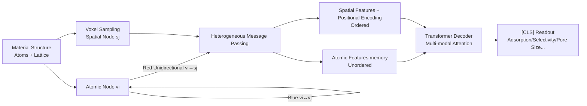

# From atom to space: SpatialRead, a Regionalized Readout Function for Spatial Properties of Materials

**Conference**: ICLR 2026  
**OpenReview**: [https://openreview.net/forum?id=v2oYZJ7Exo](https://openreview.net/forum?id=v2oYZJ7Exo)  
**Code**: [https://github.com/nankusa/SpatialRead](https://github.com/nankusa/SpatialRead)  
**Area**: AI for Science / Material Property Prediction / Graph Neural Networks  
**Keywords**: Readout functions, spatial properties, heterogeneous graphs, porous materials, MOF, gas adsorption, inductive bias  

## TL;DR
Focusing on material properties like gas adsorption that "decompose by spatial region rather than by atom," this paper proposes SpatialRead. It inserts "spatial nodes" into voxelized space, transforms the atomic graph into an atom-spatial heterogeneous graph, and adaptively fuses atomic and spatial inductive biases using multi-modal attention. This allows small models trained from scratch to surpass foundation models pre-trained on 120 million samples for these tasks.

## Background & Motivation
- **Background**: The message passing–readout paradigm is the de facto standard for GNN-based material property prediction. Most readout functions (sum/mean pooling, GraphTrans, GMT, and various clustering/dropping pools) essentially treat "nodes (atoms)" as the basic unit of aggregation, implying an **atom-decomposable inductive bias**: material-level properties can be decomposed into the sum of contributions from each atom.
- **Limitations of Prior Work**: While effective for many tasks, this bias fails for **porous materials** (MOFs, COFs, PPNs, zeolites). Properties like gas adsorption capacity, selectivity, and accessible pore volume naturally decompose into the sum of contributions from each **spatial region**. Crucially, the pore regions critical for adsorption contain almost no atoms, rendering the atom-decomposition perspective ineffective.
- **Key Challenge**: There is a mismatch between the physical decomposition of the property (by region) and the inductive bias of the readout function (by atom). Forcing a spatial decomposition might also damage performance on regular properties that should be atom-decomposable (e.g., formation energy).
- **Goal**: Design a readout function that **physically matches the target properties**, significantly outperforming others on spatial properties without sacrificing performance on regular properties.
- **Key Insight**: **Rewrite graph-level properties from "summing over nodes" to "integrating over space."** Introduce "spatial nodes" representing voxel regions, allow atoms to pass messages unidirectionally to spatial nodes, and use a Transformer decoder to adaptively choose between atomic and spatial representations, accommodating both inductive biases.

## Method

### Overall Architecture
The authors provide an empirical observation as motivation: examining atomic contributions to MOF adsorption in a standard PaiNN reveals that 86% of the top 1% contributing atoms are adjacent to pores (distance < 0.05 Å). This suggests that atomic GNNs **implicitly** learn "which regions are important," suggesting they should be built **explicitly**. SpatialRead follows three steps: (1) Discretize the "spatial integral" into a sum over various voxel regions, placing a spatial node in each; (2) Transform the atomic graph into an atom-spatial heterogeneous graph with **unidirectional** (atom $\rightarrow$ space) heterogeneous message passing; (3) Treat atomic features as memory and feed ordered spatial features (with positional encoding) into a Transformer decoder to adaptively fuse the two biases, reading out the property via a [CLS] token.

### Key Designs

**1. From node decomposition to spatial integration: Proof of equivalence.** Conventional readouts express graph-level features as an aggregation of node features $h_{graph}=\sum f(h_{v_i}\mid H)$. This paper rewrites it as an integral over continuous space $h_{graph}=\int g(r\mid S)\,d^3r=\int g(N(r))\,d^3r$, where $g$ is a regional contribution function with a finite receptive field and $S$ is the material structure. Crucially, the authors prove (Theorem 3.1) that when the readout function has a finite receptive field, "summing over nodes" and "integrating over space" are **fully equivalent in expressive power**. This indicates that switching to a spatial perspective merely **injects a new inductive bias** without weakening the model's expressibility. Properties satisfying this integral form are defined as "spatial properties," such as gas adsorption capacity where $g(r)$ represents the density of gas molecules at position $r$.

**2. Regionalized heterogeneous message passing: Voxelization + unidirectional atom-to-space flow.** The continuous integral is discretized as $p=\int g(r)d^3r\approx\sum_{j=1}^{N_s} g(r_j)\Delta V_j$, with a spatial node $s_j$ at each voxel center $r_j$. The atomic graph becomes an atom-spatial heterogeneous graph with update rules $h^{t+1}_{s_j}=U'_t\big(h^t_{s_j},\{h^t_{v_i},e_{v_i,s_j}\}_{v_i\in N(s_j)}[,\{h^t_{s_k},e_{s_k,s_j}\}_{s_k\in N(s_j)}]\big)$ and $h^{t+1}_{v_i}=U_t\big(h^t_{v_i},\{h^t_{v_j},e_{v_i,v_j}\}\big)$. The key design is the **unidirectional message flow**: spatial nodes receive messages from neighboring atoms and optionally from neighboring spatial nodes, but they **never back-propagate to atomic nodes**. Thus, spatial nodes act as pure samplers on the "readout side" without contaminating the atomic representations learned by the backbone.

**3. Property-adaptive multi-modal attention readout: A single network for dual biases.** A direct approach would be pooling only spatial nodes $p=\sum_{j=1}^{N_s}\mathrm{MLP}(h_{s_j})$, which already improves spatial properties. However, for regular atom-decomposable properties, pure spatial pooling provides the wrong inductive bias and degrades performance. To address this, the authors provide spatial nodes with positional encodings (making them **ordered**) and feed them into a Transformer decoder alongside **unordered** atomic features. The attention mechanism allows the model to **adaptively decide** whether to rely more on atomic or spatial representations based on the target property. Consequently, SpatialRead retains gains on spatial properties without degrading non-spatial ones. For properties like pore size (PLD/LCD) that are neither atom-decomposable nor local integrals but depend on the global pore shape, this global attention readout provides significant improvements.

## Key Experimental Results

### Main Results: Spatial Properties (Integral form, R² higher is better)

| Model | MOF C3H6/C3H8 Selectivity | MOF N2 Adsorption | MOF CH4/N2 Selectivity | COF CH4 Adsorption | PPN CH4 Adsorption | Zeolite CH4 Heat of Adsorption |
|---|---|---|---|---|---|---|
| CGCNN (scratch) | 0.663 | 0.760 | 0.718 | 0.556 | 0.692 | 0.411 |
| GemNet (scratch) | 0.729 | 0.968 | 0.924 | 0.816 | 0.932 | 0.836 |
| MOFTransformer (pre-trained) | 0.817 | 0.918 | 0.905 | 0.967 | 0.942 | 0.836 |
| JMP (pre-trained on 120M) | 0.774 | 0.971 | 0.908 | 0.884 | 0.947 | 0.874 |
| PaiNN (scratch) | 0.691 | 0.925 | 0.867 | 0.736 | 0.856 | 0.791 |
| **PaiNN + SN (Ours)** | 0.794 | 0.978 | 0.936 | 0.979 | 0.978 | 0.886 |
| **PaiNN + SN + MM (Ours)** | 0.784 | 0.987 | 0.941 | 0.987 | 0.977 | **0.969** |
| **JMP + SN + MM (Ours)** | **0.792** | **0.988** | **0.941** | 0.982 | **0.969** | 0.945 |

PaiNN + SpatialRead trained from scratch outperforms JMP pre-trained on 120 million samples on most spatial properties. Attaching SpatialRead to pre-trained JMP yields further gains, demonstrating **plug-and-play** compatibility.

### Ablation Study & Geometric Properties (R²)

| Model | ASA Surface Area | VF Void Fraction | PLD Pore Diameter | LCD Max Cavity |
|---|---|---|---|---|
| PaiNN (base) | 0.993 | 0.951 | 0.594 | 0.631 |
| PaiNN + SN | 0.974 | 0.999 | 0.856 | 0.913 |
| PaiNN + SN + MM | 0.996 | 0.999 | **0.965** | **0.975** |

Ablation breaks down the method: Base GNN $\rightarrow$ +SN (Spatial Node pooling) $\rightarrow$ +SN+MM (Multi-Modal Transformer). For **integral** properties (adsorption), +SN is sufficient; for **non-integral** geometric properties (PLD/LCD) depending on overall pore shape, the global receptive field of +MM is necessary (PLD 0.594 $\rightarrow$ 0.965).

### Key Findings
- **Clear boundary between integral vs. non-integral types**: For properties like adsorption capacity (regional integrals), pure spatial pooling (+SN) approaches the ceiling. For properties like PLD/LCD (pore shape), the global receptive field of +MM is required. This boundary provides an actionable criterion for readout selection.
- **Plug-and-play with pre-trained models**: JMP, pre-trained with simple sum-pooling, seamlessly integrates with SpatialRead for significant gains. JMP + SpatialRead also outperforms GemNet (JMP from scratch) + SpatialRead, showing that pre-training benefits and readout improvements are additive.
- **No degradation of regular properties**: On MatBench, JMP + SpatialRead performs comparably to JMP—slightly lower on formation energy (atom-decomposable) but higher on bandgap (collective states), confirming that readout bias must match property physics.
- **Interpretability and OOD generalization**: Top 10% contributing spatial nodes are located within pores. In out-of-distribution (high void fraction materials) generalization, PaiNN + SpatialRead achieves better Spearman correlation in 3 epochs than sum-pooling does in 40 epochs.

## Highlights & Insights
- **Theoretically grounded transition from "readout replacement" to "inductive bias shift"**: Proving the equivalence of regional integrals and node sums provides a solid foundation for the spatial decomposition bias, making "spatial nodes" a design choice rather than a trick.
- **Unidirectional message flow is a clean engineering decision**: Spatial nodes are "read-only," allowing for explicit modeling of sparse but critical pore regions without disrupting learned atomic representations, facilitating integration with pre-trained models.
- **Multi-modal attention delegates bias selection to data**: A single readout handles three distinct physical scenarios: integral spatial properties, non-integral geometric properties, and atom-decomposable regular properties.
- **Practical Impact**: Small models trained from scratch beating massive pre-trained foundation models suggests that in AI for materials, **physics-aligned readouts** may be more cost-effective than scaling data.

## Limitations & Future Work
- Spatial node count is directly tied to voxel resolution and computational cost. GemNet's high calculation requirements lead to hyperparameter constraints.
- While the custom benchmark (4 types of porous materials, 27 tasks) is new, its generalizability to broader material systems remains to be verified.
- Voxel resolution, spatial node adjacency construction, and message passing settings currently require manual configuration based on property physics.
- While effective for "neither integral nor atom-decomposable" properties (e.g., PLD/LCD), the causal contribution of "spatial nodes" vs. the "Transformer receptive field" warrants further decomposition.

## Related Work & Insights
- **Readout/Pooling Functions**: Identifies three classes—flattened pooling (GMT, GraphTrans), node clustering (DiffPool, MinCutPool), and dropping pools (TopKPool). SpatialRead is the first to replace the "atom" with "spatial region" as the aggregation unit.
- **Material GNNs**: While backbones (CGCNN, GemNet, PaiNN, etc.) focus on message passing, and foundation models (MOFTransformer, JMP) focus on scaling, this work fills the gap in "physical inductive bias at the readout side."
- **Insight**: When the physical decomposition of a task differs from the default aggregation unit, aligning the readout function to the property's physics is more effective than stacking layers or data.

## Rating
- Novelty: ⭐⭐⭐⭐⭐ Restructures readout from "node sum" to "spatial integral" with a proof of expressive equivalence, correcting a long-ignored blind spot in material GNNs.
- Experimental Thoroughness: ⭐⭐⭐⭐ Covers 4 material types and 3 property classes; validates plug-and-play, OOD, and interpretability.
- Writing Quality: ⭐⭐⭐⭐ Clear logic from motivation to theory and architecture. Empirical observations effectively justify the spatial nodes.
- Value: ⭐⭐⭐⭐⭐ Small models surpassing billion-scale foundation models has direct practical significance for high-value tasks like gas adsorption and separation.

<!-- RELATED:START -->

## Related Papers

- [\[ICML 2026\] Spatial Priors via Space Filling Curves for Small and Limited Data Vision Transformers](../../ICML2026/others/spatial_priors_via_space_filling_curves_for_small_and_limited_data_vision_transf.md)
- [\[ICLR 2026\] Improving Set Function Approximation with Quasi-Arithmetic Neural Networks](improving_set_function_approximation_with_quasi-arithmetic_neural_networks.md)
- [\[ICLR 2026\] Hippoformer: Integrating Hippocampus-inspired Spatial Memory with Transformers](hippoformer_integrating_hippocampus-inspired_spatial_memory_with_transformers.md)
- [\[ICLR 2026\] Probabilistic Kernel Function for Fast Angle Testing](probabilistic_kernel_function_for_fast_angle_testing.md)
- [\[ICLR 2026\] Learning Adaptive Distribution Alignment with Neural Characteristic Function for Graph Domain Adaptation](learning_adaptive_distribution_alignment_with_neural_characteristic_function_for.md)

<!-- RELATED:END -->
