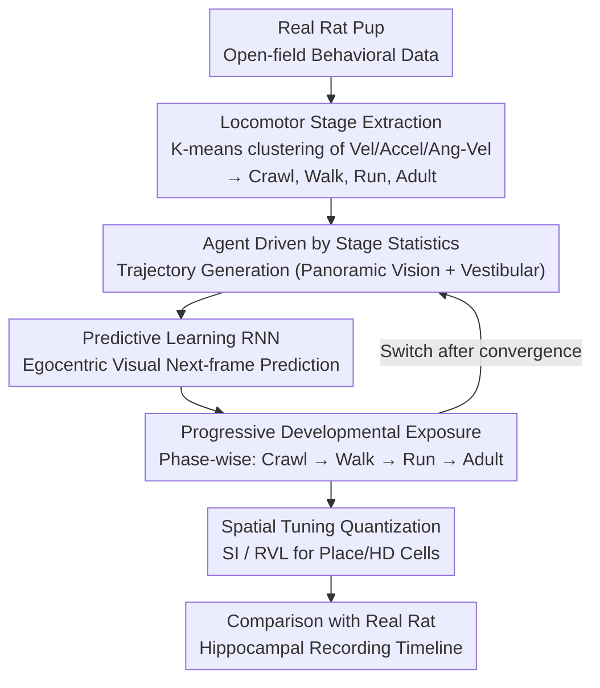

# From Movement to Cognitive Maps: RNNs Reveal How Locomotor Development Shapes Hippocampal Spatial Coding

**Conference**: ICLR 2026 Oral  
**OpenReview**: [https://openreview.net/forum?id=8bM7MkxJee](https://openreview.net/forum?id=8bM7MkxJee)  
**Code**: Yes  
**Area**: Computational Neuroscience  
**Keywords**: hippocampus, spatial coding, locomotor development, RNN, place cells, head direction cells, cognitive maps

## TL;DR
Combining cluster analysis of rat pup locomotor development with shallow RNN predictive learning models, this paper provides the first computational evidence that developmental changes in locomotor statistics (crawling → walking → running → adult) drive the sequential emergence of hippocampal spatial-tuned neurons (place cells, head direction cells, and conjunctive cells). The model quantitatively recovers the developmental timeline of rat hippocampal recordings and predicts a gradual increase in conjunctive place-direction cells during development, which was subsequently verified in experimental data.

## Background & Motivation
**Background**: Spatial coding neurons such as place cells, head direction (HD) cells, border cells, and grid cells exist in the hippocampus. These emerge sequentially along a specific developmental timeline (HD cells earliest at ~P12, place cells at ~P16, and grid cells at ~P20), but the computational mechanisms driving this emergence remain unknown.

**Limitations of Prior Work**: Existing models (e.g., Cueva & Wei 2018, TEM) can generate spatial representations during training, but they utilize constant movement patterns and provide direct spatial coordinates as supervisory signals, failing to consider the impact of real locomotor development statistics. Two competing hypotheses—"intrinsic circuit maturation" vs. "experience-dependent development"—have not been directly tested by computational models.

**Key Challenge**: While locomotor experience is hypothesized to be critical for spatial cognition, no computational model explains why characteristic locomotor features (velocity, acceleration, turning frequency, etc.) at different developmental stages lead to the emergence of specific types of spatial neurons at designated time points.

**Goal**: To establish a causal computational link between locomotor development statistics and the emergence of hippocampal spatial coding.

**Key Insight**: Utilize data-driven methods to extract developmental stage statistics from the behavior of real rat pups and drive predictive learning RNNs to detect whether a spatial coding timeline matching biological data spontaneously emerges.

**Core Idea**: Developmental changes in embodied sensorimotor experience statistics are sufficient to drive the ontogeny of hippocampal spatial coding.

## Method

### Overall Architecture
The paper addresses a specific question: whether statistical changes in locomotor developmental stages alone can drive the sequential emergence of hippocampal spatial coding neurons according to biological timelines. To this end, it constructs a computational pipeline from behavioral data to neural representations—first extracting locomotor statistics (velocity, acceleration, turning frequency, etc.) from real rat pups in open-field behavior via clustering, then using these stage-specific statistics to drive agents in a simulated environment to generate trajectories. A shallow RNN performs a self-supervised "next-frame visual prediction" task on these trajectories. The RNN is trained stage-by-stage in the order of crawling → walking → running → adult. Finally, the spatial tuning characteristics of its hidden states are analyzed and compared point-by-point with the developmental timeline of real rat hippocampal recordings.

### Key Designs

**1. Locomotor Stage Extraction: Letting Data Define Developmental Transitions**

Prior models typically used constant movement patterns to generate trajectories, failing to reflect qualitative changes in how pups move at different ages. This paper extracts locomotor statistics (velocity, acceleration, angular velocity) from published rat pup open-field data and uses K-means clustering to automatically segment movement data from P12–P60 into three phases: crawling (~P12-P15), walking (~P16-P19), and running (~P20+), plus an adult phase. Crucially, developmental stages are not manually defined but are natural transition points identified through locomotor patterns, ensuring that the statistics fed into the RNN accurately correspond to biological developmental nodes.

**2. Predictive Learning RNN: Using Egocentric Vision Without Privileged Coordinates**

Former models (e.g., path integration) often provided $x$-$y$ coordinates as supervisory signals, essentially leaking the "spatial" solution to the network. This paper adopts a predictive learning framework: the shallow RNN receives the panoramic visual input $\mathbf{v}_t \in \mathbb{R}^{80}$ and vestibular signals (angular velocity $\omega_t$), using its hidden state to predict the visual input at the next time step $\hat{\mathbf{v}}_{t+1}$:

$$\mathbf{h}_t = f(\mathbf{W}_{vh}\mathbf{v}_t + \mathbf{W}_{hh}\mathbf{h}_{t-1} + \mathbf{W}_{\omega h}\omega_t + \mathbf{b}), \qquad \mathcal{L} = \|\hat{\mathbf{v}}_{t+1} - \mathbf{v}_{t+1}\|^2$$

This choice serves two purposes: first, predictive learning is supported by extensive literature (Eichenbaum et al. 2004; Levy 1989), where the hippocampus is modeled as a system comparing incoming sensations with memory predictions. Second, by using egocentric vision rather than absolute coordinates, spatial representations must emerge spontaneously to solve the prediction task, validating the conclusion that locomotor statistics drive emergence.

**3. Progressive Developmental Exposure: Implementing Animal Growth Order in Training Curricula**

To test whether the order of development is critical, the model avoids mixing all locomotor patterns at once. The same RNN sequentially experiences trajectories from each stage—first training to convergence on crawling patterns, then switching to walking, running, and adult stages. Each stage's trajectories are generated in a $0.625 \times 0.625$ m environment by a simulated agent using the corresponding stage's statistics. In the adult stage, grid cell inputs $g(\mathbf{x}) = \sum_k \cos(\mathbf{k}_i \cdot \mathbf{x})$ are introduced with scale parameters $\lambda \in \{0.2, 0.4, 0.6\}$ m. This progressive exposure simulates the actual growth process of animals, where different ages provide sensory experiences with distinct statistical features.

**4. Spatial Tuning Quantization: Objective Metrics for Identifying "Spatial Cells"**

Objective metrics are required to align hidden states with hippocampal recordings. The study utilizes the standard Spatial Information (SI) metric to quantify place coding:

$$SI = \sum_i p_i \frac{r_i}{\bar{r}} \log_2 \frac{r_i}{\bar{r}}$$

where $p_i$ is the occupancy probability in the $i$-th spatial bin, and $r_i$ and $\bar{r}$ are the firing rate in that bin and the mean firing rate, respectively. Rayleigh Vector Length (RVL) quantifies directional selectivity. Thresholding is used to classify units as place cells or HD cells. A suite of control experiments—reversing the developmental order, controlling inter-frame intervals, and controlling cumulative training volume—was conducted to prove the specific roles of sequence, temporal resolution, and volume.

## Key Experimental Results

### Main Results: Developmental Timeline Matching

| Developmental Stage | Corresponding Age | Place Cells | HD Cells | Conjunctive Coding | Bio-Data Match |
|---------|---------|---------|---------|---------|------------|
| Crawl | ~P12-15 | Few/None | Weak | None | ✓ |
| Walk | ~P16-19 | Emerging | Adult-like | Emerging | ✓ |
| Run | ~P20+ | Increasing | Stable | Increasing | ✓ |
| Adult | >P30 | Mature | Mature | Mature | ✓ |

### Ablation Study

| Configuration | Key Metric | Description |
|------|---------|------|
| Normal Order | SI and RVL increase stage-wise | Baseline: matches biological data |
| Reversed Order | Abnormal spatial coding emergence | Proves importance of developmental sequence |
| Sensory Change Only | No place-centric emergence | Changing framerate is not equivalent to development |
| Controlled Training Vol. | No impact on emergence timeline | Rules out training volume as a confounder |
| Controlled Framerate | No change to core conclusions | Rules out temporal resolution as a confounder |

### Key Findings
- The model predicts that directional selectivity primarily emerges through conjunctive place-HD coding rather than pure HD cells appearing first—a phenomenon verified in hippocampal recording data.
- Cross-trial spatial coding correlation > 0.8, proving the learned representations are stable and reliable.
- Pure HD cells achieve adult-like tuning during the walking stage (~P16), matching experimental data of HD cells in the MEC at ~P15.

## Highlights & Insights
- **First computational bridge from locomotor development to spatial coding**: Building on descriptive observations, this work provides the first mechanistic explanation.
- **Computational evidence for embodied cognition**: Movement is not just an output but a critical input shaping cognitive representations—this has direct implications for embodied AI.
- **Prediction-verification loop**: The model generates a new prediction (developmental patterns of conjunctive cells) which is confirmed in experimental data, meeting the gold standard of computational neuroscience.
- **Inspiration for developmental curriculum learning**: Similar to curriculum learning, the "simple-to-complex" sequence of developmental exposure is crucial for representation learning.

## Limitations & Future Work
- The model is a single-layer RNN and cannot spontaneously generate grid cells (which likely require complex attractor dynamics).
- The environment is a simple 2D square; complex multi-room environments were not tested.
- Training is conducted on short 5.9s segments; long-term spatial memory was not evaluated.
- Linear decoding methods might underestimate the complexity of the representations.
- No direct causal verification by manipulating the locomotor development of real animals.

## Related Work & Insights
- **vs. Cueva & Wei 2018**: Also uses RNNs for spatial representation, but Cueva utilizes path integration (direct x-y supervision) and ignores locomotor development.
- **vs. TEM (Whittington et al. 2020)**: TEM uses a multi-component architecture (attractor + path integration + multi-loss) to solve structural knowledge, which is orthogonal to the developmental focus here.
- **vs. Levenstein et al. 2024**: Uses predictive learning but focuses on adult representations without considering ontogeny.

## Rating
- Novelty: ⭐⭐⭐⭐⭐ First to establish a mechanism from movement to spatial emergence; original and important.
- Experimental Thoroughness: ⭐⭐⭐⭐ Computational model + 5 control experiments + real hippocampal validation; lack of animal intervention is the only minor gap.
- Writing Quality: ⭐⭐⭐⭐⭐ Clear interdisciplinary writing; highest reviewer score of 10 ("should be highlighted as oral").
- Value: ⭐⭐⭐⭐⭐ Profound implications for computational neuroscience and embodied AI, establishing a new research direction.

<!-- RELATED:START -->

## Related Papers

- [\[ICML 2026\] How the Optimizer Shapes Learned Solutions in Equivariant Neural Networks](../../ICML2026/others/how_the_optimizer_shapes_learned_solutions_in_equivariant_neural_networks.md)
- [\[ICLR 2026\] Hippoformer: Integrating Hippocampus-inspired Spatial Memory with Transformers](hippoformer_integrating_hippocampus-inspired_spatial_memory_with_transformers.md)
- [\[ICLR 2026\] HippoTune: A Hippocampal Associative Loop–Inspired Fine-Tuning Method for Continual Learning](hippotune_a_hippocampal_associative_loopinspired_fine-tuning_method_for_continua.md)
- [\[ICLR 2026\] Stable and Scalable Deep Predictive Coding Networks with Meta-Prediction Errors](stable_and_scalable_deep_predictive_coding_networks_with_meta-prediction_errors.md)
- [\[ICLR 2026\] Characterizing and Optimizing the Spatial Kernel of Multi Resolution Hash Encodings](characterizing_and_optimizing_the_spatial_kernel_of_multi_resolution_hash_encodi.md)

<!-- RELATED:END -->
