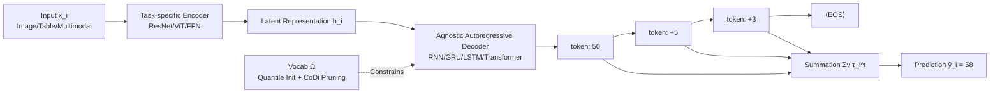

# GoR: A Unified and Extensible Generative Framework for Ordinal Regression

**Conference**: ICLR 2026  
**OpenReview**: [https://openreview.net/forum?id=ys80cc2N5M](https://openreview.net/forum?id=ys80cc2N5M)  
**Code**: [https://github.com/snailma0229/GoR.git](https://github.com/snailma0229/GoR.git)  
**Area**: Ordinal Regression / Generative Modeling / Machine Learning Methods  
**Keywords**: ordinal regression, autoregressive generation, vocabulary construction, bias-variance trade-off, model-agnostic  

## TL;DR
This paper reformulates ordinal regression (predicting targets with intrinsic order, such as age, aesthetic scores, watching duration) from "discretizing continuous space into fixed bins for classification" into "autoregressively generating a sequence of ordered tokens, accumulating their values for prediction, and determining termination via a dynamic ⟨EOS⟩." Derived from a bias-variance decomposition, the authors propose an error bound and the CoDi vocabulary construction criterion, consistently outperforming SOTA across 15 benchmarks in 5 domains.

## Background & Motivation
**Background**: Ordinal Regression (OR) aims to predict labels with natural ordering (e.g., young → old, short → long), which is ubiquitous in facial age estimation, image aesthetics assessment, watching duration prediction, and user Lifetime Value (LTV) prediction. It is more challenging than standard classification or regression because it requires modeling the ordered structure of labels and handling non-stationary semantic boundaries between adjacent categories.

**Limitations of Prior Work**: Mainstream methods rely on Continuous Space Discretization (CSD), which quantizes continuous targets into finite ordered bins and calculates weighted expectations from softmax probabilities. Two main routes within this framework have flaws: (1) **Boundary enhancement** methods use reference sample comparisons to distinguish points near boundaries but depend heavily on heuristics for reference point selection, leading to explosive complexity in wide-range scenarios. (2) **Rank-based** methods decompose OR into a series of binary subtasks (e.g., "is it greater than a threshold"). While theoretically grounded, the ordering dependency is only implicitly hidden in label definitions, and predictions for each bin remain independent (Proposition 1 proves this leads to systematic KL error). Furthermore, fixed binning is **rigid**: it magnifies errors for head classes under long-tail distributions and is highly sensitive to granularity—wide intervals blur semantics while narrow ones cause sparsity.

**Key Challenge**: Ordinal labels are essentially infinitely decomposable and additive numerical values, yet CSD forces an approximation using a fixed set of discrete boundaries, losing inter-bin ordering dependencies and being constrained by fixed resolutions that cannot adapt to individual samples.

**Goal**: To design a cross-domain, architecture-agnostic ordinal regression paradigm that leverages modern generative optimization techniques and bypasses the rigidity of fixed binning.

**Key Insight**: **Treat ordinal regression as a sequence generation task.** Inspired by generative language models, the framework autoregressively predicts tokens representing "ordinal value fragments." The final prediction is the sum of these tokens' numerical contributions, with a dynamic ⟨EOS⟩ determining sequence length. This explicitly models ordering dependencies and achieves adaptive resolution with interpretable step-by-step refinement.

## Method

### Overall Architecture
GoR establishes a bijection between the continuous label space and a discrete token sequence space. Each label $y_i$ is encoded into a variable-length token sequence $\tau_i=\{\tau_i^t\}_{t=1}^{T_i}$ from a vocabulary $\Omega=\{\omega_j\}_{j=1}^{V}$, where values are reconstructed via an additive lookup table $\nu:\Omega\to\mathbb{R}$ such that $y_i\approx r(\tau_i)=\sum_{t=1}^{T_i}\nu(\tau_i^t)$. During training, a task-specific encoder maps input $x_i$ to a latent representation $h_i$, and an architecture-agnostic autoregressive decoder generates tokens conditioned on $h_i$. During inference, generation starts from ⟨SOS⟩ until ⟨EOS⟩, and tokens are summed to obtain $\hat{y}_i$. For example, a facial age could be generated as a coarse token (50), followed by fine corrections (+5, +3), totaling 58. Every step selects a token that reduces the current residual, simulating a "coarse-to-fine" cognitive process.

### Key Designs

**1. Autoregressive Ordinal Generation Paradigm**: Explicitly reclaims order dependency lost by CSD through conditional generation. Rank-based methods assume binary decisions are conditionally independent $P_{\text{naive}}(B_i|x_i)=\prod_m P(B_i^m|x_i)$. The paper proves the KL divergence between this and the true chain distribution $P_{\text{true}}(B_i|x_i)=\prod_m P(B_i^m|B_i^{<m},x_i)$ equals the sum of conditional mutual information (Proposition 1). GoR uses the probability chain rule for autoregressive decomposition $P_\theta(\tau_i|h_i)=\prod_{t=1}^{T_i}P_\theta(\tau_i^t|h_i,\hat{\tau}_i^{<t})$, embedding dependencies and allowing adaptive resolution via dynamic ⟨EOS⟩.

**2. Bias-Variance Error Bound**: Provides a theoretical benchmark for token selection. Treating $\nu(\tau_i^t)$ as a random variable $C_i^t$, let max single-step bias be $B=\max_t|\mathbb{E}[\hat{C}_i^t|\theta]-C_i^t|$ and single-step variance be $V_{\text{var}}=\max V(C_i^t)\le\frac{(\omega_{\max}-\omega_{\min})^2}{4}$. The paper proves GoR's Mean Squared Error satisfies:

$$\mathbb{E}\big[(\hat{y}_i-y_i)^2\big]\le T_i^2 B^2 + T_i^2 V_{\text{var}}\le T_i^2 B^2 + T_i^2\frac{(\omega_{\max}-\omega_{\min})^2}{4}$$

This bound decomposes error into three controllable factors: sequence length $T_i$, single-step bias $B$, and single-step variance $V_{\text{var}}$. From this, three vocabulary design axioms are derived: the vocabulary must cover all target values with finite tokens (bias control), suppress both bias and variance (coverage constraint + sparsity control), and maintain scale invariance across datasets (distribution shift resistance).

**3. CoDi Vocabulary Construction**: Pruning based on the Coverage–Distinctiveness Index to perform bias-variance trade-offs. An initial large vocabulary is constructed using a quantile-based strategy. Pruning is then guided by:

$$\text{CoDi}_j=\underbrace{\Big(\frac{1}{N}\sum_{i=1}^N\frac{\text{count}(\omega_j,\tau_i)}{T_i}\Big)}_{\text{Coverage (Bias-related)}}\cdot\underbrace{\log\frac{N}{|\{i\mid\omega_j\in\tau_i\}|+1}}_{\text{Distinctiveness (Variance-related)}}$$

The Coverage term measures token usage frequency, while Distinctiveness measures uniqueness. Top-down pruning based on CoDi yields more uniform token distributions, simultaneously lowering token-level variance and bias $B$, aligning with Theorem 1.

**4. Ordinal Target Serialization and Training Objective**: A greedy decomposition ensures short, accurate, and monotonic token sequences. Principles include minimizing length $T_i$, limiting reconstruction relative error $\frac{|y_i-r(\tau_i)|}{y_i}\le\epsilon$, and enforcing descending token values $\tau_i^t\ge\tau_i^{t+1}$ for coarse-to-fine monotonicity. Training minimizes sequence Negative Log-Likelihood $L_{\text{NLL}}$ plus a Huber regression loss $L_{\text{reg}}$ to inject numerical relationships: $L_{\text{final}}=L_{\text{NLL}}+\lambda\cdot L_{\text{reg}}$.

## Key Experimental Results

### Main Results (Selected Domains)

| Task | Dataset | Metric | Prev. SOTA | GoR | Gain |
|------|--------|------|---------|-----|------|
| LTV | Criteo-SSC | MAE↓ | 14.764 (HiLTV) | **12.965** | -12.2% |
| LTV | Criteo-SSC | SRCC↑ | 0.2645 (HiLTV) | **0.3036** | +14.8% |
| WTP | KuaiRand | MAE↓ | 8.696 (CWM) | **7.032** | -19.1% |
| WTP | KuaiRec | XAUC↑ | 0.594 (CREAD) | **0.616** | +3.7% |
| FAE | FG-NET | MAE↓ | 4.95 (FaRL) | **4.68** | -14.1% (Interval) |
| FAE | MORPH | MAE↓ | 2.78 (Unimodal) | **2.69** | -5.8% |
| HID | HCI | MAE↓ | 0.53 (Ord2Seq) | **0.51** | -3.8% |

In Image Aesthetics Assessment (IAA), GoR significantly exceeds SOTA even with older encoders like TANet and refreshes SOTA when paired with modern AesMamba, proving paradigm modularity.

### Ablation Study
**Vocabulary Construction (KuaiRec / CIKM16, MAE↓ / XAUC↑)**

| Vocab Design | KuaiRec MAE | KuaiRec XAUC | CIKM16 MAE | CIKM16 XAUC |
|---------|------------|--------------|-----------|-------------|
| Manual | 3.281 | 0.604 | 0.825 | 0.685 |
| Binary | 3.268 | 0.605 | 0.821 | 0.687 |
| Quantile | 3.221 | 0.609 | 0.820 | 0.688 |
| Quantile + CoDi | **3.194** | **0.616** | **0.808** | **0.696** |

CoDi consistently enhances all initialization strategies. Performance relative to the retention ratio $\beta$ follows a non-monotonic curve, validating the bias-variance trade-off in Theorem 1.

**Generative Optimization Compatibility (KuaiRec)**: Adding Curriculum Learning (CL) and N-gram Penalty (NP) to the Transformer (TF) baseline improved MAE from 3.359 to 3.194. Direct Preference Optimization (DPO) further reduced MAE on Criteo-SSC to 12.438 without adding any model parameters.

### Key Findings
- **Architecture-agnostic**: RNN, GRU, LSTM, and Transformer decoders all outperformed existing SOTA, with Transformer performing best.
- **Superior Calibration**: On KuaiRec, the GoR prediction mean ($\mu=7.73$) closely matches the GT ($\mu=7.69$), whereas CREAD and TPM systematically overestimate due to rigid binning.
- **Robustness at Fine Granularity**: GoR consistently achieves lower MAE in the 0–10s short/medium duration intervals, which account for 80% of samples.

## Highlights & Insights
- **Paradigm Shift**: Replacing "discrete classification" with "additive sequence generation" explicitly models sequence dependencies and allows for adaptive resolution via ⟨EOS⟩, addressing the fundamental flaws of the CSD framework.
- **Theory-Driven Design**: Proposition 1 quantifies the independence error of rank-based methods, while Theorem 1’s error bound directly motivates the CoDi index, aligning theoretical analysis with empirical ablation.
- **Engineering Portability**: The framework is modular with respect to both encoders and decoders and can adopt mature NLP techniques (TF, CL, N-gram, DPO) into the ordinal regression domain with near-zero cost.

## Limitations & Future Work
- **Autoregressive Inference Latency**: Prediction time scales linearly with sequence length, which may be suboptimal for real-time long-sequence scenarios.
- **Generative Model Issues**: Susceptible to common generative flaws such as error accumulation or exposure bias.
- **Hyperparameter Sensitivity**: The introduction of $\epsilon, \beta, \lambda$ requires tuning across domains despite claims of scale invariance.
- Future work may explore non-autoregressive decoding for latency reduction and integrate more sophisticated RLHF/alignment paradigms.

## Related Work & Insights
- **Comparison to CSD**: GoR contrasts with boundary enhancement (e.g., POE) and rank-based methods (e.g., OR-CNN); Proposition 1 specifically critiques the independence assumption of the latter.
- **Inspiration from LLMs**: The use of autoregressive generation and various optimization tricks (CL, DPO) suggests that any regression target with ordinal and additive structure can benefit from a sequence generation perspective.
- **Insights**: The CoDi index for "Coverage × Distinctiveness" is a valuable heuristic for other tasks requiring continuous-to-discrete token mapping, such as time-series or signal quantization.

## Rating
- **Novelty**: ⭐⭐⭐⭐⭐ Formalizing ordinal regression as autoregressive generation with a supporting bias-variance framework is a highly original contribution.
- **Experimental Thoroughness**: ⭐⭐⭐⭐⭐ Extensive benchmarks across 5 domains and 15 datasets, combined with multidimensional ablations.
- **Writing Quality**: ⭐⭐⭐⭐ The link between theory, method, and experiments is clear, though some technical details on serialization require close reading of the appendix.
- **Value**: ⭐⭐⭐⭐⭐ Provides a versatile and theoretically grounded baseline for high-value tasks in recommendation (LTV) and computer vision (age/aesthetics).

<!-- RELATED:START -->

<!-- Related papers would be listed here -->

<!-- RELATED:END -->

## Related Papers

- [\[ICLR 2026\] DA-AC: Distributions as Actions — A Unified RL Framework for Diverse Action Spaces](distributions_as_actions_a_unified_framework_for_diverse_action_spaces.md)
- [\[ACL 2025\] MapQaTor: An Extensible Framework for Efficient Annotation of Map-Based QA Datasets](../../ACL2025/others/mapqator_an_extensible_framework_for_efficient_annotation_of_map-based_qa_datase.md)
- [\[ECCV 2024\] An Incremental Unified Framework for Small Defect Inspection](../../ECCV2024/others/an_incremental_unified_framework_for_small_defect_inspection.md)
- [\[ICML 2026\] iWorld-Bench: A Benchmark for Interactive World Models with a Unified Action Generation Framework](../../ICML2026/others/iworld-bench_a_benchmark_for_interactive_world_models_with_a_unified_action_gene.md)
- [\[NeurIPS 2025\] Neural Collapse in Cumulative Link Models for Ordinal Regression: An Analysis with Unconstrained Feature Model](../../NeurIPS2025/others/neural_collapse_in_cumulative_link_models_for_ordinal_regression_an_analysis_wit.md)

<!-- RELATED:END -->
