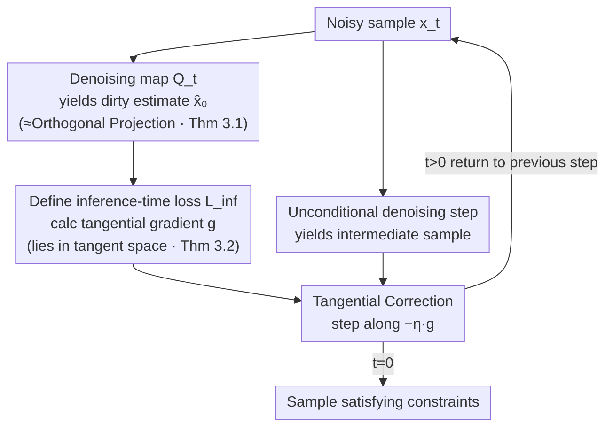

# Harpoon: Generalised Manifold Guidance for Conditional Tabular Diffusion

**Conference**: ICLR 2026  
**arXiv**: [2602.07875](https://arxiv.org/abs/2602.07875)  
**Code**: [GitHub](https://github.com/adis98/Harpoon)  
**Area**: Diffusion Models/Tabular Data  
**Keywords**: Tabular Data, Manifold Guidance, Conditional Generation, Inference-time Guidance, Inequality Constraints

## TL;DR
This paper extends manifold theory from images to tabular diffusion models, proving that the gradient of any differentiable inference-time loss lies within the tangent space of the data manifold (not limited to squared error). Based on this, it proposes Harpoon, a method that guides unconditional samples along the manifold at inference time to satisfy diverse tabular constraints.

## Background & Motivation

**Background**: Tabular diffusion models generate high-quality tabular data, but conditional generation (missing value imputation, inequality constraints, etc.) is a core requirement. Existing conditional methods are divided into training-time (difficult to generalize to new constraints) and inference-time (limited to imputation tasks) categories.

**Limitations of Prior Work**: (1) Training-time methods (conditional input/classifier guidance/classifier-free guidance) cannot generalize to constraints unseen during training; (2) Inference-time methods typically support only imputation and not inequality constraints; (3) Manifold theory in image diffusion assumes continuous features and flat geometry, which is unsuitable for mixed-type tabular data.

**Key Challenge**: The need for a "train once, adapt at inference time to any constraint" method, whereas existing manifold guidance theory only provides guarantees for squared error loss and flat manifolds.

**Key Insight**: The paper proves two stronger theoretical results: (1) Theorem 3.1: The denoising mapping $Q_t$ converges to an orthogonal projection onto the manifold as $\bar{\alpha}_t \to 1$ (without requiring a flatness assumption); (2) Theorem 3.2: The gradient of any differentiable loss lies in the tangent space (not limited to squared error).

**Core Idea**: By proving that the gradient of any differentiable objective at inference time aligns with the manifold, Harpoon alternates between unconditional denoising and tangential correction to satisfy diverse constraints.

## Method

### Overall Architecture
Harpoon aims to achieve "train once, adapt to any constraint" for tabular conditional generation: first, an **unconditional** diffusion model is trained in a standard way where constraint information does not enter training; all actual conditionalization is deferred to the sampling stage. During sampling, each step performs two actions—first, the unconditional model performs a standard denoising step, and then a **inference-time loss** $\mathcal{L}_{\text{inf}}$ specifically designed for the current constraint is used to calculate a gradient for correction, pushing the sample toward satisfying the constraint. By alternating "denoising" and "correction" through the reverse chain, samples gradually drift along the geometry of valid data into regions that satisfy the constraints.

This alternating mechanism works, supporting imputation, range/categorical constraints, and their conjunctions and disjunctions simultaneously using the same model, thanks to two newly proven manifold theorems: the "dirty estimate" obtained from a single denoising step lies on the data manifold (Theorem 3.1), and the gradient of any differentiable loss with respect to the sample points along the **tangent space** of the manifold (Theorem 3.2). The former ensures a valid starting point for correction, while the latter ensures that the correction does not push the sample away from the valid data geometry.

### Key Designs

**1. Theorem 3.1 (Denoising as Orthogonal Projection): Generalizing manifold guidance from flat geometry to curved manifolds**

The manifold guidance theory for image diffusion (Chung et al.) has an implicit premise—the data manifold is locally flat, which does not hold for mixed-type tabular data. This paper proves that the denoising mapping $Q_t$ trained with MSE is equivalent to an **orthogonal projection** onto the data manifold $\mathcal{M}_0$ in the limit as $\bar{\alpha}_t \to 1$ (noise approaching zero). This conclusion **does not require a flatness assumption** and holds for curved manifolds. Consequently, the dirty estimate $\hat{x}_0 = Q_t(x_t)$ produced by single-step denoising resides on the manifold, providing a geometrically valid starting point for all subsequent corrections.

**2. Theorem 3.2 (Gradient in Tangent Space): Expanding available guidance loss from squared error to any differentiable loss**

Knowing the dirty estimate is on the manifold is insufficient; the key is whether the correction step pushes samples off the manifold. This paper further proves that for **any** differentiable inference-time loss $\mathcal{L}_{\text{inf}}$, its gradient with respect to the sample lies in the tangent space at the dirty estimate:

$$\nabla_{x_t}\mathcal{L}_{\text{inf}}(\hat{x}_0, c) \in T_{\hat{x}_0}\mathcal{M}_0.$$

This generalizes existing theory from "guaranteed only for squared error losses of the form $\|W(x_0 - H(\hat{x}_0))\|_2^2$" to any differentiable targets like Cross-Entropy, L1, or ReLU inequality penalties, without requiring a flat manifold. Essentially, any reasonable loss used for gradient correction at inference time will only move the sample tangentially along the manifold, thus allowing various heterogeneous constraints to fit into the same guidance framework.

**3. Harpoon Algorithm: Alternating unconditional denoising and tangential correction**

With the two theorems as a foundation, the algorithm alternates denoising and correction throughout the reverse chain. Each step obtains a dirty estimate based on Theorem 3.1 and calculates a tangential gradient according to Theorem 3.2. After an unconditional denoising step yields an intermediate sample $x_{t-1}'$, a tangential correction is performed:

$$x_{t-1} = x_{t-1}' - \eta \cdot \nabla_{x_t}\mathcal{L}_{\text{inf}}(\hat{x}_0, c),$$

where $\eta$ is the guidance step size. Since adjacent manifolds are nearly parallel (Paper Proposition 1), performing the correction using the previous step's gradient does not cause significant deviation, and the sample converges to the target region. The type of constraint is determined entirely by $\mathcal{L}_{\text{inf}}$: partial feature observation $(1-m)\odot x_0$ for imputation, inequality like $\text{Age}\ge 10$ for range constraints, and $\text{Gender}=\text{Male}$ for categorical constraints, with support for logical combinations (and/or)—all without retraining the model.

### Loss & Training
- **Training**: Standard MSE denoising loss, unconditional, trained once.
- **Inference-time loss options**: MAE (default, as its sparsity-inducing nature fits the sparse one-hot structure of discrete tabular features), MSE, Cross-Entropy, ReLU penalty; the inference loss can differ from the training loss, which is the practical value of Theorem 3.2.
- **Guidance strength $\eta$**: Controls the degree of constraint satisfaction, requiring task-specific tuning.

## Key Experimental Results

### Main Results - Imputation (MAR, 50% missing)

| Method | Adult | Bean | California | Magic | Average |
|------|-------|------|-----------|-------|------|
| GAIN | 1.86 | 1.41 | 15.06 | 1.27 | High |
| DiffPuter (Prev. SOTA) | Mid | Mid | Mid | Mid | Mid |
| **Ours (Harpoon)** | **Low** | **Low** | **Low** | **Low** | **SOTA** |

### Inequality Constraints

| Constraint Type | Violation Rate↓ | α-score↑ | Utility↑ |
|---------|---------|----------|-------|
| Range | **Lowest** | High | High |
| Categorical | **Lowest** | High | High |
| Conjunction (and) | **Lowest** | High | High |
| Disjunction (or) | **Lowest** | High | High |

### Key Findings
- Experiments verify that inference-time gradients are indeed approximately orthogonal to the "dirty estimate" (~90°), even at larger timesteps.
- Different inference-time losses (MSE/MAE/CE) behave consistently under the same training objective → empirical validation of Theorem 3.2.
- MAE loss performs best for tabular data (sparsity-inducing property suits discrete features).
- Train once, multiple inference-time constraints → significantly more flexible than training-time conditional methods.

## Highlights & Insights
- **Theoretical contribution is core**: The two theorems significantly generalize manifold guidance theory from image diffusion to curved manifolds and arbitrary differentiable losses. This has directional significance for other modalities beyond tabular data.
- **"Train once, any constraint"**: Training an unconditional model and adding arbitrary constraints at inference time is the ideal paradigm for conditional generation. Harpoon proves this is feasible and theoretically grounded for tabular data.
- **MAE preferred over MSE**: The discovery that discrete tabular features are better suited for sparsity-inducing L1 losses provides a valuable domain-specific insight.

## Limitations & Future Work
- The orthogonal projection guarantee strictly holds only as $\bar{\alpha}_t \to 1$; deviations may occur at large timesteps.
- Continuous embeddings for tabular data (e.g., one-hot) are approximations; the discrete-continuous gap persists.
- Guidance strength $\eta$ requires manual tuning.
- Validated only on UCI datasets; scalability to larger-scale tabular data remains unknown.

## Related Work & Insights
- **vs. DiffPuter**: DiffPuter uses training-time conditionalization, whereas Harpoon uses inference-time guidance—the former is more specialized, while the latter is more flexible.
- **vs. Image Manifold Guidance (Chung et al.)**: Harpoon generalizes the theory (curved manifolds + any loss) and applies it to the tabular domain for the first time.
- **vs. CTGAN/TabDDPM**: These do not support inference-time conditionalization.

## Rating
- Novelty: ⭐⭐⭐⭐⭐ Vital theoretical generalization of manifold theory, naturally adapted to tabular data.
- Experimental Thoroughness: ⭐⭐⭐⭐ Multiple datasets, multiple tasks (imputation + inequalities), and theoretical verification.
- Writing Quality: ⭐⭐⭐⭐⭐ Clear theoretical derivation with sound intuitive explanations.
- Value: ⭐⭐⭐⭐ Theoretical impact extends beyond the tabular field, offering general significance for diffusion model guidance.

<!-- RELATED:START -->

## Related Papers

- [\[ICLR 2026\] Prior-Free Tabular Test-Time Adaptation](prior-free_tabular_test-time_adaptation.md)
- [\[AAAI 2026\] ASAG: Toward the Frontiers of Reliable Diffusion Sampling via Adversarial Sinkhorn Attention Guidance](../../AAAI2026/others/toward_the_frontiers_of_reliable_diffusion_sampling_via_adversarial_sinkhorn_att.md)
- [\[ICLR 2026\] Adaptive Conformal Guidance for Learning under Uncertainty](adaptive_conformal_guidance_for_learning_under_uncertainty.md)
- [\[ICLR 2026\] TabStruct: Measuring Structural Fidelity of Tabular Data](tabstruct_measuring_structural_fidelity_of_tabular_data.md)
- [\[AAAI 2026\] Tab-PET: Graph-Based Positional Encodings for Tabular Transformers](../../AAAI2026/others/tab-pet_graph-based_positional_encodings_for_tabular_transformers.md)

<!-- RELATED:END -->
