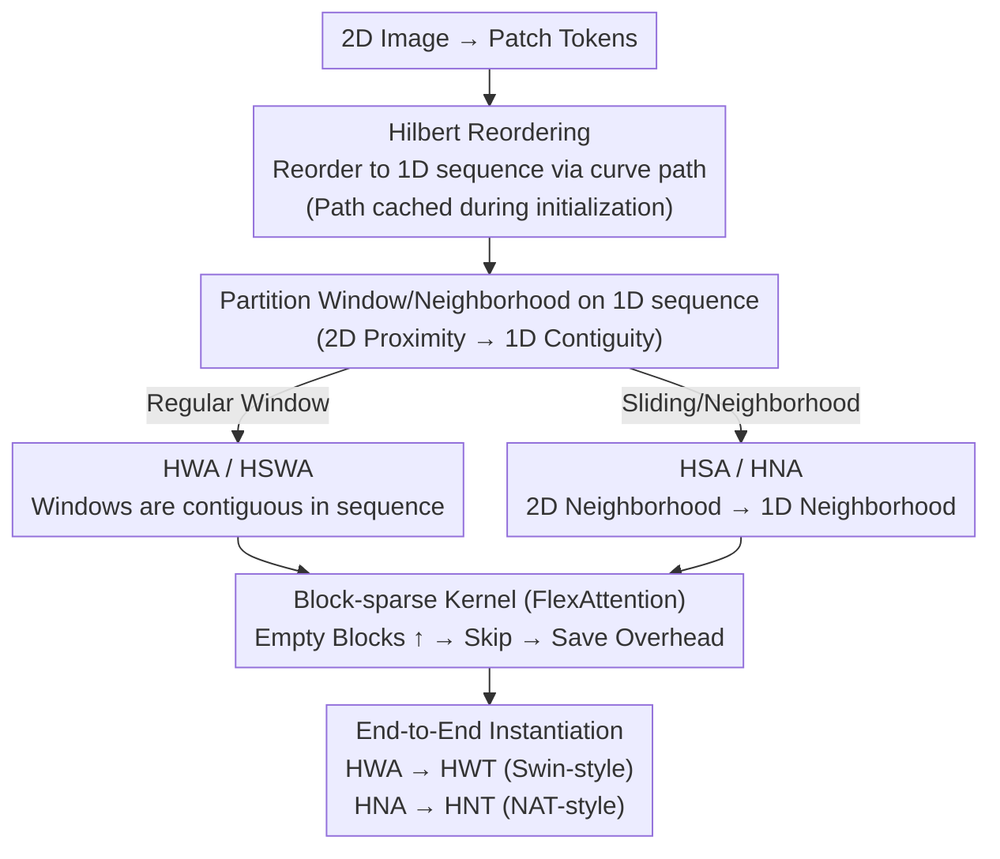

# Hilbert-Guided Sparse Local Attention

**Conference**: ICLR 2026  
**arXiv**: [2511.05832](https://arxiv.org/abs/2511.05832)  
**Code**: [GitHub](https://github.com/Yunge6666/Hilbert-Local-Attention)  
**Area**: Efficient Transformer/Attention Mechanisms  
**Keywords**: Hilbert curve, Local attention, Block sparsity, FlexAttention, Vision Transformer

## TL;DR
Hilbert space-filling curves are utilized to reorder 2D image tokens into 1D sequences that preserve spatial proximity. This significantly increases the block sparsity ratio of local attention (improving the empty block ratio from 87.5% to 96.9%). Combined with FlexAttention, it achieves a 4x speedup for window attention and an 18x speedup for sliding attention with minimal accuracy loss.

## Background & Motivation

**Background**: The $O(N^2)$ complexity of global self-attention in Vision Transformers limits high-resolution image processing. Local attention (e.g., Swin's window attention, NAT's neighborhood attention) reduces complexity and remains the mainstream solution.

**Limitations of Prior Work**: While local attention theoretically reduces computation, actual GPU efficiency depends on the underlying kernel implementation. Traditional row-major sequence ordering causes tokens within a 2D window to be non-contiguous in a 1D sequence. This leads to numerous partial blocks in block-sparse attention (e.g., FlexAttention), requiring additional masking overhead and limiting sparsity-driven acceleration.

**Key Challenge**: Block-sparse kernels accelerate by skipping empty blocks $\rightarrow$ however, window attention using row-major ordering has a low empty block ratio (87.5%) and many partial blocks $\rightarrow$ speedup is restricted.

**Key Insight**: Hilbert curves possess excellent locality-preserving properties—points close in 2D space remain close on the 1D curve. Reordering tokens using the Hilbert curve $\rightarrow$ tokens within a window become contiguous in 1D $\rightarrow$ the empty block ratio increases significantly while partial blocks decrease.

**Core Idea**: Hilbert reordering makes 2D local attention patterns more compact within 1D sequences $\rightarrow$ more empty blocks $\rightarrow$ more efficient block-sparse kernels.

## Method

### Overall Architecture
This work addresses the gap where local attention "saves computation in theory but runs slowly in practice." Block-sparse kernels (e.g., FlexAttention) partition the attention matrix into fixed-size blocks and accelerate by skipping entirely empty blocks. However, row-major ordering causes 2D window tokens to scatter across the 1D sequence, resulting in few empty blocks and many half-filled partial blocks, which degrades acceleration. The proposed method inserts a pure reordering operation before attention calculation: image tokens are reordered into a 1D sequence following the path of a Hilbert space-filling curve, ensuring that spatially proximal tokens are also sequential. Subsequently, windowing or neighborhood operations are applied as usual to this 1D sequence and computed via block-sparse kernels. Reordering changes only the physical layout without altering the spatial semantics of attention; once tokens within a window become contiguous, the empty block ratio rises, allowing the kernel to skip more blocks. This approach is implemented in two directions: Hilbert Window Attention (HWA, with a shifted version HSWA) and Hilbert Sliding/Neighborhood Attention (HSA/HNA). These are integrated into two end-to-end models: HWT (Swin-style) and HNT (NAT-style). The Hilbert path depends only on image resolution and can be pre-computed and cached during model initialization.

### Key Designs

**1. Hilbert Window Attention (HWA): Converting Partial Blocks to Empty Blocks**

Under row-major ordering, a $2 \times 2$ window might capture tokens (1, 2, 5, 6). These span multiple rows in a 1D sequence and occupy corners of several blocks, creating 4 half-filled partial blocks. Block-sparse kernels cannot skip these and must perform element-wise masking, incurring high overhead. With a Hilbert sequence, the same window captures contiguous tokens (1, 2, 3, 4), fitting neatly into 2 full blocks while leaving 2 blocks entirely empty—increasing the empty block ratio from 0% to 50%. HWA applies this "Hilbert reordering followed by contiguous windowing" to standard window attention, maintaining the same spatial neighborhood while optimizing the physical layout for block-sparse kernels.

**2. Hilbert Sliding / Neighborhood Attention (HSA / HNA): Transforming 2D to 1D Neighborhoods**

Sliding window and neighborhood attention are the most fragmented under row-major ordering—each query's neighborhood spans multiple 1D rows, making block sparsity nearly impossible to exploit. The locality-preserving property of Hilbert curves solves this: neighbors in 1D $\approx$ neighbors in 2D. Thus, neighborhood attention originally defined in 2D can be computed directly as 1D neighborhood attention (using `na1d` from NATTEN or `mask_mod`/`score_mod` in FlexAttention). This leverages mature 1D sparse kernels and avoids the $O(N^2)$ intermediate storage overhead required to construct 2D neighborhoods.

**3. Speedup Mechanism: More Empty Blocks, Less Overhead**

The total execution time of a block-sparse kernel can be approximated as:

$$T \approx \frac{\sum_{i=1}^{M}(\alpha + \beta \cdot r_i)}{P_{\text{eff}}}$$

For each processed block, there is a fixed launch overhead $\alpha$ (CTA launch, query block loading, initialization) and a memory/compute overhead $\beta \cdot r_i$ proportional to the number of non-empty rows $r_i$ in the block. $P_{\text{eff}}$ represents effective parallelism. Empty blocks are skipped entirely and do not enter the summation. Therefore, more empty blocks mean fewer CTA launches and fewer K/V loads, shortening $T$. This formula explains why HWA/HSA focuses on "creating empty blocks." It also notes that the combination of block size and window size determines empty block distribution, requiring tuning to maximize the ratio.

**4. End-to-End Instantiation (HWT / HNT): Zero-Intrusion Integration**

The paper integrates these operators into two trainable models. HWT is isomorphic to Swin Transformer, replacing WSA with HWA. It uses HWA paired with Hilbert Shifted Window Attention (HSWA) for cross-window communication; shifting windows in 1D is simpler than 2D masking, though it may introduce non-adjacent 2D tokens at sequence boundaries that require masking. Since Hilbert windows are irregularly shaped, standard window Relative Position Bias (RPB) is replaced with a global RPB covering the entire feature map. HNT is isomorphic to NAT, replacing neighborhood attention with HNA. Both utilize FlexAttention's `mask_mod`/`score_mod` interfaces, requiring no custom kernels or changes to training workflows.

### Loss & Training
- Standard ImageNet classification training is used without altering objectives.
- Hilbert paths are computed once at initialization and cached for reuse during inference.
- Compatible with multiple kernels including FlexAttention, FlashAttention, xFormers, and NATTEN.

## Key Experimental Results

### Attention Computation Efficiency

| Attention Type | Input | Window | Empty Block Ratio | Forward Time | Speedup |
| :--- | :--- | :--- | :--- | :--- | :--- |
| WSA (Flex) | 96×96 | 16×16 | 83.3% | 2.63ms | 1× |
| **HWA (Flex)** | 96×96 | 16×16 | **97.2%** | **0.40ms** | **6.6×** |
| SA (Flex) | 64×64 | 7×7 | ~Low | Slow | 1× |
| **HSA (Flex)** | 64×64 | 7×7 | ~High | Fast | **~18×** |

### Main Results (ImageNet)

| Model | Params | Top-1 Acc | Throughput | Description |
| :--- | :--- | :--- | :--- | :--- |
| Swin-T | 28M | 81.3% | Baseline | Original Swin |
| **HWT-T** | 28M | 81.0% | **Faster** | -0.3% Accuracy |
| NAT-Mini | - | 81.8% | Baseline | Original NAT |
| **HNT-Mini** | - | 81.5% | **Faster** | -0.3% Accuracy |

### Key Findings
- Hilbert reordering improves the empty block ratio from 83-91% to 96-98%, approaching the theoretical limit.
- Larger windows or longer sequences yield higher speedups due to more pronounced differences in empty block ratios.
- Accuracy loss is only 0.2-0.3%; while Hilbert windows are irregularly shaped, spatial proximity is well-preserved.
- HSA achieves the most significant speedup (~18x) because sliding windows are extremely "fragmented" in row-major ordering.

## Highlights & Insights
- **Utility of Space-Filling Curves**: The locality-preserving property of Hilbert curves perfectly aligns with the requirements of block-sparse optimization. This is an elegant combination of mathematical tools and system optimization.
- **Ordering Change, Not Model Change**: Hilbert reordering does not change the logical semantics of attention (the spatial neighborhood remains the same); it only changes the physical layout to suit block-sparse kernels. It is zero-intrusive to existing architectures.
- **Flagship Application for FlexAttention**: HWA/HSA/HNA are defined via FlexAttention interfaces, demonstrating the power of programmable sparse attention frameworks without needing manual kernel writing.

## Limitations & Future Work
- Global RPB uses more parameters than window RPB, which may lead to overfitting in small models.
- Hilbert curves are primarily applicable to dimensions that are powers of 2; non-square or non-$2^n$ sizes require padding.
- Shifted windows in Hilbert sequences may bring non-adjacent tokens into the same window, necessitating additional masking.
- Acceleration depends on frameworks like FlexAttention; performance may vary across different hardware or CUDA versions.

## Related Work & Insights
- **vs. Swin Transformer**: HWT accelerates Swin's WSA via Hilbert reordering with $<0.3\%$ accuracy loss.
- **vs. NAT/NATTEN**: HNT converts 2D neighborhood attention to 1D, enabling direct use of optimized 1D kernels.
- **vs. FlashAttention**: While FlashAttention optimizes dense attention, HWA/HSA leverages sparsity for further acceleration.

## Rating
- Novelty: ⭐⭐⭐⭐ Elegant combination of Hilbert curves and block-sparse optimization.
- Experimental Thoroughness: ⭐⭐⭐⭐ Validated across attention types, kernels, and end-to-end models.
- Writing Quality: ⭐⭐⭐⭐ Clear diagrams and well-explained acceleration principles.
- Value: ⭐⭐⭐⭐ Directly practical for high-resolution Vision Transformers.

<!-- RELATED:START -->

## Related Papers

- [\[ICLR 2026\] QUEST: A Robust Attention Formulation Using Query-Modulated Spherical Attention](quest_a_robust_attention_formulation_using_query-modulated_spherical_attention.md)
- [\[ICLR 2026\] Neural Dynamics Self-Attention for Spiking Transformers](neural_dynamics_self-attention_for_spiking_transformers.md)
- [\[AAAI 2026\] GDBA Revisited: Unleashing the Power of Guided Local Search for Distributed Constraint Optimization](../../AAAI2026/others/gdba_revisited_unleashing_the_power_of_guided_local_search_for_distributed_const.md)
- [\[ACL 2025\] Unique Hard Attention: A Tale of Two Sides](../../ACL2025/others/unique_hard_attention_a_tale_of_two_sides.md)
- [\[AAAI 2026\] Local Guidance for Configuration-Based Multi-Agent Pathfinding](../../AAAI2026/others/local_guidance_for_configuration-based_multi-agent_pathfinding.md)

<!-- RELATED:END -->
