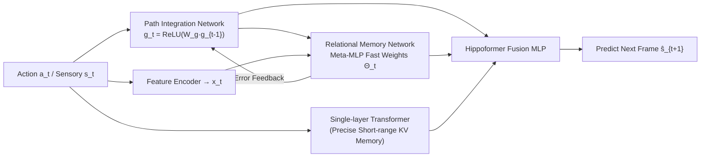

# Hippoformer: Integrating Hippocampus-inspired Spatial Memory with Transformers

**Conference**: ICLR 2026  
**OpenReview**: [https://openreview.net/forum?id=hxwV5EubAw](https://openreview.net/forum?id=hxwV5EubAw)  
**Code**: To be confirmed  
**Area**: Brain-inspired Architecture / Sequence Modeling / Spatial Memory  
**Keywords**: Hippocampus, Entorhinal Cortex, TEM, Grid Cells, Spatial Reasoning, Transformer, Test-time Memory  

## TL;DR
This paper replaces the expensive tensor-product Hebbian memory in TEM with a "Meta-MLP fast weight" relational memory, resulting in mm-TEM—a structured spatial memory that is training-efficient, exhibits spontaneous grid cell emergence, and generalizes to long sequences. By paralleling mm-TEM with a single-layer Transformer to form Hippoformer, the model complements the Transformer's precise short-range memory with structured long-range memory, achieving stronger long-range generalization in 2D/3D prediction tasks.

## Background & Motivation
- **Background**: Transformers rely on self-attention to retrieve key-value caches as associative memory, serving as the foundation of modern generative AI. Recent works like Titans use fast MLP weights to expand memory capacity for improved long-sequence modeling. In neuroscience, the hippocampal-entorhinal (HC-EC) system is central to spatial and episodic memory. The medial entorhinal cortex (MEC) provides "structural codes" based on path integration, which the hippocampus (HPC) binds with "sensory codes" from the lateral entorhinal cortex (LEC) for flexible spatial reasoning. The Tolman-Eichenbaum Machine (TEM) formulated these mechanisms into a learnable computational framework.
- **Limitations of Prior Work**: On one hand, memory structures in Transformers/Titans are "flat," lacking inherent spatial priors to organize "what-where" structures in experience. On the other hand, hippocampal models are difficult to integrate into modern deep learning. The original TEM uses tensor-product Hebbian weights for relational memory, which is biologically plausible but limited in capacity and slow to train. While TEM-t improves efficiency using key-value self-attention, it inherits the context window limits of Transformers and requires complex novelty-based access and hyperparameter tuning. Vector-HaSH is non-differentiable.
- **Key Challenge**: Expanding memory capacity while ignoring its **underlying spatial structure** is inefficient, yet biologically elegant structured memories **cannot be scaled or differentiably embedded** into modern architectures. A tension exists between "structural priors" and "scalability/differentiability."
- **Goal**: Construct a spatial memory module that retains hippocampal grid-like structural priors, is training-efficient and differentiable, and can be seamlessly integrated into Transformers to verify its generalization advantages in long sequences, large environments, and multi-step prediction.
- **Core Idea**: **[Rewriting relational memory with fast weights]** Replace the Hebbian tensor product in TEM with a "Meta-MLP" (mm-TEM) that online minimizes reconstruction loss driven by prediction errors. **[Parallel dual-memory]** Parallelize mm-TEM with a single-layer Transformer (Hippoformer), allowing one to handle structured long-range abstraction and the other to manage precise short-range memory.

## Method

### Overall Architecture
mm-TEM follows the two-module skeleton of TEM: the **Path Integration Network** derives the structural code $g_t$ (corresponding to the MEC grid system) from action $a_t$, and the **Relational Memory Network** binds $g_t$ with the sensory code $x_t$ into a joint representation for bidirectional retrieval (corresponding to HPC conjunctive encoding). The key modification is in the relational memory, which uses a Meta-MLP with hierarchical fast weights $\Theta_t$ for online access instead of tensor-product Hebbian weights. Hippoformer then parallels mm-TEM with a single-layer Transformer: both process input embeddings, and their concatenated outputs are fused by an MLP.

### Key Designs

**1. Path Integration Network: Recurring Structural Codes from Actions** Inspired by the MEC grid system, the network maps action $a_t$ through a two-layer ReLU MLP $f_g$ to a transformation matrix $W^g_t=f_g(a_t)$. This is used to derive the structural code $\tilde g_t=\mathrm{ReLU}(W^g_t g_{t-1})$, followed by $\ell_2$ normalization $g_t=\tilde g_t/\lVert\tilde g_t\rVert_2$ to maintain a unit vector. This implicitly encodes spatial consistency rules (e.g., "Up+Down+Left+Right=0") into the recurrence, allowing structural codes to be reused across environments and support compositional generalization—where grid-like periodic representations emerge.

**2. Meta-MLP Relational Memory: Replacing Hebbian Memory with Online Reconstruction Loss** The relational network projects the joint representation $m_t=[g_t,x_t]$ into $k_t,v_t,q_t$. Instead of storing $m_t$ directly, the Meta-MLP learns to associate keys with values by minimizing $\mathcal L(k_t,v_t;\Theta_t)=\lVert f_{\mathrm{MLP}}(k_t;\Theta_t)-v_t\rVert_2^2$. Fast weights are updated via "forgetting + momentum + error-driven" mechanisms: $\Theta_t=(1-\alpha_t)\Theta_{t-1}+H_t$, where $H_t=\eta_t H_{t-1}-\beta_t\nabla_\Theta\mathcal L(k_t,v_t;H_{t-1})$. $\alpha_t$ is a data-dependent forgetting gate, $\nabla_\Theta\mathcal L$ ensures updates are driven only by "surprising" inputs (prioritizing novel stimuli), and $\eta_t$ and $\beta_t$ are momentum and learning rate terms. During retrieval, $q_t$ yields the joint reconstruction $\hat m_t=[\hat g_t;\hat x_t]$ via $f_{\mathrm{MLP}}(q_t;\Theta_t)$. This transforms complex memory management into differentiable, test-time adaptive update rules.

**3. Three-way Auxiliary Relational Loss: Enforcing Structure-Sensory Binding** To ensure the memory learns true "structure-sensory" binding rather than rote memorization, three masked reconstruction constraints are added: inferring structural code from sensory code $\mathcal L_{x2g}=\lVert\hat g_t-g_t\rVert_2^2$, self-reconstructing structural code $\mathcal L_{g2g}=\lVert\bar g_t-g_t\rVert_2^2$, and inferring sensory code from structural code $\mathcal L_{g2x}=\lVert\hat x_t-x_t\rVert_2^2$. Since $\mathcal L_{g2x}$ is covered by the primary prediction objective, the relational loss simplifies to $\mathcal L_{rel}=\mathcal L_{x2g}+\mathcal L_{g2g}$. Ablations show that removing any term significantly hurts generalization.

**4. Dual Memory Parallel Connection (Hippoformer)** From a memory perspective, a window-limited Transformer acts as "precise short-term memory" via KV caching, while mm-TEM acts as "structured but less precise long-term memory." Hippoformer parallels the two: the Transformer branch receives action and sensory embeddings, while the mm-TEM branch processes the structural codes. Their outputs are fused by an MLP. A hyperparameter $m_b$ controls the update frequency of the Meta-MLP—larger $m_b$ leads to sparser updates and higher efficiency, pushing mm-TEM toward long-range prediction and sacrificing short-range precision, which is then compensated by the Transformer branch.

## Key Experimental Results

### Main Results (3D Open Environment Prediction, error in 1e-3, lower is better)

| Model | 1-step Full | 1-step Visible | 1-step Not Visible | m-step Full | m-step Visible | m-step Not Visible |
|---|---|---|---|---|---|---|
| Transformer | 1.29 | 0.67 | 2.15 | 36.13 | 11.49 | 38.07 |
| Titans | 1.32 | 0.69 | 2.20 | 33.42 | 10.60 | 35.21 |
| mm-TEM | 5.10 | 4.23 | 6.53 | 14.30 | 13.23 | 14.40 |
| **Hippoformer** | **1.27** | **0.67** | **2.09** | **9.71** | **2.72** | **10.27** |

For 1-step prediction, Hippoformer slightly outperforms Transformer/Titans. For multi-step imagination, Hippoformer **leads significantly**: while baselines suffer from error accumulation after 36–56 steps, Hippoformer maintains coherence.

### Ablation Study (Auxiliary Relational Loss in 2D Grid, Fig. 3C)

| Variant | Performance |
|---|---|
| Full mm-TEM | Best long-range generalization |
| w/o $\mathcal L_{g2g}$ | Significant decrease in generalization |
| w/o $\mathcal L_{s2g}$ | Significant decrease in generalization |
| w/o rel (None) | Severe degradation |

### Key Findings
- **Training Efficiency**: mm-TEM reaches nearly 90% test accuracy within 5,000 gradient steps, whereas TEM reaches only ~60% after 20,000 steps.
- **Long-sequence Generalization**: In 1-step prediction, Transformer/Titans collapse once the context exceeds the 128-step training window, whereas mm-TEM maintains ~40% accuracy at 4,096 steps.
- **Distribution Shift Robustness**: In a counter-clockwise circular grid, mm-TEM achieves >90% while baselines drop by up to 30%. When environment size scales from 7×7 to 15×15 without retraining, mm-TEM decays the slowest.
- **Grid Emergence & Mechanism**: The path integration network spontaneously develops periodic grid representations. The grid scale is modulated by the update frequency $m_b$ (larger $m_b$ results in coarser grids), linking "grid scale diversity" to "multi-time-scale prediction." Grid scores correlate positively with multi-step accuracy ($r=0.647, p=0.0002$).
- **Grid Quality vs. Path**: Some models with lower grid scores still achieve high accuracy, developing "alternative but regular" representations compared to the unstructured patterns of low-accuracy models—indicating strong grid cells are a manifestation of effective structural learning but not the sole sufficient condition.
- **Synergy in Hippoformer**: Standalone mm-TEM with $m_b=8$ is weaker in short-context 1-step prediction due to missing recent information. Paralleling it with a Transformer restores performance across both short and long contexts.

## Highlights & Insights
- **Applying "Test-time Learning" Appropriately**: While Titans-style fast weights were originally intended for capacity expansion, this work applies them to structure-sensory binding in the HC-EC system. This resolves the capacity/efficiency bottleneck of TEM's tensor product while maintaining differentiability—a clean example of using machine learning mechanisms to implement neuroscience priors.
- **Grid Scale = Prediction Horizon**: The emerged relationship where larger $m_b \rightarrow$ longer effective prediction horizon $\rightarrow$ coarser grids provides a computational explanation for the grid scale gradient along the dorso-ventral hippocampal axis without requiring preset multi-scale place fields.
- **Synergy of Dual Memory**: Short-range precision relies on the Transformer's KV cache, while long-range abstraction depends on mm-TEM's structural focus. Their parallel integration validates that memory should be "structured" rather than just "larger."
- **Abstraction vs. Memorization**: Traditional TEM/TEM-t focused on memory storage and memory-based reasoning. mm-TEM moves toward "abstraction" via parameterized relational memory. Hippoformer combines the two, achieving lower error for both "visible frames" (relying on memory) and "invisible frames" (relying on abstraction) in 3D tasks.

## Limitations & Future Work
- **Simple Integration**: Hippoformer currently uses a "direct parallel" connection between Transformer and mm-TEM; deeper coupling mechanisms remain unexplored.
- **Single-layer and Unscaled**: The current design is single-layer and does not utilize model/compute scaling proven critical in LLMs; effects of multi-layer stacking and scaling are unknown.
- **Controlled Tasks**: Evaluations are focused on 2D grids and 3D open environment predictions, which are still a distance away from real-world complex spatio-temporal tasks.
- **Heuristic $m_b$ Trade-off**: The update frequency $m_b$ manually balances training efficiency/long-range bias against short-range precision. Currently, this relies on the Transformer branch as a safety net rather than an end-to-end adaptive schedule.

## Related Work & Insights
- **HC-EC Computational Models**: CSCG, Vector-HaSH, and TEM-t are elegant but difficult to scale—TEM is computationally expensive, TEM-t is window-limited, and Vector-HaSH is non-differentiable. mm-TEM fills the "differentiable + scalable" gap.
- **Long-sequence Modeling**: Mamba, Titans, and Gated DeltaNet advance long-sequence modeling via structured initialization or fast weights, but often treat memory as flat capacity. This work emphasizes that real-world information is spatio-temporally structured, introducing spatial priors to memory.
- **Theories of Grid Scale Origin**: Unlike theories deriving grid scales from multi-scale prediction or place field basis functions, mm-TEM allows multi-scale grids to emerge end-to-end simply by tuning the update frequency.

## Rating
- **Novelty**: ⭐⭐⭐⭐ Coupling Titans-style fast weights with TEM relational memory and discovering that grid scale is modulated by update frequency is a clever interdisciplinary cross-over.
- **Experimental Thoroughness**: ⭐⭐⭐ Covers 2D/3D sequences, long-range generalization, and distribution shifts, but relies on controlled synthetic tasks without large-scale real-world benchmarks.
- **Writing Quality**: ⭐⭐⭐⭐ Clear mapping between neuroscience motivation and methodology; consistent narrative with well-integrated formulas and figures.
- **Value**: ⭐⭐⭐⭐ Provides a differentiable and scalable path for embedding structured spatial memory into foundational architectures, though engineering maturity and scalability remain to be proven.

<!-- RELATED:START -->

## Related Papers

- [\[ICLR 2026\] The Counting Power of Transformers](the_counting_power_of_transformers.md)
- [\[ECCV 2024\] SpatialFormer: Towards Generalizable Vision Transformers with Explicit Spatial Understanding](../../ECCV2024/others/spatialformer_towards_generalizable_vision_transformers_with_explicit_spatial_un.md)
- [\[ICML 2026\] Spatial Priors via Space Filling Curves for Small and Limited Data Vision Transformers](../../ICML2026/others/spatial_priors_via_space_filling_curves_for_small_and_limited_data_vision_transf.md)
- [\[ICLR 2026\] HippoTune: A Hippocampal Associative Loop–Inspired Fine-Tuning Method for Continual Learning](hippotune_a_hippocampal_associative_loopinspired_fine-tuning_method_for_continua.md)
- [\[ICLR 2026\] A Brain-Inspired Gating Mechanism Unlocks Robust Computation in Spiking Neural Networks](a_brain-inspired_gating_mechanism_unlocks_robust_computation_in_spiking_neural_n.md)

<!-- RELATED:END -->
