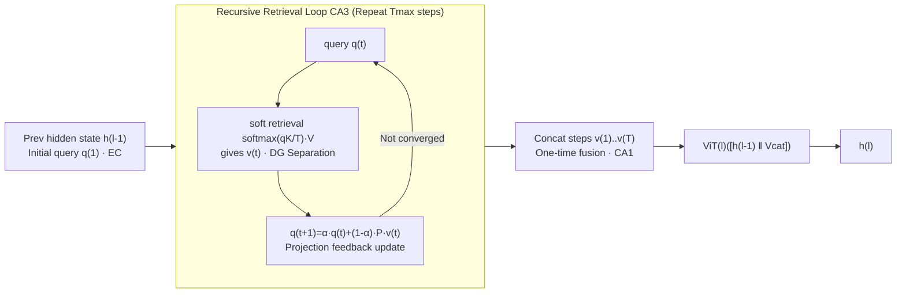

# HippoTune: A Hippocampal Associative Loop–Inspired Fine-Tuning Method for Continual Learning

**Conference**: ICLR 2026  
**OpenReview**: [https://openreview.net/forum?id=MtDiLnnYgm](https://openreview.net/forum?id=MtDiLnnYgm)  
**Code**: [https://github.com/yan4xi1/HippoTune](https://github.com/yan4xi1/HippoTune)  
**Area**: Continual Learning / Parameter-Efficient Fine-Tuning / Brain-Inspired  
**Keywords**: Continual Learning, PEFT, Hippocampal Loop, Iterative Retrieval, Krylov Subspace, Second-order Preconditioning  

## TL;DR
HippoTune upgrades "single-step prompt pool retrieval" to an **intra-layer iterative latent space retrieval cycle** mimicking the hippocampal EC–DG–CA3–CA1 loop. Through several rounds of "query–retrieval–feedback," it deeply activates memories of previous tasks, improving the accuracy of buffer-free PEFT-CL by 5–8% with approximately half the FLOPs.

## Background & Motivation
- **Background**: In continual learning, PEFT-CL methods (e.g., L2P, DualPrompt, CODA-Prompt) freeze the backbone and insert small trainable modules. These methods maintain a "parameter/prompt pool" and use sample representations as queries during inference to retrieve and activate sub-modules. They have become mainstream due to computational efficiency and resistance to forgetting.
- **Limitations of Prior Work**: These methods are essentially **single-step retrieval**—selecting a set of prompts using a query in one go. Single-step retrieval "under-activates" memories of old tasks and often requires a full backbone forward pass to obtain high-level semantic queries, causing additional latency.
- **Key Challenge**: When performing learned tasks, the human brain engages in **multiple rounds of associative recall** (sparse clues → repeated completion via hippocampal loops) to more fully reactivate historical knowledge. Current methods use a "one-off" approach, unable to deepen retrieval without repeatedly constructing high-level features.
- **Goal**: To make the retrieval "depth" a differentiable and controllable process under strict computational budgets without increasing backbone forward passes or relying on a replay buffer, thereby more thoroughly awakening memories of previous tasks.
- **Core Idea**: **[Brain-Inspired Iterative Retrieval]** Inspired by the pattern separation/completion/integration mechanisms of the EC–DG–CA3–CA1 loop, a lightweight "query–soft retrieval–projection feedback" associative loop (termed Latent Deliberation) is embedded within each Transformer layer. This is theoretically proven to be equivalent to **[Krylov second-order preconditioning]**, where multi-step iterations achieve a polynomial approximation of the inverse Hessian.

## Method

### Overall Architecture
HippoTune first unifies all PEFT modules into a shared retrieval pool (with learnable key matrices). It extends the standard forward pass of each Transformer layer into a **controllable iterative associative loop**: using the previous layer's hidden state as the initial query, it performs several rounds of soft key–value retrieval and projects the results back to update the query until convergence or maximum steps are reached. Finally, retrieval vectors from all steps are fused and fed into the ViT block output. The process corresponds to the four stages of the hippocampus: EC (seed query) → DG (pattern separation) → CA3 (recursive completion) → CA1 (integration/fusion). The system is trained end-to-end using classification, orthogonality, and entropy losses, with truncated BPTT used to align training and inference budgets.

### Key Designs

**1. Unified Retrieval Perspective of PEFT-CL: Abstracting "Prompt Pools" as Key–Value Retrieval.** The authors consolidate all lightweight modules into a pool $V=\{\theta^{(1)}, \dots, \theta^{(m)}\}$ with a learnable key matrix $K \in \mathbb{R}^{m \times d}$. Given a frozen backbone hidden state $x$, routing scores $s = xK^\top / \tau$ and $g = \mathrm{softmax}(s)$ are calculated, and module residuals $\Delta h^{(i)} = \phi(x; \theta^{(i)})$ are mixed to update $h \leftarrow h + g^\top \Delta H$. This unified form reduces L2P, DualPrompt, and CODA-Prompt to "single-step retrieval" cases, highlighting three issues: query cost (high-level features require extra computation), retrieval depth (current methods retrieve only once), and key-gating design (temperature/Top-k/entropy). This abstraction serves as the starting point for deepening retrieval.

**2. Latent Deliberation: Intra-layer Differentiable Iterative Retrieval Loop.** Using the previous layer's hidden state as the initial query $q^{(1)} = h^{(l-1)}$, each layer maintains key/value matrices $K^{(l)}, V^{(l)}$ encoding task subspaces. At step $t$, soft retrieval yields $S^{(t)} = \mathrm{softmax}(q^{(t)}K^{(l)\top} / T)$ and $v^{(t)} = S^{(t)}V^{(l)}$ (temperature $T$ adjusts sharpness). A layer-specific linear transformation $P^{(l)}$ feeds retrieval results back into the query: $q^{(t+1)} = \alpha q^{(t)} + (1-\alpha)P^{(l)}v^{(t)}$. The loop stops when $\|v^{(t)} - v^{(t-1)}\|_2 < \varepsilon$ or $t = T_{\max}$, mimicking CA3 auto-associative completion. To avoid re-running forward passes, **one-time fusion** is used: concatenated vectors $V_{cat} = v^{(1)} \| \dots \| v^{(T)}$ are fed into the ViT block: $h^{(l)} = \mathrm{ViT}^{(l)}(h^{(l-1)} \| V_{cat})$, corresponding to CA1 integration. The trade-off between quality and efficiency is explicitly adjusted via $T_{\max}$, $\varepsilon$, and Top-k.

**3. Krylov Subspace Preconditioning Theory: Multi-step Iteration ≈ Implicit Second-order Correction.** The authors abstract the single-layer recursion as gradient descent on a smooth potential function $q^{(t+1)} = q^{(t)} - \eta \nabla \phi(q^{(t)})$. They prove that near a fixed point, when $\rho(I - \eta H) < 1$, the leading term of the gradient w.r.t. parameters after $T_{\max}$ steps is $\sum_{k=0}^{T_{\max}-1}(J^\top)^k\hat\theta = \mathcal{K}_{T_{\max}}(H)\hat\theta$, where $J = I - \eta H$. As $T_{\max} \to \infty$, the Neumann series converges to $H^{-1}$, meaning the iteration implicitly achieves a polynomial approximation of the inverse Hessian—a **differentiable second-order preconditioner**—without explicit computation of second-order information. The corollary suggests effectiveness at $T_{\max} = 2 \sim 4$.

**4. End-to-end Three-term Loss + Truncated BPTT.** The training objective is $L = L_{cls} + \lambda_{orth}L_{orth} + \lambda_{ent}L_{ent}$. $L_{cls}$ supervises downstream performance; $L_{orth} = \sum_l \|K^{(l)\top}K^{(l)} - I\|_F^2$ encourages orthogonal keys to reduce interference; $L_{ent} = -\sum_l \sum_t \sum_i S_i^{(t)} \log S_i^{(t)}$ controls the sharpness of retrieval weights. Truncated BPTT propagates gradients only through the last few steps, aligning training with dynamic inference budgets ($T_{\max}$, Top-k) to ensure consistency.

## Key Experimental Results

### Main Results
ViT-Base/16 backbone, three visual continual learning benchmarks (10 tasks, class-incremental), buffer-free setting:

| Method | GFLOPs | Seq-CIFAR100 Acc/AAA | Seq-ImageNet-R Acc/AAA | Seq-CUB200 Acc/AAA |
| :--- | :--- | :--- | :--- | :--- |
| DER++ (w/ buffer) | 16.88 | 84.50/90.16 | 54.21/65.26 | 77.42/83.61 |
| L2P | 35.20 | 82.76/88.48 | 71.26/76.13 | 68.39/78.29 |
| CODA-Prompt | 35.84 | 86.28/91.05 | 74.05/78.14 | 72.45/78.94 |
| HiDe-Prompt | 35.25 | **88.25/92.69** | 74.65/78.46 | **84.27/88.64** |
| **Ours (HippoTune)** | **16.92** | 87.65/92.07 | **74.85/79.92** | 81.12/86.63 |

- Using roughly half the FLOPs (16.92 vs ~35), HippoTune achieves the highest Acc/AAA on Seq-ImageNet-R, surpassing HiDe-Prompt which uses double the compute.
- On ImageNet-R with varying task numbers (N=5/10/20), HippoTune leads all baselines, with its advantage becoming more stable as the number of tasks increases.
- Average training time is reduced by approximately 30% on identical hardware.

### Ablation Study
Removal of Latent Deliberation components (Acc/AAA):

| Variant | Seq-CIFAR100 | Seq-ImageNet-R |
| :--- | :--- | :--- |
| Full Method | 87.65/92.07 | 74.85/79.92 |
| w/o Iterative Retrieval ($T_{\max}=1$) | 86.51/90.63 | 72.89/78.10 |
| w/o $L_{orth}$ | 87.32/91.87 | 74.09/78.77 |
| w/o $L_{ent}$ | 87.43/91.30 | 74.67/79.55 |
| w/o Fusion (last step only) | 87.27/91.28 | — |

### Key Findings
- **Iterative retrieval is central**: Degrading to single-step ($T_{\max}=1$) results in the most significant drop (72.89/78.10 on ImageNet-R), proving multi-step retrieval is crucial for integrating history and resisting forgetting.
- **Orthogonality is critical in difficult domains**: Removing $L_{orth}$ drops AAA by 1.2 points on ImageNet-R, showing that maintaining diversity in retrieval vectors is vital for utilizing old knowledge.
- **Entropy/Fusion are secondary**: Removing them affects performance by <0.6 points, serving primarily for stability and refinement.
- **Hyperparameter trends**: $T_{\max} \approx 4$ is optimal; intermediate temperatures ($10^{-1}$) work best; inserting PEFT in shallow+middle layers (1–7) is superior, confirming multi-level memory.

## Highlights & Insights
- **Valuable Abstraction of "Deepened Retrieval"**: By proving current prompt pool methods are special cases of single-step retrieval, the progression to "iterative deepening" becomes logical and interpretable.
- **Mapping Brain Science to Theory**: Rather than a vague analogy to the EC–DG–CA3–CA1 loop, the authors map the recursion to Krylov polynomial approximation of the inverse Hessian, providing a mathematical second-order optimization explanation for "multi-round association."
- **Genuine Efficiency Advantage**: While iterative loops seem costly, operating in latent space with one-time fusion achieves better results with half the FLOPs. $T_{\max}/\varepsilon$ and Top-k provide clear knobs for tuning the inference budget.

## Limitations & Future Work
- **Validation limited to visual classification**: Benchmarks are confined to ViT-based image class-incremental learning, leaving the transferability of hippocampal loops to NLP or large-scale LoRA scenarios unproven.
- **Memory overhead not directly compared**: While emphasize is on buffer-free operation, the cost of scaling the prompt pool and key/value matrices with more tasks is not fully discussed.
- **Theory-Practice Gap**: Krylov analysis assumes being near a fixed point and a positive definite Hessian with spectral radius <1; whether these hold during training remains largely empirical.
- **Trade-offs against strong baselines**: Performance on CIFAR100/CUB200 slightly trails HiDe-Prompt, which the authors attribute to the latter's higher compute and more complex prompt design.

## Related Work & Insights
- **PEFT-CL Prompt Pool Path**: L2P, DualPrompt, and CODA-Prompt use prompt pools with key-query retrieval. LAE, HiDe, and MoE-Adapter add dynamic expansion or expert routing. HippoTune unifies these as single-step retrieval and deepens them.
- **Brain-Inspired CL**: CLS theory, FearNet, and Triple Memory Networks use long/short-term memory to balance plasticity and stability, but often rely on replay or complex architectures. Ours simulates hippocampal associative memory granularly within the PEFT paradigm.
- **Inspiration**: The "single-step → multi-step differentiable iteration" approach can be transferred to RAG, MoE routing, or prompt selection. The "recursion ≈ implicit second-order preconditioning" perspective provides an optimization tool for explaining iterative reasoning models.

## Rating
- **Novelty**: ⭐⭐⭐⭐ — Unifying prompt pool retrieval and transforming it into an intra-layer iterative loop is novel, further strengthened by the Krylov subspace theory.
- **Experimental Thoroughness**: ⭐⭐⭐ — Benchmark performance, task scaling, and ablations are solid, though limited to visual classification tasks.
- **Writing Quality**: ⭐⭐⭐⭐ — Clear motivation and excellent mapping between biological inspiration and mathematical formulation.
- **Value**: ⭐⭐⭐⭐ — Achieves 5–8% improvement with half the FLOPs under strict budgets, offering high practical value for resource-constrained continual learning.

<!-- RELATED:START -->

## Related Papers

- [\[ICLR 2026\] Forget Forgetting: Continual Learning in a World of Abundant Memory](forget_forgetting_continual_learning_in_a_world_of_abundant_memory.md)
- [\[ICLR 2026\] Deploying Models to Non-participating Clients in Federated Learning without Fine-tuning: A Hypernetwork-based Approach](deploying_models_to_non-participating_clients_in_federated_learning_without_fine.md)
- [\[ICML 2026\] Continual Learning of Domain-Invariant Representations](../../ICML2026/others/continual_learning_of_domain-invariant_representations.md)
- [\[ICML 2026\] Advantages of Non-Smooth Components in Vision Transformer Fine-Tuning](../../ICML2026/others/vision_transformer_finetuning_benefits_from_non-smooth_components.md)
- [\[ACL 2025\] Intuitive Fine-Tuning: Towards Simplifying Alignment into a Single Process](../../ACL2025/others/intuitive_fine_tuning.md)

<!-- RELATED:END -->
