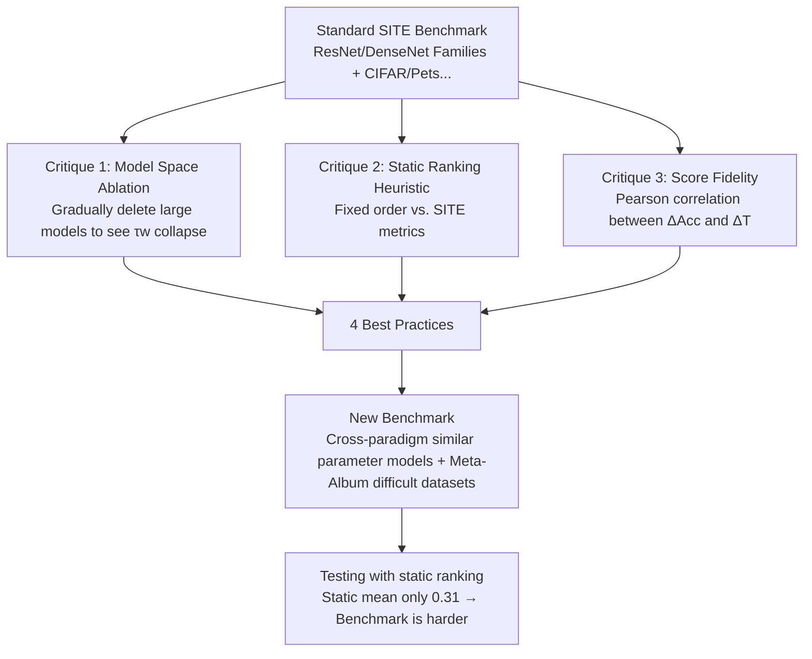

# How NOT to benchmark your SITE metric: Beyond Static Leaderboards and Towards Realistic Evaluation

**Conference**: ICLR 2026  
**OpenReview**: [https://openreview.net/forum?id=ZHKVPkJMSI](https://openreview.net/forum?id=ZHKVPkJMSI)  
**Code**: Provided with supplementary materials (including reproduction scripts and Jupyter notebooks)  
**Area**: Transferability Evaluation / Model Selection / Benchmarking Methodology  
**Keywords**: Transferability Estimation, SITE, Model Selection, Benchmark Critique, Weighted Kendall's Tau, Static Ranking  

## TL;DR
This paper empirically debunked three fundamental flaws in the standard benchmarks used in the "Source Independent Transferability Estimation (SITE)" field—unrealistic model spaces, leaderboards exploitable by static rankings, and score scales unrelated to real accuracy differences. It demonstrated that a static heuristic ranking, which ignores data entirely, outperforms all sophisticated SITE metrics. Consequently, the authors provided best practices for constructing more realistic benchmarks and introduced a new benchmark suite.

## Background & Motivation

**Background**: Models pre-trained on large datasets like ImageNet have become standard in deep learning. However, transfer gains vary significantly across different architectures, weights, and source data, leading to the "pre-trained model selection" problem. Source Independent Transferability Estimation (SITE) aims to calculate a low-cost score $T_m$ for each candidate model in a library without fine-tuning or access to the source dataset, ranking them by predicted downstream performance. This field has seen rapid output in recent years at ICML/NeurIPS/CVPR, with metrics such as LogME, TransRate, SFDA, ETran, NLEEP, H-Score, and GBC emerging.

**Limitations of Prior Work**: Almost all "progress" in these metrics is measured using the same set of standard benchmarks—a fixed pool of CNNs (ResNet34/50/101/152, DenseNet121/169/201, MobileNet, Inceptionv3, MNASNet, GoogleNet) fine-tuned on CIFAR10/100, Pets, Aircraft, Food, and DTD, using Weighted Kendall's Tau ($\tau_w$) to measure the correlation between predicted and actual fine-tuning accuracy rankings. However, this benchmark suite itself has never been critically examined.

**Key Challenge**: The model pool in these benchmarks is dominated by "size variants within the same architecture family" (e.g., various sizes of ResNet/DenseNet). Since larger models predictably outperform shallower ones, the supposedly complex task of "selecting the best model" degenerates into "identifying the largest model." This implies that the high scores achieved by metrics may not reflect genuine estimation capability.

**Goal**: Rather than endorsing a specific SITE metric or recommending "when to use which," this paper critiques the benchmarks themselves. It proves that existing evaluation protocols are seriously disconnected from real-world model selection and provides actionable guidelines for benchmark construction.

**Core Idea**: **(1) Falsifying existing benchmarks**—empirically exposing flaws using "model space ablation," "static ranking heuristics," and "score fidelity"; **(2) Reconstructing benchmarks**—proposing four best practices and a more challenging benchmark based on Meta-Album that cannot be exploited by static rankings.

## Method

### Overall Architecture
Ours is not a new metric but a benchmarking methodology of "falsification followed by reconstruction." The first phase launches three independent empirical critiques against standard benchmarks (unrealistic model space / exploitable by static ranking / meaningless score scale), each accompanied by a quantifiable validation experiment. The second phase translates these critiques into four best practices and constructs a new benchmark consisting of models with similar parameter counts across different architectural paradigms and difficult Meta-Album datasets, tested again using static rankings.

### Key Designs

**1. Critique 1: Model Space Ablation: Exposing the pseudo-task of "selecting the largest model."** The authors contend that the standard model pool is unrealistic—it is dominated by different size variants of ResNet and DenseNet. In practice, users care about "which architecture is better under constraints of size/speed/availability," not "whether to use a larger or smaller ResNet." To verify vulnerability, they **gradually removed the largest variants** (ResNet-152, ResNet-101, DenseNet-201, DenseNet-169) from overrepresented families, reducing 11 models to 7 (one per family), and recalculated $\tau_w$. The result was an abrupt drop in $\tau_w$ for almost all metrics: except for DTD and Pets, all metrics fell below 0.6 after ablation. For every metric, a dataset could be found where removing a single model caused a sharp performance decline. The conclusion is sharp: high scores of existing metrics are "fragile and highly dependent on correctly ranking a few overrepresented large models in a flawed benchmark."

**2. Critique 2: Static Ranking Heuristic: A data-independent fixed order outperforms all metrics.** Due to model dependencies and lack of dataset diversity, leaderboards become "static"—a few high-capacity models (e.g., ResNet-152) dominate regardless of the target dataset (in 10 datasets, ResNet-152 ranked first in 8, and the second place always fell among the top 3 models). Based on this, the authors constructed a **data-independent static ranker** that orders models solely by size, alternating between ResNet and DenseNet:

$$\text{ResNet-152} \succ \text{DenseNet-201} \succ \text{ResNet-101} \succ \text{DenseNet-169} \succ \text{ResNet-50} \succ \cdots \succ \text{MNASNet}$$

This ranker calculates no features and ignores task information, yet it achieves the **highest $\tau_w$ on every dataset** in the standard benchmark, with an average $\tau_w=0.91$, while LogME, the best SITE metric, only achieves 0.57. This directly indicates that standard benchmarks reward "memorizing a fixed model hierarchy" rather than genuine task-relevant transferability estimation.

**3. Critique 3: Score Fidelity: Decoupling score differences from accuracy differences.** A practical metric should not only rank correctly but also provide meaningful score **magnitudes**—a large difference in scores should correspond to a large difference in accuracy, allowing users to judge if a high-scoring model is worth the computational cost. The authors formalized this as "fidelity to accuracy differences": for any four models $A, B, C, D$ in the model space, an ideal metric should satisfy:

$$\Delta\mathrm{Acc}(A,B;D) > \Delta\mathrm{Acc}(C,D;D) \implies \Delta T(A,B) > \Delta T(C,D)$$

where $\Delta\mathrm{Acc}(X,Y;D)=\mathrm{Acc}(X,D)-\mathrm{Acc}(Y,D)$ and $\Delta T(X,Y)=T(X)-T(Y)$. They calculated the Pearson correlation between all $\{\Delta\mathrm{Acc}\}$ and $\{\Delta T\}$ pairs for each metric/dataset and found that correlations were weak for almost all metrics: for instance, on Pets, a LogME score difference of 0.09 could correspond to an accuracy difference of either 2.5% or 0.5%. The lack of a reliable mapping between scores and performance makes these metrics nearly useless for end-users making real decisions.

**4. Reconstruction: Four Best Practices + New Benchmark: Resistance to static ranking.** The critiques are translated into actionable guidelines: **(BP1)** Publicly release metric code, data links, scores, final accuracies, and pre-trained models to ensure reproducibility; **(BP2)** Construct diverse and non-trivial model spaces—spanning different paradigms like CNNs (ConvNeXt), ViTs (ViT, Swin), and MLPs (MLP-Mixer), while ensuring models are of **similar size** based on practical constraints like parameters/FLOPs/speed. This forces metrics to judge "which architectural inductive bias fits this task" rather than applying scaling laws; **(BP3)** Datasets should have difficulty headroom (avoiding datasets near 100% saturation) and domain diversity (fine-grained, medical, satellite, texture, non-web-scraped data); **(BP4)** Engineer "performance dispersion and ranking entropy" so that different architectures excel on different datasets, breaking the static leaderboard. Based on this, they built a new benchmark—using Twins-SVT, XCiT, CoaT, DeiT, MaxViT, and MViT v2 (similar parameters, not direct upgrades of each other), with 15 datasets selected from Meta-Album's 30 that avoid being saturated near 100% (Sports, PlantVillage, RESISC, Insects, PanNuke, Fungi, RSD, Boats, PlantDoc, Stanford Actions, DTD, PRTA, SPIPOLL, MPII, Dogs). On this new benchmark, the static ranker's $\tau_w$ range is only $[-0.3, 0.77]$ with a mean of 0.31, proving the benchmark is harder and no longer exploitable by memorized rankings.

## Key Experimental Results

### Main Results: Static Ranking vs. SITE Metrics on Standard Benchmarks (Weighted Kendall's $\tau_w$)

| Dataset | GBC | TransRate | SFDA | H-Score | NLEEP | LogME | **Static Ranking** |
|---|---|---|---|---|---|---|---|
| Aircraft | -0.12 | 0.14 | -0.22 | 0.60 | -0.51 | 0.41 | **0.84** |
| CIFAR10 | -0.02 | 0.51 | 0.85 | 0.91 | 0.76 | 0.85 | **0.91** |
| CIFAR100 | 0.09 | 0.20 | 0.79 | 0.80 | 0.84 | 0.72 | **0.98** |
| DTD | 0.14 | 0.20 | 0.63 | 0.04 | 0.70 | 0.66 | **0.99** |
| Food | 0.10 | -0.05 | 0.30 | 0.59 | 0.69 | 0.39 | **0.80** |
| Pets | -0.15 | 0.17 | 0.34 | 0.37 | 0.84 | 0.41 | **0.94** |
| **Average** | 0.007 | 0.195 | 0.448 | 0.552 | 0.553 | 0.573 | **0.91** |

> Static ranking, which looks at no data, ranks highest on every dataset, with an average of 0.91, far exceeding the 0.573 of the best metric, LogME.

### $\tau_w$ on the New Benchmark (Meta-Album 15 Datasets)

| Dataset | TransRate | LogME | NLEEP | SFDA | HScore | GBC | **Static** |
|---|---|---|---|---|---|---|---|
| Sports | 0.39 | 0.25 | 0.30 | 0.70 | -0.08 | 0.38 | 0.46 |
| RESISC | 0.24 | 0.11 | 0.14 | 0.76 | 0.23 | 0.36 | 0.55 |
| Dogs | -0.71 | -0.41 | -0.62 | -0.32 | -0.30 | -0.59 | -0.15 |
| DTD | -0.53 | -0.37 | -0.37 | -0.48 | -0.33 | -0.42 | 0.01 |
| Fungi | 0.44 | 0.70 | -0.22 | 0.77 | 0.40 | 0.34 | 0.77 |
| RSD | 0.02 | -0.20 | -0.34 | -0.07 | -0.06 | -0.04 | 0.60 |
| **Average** | 0.13 | 0.061 | 0.04 | 0.15 | 0.06 | 0.17 | **0.31** |

> On the new benchmark, no SITE metric performs consistently well (all means ≤ 0.17), and the static ranking score drops to 0.31, indicating the benchmark is more difficult and cannot be exploited by memorized rankings.

### Key Findings
- **Static ranking dominates everything**: Average $\tau_w$ on standard benchmarks is 0.91 (Static) vs. 0.57 (Best Metric), proving benchmarks reward "memorizing model hierarchies" rather than genuine ability.
- **Metrics are not robust to model space**: Removing extra-large models causes $\tau_w$ to drop below 0.6 for almost all metrics; every metric can be broken by removing a single model on certain datasets.
- **Score scales are meaningless**: Correlation between score differences and accuracy differences is weak (e.g., LogME score diff of 0.09 corresponds to 0.5%–2.5% accuracy diff).
- **Problems exist across domains**: Issues were found in Spiking Neural Networks (SEW-ResNet-152 dominance in MEAF), NLP (Static winner in LogME), Object Detection (YOLOv5m winning 4/5 tasks), and ViT transfer (ViT-B dominating 8/11 tasks).

## Highlights & Insights
- **"Reverse Best Practice" Narrative**: The title "How NOT to benchmark" serves as a powerful scientific rhetoric—using a trivial static heuristic as a "mirror" to force the field to reflect, which is more impactful than merely proposing a new metric.
- **Three Independent Tools**: Model ablation (robustness), static ranking (task relevance), and fidelity correlation (interpretability) are complementary, hitting "how rankings are generated," "whether rankings use task info," and "whether scores are useful for decisions."
- **Falsifiability**: The static ranker is an extremely simple, reproducible baseline that requires no training. It should be treated as a mandatory lower bound for any subsequent SITE benchmark to surpass.
- **Philosophy of Cross-Paradigm Similar Parameter Count**: The core of BP2/BP4 is "isolating architectural inductive bias via parameter/FLOPs alignment." This decouples "model selection" from "scale selection," which is crucial for approximating real-world practice.

## Limitations & Future Work
- **Restricted to Image Classification**: Critical analysis and the new benchmark focus on vision classification. Systematic validation in NLP, object detection, and medical imaging is left for future work (though scattered evidence was provided).
- **Exclusion of Fine-tuning Hyperparameters/Optimizers**: Current SITE metrics and benchmarks assume a fixed fine-tuning process, whereas learning rate, optimizer, and weight decay significantly impact final accuracy. Incorporating these into transferability prediction remains an open challenge.
- **New Benchmark as an "Example" Rather Than Final**: The authors state that their 15-dataset benchmark is a starting point, encouraging the community to refine it based on best practices and suggesting social choice theory for designing reliable benchmark aggregations.
- **Noise in Transferability "Ground Truth"**: Using a single fine-tuning accuracy as ground truth is susceptible to randomness. Gaps between second-best models can be as small as 0.2%, which weakens the reliability of $\tau_w$ itself.

## Related Work & Insights
- **Large-scale Stability Analysis**: Agostinelli et al. (2022) used 700k+ experiments to show that metric effectiveness depends heavily on specific scenarios, but its scale is hard to reproduce; ours complements this with lightweight, reproducible critique. Ibrahim et al. (2021) noted metric instability under class imbalance.
- **ImageNet Accuracy and Transfer**: Kornblith et al. (2019) showed ImageNet accuracy predicts transfer on web-scraped datasets, while Fang et al. (2023) showed this correlation fails on non-web-scraped real-world datasets—supporting our BP3 to include non-web data.
- **Predecessors**: H-Score and NCE were early works; LogME, TransRate, SFDA, ETran, and NLEEP are the mainstream metrics being critiqued.
- **Insights**: Ours serves as a model for the "benchmark critique" meta-research paradigm. It warns any sub-field relying on fixed leaderboards: first ask if a trivial baseline can exploit the leaderboard before claiming methodological innovation. The appendix provides a SITE benchmark and evaluation checklist inspired by the NAS Checklist, useful for peer review and self-assessment.

## Rating
- **Novelty**: ⭐⭐⭐⭐ — Proposing no new metric but systematically falsifying an entire sub-field's benchmark using a "mirror" like a static ranker is sharp and rare; formalizing "fidelity to accuracy difference" is also a valuable new evaluation dimension.
- **Experimental Thoroughness**: ⭐⭐⭐⭐ — Three critiques each have quantifiable validation (ablation/static ranking/fidelity), covering 6 metrics × 6 datasets and extending to the Meta-Album 15 dataset; slightly limited by focused analysis on image classification.
- **Writing Quality**: ⭐⭐⭐⭐ — Clear structure (critique → construction), logical progression, and charts directly support arguments; some minor typos do not hinder comprehension.
- **Value**: ⭐⭐⭐⭐ — Provides a necessary wake-up call for the transferability estimation community, offering actionable best practices, a new benchmark, and an evaluation checklist; the static ranking baseline should become a standard control for subsequent work.

<!-- RELATED:START -->

## Related Papers

- [\[AAAI 2026\] Think How Your Teammates Think: Active Inference Can Benefit Decentralized Execution](../../AAAI2026/others/think_how_your_teammates_think_active_inference_can_benefit_decentralized_execut.md)
- [\[ICLR 2026\] Deterministic Bounds and Random Estimates of Metric Tensors on Neuromanifolds](deterministic_bounds_and_random_estimates_of_metric_tensors_on_neuromanifolds.md)
- [\[ICML 2025\] Position: AI Evaluation Should Learn from How We Test Humans](../../ICML2025/others/position_ai_evaluation_should_learn_from_how_we_test_humans.md)
- [\[ICLR 2026\] Beyond Uniformity: Regularizing Implicit Neural Representations through a Lipschitz Lens](beyond_uniformity_regularizing_implicit_neural_representations_through_a_lipschi.md)
- [\[ICLR 2026\] The Hot Mess of AI: How Does Misalignment Scale With Model Intelligence and Task Complexity?](the_hot_mess_of_ai_how_does_misalignment_scale_with_model_intelligence_and_task_.md)

<!-- RELATED:END -->
