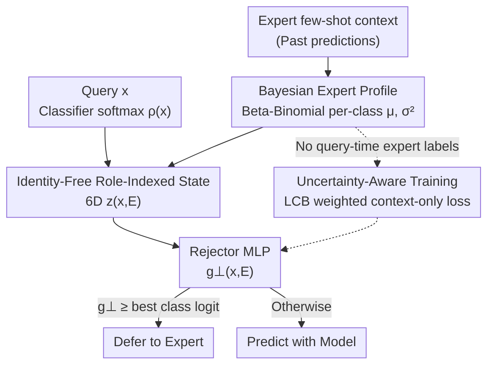

# Identity-Free Deferral For Unseen Experts

**Conference**: ICLR 2026  
**OpenReview**: [https://openreview.net/forum?id=4YG9ufFg58](https://openreview.net/forum?id=4YG9ufFg58)  
**Code**: None  
**Area**: Human-AI Collaboration / Learning to Defer  
**Keywords**: Learning to Defer, Human-AI Collaboration, Permutation Invariance, Bayesian Expert Profiling, OOD Generalization

## TL;DR
This paper points out that existing "Learning to Defer" (L2D) methods fail when facing unseen experts with out-of-distribution (OOD) capability profiles because they learn "identity shortcuts" by processing class-indexed signals in fixed coordinates. The authors propose Identity-Free Deferral (IFD), which structurally enforces permutation invariance using a "role-indexed" low-dimensional state and pairs it with an uncertainty-aware training objective that requires no query-time expert labels. IFD is significantly more stable for unseen and especially OOD experts on medical imaging and ImageNet-16H human annotations.

## Background & Motivation
**Background**: Learning to Defer (L2D) allows an AI system to learn not only "what to predict" but also "when to hand over the decision to a human expert." This involves training a classifier $h$ and a rejector $r$ simultaneously, where $r$ decides whether to use the model's prediction or defer to an expert, optimizing the overall accuracy of the "Human + AI" collaborative system end-to-end. This is highly attractive in high-risk scenarios such as healthcare.

**Limitations of Prior Work**: In real-world deployment, experts encountered during testing are often **unseen during training**—due to hospital shift changes, the growth of medical interns, or varying habits across different sites. SOTA methods like L2D-Pop (Tailor et al., 2024) use meta-learning to learn an expert representation from a small context of past predictions to condition the rejector. While this transfers well to **in-distribution (ID)** unseen experts, it fails when unseen experts are **OOD** (systemic shifts in capability profiles, such as the same expertise patterns but with different class indices, or different strengths across sites).

**Key Challenge**: The authors diagnose the root cause as an **architectural flaw**—"identity-conditioned deferral." L2D-Pop's high-capacity encoder processes class-indexed signals (per-class embeddings, one-hot vectors) in **fixed coordinates**, which effectively exposes class identities to the rejector. Consequently, it learns **shortcuts** like "defer if the 3rd dimension is strong." These shortcuts work well under training class indices but collapse as soon as classes are renamed or reordered (relabeled)—a common occurrence in OOD scenarios. The essence of the problem is that deferral decisions **should** be invariant to coherent relabeling (renaming a class should not change the decision to defer or predict), but existing architectures break this permutation symmetry.

**Goal**: Design a deferral architecture that structurally respects "coherent relabelling symmetry," ensuring the policy depends only on transferable **structural information** such as "who is better suited for this case," rather than memorizing absolute class identities, while also removing expensive query-time expert labels.

**Key Insight**: The authors first theoretically clarify the symmetry—the population Bayes optimal rejector is **invariant** to coherent relabeling (Prop. 3.1), while the standard L2D-Pop encoder does **not** satisfy this invariance under general parameters (Thm. 3.1), making it naturally vulnerable to expert-only relabeling (Cor. 3.1). Since the Bayes solution itself is invariant, this inductive bias should be directly integrated into the architecture.

**Core Idea**: Before the rejector sees any input, **strip away all absolute identity channels**—compress each expert's capability into a "role-indexed" low-dimensional state, retaining only structural quantities like "model confidence in its top class" and "estimated expert capability in that role," thus ensuring permutation invariance.

## Method
### Overall Architecture
IFD aims to ensure the "rejector recognizes structure, not identities." The overall pipeline is: given a few-shot context of an expert (past (input, truth, expert prediction) pairs), first use Beta–Binomial conjugacy to calculate an explicit Bayesian capability profile (mean $\mu^E_y$ + variance $(\sigma^E_y)^2$) for **each class** of that expert. Then, extract this profile and the classifier's softmax output on the current query into a 6-dimensional state vector $z(x,E)$ that is independent of absolute class IDs. A small MLP then maps $z$ to a deferral logit $g_\perp(x,E)$, which is compared with the model's best class logit to decide whether to defer or predict. Training uses an uncertainty-aware cross-entropy loss that depends only on context profiles and does not require query-time expert labels.

### Key Designs

**1. Bayesian Per-Class Accuracy Profiles: Compressing Experts into Transferable Structural Quantities with Uncertainty**

To address "OOD expert capability shift and high noise in few-shot context estimation," IFD does not learn an uninterpretable latent embedding. Instead, it builds an **explicit** capability posterior for each of the expert's classes. Using Beta–Binomial conjugacy: for class $y$, it counts the occurrences $n^E_y$ in the context and the number of correct predictions $t^E_y$. Given a prior $\theta^E_y \sim \mathrm{Beta}(\alpha_y,\beta_y)$, the posterior is $\theta^E_y \mid \mathcal{D}^E_C \sim \mathrm{Beta}(\alpha_y+t^E_y,\ \beta_y+n^E_y-t^E_y)$, yielding posterior mean $\mu^E_y$, variance $(\sigma^E_y)^2$, and the estimated best class $\hat k^E_{\text{best}}=\arg\max_y \mu^E_y$.

Crucially, it approximates $P(M^E=y\mid Y=y,E)$ (class-level accuracy) rather than instance-level $P(M^E=y\mid X=x,Y=y,E)$. In scenarios like medical imaging, the authors argue that expert differences mainly stem from **class-level expertise**. This abstraction provides three benefits: closed-form posteriors with uncertainty, states transferable across experts, and a natural interface for prior knowledge. Prop. 4.1 guarantees that as long as each class is observed enough times ($n \ge \frac{\ln(2K/\delta)}{2}\big(\frac{2}{\Delta_{\text{acc}}}\big)^2$), the estimated best class almost certainly converges to the true best class.

**2. Role-Indexed Identity-Free State: Hardwiring Permutation Invariance in Architecture**

This is the core of the paper, blocking "coordinate-recognition" shortcuts. The rejector **never sees absolute class IDs**. It only receives a small vector composed of: ① values read at "roles"—where roles are **indices selected by data rather than names** (here, the model's top class $k_{\text{top}}(x)$ and the expert's estimated best class $\hat k^E_{\text{best}}$); ② permutation-invariant aggregates (e.g., entropy, order-statistics gaps). The 6D state is instantiated as:

$$z(x,E) = \big(\underbrace{\rho_{k_{\text{top}}}(x),\ \rho_{\hat k^E_{\text{best}}}(x)}_{\text{Model confidence at roles}},\ \underbrace{\mu^E_{k_{\text{top}}},\ (\sigma^E_{k_{\text{top}}})^2}_{\text{Expert profile at model top}},\ \underbrace{\mu^E_{\hat k^E_{\text{best}}},\ (\sigma^E_{\hat k^E_{\text{best}}})^2}_{\text{Expert profile at expert top}}\big) \in \mathbb{R}^6$$

Why is this invariant? When a permutation $\pi$ reorders all class-indexed quantities **coherently**, the two roles move accordingly ($k_{\text{top}}$ moves to $\pi(k_{\text{top}})$). Thus, both the "values read at roles" and the "invariant aggregates" remain unchanged (Prop. 4.2), making $g_\perp$ invariant (Cor. 4.1). This perfectly matches the Bayes solution's invariance, eliminating the mismatch in standard encoders where weights are tied to a fixed coordinate $j$ while the expert's best class has shifted.

**3. Uncertainty-Aware Context-Only Training: Removing Query-Time Expert Labels and Suppressing Over-Deferral**

Standard L2D-Pop requires expert labels for every query during training, which is an expensive bottleneck. IFD builds deferral supervision entirely on profiles derived from the context: for a labeled query $(x,y)$ and sampled expert $E$, it **only** supervises deferral when the expert's estimated best class matches $y$, weighted by a lower confidence bound (LCB) $L^E_y=[\mu^E_y-\alpha\sigma^E_y]_+$:

$$\mathcal{L}^{\text{IFD}}_{\text{CE}}(x,y,E) = -\log p(y\mid x,\psi^{\text{IFD}}) - L^E_y\,\mathbb{I}\{\hat k^E_{\text{best}}=y\}\,\log p(\perp\mid x,\psi^{\text{IFD}})$$

where the identity-free state is directly used as the embedding $\psi^{\text{IFD}}(x,E)\equiv z(x,E)$. Two novelties: 1. Supervision comes entirely from context profiles, **completely eliminating the need for query-time expert labels** (saving significant costs, e.g., in Blood Cells where $N=11959$ but $N^E_C=120$); 2. LCB weighting **automatically lowers the supervision weight for uncertain profiles**, preventing over-deferral based on noisy estimations.

### Loss & Training
The objective is $\mathcal{L}^{\text{IFD}}_{\text{CE}}$ using a $(K+1)$-way softmax, averaged over sampled experts within each minibatch. At inference, the rejector calculates the deferral margin $\Delta_j(x)=g_\perp(x,E_j)-\max_k g_k(x)$ for each available expert $E_j$, selecting the expert with the largest margin (winner-takes-all routing). The budget curve is generated by scanning the threshold $\tau$. An optional prior interface (§4.4) allows expert self-assessment accuracy $a^E_y$ to be encoded into the Beta prior, which the posterior eventually overrides as context grows.

## Key Experimental Results

### Main Results
Three medical datasets (HAM10000 dermoscopy, Blood Cells microscopy, Liver tumours radiology) with realistic simulated experts, and ImageNet-16H with real human labels. Metrics are Area Under the Curve for budget scanning: **AURSAC** (System Accuracy, SAC) and **AURDAC** (Expert Accuracy on deferred samples, DAC). Variable Specialists (accuracy varies drastically across categories) represent the most challenging setting.

| Dataset | Expert Type / Distribution | IFD SAC | L2D-Pop(QC) SAC | L2D-Pop(QI) SAC | ΔSAC |
| :--- | :--- | :--- | :--- | :--- | :--- |
| HAM10000 | Variable / ID | **.80** | .78 | .78 | +.02 |
| HAM10000 | Variable / OOD | **.77** | .73 | .73 | +.04 |
| Blood Cells | Variable / ID | **.81** | .78 | .77 | +.03 |
| Blood Cells | Variable / OOD | **.80** | .74 | .74 | +.06 |
| ImageNet-16H | Noise 125 / OOD | **.66** | .61 | .63 | +.03 |

On Stable Specialists, all methods perform similarly; the gap emerges for Variable and especially OOD experts, where IFD leads in both SAC and DAC. The +.06 SAC gain on Blood Cells OOD is the most significant.

### Ablation Study
| Configuration / Dimension | Finding | Explanation |
| :--- | :--- | :--- |
| Annotation Cost | IFD uses only $\sum_E N^E_C$ context labels vs L2D-Pop's $E\times N$ query labels | Massive savings as $N \gg N^E_C$. |
| Input Distribution Shift | IFD outperforms baselines across all noise levels and ID/OOD experts | L2D-Pop re-encodes corrupted context images; IFD uses query-independent profiles. |
| LCB Uncertainty Weighting | Removing it leads to over-deferral | Verifies LCB's role in suppressing supervision from uncertain profiles. |
| Context Scale | IFD improves monotonically with context | Query-independent profiles have lower variance in small-context regimes. |

### Key Findings
- **Highest Gains in OOD + Variable Expert Scenarios**: This is exactly where "identity shortcuts" fail most frequently and architectural invariance is most valuable.
- **Robustness from Representation Design**: By avoiding the re-encoding of noisy input images into expert representations, IFD keeps routing stable.
- **Simulators Favor Competitors**: Since the expert simulators build instance-level accuracy (favoring query-conditioned L2D-Pop), the comparative results are **conservative** for IFD, making its victory more compelling.

## Highlights & Insights
- **Diagnosing "Failure Mode" as a Provable Architectural Property**: Rather than just empirically noting OOD drops, the authors use coherent relabeling symmetry to prove that standard encoders break invariance (Thm. 3.1) and link this to OOD fragility (Cor. 3.1).
- **"Role-Indexing" as a Transferable Trick**: Reading values based on data-selected roles rather than names is a generalizable technique for any task where decisions should be reordering-invariant but models learn coordinate-tied shortcuts.
- **Integrating Uncertainty into Supervision**: Using the LCB $[\mu-\alpha\sigma]_+$ as a weight for deferral supervision naturally incorporates confidence into training rather than relying on post-hoc calibration.
- **Removing Query-Time Labels**: Eliminating a major deployment bottleneck makes L2D much more practical for data-scarce medical fields.

## Limitations & Future Work
- **Class-Level Profiles Lose Instance-Level Variance**: While role-indexed class-level accuracy ensures efficiency and symmetry, it cannot capture an expert's fluctuating capability across samples of the same class.
- **Formal Invariance is Limited to Coherent Relabeling**: The proofs address consistent permutations. Real OOD shifts might involve partial remapping or incoherent shifts between expert and model posteriors, which remain open for study.
- **Future Directions**: The authors suggest complementary paths: architectural (permutation-equivariant encoders) and training-side (random label permutations within episodes or penalizing coordinate sensitivity).

## Related Work & Insights
- **vs L2D-Pop (Tailor et al., 2024)**: Both adapt to unseen experts using context. L2D-Pop learns high-capacity latent embeddings tied to fixed coordinates, making it vulnerable to OOD shifts. IFD uses explicit Bayesian profiles and role-indexed states to **provably** ensure invariance.
- **vs Multi-Expert L2D (Verma et al., 2023)**: This is a fixed-expert baseline. IFD generalizes this to adapt to *any* unseen expert by substituting the embedding slot with an identity-free state.
- **vs Standard Single-Expert L2D (Mozannar & Sontag, 2021)**: IFD reuses its consistent softmax surrogate form but removes the fixed-expert constraint and the reliance on absolute IDs.

## Rating
- Novelty: ⭐⭐⭐⭐⭐ Attributing L2D's OOD failure to provable non-invariance and fixing it via role-indexing is a clean and elegant solution.
- Experimental Thoroughness: ⭐⭐⭐⭐ Covers three medical sets and human labels across many dimensions; lacks only real-world multi-site clinical deployment.
- Writing Quality: ⭐⭐⭐⭐⭐ Tight link between theory (invariance proofs) and method (role-indexed states, LCB loss).
- Value: ⭐⭐⭐⭐ Addresses the real-world pain point of expert shift across sites/shifts with a deployment-friendly, label-efficient architecture.

<!-- RELATED:START -->

## Related Papers

- [\[ICLR 2026\] Prior-Free Tabular Test-Time Adaptation](prior-free_tabular_test-time_adaptation.md)
- [\[ICLR 2026\] Bayesian Influence Functions for Hessian-Free Data Attribution](bayesian_influence_functions_for_hessian-free_data_attribution.md)
- [\[ICLR 2026\] Articulation in Motion: Prior-Free Part Mobility Analysis for Articulated Objects](articulation_in_motion_prior-free_part_mobility_analysis_for_articulated_objects.md)
- [\[NeurIPS 2025\] Brain-Like Processing Pathways Form in Models With Heterogeneous Experts](../../NeurIPS2025/others/brain-like_processing_pathways_form_in_models_with_heterogeneous_experts.md)
- [\[AAAI 2026\] Cost-Free Neutrality for the River Method](../../AAAI2026/others/cost-free_neutrality_for_the_river_method.md)

<!-- RELATED:END -->
