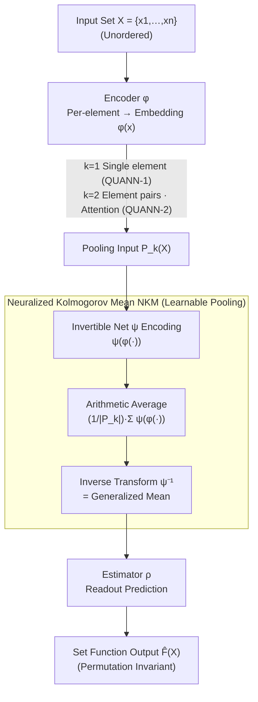

# Improving Set Function Approximation with Quasi-Arithmetic Neural Networks

**Conference**: ICLR 2026  
**arXiv**: [2602.04941](https://arxiv.org/abs/2602.04941)  
**Code**: None  
**Area**: Deep Learning Theory/Set Functions  
**Keywords**: Set Functions, Kolmogorov Mean, Invertible Networks, Learnable Pooling, Permutation Invariance

## TL;DR
The authors propose QUANN (Quasi-Arithmetic Neural Networks), which utilizes invertible neural networks to implement learnable Kolmogorov means as pooling operations. This represents the first machine learning realization of generalized central tendency measures. QUANN serves as a universal approximator for mean-decomposable set functions, and its learned embeddings exhibit significantly stronger transferability across tasks.

## Background & Motivation

**Background**: Learning set functions requires permutation invariance. DeepSets employs sum pooling, while PointNet uses max pooling—two fixed, non-trainable pooling operations that shift the approximation burden entirely onto the encoder and estimator.

**Limitations of Prior Work**: (1) Fixed pooling forces the encoder to learn embeddings that are simultaneously adapted to both the downstream task and the specific pooling operation, which limits embedding transferability; (2) Sum and max are extreme special cases of Kolmogorov means, leaving various intermediate forms (geometric, harmonic means, etc.) unexploited; (3) Existing learnable pooling methods are either overly complex to implement or have limited expressivity (e.g., Power DeepSets only learns a single exponent).

**Key Challenge**: There is a need for a learnable pooling operation that is theoretically grounded, simple to implement, and sufficiently expressive.

**Key Insight**: The Kolmogorov mean $M_f = f^{-1}(\frac{1}{n}\sum_i f(x_i))$ unifies various means through the selection of different invertible functions $f$. Implementing $f$ via an invertible neural network enables a learnable generalized central tendency.

## Method

### Overall Architecture
QUANN addresses the fundamental limitation in set function learning where pooling operations are "hard-coded" and non-trainable. It follows the "Encoder—Pooling—Readout" backbone of DeepSets but replaces the central pooling with a learnable component. The encoder $\phi$ first maps each set element to an embedding. An intermediate invertible neural network $\psi$ then aggregates these embeddings into a learnable Kolmogorov mean. Finally, the estimator $\rho$ produces a prediction from this aggregated representation. The overall formulation is:

$$\hat{F}(X) = \rho\Big(\psi^{-1}\big(\tfrac{1}{|P_k(X)|}\sum_{\pi} \psi(\phi(\pi))\big)\Big)$$

where $\phi$ is the encoder, $\psi$ is the invertible network acting as the generator function, and $\rho$ is the estimator. $P_k(X)$ denotes the combination of elements involved in pooling: $k=1$ processes single elements (QUANN-1), while $k=2$ incorporates element-pair interactions via attention (QUANN-2). The core design ensures that the intermediate layer is no longer a fixed sum or max, but a generalized mean whose shape is data-driven.

### Key Designs

**1. Neuralized Kolmogorov Mean (NKM): Transforming Pooling into Learnable Generalized Means**

While DeepSets and PointNet use fixed sum and max pooling respectively, NKM returns to the unified Kolmogorov mean form $M_\psi(X) = \psi^{-1}(\frac{1}{n}\sum_{i=1}^n \psi(x_i))$. The choice of generator function $\psi$ determines the mean: linear $\psi$ corresponds to the arithmetic mean, log $\psi$ to the geometric mean, and power $\psi$ to the power mean. QUANN learns $\psi$ directly using a RevNet. The invertibility of RevNet guarantees the existence of $\psi^{-1}$ (a prerequisite for the Kolmogorov mean), while its expressivity allows it to fit any intermediate state between sum and max.

**2. Universal Approximation Guarantees: Theoretical Soundness for Learnable Pooling**

QUANN provides two levels of theoretical guarantees. QUANN-1, which aggregates single-element information, is already a universal approximator for mean-decomposable set functions. QUANN-2, which incorporates pair-wise interactions, is even more powerful and can cover functions requiring high-order interactions. Under mild conditions, QUANN can also approximate max-decomposable functions, meaning its expressivity upper bound encompasses both DeepSets and PointNet.

**3. Embedding Decoupling: Invertible Pooling for Transferable Representations**

Fixed pooling forces encoders to "compensate" for the specific aggregation method, resulting in embeddings that are highly coupled with the pooling layer. Because $\psi$ is invertible, NKM does not lose the structural information of inputs (unlike max pooling, which discards non-maximal values). Consequently, the encoder can focus on learning general embeddings. Empirically, QUANN's encoder performs well when transferred to non-set tasks, demonstrating that its learned representations are no longer dependent on a specific aggregation logic.

### Loss & Training
- Standard supervised learning with end-to-end training.
- $\psi$ is implemented using a RevNet architecture to ensure invertibility.

## Key Experimental Results

### Main Results

| Method | Set Classification | Set Regression | Point Cloud Classification | Average |
|------|---------|---------|---------|------|
| DeepSets (sum) | Baseline | Baseline | Baseline | Baseline |
| PointNet (max) | Mid | Mid | Mid | Mid |
| HPDS (Power Mean) | Good | Good | Good | Good |
| **QUANN-1** | **Best** | **Best** | **Best** | **SOTA** |

### Ablation Study

| Configuration | Performance on Non-Set Tasks |
|------|-------------------|
| DeepSets Encoder | Poor (Coupled with sum pooling) |
| PointNet Encoder | Poor (Coupled with max pooling) |
| **QUANN Encoder** | **Good (Generalized embeddings)** |

### Key Findings
- The pooling form learned by NKM resides between sum and max, automatically adapting to the task.
- Invertible $\psi$ ensures no information loss, removing the need for the encoder to "compensate" for specific pooling.
- QUANN outperforms SOTA on all benchmarks, including tasks requiring high-order interactions.

## Highlights & Insights
- **Neuralization of Kolmogorov Mean**: This work elegantly combines a century-old mathematical concept (quasi-arithmetic mean) with modern deep learning. Using invertible networks for the generator function is both theoretically sound and practical.
- **Decoupling Encoder and Pooling**: Moving from fixed pooling (where encoders must adapt) to learnable pooling allows encoders to focus on learning high-quality embeddings while the pooling layer automatically adapts to those embeddings.
- **The Dual Value of Invertibility**: (1) It ensures the Kolmogorov mean is mathematically well-defined; (2) It preserves information throughout the aggregation process, unlike max pooling.

## Limitations & Future Work
- RevNet increases computational overhead (though invertibility avoids storing intermediate activations).
- The quadratic complexity of QUANN-2 with respect to element pairs limits its use for very large sets.
- Experiments were conducted on finite sets; the continuous case (function sets) is not yet considered.
- A thorough comparison with non-Janossy methods like Slot Attention is lacking.

## Rating
- Novelty: ⭐⭐⭐⭐⭐ The neuralization of the Kolmogorov mean is an elegant theoretical contribution.
- Experimental Thoroughness: ⭐⭐⭐⭐ Broad task coverage, transferability validation, and ablation studies.
- Writing Quality: ⭐⭐⭐⭐⭐ Clear theoretical framework with intuitive summary tables.
- Value: ⭐⭐⭐⭐ Provides a fundamental improvement for set function learning.

<!-- RELATED:START -->

## Related Papers

- [\[ICLR 2026\] On the Lipschitz Continuity of Set Aggregation Functions and Neural Networks for Sets](on_the_lipschitz_continuity_of_set_aggregation_functions_and_neural_networks_for.md)
- [\[ICLR 2026\] Learning Adaptive Distribution Alignment with Neural Characteristic Function for Graph Domain Adaptation](learning_adaptive_distribution_alignment_with_neural_characteristic_function_for.md)
- [\[ICLR 2026\] Learning on a Razor's Edge: Identifiability and Singularity of Polynomial Neural Networks](learning_on_a_razors_edge_identifiability_and_singularity_of_polynomial_neural_n.md)
- [\[ICML 2025\] Improving the Effective Receptive Field of Message-Passing Neural Networks](../../ICML2025/others/improving_the_effective_receptive_field_of_message-passing_neural_networks.md)
- [\[ICLR 2026\] Consistent Low-Rank Approximation](consistent_low-rank_approximation.md)

<!-- RELATED:END -->
