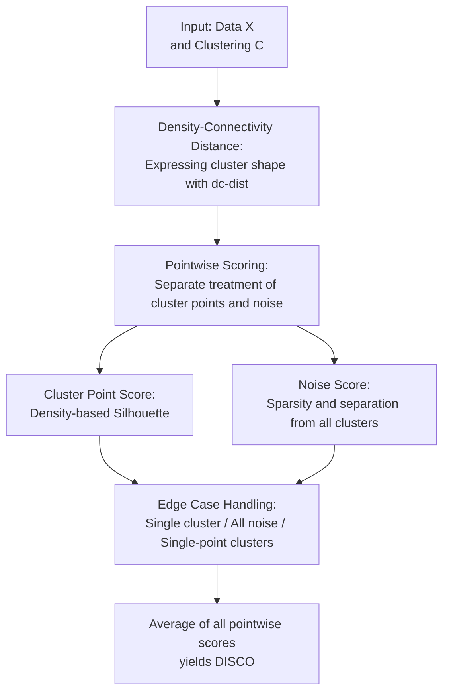

# Internal Evaluation of Density-Based Clusterings with Noise

**Conference**: ICLR2026  
**OpenReview**: [https://openreview.net/forum?id=izbBFuHtAX](https://openreview.net/forum?id=izbBFuHtAX)  
**Code**: https://github.com/pasiweber/DISCO  
**Area**: Cluster Evaluation / Data Mining / Others  
**Keywords**: density clustering, internal cluster validity index, noise labels, DISCO, density-connectivity  

## TL;DR

This paper proposes DISCO, an internal evaluation metric for density-based clustering results with noise. It uses density-connectivity instead of Euclidean compactness to evaluate clusters of arbitrary shapes and explicitly evaluates whether noise labels represent "true noise" or "points that should be in a cluster but were discarded."

## Background & Motivation

**Background**: In clustering tasks, ground truth labels are often unavailable. Therefore, researchers require Internal Cluster Validity Indices (CVIs) to compare different algorithms, hyperparameters, or different partitions generated by the same algorithm. Classical metrics like the Silhouette Coefficient, Davies-Bouldin, and Dunn index are usually designed around the framework of "intra-cluster compactness and inter-cluster separation," which is intuitive if the data naturally forms spherical or center-based clusters.

**Limitations of Prior Work**: The goal of density-based clustering is not to find spherical clumps but to identify clusters connected by high-density regions, where shapes can be curved or even ring-like. Methods like DBSCAN and HDBSCAN also label low-density points or points not belonging to any cluster as noise. The problem is that most CVIs either assume every point must belong to a cluster or are only suitable for clusters that are compact in the Euclidean sense. Even density-based metrics like DBCV handle noise simply by penalizing the total score based on the noise ratio, rather than judging whether the noise label itself is reasonable.

**Key Challenge**: The advantages of density-based clustering—"arbitrary cluster shapes" and "noise exclusion"—are often treated as anomalies by common evaluation metrics. A correctly identified ring-shaped cluster might receive a low Silhouette score due to Euclidean non-compactness; a clustering that correctly identifies significant background noise might be penalized by DBCV due to a high noise ratio. Consequently, such metrics may guide model selection in the wrong direction: favoring k-Means-like "chunked" results or results that force noise into clusters.

**Goal**: The authors aim to construct an internal metric that evaluates density-based clustering outputs without ground truth while satisfying four requirements: ability to identify arbitrary cluster shapes, ability to evaluate noise label quality, a bounded and comparable score range, and defined behavior for edge cases produced by DBSCAN/HDBSCAN.

**Key Insight**: Instead of reinventing a completely unfamiliar evaluation framework, the paper adapts the interpretable logic of Silhouette: comparing "the point's relationship with its own cluster" versus its "relationship with external clusters." Two key changes are made: first, distance is changed from Euclidean to density-connectivity distance, allowing the metric to perceive density paths rather than straight lines; second, noise points are modeled separately, requiring a "good" noise point to be both in a low-density region and not density-connected to any existing cluster.

**Core Idea**: Utilize a pointwise score based on density-connectivity to unify the evaluation of both cluster points and noise points, ensuring the CVI no longer just penalizes the quantity of noise but judges whether each noise label conforms to the semantics of density clustering.

## Method

### Overall Architecture

DISCO takes a set of data points $X$ and a candidate clustering result $C$ as input, where some points belong to clusters $C_i$ and others are labeled as noise $N$. It outputs an overall score in the range $[-1, 1]$, where higher scores indicate a better fit for density clustering semantics. The overall approach is to establish distances from a density-connectivity perspective and then calculate quality scores for each point: cluster points are evaluated on "intra-cluster density-connectivity compactness vs. nearest external cluster separation," while noise points are evaluated on "whether they are sparse enough" and "whether they are far enough from all clusters."

This process can be understood as migrating the pointwise comparison mechanism of Silhouette into the world of density clustering. While a standard Silhouette asks how close a point is to its own cluster versus the nearest other cluster on average, DISCO asks whether a point truly belongs more to its own cluster along density paths and whether noise-labeled points truly do not belong to any cluster.

Formally, DISCO defines a score $\rho(x)$ for each point and then averages them:

$$
\rho(X)=\operatorname{avg}_{x\in X}\rho(x).
$$

If $x$ is a cluster point, $\rho_{cluster}(x)$ is used; if $x$ is a noise point, $\rho_{noise}(x)$ is used. This point-level definition is not only convenient for the total score but also makes the evaluation more interpretable: low-scoring points can directly highlight cluster boundaries, incorrect noise labels, or unstable regions.

### Key Designs

**1. Density-Connectivity Distance: Understanding Arbitrary Shapes**

Standard CVIs are easily misled by ring, spiral, or curved manifold shapes because they measure compactness using Euclidean straight-line distances. DISCO's first step is to use density-connectivity distance, $d_{dc}(x,y)$. This distance does not ask how far apart two points are in a straight line, but rather identifies the maximum sparsity gap that must be crossed on the optimal density path from $x$ to $y$. If two points can be connected via high-density regions, $d_{dc}$ can be small even if the Euclidean distance is large; if there is a low-density gap between them, $d_{dc}$ will be large even if the Euclidean distance seems small.

Specifically, the paper defines the core-distance $\kappa(x)$ for each point as the Euclidean distance to its $\mu$-th nearest neighbor. A smaller $\kappa(x)$ indicates higher density. The mutual reachability distance between two points is $d_m(x,y)=\max(\kappa(x),\kappa(y),d_{eucl}(x,y))$. Following this, a Minimum Spanning Tree (MST) is found on the graph weighted by $d_m$, and $d_{dc}(x,y)$ is the minimum possible value of the maximum edge weight on the path connecting $x$ and $y$. This minimax path distance captures the "density-connectivity" intuition relied upon by DBSCAN/HDBSCAN.

**2. Cluster Point Score: Transforming Silhouette into Density Pointwise Comparison**

For points already assigned to a cluster $\hat C_x$, DISCO retains the core structure of Silhouette: if the average distance from point $x$ to its own cluster is smaller than the average distance to the nearest external cluster, it receives a high score. Conversely, if it is more connected to another cluster or its own cluster is not compact, the score is penalized. The difference is that all distances are replaced by $d_{dc}$, with the average distance written as $\tilde d_{dc}(x,C_i)=\operatorname{avg}_{y\in C_i} d_{dc}(x,y)$.

The cluster point score is:

$$
\rho_{cluster}(x)=\min_{C_i\neq \hat C_x}\frac{\tilde d_{dc}(x,C_i)-\tilde d_{dc}(x,\hat C_x)}{\max(\tilde d_{dc}(x,C_i),\tilde d_{dc}(x,\hat C_x))}.
$$

This definition addresses the issue that density clusters are not necessarily Euclidean compact. For example, in two concentric rings, points far apart on one ring would seem non-compact using Euclidean average distance; however, viewed along the ring-shaped high-density path, they belong to the same density-connected structure. DISCO thus gives reasonable scores to correct ring-shaped clusters without favoring k-Means results that split rings into sectors.

**3. Noise Score: Checking Sparsity and Non-connectivity Simultaneously**

The most critical contribution of this paper is evaluating noise labels as "first-class citizens." A point being labeled as noise should not naturally result in a penalty, nor should it be ignored; it is a "good" noise point only when two things are true: first, the region it occupies is indeed sparse and does not resemble a high-density area that could form a cluster; second, it is not density-connected to any existing cluster (otherwise, it is more like a boundary point or a missed label).

The first term is $\rho_{sparse}$, which compares the noise point's core-distance with the maximum core-distance of each cluster. For cluster $C$, $\kappa(C)=\max_{x\in C}\kappa(x)$ can be seen as the minimum threshold required to maintain density-connectivity in that cluster. If the $\kappa(x_n)$ of a noise point $x_n$ is larger than all clusters, it is in a sparser region. If its density level is comparable to a cluster, it should not be rewarded. The formula is:

$$
\rho_{sparse}(x_n)=\min_{C_i\in C}\frac{\kappa(x_n)-\kappa(C_i)}{\max(\kappa(x_n),\kappa(C_i))}.
$$

The second term is $\rho_{far}$, which compares the nearest $d_{dc}$ from the noise point to each cluster with that cluster's $\kappa(C_i)$. If the density-connectivity distance from $x_n$ to a cluster does not exceed the density threshold required to maintain internal connectivity for that cluster, it essentially acts as part of the cluster. Labeling it as noise should be penalized. The formula is:

$$
\rho_{far}(x_n)=\min_{C_i\in C}\frac{\min_{y\in C_i}d_{dc}(x_n,y)-\kappa(C_i)}{\max(\min_{y\in C_i}d_{dc}(x_n,y),\kappa(C_i))}.
$$

The final noise score is the minimum of both: $\rho_{noise}(x_n)=\min(\rho_{sparse}(x_n),\rho_{far}(x_n))$. This minimization is important because a noise point should not be rewarded if it violates either condition: a dense clump labeled as noise is bad, and a cluster interior or boundary point labeled as noise is also bad.

**4. Edge Case Handling: Consistent Definitions for Real Outputs**

Density clustering often produces outputs that traditional CVIs struggle to handle: all points as noise, a single cluster, single-point clusters, one cluster with some noise, or duplicate points resulting in a core-distance of 0. Many metrics either error out or lose mathematical meaning in these cases, while DISCO defines explicit rules. An "all-noise" clustering has no value, so all noise point scores are set to $-1$; a single-point cluster does not reflect "organizing similar points together," so its points are scored $0$; when there is only one cluster and no noise, the score is $0$, as there is no external separation to compare.

Interestingly, for "one cluster plus noise," DISCO uses the nearest noise point as a substitute for the nearest external cluster to evaluate cluster points: if the density-connectivity distance to the noise point is much larger than the intra-cluster distance, it indicates they are well-separated; otherwise, the cluster boundary may be unreliable. This design allows DISCO to cover common abnormal outputs caused by improper DBSCAN parameters.

### Loss & Training

DISCO is not a trained model and thus has no loss function or backpropagation. Its "computational strategy" consists of three parts: calculating core-distance and mutual reachability distance, constructing an MST to obtain $d_{dc}$, and calculating/averaging $\rho_{cluster}$ or $\rho_{noise}$ for each point.

The paper uses a default hyperparameter $\mu=5$, which corresponds to common minPts empirical settings in DBSCAN literature. The overall complexity is $O(n^2)$, with running time primarily growing with the number of samples rather than dimensions; experiments show it is in the same order of magnitude as density-related metrics like DBCV, DCSI, and CVNN, but significantly slower than center-based metrics like Silhouette.

## Key Experimental Results

### Main Results

The experiments investigate whether DISCO prefers density clustering semantics, handles noise labels correctly, is suitable for DBSCAN parameter selection, and its consistency with the external metric ARI.

| Scenario | Comparison Clustering | DISCO | Key Competitor Performance | Conclusion |
|------|----------|-------|------------------|------|
| 3-spiral | DBSCAN Ground Truth vs k-Means | 0.59 vs 0.00 | Silhouette: 0.00 vs 0.36 (prefers k-Means) | DISCO identifies spiral density clusters |
| complex9 | DBSCAN Ground Truth vs k-Means | 0.36 vs 0.02 | Silhouette: -0.01 vs 0.40 (prefers k-Means) | DISCO is not misled by center-based partitioning |
| cluto-t8-8k | Ground Truth vs Bad Noise Partition | 0.30 vs -0.07 | DBCV: -0.05 vs 0.17 (prefers bad partition) | Explicit noise evaluation is necessary |
| Two rings + background noise | Ground Truth vs Noise Merged into Cluster | 0.50 vs 0.19 | DBCV: 0.46 vs 0.63 (prefers less noise) | DISCO does not reward "under-labeling" noise |

| Dataset | Evaluation Goal | DISCO Results | Reference Results | Explanation |
|--------|----------|------------|----------|------|
| Synth high | Selecting DBSCAN $\epsilon$ via CVI | Optimal score at $k=10$ | Peak ARI at $k=10$ | DISCO is usable for parameter selection |
| Multiple benchmarks | Pearson Corr with ARI | complex8: 95.71; COIL20: 95.79; Optdigits: 91.07 | MMJ-SC/LCCV also strong; DBCV inconsistent/incalculable | DISCO is more stable across datasets |
| Real-world/UCI | HDBSCAN noise label quality | Noise points score higher than "cluster points forced as noise" | Spambase/Wine quality give negative noise scores | Detects HDBSCAN over-labeling noise |
| Runtime | Comparison with density CVIs | cluto-t8-8k: 3.982s; htru2: 37.191s | DBCV: 1.831s, 38.432s; LCCV/CVDD often slower | DISCO cost is acceptable but not the fastest |

### Ablation Study

The ablation study systematically changes data or labels to observe if DISCO components behave as expected.

| Configuration / Perturbation | Observed Metric | DISCO Behavior | Explanation |
|-------------|----------|------------|------|
| Increase ratio of misassigned cluster points | $\rho_{cluster}$ & Total Score | Smooth decline | Small errors don't collapse scores; good for fine-grained comparison |
| Increase distance between two spherical clusters | $\rho_{cluster}$ | Rapid increase after density separation | Captures the transition from connectivity to separation |
| Increase fuzziness of two-moons boundary | $\rho_{cluster}$ | Gradual decline from high score | Matches intuition on cluster boundary ambiguity |
| Make distant noise points increasingly dense | $\rho_{sparse}$ | Score drops as noise clump looks like a cluster | Prevents rewarding "missed dense clusters" as good noise |
| Move single noise point from cluster center outward | $\rho_{far}$ | Rapid increase after exiting cluster radius | Distinguishes mislabeled internal noise from true isolated noise |
| Change $\mu\in[1,30]$ or $[1,10]$ | Total DISCO | Stable on most datasets | Metric is not highly sensitive to core hyperparameter |

### Key Findings

- DISCO fills the gap in existing CVIs: it doesn't just "allow for noise," it evaluates noise label quality pointwise. This is evident in the two-rings-plus-background experiment, where DBCV prefers the incorrect version due to smaller noise ratio, while DISCO prefers the true version.
- Density-connectivity distance is crucial for evaluating arbitrary shapes. Euclidean distance would view rings and spirals as non-compact; using $d_{dc}$ focuses on the continuity of high-density paths.
- The non-determinism of DBCV is a valuable finding. Since the MST under mutual reachability distance is often not unique and DBCV removes MST leaves, the same clustering can yield different scores depending on point order. This affects reproducibility in hyperparameter selection.
- DISCO is more complete regarding edge cases. Many competing methods fail to compute for single-point clusters or all-noise outputs, whereas DISCO always returns a bounded score.

## Highlights & Insights

- The most elegant aspect of this paper is transforming "noise" from a byproduct that needs filtering into a label type that can be evaluated. In density clustering, correctly identifying noise is part of the task; DISCO finally acknowledges this.
- Pointwise scoring provides strong diagnostic power. The total score tells you which clustering is better, while point-level scores identify suspicious labels: low cluster scores suggest boundary errors, and low noise scores suggest missed cluster members.
- The $\rho_{noise}=\min(\rho_{sparse},\rho_{far})$ design is restrained. It doesn't simplify noise quality to just "far from clusters," as a dense clump far away shouldn't be noise; nor does it only look at "sparsity," as sparse points near boundaries may still be density-connected.
- The analysis of DBCV's non-determinism is independently valuable. Many papers assume CVIs are deterministic, but here it is shown that leaf removal makes DBCV sensitive to processing order.
- This approach is transferable to other unsupervised tasks with "rejection" or "background" classes. In any scenario where a model labels samples as unknown, outlier, or background, metrics should evaluate whether the rejection is consistent with local structures.

## Limitations & Future Work

- DISCO still requires choosing the hyperparameter $\mu$. Although $\mu=5$ is stable across most datasets, it may not be optimal for different data scales, local dimensions, or non-uniform sampling.
- The complexity is $O(n^2)$. While acceptable for medium-sized data, it becomes a bottleneck for million-scale data or scenarios requiring iterative tuning. Future work could consider approximate nearest neighbor graphs or sampled density-connectivity.
- The paper primarily discusses a "background noise" model. If noise itself has complex structures (e.g., multi-source anomalies or groups with high local density), the interpretations of $\rho_{sparse}$ and $\rho_{far}$ might need extension.
- For clustering on modern high-dimensional representations, the reliability of the distance itself is a prerequisite. DISCO evaluates density-connected structures better, but it will inherit biases if the feature space itself is distorted.

## Related Work & Insights

- **vs Silhouette Coefficient**: Silhouette uses average distance to own vs nearest other cluster for an intuitive, bounded score; DISCO inherits this framework but swaps Euclidean distance for density-connectivity and adds noise scoring.
- **vs DBCV**: DBCV is the closest classic target, handling arbitrary shapes and noise ratios; however, it doesn't evaluate noise quality pointwise, scales by non-noise ratio, and suffers from non-determinism. DISCO is pointwise, deterministic, and bounded.
- **vs DCSI / MMJ-SC / LCCV**: These methods evaluate arbitrary shapes using connectivity or min-max distances. DISCO differs by explicitly modeling noise and providing complete definitions for common anomalous outputs of real clustering algorithms.
- **vs CVNN / CVDD / CDbw**: These extend traditional CVIs using neighbors or density. Some are unbounded or lack clear semantics for noise labels. DISCO's insight is: rather than patching compactness-based metrics, clarify the two semantic cores of density clustering—density-connected clusters and non-connected low-density noise.

## Rating

- Novelty: ⭐⭐⭐⭐⭐ Explicit noise label quality evaluation is a key missing piece.
- Experimental Thoroughness: ⭐⭐⭐⭐⭐ Covers toy, benchmark, real data, parameter selection, and robustness.
- Writing Quality: ⭐⭐⭐⭐☆ Clear logic and rigorous definitions, though some tables are very dense.
- Value: ⭐⭐⭐⭐⭐ Directly beneficial for density-based algorithm comparison and hyperparameter tuning.

<!-- RELATED:START -->

## Related Papers

- [\[ICLR 2026\] Noise-Aware Generalization: Robustness to In-Domain Noise and Out-of-Domain Generalization](noise-aware_generalization_robustness_to_in-domain_noise_and_out-of-domain_gener.md)
- [\[CVPR 2026\] Neural Mixture Density Processes](../../CVPR2026/others/neural_mixture_density_processes.md)
- [\[ICLR 2026\] Regulating Internal Alignment Flows for Robust Learning Under Spurious Correlations](regulating_internal_alignment_flows_for_robust_learning_under_spurious_correlati.md)
- [\[ACL 2025\] Entropy-UID: A Method for Optimizing Information Density](../../ACL2025/others/entropy-uid_a_method_for_optimizing_information_density.md)
- [\[CVPR 2026\] FedSDR: Federated Graph Learning with Structural Noise Detection and Reconstruction](../../CVPR2026/others/fedsdr_federated_graph_learning_with_structural_noise_detection_and_reconstructi.md)

<!-- RELATED:END -->
