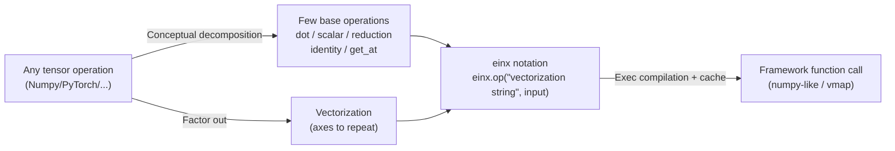

# It's All Just Vectorization: einx, a Universal Notation for Tensor Operations

**Conference**: ICLR 2026  
**OpenReview**: [https://openreview.net/forum?id=QqvQ3iAdpC](https://openreview.net/forum?id=QqvQ3iAdpC)  
**Code**: [https://github.com/fferflo/einx](https://github.com/fferflo/einx)  
**Area**: Tensor Programming / Scientific Computing Notation  
**Keywords**: Tensor operations, vectorization, einops, einsum, declarative notation, shape errors  

## TL;DR
This paper elevates "vectorization" to a unified meta-concept, pointing out that almost all Numpy-style tensor operations can be decomposed into "a few base operations + their respective vectorizations." Based on this, it designs a declarative, bracketed universal tensor notation called einx, analogous to loop notation, which compresses a vast and inconsistent array of tensor APIs into a small set of base operations.

## Background & Motivation

**Background**: Tensor operations are the cornerstone of modern deep learning and scientific computing. Mainstream frameworks (Numpy, PyTorch, TensorFlow, Jax, MLX) all adopt a Numpy-style "point-free" notation, such as `np.sum(x, axis=1)`, where operations act directly on the entire tensor. To alleviate the lack of indexing expressiveness in this notation, frameworks have introduced numerous patchy mechanisms: `axis` parameters, pure shape operations, broadcasting, advanced indexing, and countless function-specific rules.

**Limitations of Prior Work**: Numpy-style APIs are massive and mutually inconsistent, leading to code that is hard to read/write and frequent "shape errors." Existing alternatives like einsum and einops draw from Einstein summation convention, using index strings like `"a b -> a"` to express operations. Although popular, they **can only cover a few operations** (einsum only dot products; einops adds reduce/repeat/rearrange) and lack universality; furthermore, einops relies heavily on "ostensive" definitions without providing a clear explanation for `"a b -> a"`.

**Key Challenge**: Loop notation (explicitly addressing elements by indices) is naturally clear, universal, and interpretable, but it is verbose and does not reflect actual execution. Numpy-style notation is concise and calls optimized backends but sacrifices clarity and consistency. A bridge between the two is missing.

**Goal**: To find a "better paradigm"—one that retains the clarity and interpretability of loop notation while being as concise and declarative as Numpy/einsum, compatible with existing framework backends, and applicable to **any** tensor operation using a single set of rules.

**Core Idea**: **"Repurposing Vectorization"** — Vectorization is viewed as a "function that transforms tensor operations," which can either **lift** low-order operations into high-order ones or **decompose** existing high-order operations into "a few base operations + their respective vectorizations." Once the vectorization factor is isolated, diverse operations like matrix multiplication, various products, reduce, reshape, and gather are essentially different vectorizations of the same few base operations (dot / scalar / reduction / identity / get_at)—"It's all just vectorization."

## Method

### Overall Architecture
The design of einx consists of two steps: first, explaining vectorization thoroughly at the conceptual level (supporting both lift and decompose); second, defining a declarative notation that corresponds one-to-one with loop notation; finally, providing a Python implementation that compiles to function calls in existing frameworks. Operations are written as `output = einx.{base_op}("{vectorization}", input...)`: the function name specifies "which base operation to perform," and the string specifies "along which axes to vectorize."

### Key Designs

**1. Vectorization as a Unified Transformation: Connecting Lift and Decompose** — einx defines vectorization as "transforming an operation that handles a single data point into one that handles a batch of data points simultaneously." Looking forward, `sin` acts on a scalar; after vectorization, it is applied to each scalar along a certain axis. In loop notation, this is `for i: y[i] = sin(x[i])`. Vectorizing along multiple axes corresponds to multiple for-loops, considering only operations insensitive to loop order. Looking backward, many high-order operations can be decomposed into "base operation + vectorization": matrix multiplication is a vectorized dot product $z[i,j] = dot(x[i,:], y[:,j])$; outer/Hadamard/Kronecker/Khatri–Rao are all vectorized scalar multiplications with different vectorization patterns; `transpose`/`reshape` are vectorized identity mappings $identity(a)=a$; broadcasting is an identity mapping vectorized along axes that "only appear on the output side"; `gather/take/index_select` are vectorized `get_at` (retrieving a value from an n-dimensional value tensor given a coordinate vector of length n). This observation forms the foundation for the subsequent notation design.

**2. Declarative Bracket Notation Isomorphic to Loop Notation** — einx strings are constructed strictly by "translating loop notation": `->` separates inputs from outputs, commas separate multiple tensors, spaces separate axes of each tensor, and the colon `:` representing sub-tensors in loop notation is replaced by **new axis names within square brackets**. Axes inside brackets are "argument sub-tensor axes" where the base operation actually acts, while axes outside brackets are vectorized axes. For example, matrix multiplication is written as `einx.dot("a [b], [b] c -> a c", x, y)`—the brackets clearly indicate the dot product is performed only along `b`. This notation is **declarative** (specifying what the input/output looks like, leaving reshape/broadcast/transpose to the system), contrasting with imperative Numpy code: `einx.add("a d e, c b e -> a b c d e", x, y)` corresponds to a long sequence of `x[:,None,None] + np.transpose(...)[None,:,:,None]`. Since everything is explained by loop notation, the semantics of any operation can be "read out element-wise."

**3. Axis Composition: Flatten, Concatenate, and Generalized Ellipsis** — To cover operations like reshape and stack/concatenate/split, einx introduces axis composition: parentheses represent **flattened axes** (merging multiple axes in row-major order, e.g., `"a b c -> (a b) c"`); it also adds **concatenated axes** not found in einops, using `(b + c)` to represent concatenating multiple tensors along a new axis, thus unifying `np.{stack|concatenate}` as vectorized identity mappings. Furthermore, einx generalizes the ellipsis `...`: placed after an axis, it indicates the axis can be repeated variably (similar to variadic parameters in Java/C++/Swift), with the number of repetitions inferred from input dimensions. For example, `einx.add("b... i, b... j -> b... i j", x, y)` automatically expands to `b0 b1 ...` based on input rank. Combined with features like anonymous axes (specifying length with numbers), axis constraints (passing axis lengths as keywords), and implicit outputs (automatic inference), the notation is both compact and self-describing.

**4. Compilation to Framework Backends, Zero Runtime Overhead** — einx is not a new runtime but **compiles** each einx operation into function calls of the target framework. It uses Python's `exec` to generate an isolated code snippet, which is compiled and cached upon the first call; subsequent calls with the same signature reuse it directly. Aside from cache lookup, there is **no additional overhead compared to calling framework functions directly**. When combined with JIT like `jax.jit`, the footprint of einx disappears completely. The same einx expression can be compiled into different backend notations: `einx.sum("a ([b] c)", x, c=4)` can be compiled into a numpy-like version (`reshape` + `jnp.sum(axis=...)`) or a `jax.vmap`-based version (nested vmap). Using vmap, einx can also adapt **any custom Python function** into an einx operation (`einx.torch.adapt_with_vmap`), achieving true universality for any operation.

## Key Experimental Results

This is a notation/system design paper; it does not feature traditional accuracy benchmarks. Instead, "experiments" are presented as capability comparison tables and code case studies.

### Operational Coverage Comparison (Summary of Tab. 2)
P=Permutation, F=Flattening, R=Repeating (output-only vectorization), C=Concatenation.

| Notation | Identity | Scalar | Reduction | Dot-product | Indexing | Any other |
|------|----------|--------|-----------|-------------|----------|-----------|
| **einx (Ours)** | PFRC | PFR | PFR | PFR | PFR | PFR |
| einsum (2011) | P | P(mul only) | P(sum only) | P | — | — |
| einops reduce/repeat/rearrange/einsum | PFR | P(mul only) | PF | P | — | — |
| einops pack/unpack | (FC)* | — | — | — | — | — |
| eindex (2023) | — | — | — | — | (P)** | — |

einx achieves full coverage (PFRC/PFR) across all operation categories and vectorization types, while einsum/einops/eindex each support only a limited subset.

### Case Study: Multi-Head Attention (MHA)

| Implementation | Key Observations |
|----------|----------|
| **einx** | Requires only 3 lines: `einx.dot` for QK, `einx.softmax` for normalization, and `einx.dot` for weighted V. Brackets self-describe summation over `c` and `k`; softmax self-describes application over axis `k`. |
| einsum+einops+Numpy | Requires multiple additional `einops.rearrange` calls to split heads (einsum lacks axis composition). Element-wise operations like softmax/mask are not supported by einops, forcing a fallback to Numpy's positional `axis`/`newaxis`, which obscures semantics. |

## Key Findings
- **Eliminating "Silent Failures"**: einsum packs multiple operations into one entry point; a typo like `"ij,ik->ik"` can silently change a dot product into a reduction. Because einx uses independent entry points for each base operation and checks bracket consistency, it **reports errors loudly** (e.g., `einx.dot("i [j], [i] k -> i k")` fails due to inconsistent brackets).
- **Readability**: In `einsum("b q k h, b k h c -> b q h c")`, it is unclear which axis is being summed. In einx, `einx.dot("b q [k] h, b [k] h c -> b q h c")` uses brackets to immediately highlight that the sum occurs over `k`.
- **Flexible Shapes**: When changing indexing or output shapes, einx only requires updating the vectorization string while the entry point remains same. In Numpy, one often has to switch to an entirely different entry point (e.g., `index_select` to `take_along_dim`), or no single entry point can express the change.
- **API Compression**: Tab. 1 demonstrates how a vast array of seemingly different Numpy/PyTorch calls (`take`/`gather`/`index_select`/`gather_nd`, `outer`/`kron`/`khatri_rao`, `matmul`/`dot`/`tensordot`/`inner`, `transpose`/`squeeze`/`broadcast_to`/`reshape`, `concatenate`/`stack`/`meshgrid`, etc.) collapse into a few einx entry points like `get_at`, `multiply`, `dot`, and `id`. They are distinguished only by the vectorization string, intuitively confirming that "it's all just vectorization."

## Highlights & Insights
- **Conceptual Elevation**: The paper's greatest contribution is not just another library, but the elevation of "vectorization" from a narrow SIMD compiler concept to a "universal function for transforming tensor operations," using it to unify the entire Numpy ecosystem—an insight with high intellectual density.
- **Bracket Distinction**: Using brackets to distinguish vectorized axes from sub-tensor axes is the key notation innovation compared to einsum/einops. Explicitly writing "which axes the operation acts upon" into the string is both self-describing and allows for compile-time consistency checks.
- **Declarative + Compiled + Zero Overhead**: Generating isolated code via `exec` that can be inspected by the user and falling back to either numpy-like or vmap backends balances readability and execution efficiency. It is a very pragmatic engineering approach.
- **Complementarity with Named Tensors**: einx operates on positional tensors and integrates seamlessly with the existing Python ecosystem, and it can be used on top of symbolic axis names (named tensors).

## Limitations & Future Work
- **Restricted to Order-Insensitive Operations**: The paper explicitly considers only operations where the loop order and the index order within each loop do not change the result. The boundaries of expressiveness for order-dependent operations (e.g., scans or recursive operations) are not fully discussed.
- **Learning Curve and Ecosystem Inertia**: While more universal, the new syntax (brackets, generalized ellipsis, concatenated axes) presents a new mental model compared to the widely accepted einops, creating friction for migration and adoption.
- **Backend Dependence for Performance**: "Zero overhead" relies on compiling to native framework calls. In scenarios where the einx decomposition differs from the framework's optimized kernels (e.g., highly optimized fused operators), it is unclear if the generated code always matches the best hand-written implementation. End-to-end benchmarks for large-scale workloads are limited.
- **Backend Limitations**: If the target framework lacks an efficient implementation for a base operation, einx must fall back to vmap or loop-like expansion, potentially resulting in lower performance than specialized operators.

## Related Work & Insights
- **ein\* Notation Lineage**: From Einstein summation convention to einsum (Wiebe 2011), einops (Rogozhnikov 2022), and various incompatible variants (einindex, pack/unpack, eindex, eingather, einmesh). einx points out that these "ein\*" tools do not truly use Einstein notation but merely borrow the index string style; thus, it calls itself einx without claiming to be "Einstein-inspired."
- **Named Tensors** (xarray, torchdim, Named Tensor Notation, Haliax, etc.): These use symbolic axis names for implicit vectorization, which is complementary to einx's positional notation.
- **Other Pointful Languages** (Tensor Comprehensions, Dex/Paszke 2021, etc.): These define their own base operations and composition notations but have limited integration with existing frameworks and insufficient vectorization support for "operations not defined within the notation"—a problem einx solves by adapting arbitrary functions via `vmap`.
- **Insight**: When a domain's API bloats and rules become inconsistent, there is often an overlooked "meta-operation" (here, vectorization). Explicitly factoring it out can dramatically reduce complexity—a strategy applicable to designing other DSLs or operator libraries.
- **Significance for DL Practice**: Operators like attention, MoE, and convolution reshapes, which involve heavy splitting/merging/broadcasting/summation, are shorter and self-describing in einx. This can significantly reduce "shape errors," one of the most common silent bugs in deep learning engineering.

## Rating
- **Novelty**: ⭐⭐⭐⭐⭐ Elevating vectorization to a unified meta-concept and designing a provably universal declarative notation is a fresh and self-consistent perspective that goes beyond being "just another einops variant."
- **Experimental Thoroughness**: ⭐⭐⭐ As a notation/systems paper, it focuses on capability tables, case studies, and overhead analysis, but lacks quantitative end-to-end benchmarks for large-scale real-world workloads.
- **Writing Quality**: ⭐⭐⭐⭐⭐ The arguments build logically (starting with lift/decompose to introduce the notation), with rich examples and clear comparisons. The "It's all just vectorization" narrative is highly persuasive.
- **Value**: ⭐⭐⭐⭐ Provides both a functional open-source tool and a superior mental model for thinking about tensor programming. It effectively improves readability and correctness, though long-term impact depends on community adoption.

<!-- RELATED:START -->

## Related Papers

- [\[ICLR 2026\] AnyUp: Universal Feature Upsampling](anyup_universal_feature_upsampling.md)
- [\[ICLR 2026\] Exposing Mixture and Annotating Confusion for Active Universal Test-Time Adaptation](exposing_mixture_and_annotating_confusion_for_active_universal_test-time_adaptat.md)
- [\[AAAI 2026\] OR-R1: Automating Modeling and Solving of Operations Research Optimization Problems](../../AAAI2026/others/or-r1_automating_modeling_and_solving_of_operations_research_optimization_proble.md)
- [\[CVPR 2026\] Clair Obscur: an Illumination-Aware Method for Real-World Image Vectorization](../../CVPR2026/others/clair_obscur_an_illumination-aware_method_for_real-world_image_vectorization.md)
- [\[CVPR 2026\] What Is the Optimal Ranking Score Between Precision and Recall? We Can Always Find It and It Is Rarely F₁](../../CVPR2026/others/what_is_the_optimal_ranking_score_between_precision_and_recall_we_can_always_fin.md)

<!-- RELATED:END -->
