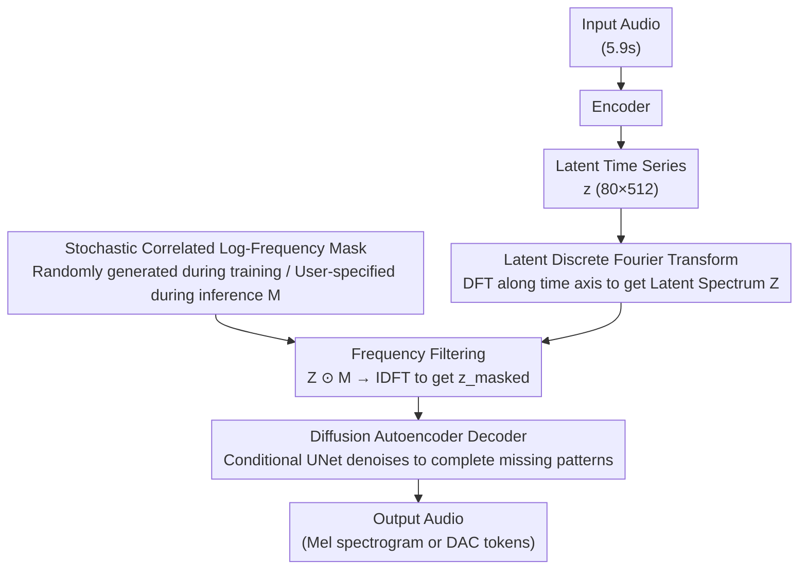

# Latent Fourier Transform

**Conference**: ICLR 2026 Oral  
**OpenReview**: [https://openreview.net/forum?id=ogMxCjdCCq](https://openreview.net/forum?id=ogMxCjdCCq)  
**Code**: Available  
**Area**: Others  
**Keywords**: diffusion autoencoder, Fourier transform, music generation, latent frequency, timescale control, controllable generation

## TL;DR
The LatentFT framework is proposed to apply Discrete Fourier Transform (DFT) on the latent time-series representation of a diffusion autoencoder to separate musical patterns by timescale. During training, a stochastic correlated log-frequency mask is used to enable the decoder to reconstruct from partial spectra. During inference, users selectively retain or mix musical elements at different timescales by specifying frequency masks. LatentFT significantly outperforms baselines like ILVR, Guidance, Codec Filtering, and RAVE in conditional generation and music fusion tasks, with a listening test of 29 musicians confirming its superior audio quality and fusion capabilities.

## Background & Motivation
**Background**: Music generation models (e.g., diffusion-based autoencoders, language models) can generate high-quality music but lack fine-grained control over musical structures across different timescales. Music contains multi-scale structures—chord progressions ($\sim 0.5$ Hz), melody lines ($\sim 2$-$5$ Hz), and rhythmic patterns ($\sim 8$ Hz)—which vary at different rates along the time axis.

**Limitations of Prior Work**: Existing control methods (text prompts, style transfer, guidance) only provide global adjustments and cannot independently manipulate multi-scale requirements, such as "keeping the chords of this song but replacing the rhythm." In deep multi-scale representations (e.g., different layers of a UNet), coarse and fine-grained information are entangled, making independent control difficult.

**Key Challenge**: Music generation requires decoupled control across timescales, yet there is currently no natural, continuous, and interpretable control axis to achieve this.

**Goal**: To provide a new control axis based on the latent frequency domain, allowing users to tune musical structures as they would adjust timbre with an equalizer.

**Key Insight**: Leverage the natural "decomposition by frequency" property of the Fourier Transform—where different frequency components are orthogonal and independent modifications do not interfere—and apply it to learned latent time series.

**Core Idea**: Perform DFT in the latent space and use frequency masks to control music generation—serving as an "equalizer for musical structure."

## Method

### Overall Architecture
LatentFT aims to provide a control axis similar to an equalizer knob for music generation: users can independently retain or replace musical elements at specific timescales—chords, melodies, or rhythms. The entire framework revolves around performing this control in the latent frequency domain. In the workflow, an encoder first compresses an audio clip into a latent time series $\mathbf{z} \in \mathbb{R}^{C \times T'}$ ($C=80$ channels, $T'=512$ frames, corresponding to 5.9 seconds of audio). A latent DFT layer performs DFT along the time axis to transform $\mathbf{z}$ into the frequency domain, multiplied by a frequency mask $\mathbf{M}$ to retain target bands. Finally, a diffusion decoder "re-imagines" the full audio from the masked latent spectrum $\mathbf{z}_{\text{masked}} = \text{IDFT}(\text{DFT}(\mathbf{z}) \odot \mathbf{M})$. These three components are trained end-to-end.

### Key Designs

**1. Latent Discrete Fourier Transform: Building the control axis in the frequency domain, leveraging orthogonality to ensure band-wise independence.**

Manipulating musical structures directly in the time domain or across different UNet layers faces the long-standing issue of entangled coarse and fine-grained information. LatentFT instead applies DFT along the time axis of the latent time series $\mathbf{z}$ output by the encoder, obtaining the latent spectrum $\mathbf{Z} = \text{DFT}(\mathbf{z})$. With a latent frame rate $f_r \approx 86$ Hz, the latent Nyquist frequency is approximately 43 Hz. Frequency bins $k$ map to latent frequencies $f_k = k \cdot f_r / T'$, and a zero-padding factor $L=2$ is used to increase frequency resolution to 1024 bins. The key to using DFT over bandpass filters is orthogonality—different frequency components are orthogonal, so modifying one does not leak into others. In the paper's experiments, bandpass alternatives led to unstable training, while DFT masking is equivalent to an ideal bandpass with periodic padding, leaving no edge artifacts.

**2. Stochastic Correlated Log-Frequency Mask Training: Ensuring the decoder can generate based on user-specified masks by exposing it to various band combinations during training.**

If the decoder is only trained on full spectra, it will fail during inference when presented with a latent spectrum containing only partial bands. Thus, during training, a random 0-1 mask $\mathbf{M}$ is applied to the latent spectrum, forcing the decoder to learn to reconstruct full audio from any subset of frequency bands. The mask is not purely random speckle but is generated through correlation and log-scaling: a correlation matrix $\mathbf{K} \in \mathbb{R}^{F \times F}$ is computed based on log-scale distances between frequency bins, which weights independent random scores into correlated scores before thresholding into a binary mask. Correlation ensures that masked/retained bins appear in contiguous blocks, forming continuous frequency "groups" rather than speckles, which better aligns with musical semantics like "retaining the chord band." Log-scaling ensures higher frequency groups are wider, matching the energy distribution of musical signals (similar to the $1/f$ spectrum where each octave has equal energy). Ablations show that removing correlation or log-scaling degrades FAD in both conditional generation and fusion.

**3. Diffusion Autoencoder Decoder: Utilizing generative power to inpaint musical patterns removed by the mask.**

When the mask removes certain frequency bands, information is truly missing, and the decoder must "imagine" plausible missing content—a task at which diffusion models excel. The decoder is a conditional UNet using $\mathbf{z}_{\text{masked}}$ as a condition, following the standard DDPM denoising process to generate mel spectrograms (or DAC tokens). Training uses the standard diffusion loss:

$$\mathcal{L} = \mathbb{E}_{\epsilon, t}\big[\|\epsilon - \epsilon_\theta(\mathbf{x}_t, t, \mathbf{z}_{\text{masked}})\|^2\big].$$

The inherent stochasticity of the sampling process also allows for the generation of multiple distinct variations from the same set of masks.

### A Complete Example: Fusing two songs into a new one.
Taking music fusion as an example: a user wants "the chord progression of Song A + the rhythmic pattern of Song B." First, both songs are encoded into latent time series and transformed via latent DFT. Chord progressions typically fall in the low frequencies ($\sim 0.5$ Hz), so the low-frequency band is retained from Song A's latent spectrum. Rhythms/drums fall in the high frequencies ($\sim 8$ Hz), so high-frequency bands are retained from Song B. Melodies in the mid-frequencies ($\sim 2$-$5$ Hz) are assigned to either source as needed. These non-overlapping bands are merged into a new latent spectrum and fed into the diffusion decoder for denoising, generating a new song with A's chords and B's rhythm. Conditional generation is a special case of this process—retaining the target band of a single reference while discarding the rest, allowing the decoder to generate variations based on the preserved patterns. The paper also identifies failure modes: fusion fails when the two references use overlapping or adjacent frequency bands for conflicting musical roles.

## Key Experimental Results

### Main Results: Conditional Generation

| Method | Loudness ↑ | Rhythm ↑ | Timbre ↓ | Harmony ↓ | FAD ↓ |
|------|-----------|----------|----------|-----------|-------|
| LatentFT-UNet | **0.834** | **0.966** | **0.391** | **0.079** | **0.348** |
| LatentFT-MLP | 0.815 | 0.963 | 0.376 | 0.079 | 0.337 |
| ILVR | 0.540 | 0.881 | 1.183 | 0.116 | 1.478 |
| Guidance | 0.459 | 0.876 | 1.419 | 0.133 | 2.084 |
| Codec Filtering | 0.712 | 0.926 | 0.857 | 0.108 | 2.523 |
| RAVE | -0.016 | 0.718 | 3.836 | 0.180 | 4.695 |

### Ablation Study

| Configuration | FAD (Cond.) | FAD (Fusion) | Description |
|------|----------|----------|------|
| LatentFT-MLP Full | 0.337 | 1.387 | Baseline |
| w/o Mask Training | Poor | Poor | Decoder cannot reconstruct from masked input |
| w/o Log-scale | Higher FAD | Higher FAD | Bandwidths do not match $1/f$ distribution |
| w/o Correlated Mask | Higher FAD | Higher FAD | Speckle masks do not correspond to musical semantics |
| w/ Bandpass Alt. | 1.511 | 2.58 | Unstable training, significantly worse FAD |
| LatentFT-DAC | 0.915 | 1.364 | Generalizable to different frontends |

### Key Findings
- **Different musical attributes correspond to specific latent frequency ranges**: Chord progressions $\sim 0.5$ Hz (Low), melodies $\sim 2$-$5$ Hz (Mid), and rhythm/drums $\sim 8$ Hz (High). This mapping is song-dependent with slight variations.
- **Listening Test with 29 Musicians**: Kruskal-Wallis H + Wilcoxon signed-rank tests show LatentFT is statistically significantly superior to all baselines in audio quality and fusion capability.
- **Generalization**: Successfully generalized to 30-second clips (via fine-tuning), capturing phrase transitions at $0.05$ Hz (20s period).
- **Dataset Generalization**: Validated on Maestro (piano) and GTZAN (10 genres) datasets.

## Highlights & Insights
- **Novel Control Axis**: Latent frequency is an unprecedented control dimension in music generation—orthogonal, continuous, and interpretable.
- **Practical Value of DFT Orthogonality**: Modifying one frequency band does not affect others, proving much more stable than time-domain methods like bandpass filters (evidenced by stability experiments).
- **Structural Analogy to Equalizers**: While traditional equalizers manipulate the audio spectrum to change timbre, LatentFT manipulates the latent spectrum to change musical structure—an elegant conceptual leap.
- **Transparency in Failure Modes**: The authors honestly define the boundaries of the method by showing fusion failures when reference bands overlap or are too close.

## Limitations & Future Work
- Primarily trained on 5.9s segments; 30s requires fine-tuning, and longer durations (3 min+) are currently infeasible.
- The mapping between latent frequencies and musical attributes is song-dependent and lacks cross-song consistency.
- DAC encoder performance is slightly lower than the mel-encoder, possibly due to smaller training batch sizes.
- Not yet compared with text-conditioned music models (e.g., MusicLM) in compositional control scenarios.

## Related Work & Insights
- **vs. ILVR/Guidance**: These methods use DFT masks on mel-spectrograms to guide diffusion denoising without dedicated latent space or mask training, resulting in significantly worse performance than LatentFT.
- **vs. RAVE**: RAVE's latent space is unsuitable for frequency-domain manipulation (direct masking leads to low audio quality), suggesting that not all latent spaces support DFT control.
- **vs. AudioMAE**: AudioMAE performs patch mask reconstruction on time-frequency spectrograms, while LatentFT performs frequency mask reconstruction on the latent spectrum; they share a similar direction but different objectives.

## Rating
- **Novelty**: ⭐⭐⭐⭐⭐ Latent Fourier domain control is a brand-new concept; the "equalizer for musical structure" analogy is elegant.
- **Experimental Thoroughness**: ⭐⭐⭐⭐⭐ 3 datasets + musician listening tests (statistically significant) + extensive ablations + alternative encoders + failure mode analysis + 30s generalization.
- **Writing Quality**: ⭐⭐⭐⭐ Conceptual explanations are intuitive and clear, though reviewers noted some inconsistency in terminology (timescale vs. latent frequency).
- **Value**: ⭐⭐⭐⭐⭐ Provides a brand-new, interpretable control paradigm for music generation, opening a new research direction.

<!-- RELATED:START -->

## Related Papers

- [\[NeurIPS 2025\] Deep Legendre Transform](../../NeurIPS2025/others/deep_legendre_transform.md)
- [\[ICLR 2026\] LPWM: Latent Particle World Models for Object-Centric Stochastic Dynamics](latent_particle_world_models_self-supervised_object-centric_stochastic_dynamics_.md)
- [\[CVPR 2025\] Integral Fast Fourier Color Constancy](../../CVPR2025/others/integral_fast_fourier_color_constancy.md)
- [\[ICLR 2026\] Out of the Shadows: Exploring a Latent Space for Neural Network Verification](out_of_the_shadows_exploring_a_latent_space_for_neural_network_verification.md)
- [\[AAAI 2026\] Formal Abductive Latent Explanations for Prototype-Based Networks](../../AAAI2026/others/formal_abductive_latent_explanations_for_prototype-based_networks.md)

<!-- RELATED:END -->
