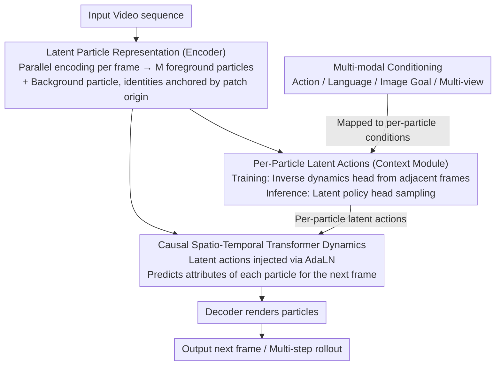

# LPWM: Latent Particle World Models for Object-Centric Stochastic Dynamics

**Conference**: ICLR 2026 Oral  
**arXiv**: [2603.04553](https://arxiv.org/abs/2603.04553)  
**Code**: [Project Page](https://taldatech.github.io/lpwm-web)  
**Area**: World Models / Object-Centric Representation / Video Prediction  
**Keywords**: Object-Centric, Latent Particles, Self-Supervised, World Model, Stochastic Dynamics, Latent Actions

## TL;DR
LPWM is the first self-supervised object-centric world model capable of scaling to real-world multi-object datasets. The core innovation is learning independent latent action distributions for each particle (per-particle latent actions). By utilizing a causal spatio-temporal Transformer to encode all frames in parallel, it supports diverse conditional generation (actions, language, image goals, multi-view). It achieves SOTA in video prediction and demonstrates imitation learning capabilities (89% success rate on OGBench task3).

## Background & Motivation
**Background**: Object-centric world models decompose scenes into independent object representations (slots/patches/particles), making them naturally suited for understanding multi-object interactions. The DLP (Deep Latent Particles) framework represents objects using keypoints with expanded attributes (position, scale, depth, transparency, visual features).

**Limitations of Prior Work**:
   - **Slot-based methods** (e.g., SlotFormer): Suffer from inconsistent decomposition, blurry predictions, difficult convergence, and require two-stage training.
   - **Patch-based methods** (e.g., G-SWM): Depend on post-processing matching across frames, failing to scale to complex data.
   - **DDLP** (Current SOTA particle-based method): Relies on explicit particle tracking and sequential encoding, preventing parallelization and lacking support for stochasticity.
   - All object-centric methods are **limited to simple simulation environments** and cannot handle real-world multi-object videos.

**Key Challenge**: While object-centric representations offer advantages (interpretability, compositional generalization, sparse interaction modeling), the key bottleneck in scaling to complex real-world scenes is handling independent stochastic motions of multiple objects. Global latent actions fail to capture independent behaviors such as "Object A moves left while Object B remains stationary."

**Core Idea**: Learn independent latent action distributions $z_c^m$ for each latent particle. During training, these are inferred from frame pairs using inverse dynamics; during inference, they are sampled from a learned latent policy. These actions condition a causal spatio-temporal Transformer via AdaLN.

## Method

### Overall Architecture
LPWM addresses the scalability of object-centric world models to real-world multi-object videos by modeling independent stochastic motion for each object. Trained end-to-end as a Variational Autoencoder (VAE) driven solely by video, the model consists of four modules: Encoder, Decoder, Context Module, and Dynamics Module. The encoder extracts $M$ foreground particles (each with attribute vector $z_{fg}^m = [z_p, z_s, z_d, z_t, z_f]$ covering 2D position, scale, depth, transparency, and visual features) plus one background particle in parallel for each frame. The context module then samples a latent action $z_c^m$ for each particle, characterizing its intended movement. The dynamics module takes the current particles and their corresponding latent actions to predict the attributes of each particle in the next frame, with latent actions injected via AdaLN. Finally, the decoder renders the predicted particles into the next image, providing a reconstruction loss. Multi-modal conditions (actions, language, image goals, multi-view) are unified and injected via the context module, mapped to per-particle latent actions. Since particle identity is anchored by patch origins rather than tracking, all frames can be encoded in parallel.

### Key Designs

**1. Latent Particle Representation: Anchoring identity via patch origin, eliminating explicit tracking**

The scalability bottleneck of particle-based predecessors like DDLP lies in explicit tracking—sequentially tracking the trajectories of a few particles. Tracking failures accumulate errors over time, and sequential dependency prevents parallelization. LPWM independently encodes $M$ foreground particles per frame, where particle identity is directly determined by its patch origin. Thus, particles from the same origin naturally correspond across frames without cross-frame matching or trajectory tracking. This allows parallel encoding of all frames. The representation sits between patch-based and object-centric approaches; particles move within a range around their origin to fit object motion, preserving compositionality while avoiding the rigidity of patch representations.

**2. Per-Particle Latent Actions (Context Module): Individual stochasticity for each object**

In real-world scenes, object motions are independent. LPWM learns a separate latent action distribution for each particle $m$. The Context Module is a causal spatio-temporal Transformer with two complementary heads. During training, the **inverse dynamics head** infers particles' latent actions $q(z_c^m \mid o_t, o_{t+1})$ from actual transitions. During inference, the **latent policy head** $\pi(z_c^m \mid o_{\leq t})$ predicts the distribution from historical frames and samples from it to enable stochastic prediction. Both are aligned via KL divergence: the latent policy acts as a prior to regularize the inverse dynamics using $D_{KL}\big(q(z_c^m \mid o_t, o_{t+1}) \,\|\, \pi(z_c^m \mid o_{\leq t})\big)$. Ablation studies prove that per-particle actions are crucial for capturing independent motion patterns compared to global latent actions used in Genie or CADDY.

**3. Causal Spatio-Temporal Transformer Dynamics: Injecting latent actions via AdaLN**

The backbone for predicting particle attribute changes is a Transformer managing both time and space. Causal attention ensures that each particle only observes historical frames, while spatial attention allows interaction between particles within the same frame (modeling collisions and occlusions). Latent actions $z_c^m$ are injected via Adaptive Layer Normalization (AdaLN), modulating the normalization parameters of each Transformer layer. Ablations show that AdaLN-based conditioning is more effective than additive positional embeddings for transmitting conditional signals.

**4. Multi-modal Conditioning: A unified interface for Action / Language / Image Goal / Multi-view**

LPWM treats external conditions as inputs to the Transformer's conditioning channel. External action signals, encoded text (language), target frames (image goals), or multi-view particles are all mapped into the latent action space. This unified interface allows seamless transfer from video pre-training to robot control without redesigning modules for different conditions.

### Loss & Training
- End-to-end self-supervised training on videos by maximizing the temporal ELBO, which involves minimizing the sum of reconstruction error and KL divergence. This is split into $\mathcal{L}_{static}$ for the first frame (per-particle KL and transparency regularization) and $\mathcal{L}_{dynamic}$ for subsequent frames (latent action KL and predicted particle KL).
- Reconstruction Loss: Pixel-wise MSE for simulation data; MSE + LPIPS for real-world data. KL terms are masked by particle transparency, allowing only visible particles to participate.
- Latent action dimension $d_{ctx}=7$; training resolution 128×128; $M$ particles adjusted by dataset; Adam optimizer with a learning rate of $8\times10^{-5}$.

## Key Experimental Results

### Main Results (Video Prediction)

| Dataset | Condition | DVAE LPIPS↓ | LPWM LPIPS↓ | DVAE FVD↓ | LPWM FVD↓ |
|--------|---------|-------------|-------------|-----------|-----------|
| Sketchy-U | Latent Action | 0.113 | **0.070** | 140.06 | **85.45** |
| BAIR-U | Latent Action | 0.063 | **0.062** | 164.41 | **163.91** |
| Bridge-L | Language | — | — | 146.85 | **47.78** |
| Mario-U | Latent Action | — | **Ours** | — | **Ours** |

LPWM outperforms all baselines in LPIPS and FVD across various stochastic dynamics datasets.

### Main Results (Imitation Learning)

| Env/Task | GCIVL | HIQL | **LPWM** |
|-----------|-------|------|---------|
| PandaPush 1 Cube | 74±4 | — | **100±0** |
| PandaPush 3 Cubes | 62.1±4.4 | — | **89.4±2.5** |
| OGBench task1 | 84±4 | 80±6 | **100±0** |
| OGBench task3 | 16±8 | 61±11 | **89±9** |

LPWM significantly outperforms baselines on PandaPush and OGBench tasks. On OGBench task3 (involving 4 atomic behaviors), it achieves 89% success vs. 16% for EC Diffuser.

### Ablation Study

| Configuration | Effect | Description |
|------|------|------|
| Global vs. Per-particle latent actions | Per-particle is significantly better | Validates core innovation |
| Latent action dimension | Optimal near meaningful particle dims ($6+d_{obj}$) | Robust to dimension |
| AdaLN vs. Additive Positional Embedding | AdaLN is better | Conditioning method matters |

### Key Findings
- Per-particle latent actions are the decisive factor for performance; global actions fail to model independent movements in multi-object scenes.
- LPWM’s compact model matches the FVD of large-scale video generation models on BAIR-64, demonstrating the efficiency of object-centric inductive biases.
- Success on real-world datasets (Sketchy, BAIR, Bridge) breaks the traditional perception that object-centric methods only suit simulations.
- High alignment between imagined trajectories and actual execution (Figure 4) proves that the world model's accuracy translates directly into decision-making capability.

## Highlights & Insights
- **Scalability Breakthrough for Object-Centric Representations**: Object-centric methods were long considered limited to simple simulations. LPWM proves that with correct design (per-particle latent actions + tracking-free parallel encoding), they can scale to the real world.
- **Computational Implementation of "What-Where" Visual Pathways**: The particle representation naturally aligns with object decomposition in the visual system, while latent actions correspond to motor prediction, matching neuroscience findings on human spatio-visual world models.
- **Unified Multi-condition Interface**: The model supports unconditional, action, language, image, and multi-view conditioning, facilitating natural transfer from video pre-training to robotic control.

## Limitations & Future Work
- Assumes small camera movements and repetitive scenes (e.g., robotic tabletop manipulation); not applicable to arbitrary videos (e.g., street scenes, movies).
- Long-horizon tasks (>4 atomic behaviors such as OGBench task4/5) still result in failure across all methods; long-term planning remains a challenge.
- Fixed number of particles $M$ cannot dynamically adapt to scenes of varying complexity.
- Implicit tracking (movement near origin) may fail in scenarios with large displacements.
- Not yet integrated with explicit reward models or Reinforcement Learning.

## Related Work & Insights
- **vs. SlotFormer (Slot-based)**: SlotFormer uses two-stage training and suffers from inconsistent decomposition and blurry predictions; LPWM is end-to-end and more flexible with per-particle latent actions.
- **vs. Genie/CADDY (Global latent actions)**: Global actions cannot capture independent motions; while PlaySlot added slot-level latent actions, it remained limited by slot-based representation flaws.
- **vs. DDLP (Recent particle-based predecessor)**: DDLP requires explicit tracking and sequential encoding; LPWM removes tracking, enables parallel encoding, and incorporates stochasticity.

## Rating
- Novelty: ⭐⭐⭐⭐⭐ Per-particle latent actions are a natural yet non-obvious key innovation; scaling object-centric world models to the real world is a major breakthrough.
- Experimental Thoroughness: ⭐⭐⭐⭐ Evaluated on 6+ datasets (synthetic and real) across video prediction, imitation learning, and ablations.
- Writing Quality: ⭐⭐⭐⭐ Clear motivation and design logic with thorough comparisons to prior work.
- Value: ⭐⭐⭐⭐⭐ Pioneering work in object-centric world models; code, data, and models are fully open-sourced.

<!-- RELATED:START -->

## Related Papers

- [\[ICLR 2026\] Building Spatial World Models from Sparse Transitional Episodic Memories](building_spatial_world_models_from_sparse_transitional_episodic_memories.md)
- [\[AAAI 2026\] Beyond World Models: Rethinking Understanding in AI Models](../../AAAI2026/others/beyond_world_models_rethinking_understanding_in_ai_models.md)
- [\[ICLR 2026\] Latent Fourier Transform](latent_fourier_transform.md)
- [\[CVPR 2026\] MooCap: A Multi-View Benchmark for Cow-Object-Human Interaction and Behavior Dynamics](../../CVPR2026/others/moocap_a_multi-view_benchmark_for_cow-object-human_interaction_and_behavior_dyna.md)
- [\[NeurIPS 2025\] TrackingWorld: World-centric Monocular 3D Tracking of Almost All Pixels](../../NeurIPS2025/others/trackingworld_world-centric_monocular_3d_tracking_of_almost_all_pixels.md)

<!-- RELATED:END -->
