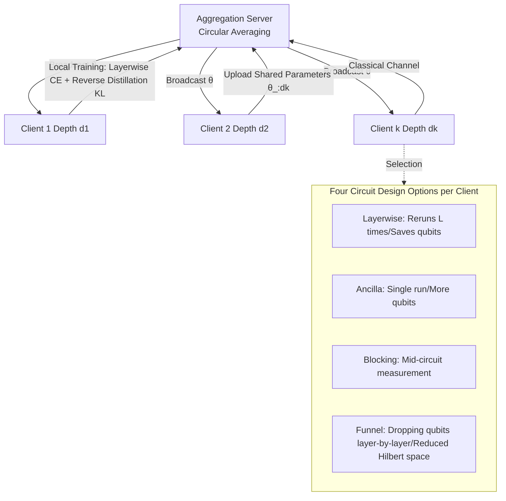

# Layerwise Federated Learning for Heterogeneous Quantum Clients using Quorus

**Conference**: ICLR 2026  
**OpenReview**: [https://openreview.net/forum?id=ZwwFuVQv64](https://openreview.net/forum?id=ZwwFuVQv64)  
**Code**: To be confirmed  
**Area**: Quantum Machine Learning / Federated Learning  
**Keywords**: Quantum Federated Learning, Heterogeneous Clients, Layerwise Loss, Reverse Distillation, Parameterized Quantum Circuits, Barren Plateaus  

## TL;DR
Targeting Quantum Federated Learning (QFL) scenarios where different clients can only support different circuit depths, Quorus employs layerwise loss and reverse distillation to enable collaborative training across quantum models of varying depths. It proposes four quantum classifier designs (Layerwise/Ancilla/Blocking/Funnel) with distinct trade-offs in shots, qubits, mid-circuit measurement, and Hilbert space, achieving an average test accuracy improvement of 12.4% over the SOTA.

## Background & Motivation
**Background**: Quantum Machine Learning (QML) is expected to solve classical hard problems with fewer parameters. When data is distributed across multiple private clients, the natural extension is Quantum Federated Learning (QFL)—where parties collaboratively train Parameterized Quantum Circuits (PQCs) by exchanging parameters through classical channels without exposing raw data.

**Limitations of Prior Work**: Existing QFL methods mostly assume all clients run circuits with identical architectures. In reality, different clients possess quantum computers with vast differences in generation and fidelity. Since hardware errors are proportional to circuit depth (decoherence leads to amplitude/phase information loss over time), devices with higher errors can only execute shallower circuits. Furthermore, deep circuits face two major constraints: **barren plateaus** (where gradients vanish exponentially with depth) and **shot costs** (the need to repeatedly execute circuits to estimate observables at each training step; e.g., IBM machines cost approximately $96 per minute).

**Key Challenge**: Classical heterogeneous FL methods (such as HeteroFL, DepthFL, ScaleFL, and ReeFL) either require training intermediate layers or direct access to features—neither of which holds for PQCs. Training intermediate layers requires clients to run the circuit to that specific depth (the very bottleneck), and "features" of quantum states cannot be directly read without state tomography. Most critically, layerwise loss requires extracting classifier outputs at each layer, but **quantum measurement collapses the superposition state**; measuring the first layer destroys the state intended for subsequent layers.

**Goal**: Enable each client to participate in training at a depth that achieves reasonable accuracy on their hardware, while allowing them to run as many layers as possible to gain higher expressivity and accuracy, all while controlling the shot budget.

**Core Idea**: **[Layerwise Loss + Reverse Distillation]** Quorus is the first to port DepthFL-style layerwise loss to the quantum context, aggregating parameters only among clients that share those parameters. **[Engineering Solutions for Quantum Collapse]** Addressing the "measurement-induced collapse" unique to quantum mechanics, the authors propose four circuit designs (Layerwise, Ancilla, Blocking, and Funnel) with mutually exclusive costs, allowing clients to choose based on their resource profiles.

## Method

### Overall Architecture
Quorus follows the "local training → parameter upload → server aggregation → broadcast" cycle of centralized FL, but introduces three quantum modifications: (1) Each client trains a PQC of depth $d_k$ according to its hardware capability, and aggregation is performed only among clients sharing those specific parameters; (2) Since parameters are Bloch sphere rotation angles, aggregation uses **circular averaging** $\text{angle}(z)=\text{atan2}(\text{imag}(z),\text{real}(z))$ instead of arithmetic averaging; (3) The local loss function consists of layerwise cross-entropy plus inter-layer KL divergence. The primary challenge lies in "how to extract classifier outputs for each layer without introducing linear shot overhead," which is solved by four distinct circuit designs.

### Key Designs

**1. Layerwise Loss + Reverse Distillation: Sharing optimization goals across deep and shallow models.** The loss for client $k$ is defined as:

$$L_k = \sum_{i=1}^{d_k} L_{ce}^i + \frac{1}{d_k-1}\sum_{i=1}^{d_k}\sum_{\substack{j=1\\ j\neq i}}^{d_k} D_{KL}(p_j \,\|\, p_i)$$

The first term is the binary cross-entropy of classifiers at each depth $i$. The second term is the pair-wise KL divergence between logits of all layers. It follows the intuition of DepthFL: since different local parameter spaces across clients cause parameter mismatch, a shared objective is needed for alignment. The KL term implements "**reverse distillation**"—allowing shallow classifiers to assist deep classifiers (contrary to traditional distillation where deep teaches shallow). This term synchronizes the training objectives of clients with different depths, ensuring parameter aggregation remains effective under heterogeneous conditions.

**2. The Collapse Paradox and the Layerwise Baseline.** Classical DepthFL assumes intermediate outputs can be "copied" and passed to the next layer (with negligible cost), but this operation does not exist in quantum mechanics. Once the first qubit is measured to obtain classification output, the superposition collapses, and subsequent layers receive a modified state. The most direct solution, **Layerwise**, involves "re-preparation": since the circuit is known, it is executed $L$ times, with the $i$-th run terminating and measuring at the $i$-th layer. The cost is that the **shot budget grows linearly with depth**, which is unfeasible for clients with deep circuits or tight budgets. Its advantages include requiring only nearest-neighbor connectivity and minimal qubit counts; it serves as a control scheme in main experiments.

**3. Ancilla / Blocking: Trading qubits or mid-circuit measurements for shots.** To make the shot count for "extracting each layer's output" independent of depth, the **Ancilla** design entangles the first qubit with a $|0\rangle$ ancilla qubit after each layer. The output of that layer is read by calculating the marginal distribution of the ancilla. The circuit runs once, but requires one ancilla per layer, and entanglement "dephases" the first qubit. The authors verified on IBM hardware that the model still trains effectively despite this. The logical equivalent, **Blocking** (with proof of equivalence in the appendix), avoids ancillas by performing **mid-circuit measurement** on the first qubit without resetting it before continuing. This suits clients capable of fast mid-circuit measurement, though currently, such operations are time-consuming and error-prone. Both essentially "trade more qubits or mid-circuit measurement capability to eliminate the linear shot overhead of Layerwise."

**4. Funnel: "Funnel-style" qubit discarding for the most constrained clients.** For clients with neither high shot budgets, nor ancillas, nor mid-circuit measurement capability, **Funnel** reduces operations on the first qubit layer-by-layer. As each layer is measured, one qubit is discarded, allowing all measurements to occur at the end of the circuit. Consequently, unitaries in deeper layers act on fewer qubits (hence "Funnel"). The cost is the **requirement that the problem itself can adapt to operations on a decreasing number of qubits**, thereby restricting the Hilbert space. These four designs (Layerwise/Ancilla/Blocking/Funnel) each incur exactly one type of cost (↑shots / ↑qubits / mid-circuit measurement / ↓Hilbert space), satisfying different resource profiles of clients.

Regarding ansatz selection, the authors compared Staircase, V-shape, and Alternating designs, using data re-uploading (Ry gates) and measuring only the first qubit (sufficient for binary classification). The V-shape ansatz performed best due to CNOT gates effectively broadcasting information and was chosen as the default.

## Key Experimental Results

Setup: MNIST / Fashion-MNIST binary classification, 128 data points per client, PCA reduced to 10 dimensions for angle encoding, averaged over 5 runs.

### Main Results: Quorus-Layerwise vs. Baselines (V-shape ansatz, Test Accuracy %)
Representative values compared by client capacity (2L–6L):

| Capacity | Technique | MNIST 0/1 | MNIST 3/4 | MNIST 4/9 | Fashion Pants/Boots |
|------|------|-----------|-----------|-----------|---------------|
| 3L | Q-HeteroFL | 79.6 (↓18.7) | 85.0 (↓11.9) | 68.5 (↓11.9) | 76.9 (↓22.3) |
| 3L | Vanilla QFL(2L) | 98.2 | 96.0 | 80.0 | 98.5 |
| 3L | **Quorus-Layerwise** | 98.0 | **96.9** | **80.4** | **99.2** |
| 6L | Q-HeteroFL | 88.6 (↓10.0) | 85.1 (↓12.7) | 73.9 (↓9.2) | 95.3 (↓4.1) |
| 6L | **Quorus-Layerwise** | **98.6** | **97.8** | **83.1** | **99.4** |

Ours outperforms Q-HeteroFL by **12.4%** on average. As depth increases, Quorus's advantage over Vanilla QFL (which is forced to use the minimum depth) becomes more pronounced, demonstrating its ability to unlock the expressivity of high-capacity clients.

### Ablation Study: Comparison of Four Quorus Variants (V-shape)

| Capacity | Layerwise | Ancilla/Blocking | Funnel |
|------|-----------|------------------|--------|
| 4L MNIST 4/9 | 81.9 (↓1.3) | 81.5 (↓1.7) | **83.2** |
| 5L MNIST 4/9 | 82.5 (↓2.1) | 81.9 (↓2.7) | **84.6** |
| 6L MNIST 4/9 | 83.1 (↓2.1) | 82.2 (↓3.0) | **85.2** |

Layerwise and Funnel are overall optimal and chosen for subsequent experiments; Ancilla/Blocking show slightly lower accuracy but offer flexibility in shots and connectivity.

### Key Findings
- **Higher Gradient Norms**: Quorus increases the gradient magnitude for high-depth clients, alleviating the barren plateau effect and making deep circuits trainable.
- **Hardware Feasibility**: Validated on various IBM superconducting QPUs, with accuracy within **3%** of ideal simulation.
- **Small Capacity Exceptions**: Quorus-Layerwise is not necessarily optimal at the smallest capacities (e.g., 2L), as its loss penalizes first-layer parameters alongside the loss of deep clients.

## Highlights & Insights
- **First structured, depth-heterogeneous QFL framework**, introducing layerwise loss and reverse distillation to the quantum domain and filling a gap in literature regarding heterogeneous quantum clients.
- **Directly Addressing Quantum Paradoxes**: The problem of measurement collapse, which does not exist in classical FL, is transformed into four circuit designs with mutually exclusive costs. The engineering is clean—each design pays exactly one type of price to suit specific hardware constraints.
- **Simulation and Real Hardware**: 12.4% improvement, 3% hardware gap, and larger gradient norms provide solid, multi-perspective evidence—a rarity in quantum papers.

## Limitations & Future Work
- Limited to **binary classification** tasks (measuring only the first qubit); multi-class classification would require a redesigned output reading method.
- Small data scale (128 points per client, PCA to 10 dims), far from the scale of real-world QML applications.
- Layerwise loss is **disadvantageous for small-capacity clients**, as parameters in the first layer are subject to multiple penalties; fairness and personalization remain to be solved.
- Dephasing in Ancilla and errors in Blocking's mid-circuit measurement remain sources of noise on NISQ devices; the hardware cost of long-range CNOT gates is not fully quantified.

## Related Work & Insights
- **Classical Heterogeneous FL**: HeteroFL (shared sub-model aggregation), DepthFL (layerwise FL, the intuition for this paper's loss), ScaleFL/FEDepth (requires training intermediate layers, non-applicable to PQCs), ReeFL (Transformer-based feature fusion, features cannot be directly extracted in quantum).
- **Quantum FL**: Chen & Yoo established homogeneous QFL; eSQFL uses inter-layer state inner products for layerwise loss but requires long-range connectivity, making it unfeasible for real hardware. Quorus's circuit designs are specifically aimed at bypassing such unfeasibility.
- **Insight**: When porting a classical algorithm to a new computing paradigm, the real challenge is often not the algorithm itself but the paradigm's inherent physical constraints (here, measurement collapse). Splitting a single abstract problem into multiple concrete designs with mutually exclusive costs is more practical for heterogeneous realities than seeking a "one-size-fits-all" solution.

## Rating
- Novelty: ⭐⭐⭐⭐⭐ First depth-heterogeneous QFL framework, providing original and mutually exclusive designs for the quantum collapse problem.
- Experimental Thoroughness: ⭐⭐⭐⭐ Solid multi-capacity × multi-dataset × 5 repeats + IBM hardware validation; however, limited to binary classification and small data.
- Writing Quality: ⭐⭐⭐⭐ Motivation is developed step-by-step; the trade-offs of the four designs are clarified in a single table.
- Value: ⭐⭐⭐⭐ Drives QFL toward real heterogeneous hardware, holding practical significance for distributed QML in the NISQ era.

<!-- RELATED:START -->

## Related Papers

- [\[ICLR 2026\] Deploying Models to Non-participating Clients in Federated Learning without Fine-tuning: A Hypernetwork-based Approach](deploying_models_to_non-participating_clients_in_federated_learning_without_fine.md)
- [\[ICLR 2026\] Federated ADMM from Bayesian Duality](federated_admm_from_bayesian_duality.md)
- [\[ICLR 2026\] A Federated Generalized Expectation-Maximization Algorithm for Mixture Models with an Unknown Number of Components](a_federated_generalized_expectation-maximization_algorithm_for_mixture_models_wi.md)
- [\[ICML 2026\] Identifiable Equivariant Networks are Layerwise Equivariant](../../ICML2026/others/identifiable_equivariant_networks_are_layerwise_equivariant.md)
- [\[CVPR 2026\] FedSDR: Federated Graph Learning with Structural Noise Detection and Reconstruction](../../CVPR2026/others/fedsdr_federated_graph_learning_with_structural_noise_detection_and_reconstructi.md)

<!-- RELATED:END -->
