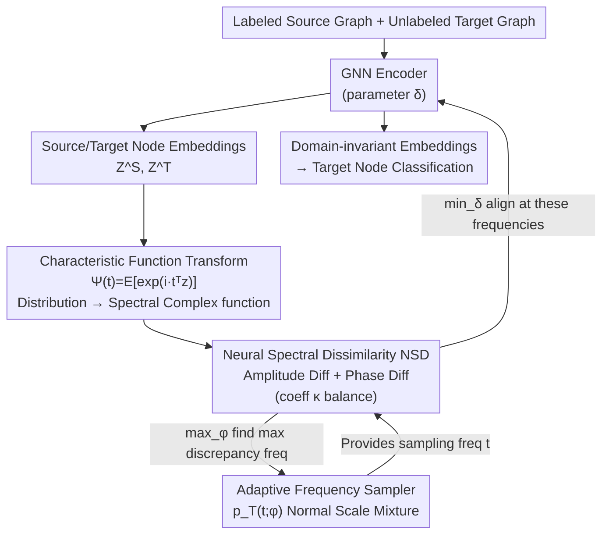

# Learning Adaptive Distribution Alignment with Neural Characteristic Function for Graph Domain Adaptation

**Conference**: ICLR 2026  
**arXiv**: [2602.10489](https://arxiv.org/abs/2602.10489)  
**Code**: [https://github.com/gxingyu/ADAlign](https://github.com/gxingyu/ADAlign)  
**Area**: Others / Graph Neural Networks  
**Keywords**: Graph Domain Adaptation, Characteristic Function, Spectral Domain Alignment, Adaptive Frequency Sampling, minimax Optimization

## TL;DR
The ADAlign framework is proposed to adaptively align source and target graph distributions in the spectral domain using neural characteristic functions. This eliminates the need for manual selection of alignment criteria by automatically identifying the most significant distribution discrepancies in each transfer scenario. It achieves SOTA on 16 transfer tasks across 10 datasets while reducing memory and training time.

## Background & Motivation
Graph Domain Adaptation (GDA) aims to transfer knowledge from labeled source graphs to unlabeled target graphs. Sources of distribution shift are complex and multifaceted—differences in node attributes, degree distributions, and homophily are often intertwined. Existing methods rely on manually designed graph filters to extract specific features (such as attribute or structural statistics) for alignment. however, the dominant discrepancies vary across transfer scenarios, making fixed strategies difficult to adapt.

As shown in the visualization of Figure 1, the feature dimensions corresponding to the maximum KL divergence in three Airport transfer tasks are completely different—features 2 and 3 are largest in B-E, while features 1, 2, and 4 are largest in U-E. Aligning fixed features fails to capture the full shift in all scenarios.

Core Innovation: Use the Characteristic Function (CF) to represent distribution discrepancies uniformly in the spectral domain—CF uniquely determines a probability distribution (Thm 2) and can adaptively identify the most informative frequency components for alignment in the frequency domain (NSD + learnable frequency sampler).

## Method

### Overall Architecture
ADAlign addresses the challenge of "mixed sources of distribution shift" in GDA—where differences in node attributes, degree distributions, and homophily often coexist, causing manual feature selection for alignment to fail across different scenarios. Its approach is to move the alignment process entirely into the frequency domain. First, a GNN encoder (parameter $\delta$) maps labeled source graphs and unlabeled target graphs into node embeddings $Z^S, Z^T$. Then, the characteristic function transforms the empirical distribution of embeddings from both sides into complex-valued functions in the frequency domain. Neural Spectral Dissimilarity (NSD) is used to measure the gap between them at each frequency. Crucially, the "which frequencies to monitor" in this metric is not fixed: a learnable frequency sampler engages in a minimax game with the encoder—the sampler identifies frequencies with the largest discrepancies to "challenge" the model, while the encoder is forced to align distributions at these selected frequencies. This removes the need to manually specify whether to align attributes or structure; the resulting domain-invariant embeddings are used directly for target graph node classification.

### Key Designs

**1. Characteristic Function Transform: Avoiding manual choices via unified spectral representation**

The difficulty in GDA lies in the intertwined sources of distribution shift (node attributes, degree distribution, homophily). Traditional methods rely on manual filters to extract certain features for alignment, but the dominant discrepancy changes across transfer scenarios. ADAlign uses the characteristic function (CF) to characterize the entire distribution: for embedding $z$, it defines $\Psi(t) = \mathbb{E}\big[\exp(i\,t^\top z)\big]$, transforming the probability distribution into a complex-valued function with frequency $t$ as coordinates. The paper proves that the CF uniquely determines a probability distribution (Thm 2) and provides convergence guarantees for empirical estimation (Thm 1). Thus, aligning $\Psi^S(t)$ and $\Psi^T(t)$ is equivalent to aligning the complete distribution rather than selected dimensions, eliminating the trade-off of "aligning attributes vs. structure."

**2. Neural Spectral Dissimilarity (NSD): Decomposing distribution discrepancy into amplitude and phase**

With characteristic functions from both sides, an optimizable distance is needed. NSD is defined as the integrated discrepancy weighted by the frequency distribution: $\mathrm{NSD} = \int_{t}\sqrt{\big|\Psi^S(t) - \Psi^T(t)\big|^2}\, dF_T(t)$. The paper performs a polar decomposition on the complex-valued difference, splitting the pointwise discrepancy into two terms:

$$\ell(t) = \underbrace{\big(|\Psi^S(t)|-|\Psi^T(t)|\big)^2}_{\text{Amplitude Diff}} + \underbrace{2|\Psi^S(t)||\Psi^T(t)|\big(1-\cos(\theta^S(t)-\theta^T(t))\big)}_{\text{Phase Diff}}$$

The amplitude term reflects the energy distribution of embeddings across frequencies, corresponding to global structure and low-frequency homophily patterns; the phase term encodes the relative positions of frequency patterns, corresponding to relational structural mismatches and heterophilic irregularities. A convex combination using coefficient $\kappa\in[0,1]$ balances the two: $\ell_\kappa(t) = \kappa\,(\text{Amplitude Diff}) + (1-\kappa)\,(\text{Phase Diff})$. This decomposition allows the metric to capture both coarse-grained global shifts and fine-grained relational mismatches. In experiments, $\kappa$ between $0.65\!-\!0.75$ performs most stably, while pushing to extremes (only amplitude $\kappa=1$ or only phase $\kappa=0$) leads to degradation, indicating their complementary nature.

**3. Adaptive Frequency Sampler: Letting the model find frequencies that require alignment**

The integral in NSD must be approximated via sampling in the frequency space. However, significant discrepancies in different transfer tasks fall into different frequency bands (the max KL dimensions vary in Figure 1). Fixed grids are either too sparse, missing key shifts, or too dense, introducing redundancy and noise. ADAlign parameterizes the sampling density as a normal scale mixture $p_T(t;\varphi)$, which covers multiple distribution families (Gaussian, Cauchy, Student-$t$). It adaptively concentrates mass on low frequencies (global changes) or high frequencies (fine-grained shifts) and uses the reparameterization trick to ensure differentiability. During training, sampling parameters $\varphi$ move toward maximizing the NSD contribution, actively shifting probability mass to frequencies with the largest discrepancies to select a compact, high-signal set of frequency points.

**4. Minimax Optimization: Adversarial "finding and fixing" of discrepancies**

These forces are combined into a minimax objective (Eq 14): $\min_{\delta}\max_{\varphi}\big[\mathcal{L}_{\text{source}} + \lambda\,\mathcal{L}_{\text{align}}\big]$. The inner $\max_\varphi$ allows the sampler to adversarially search for frequencies with the current maximum discrepancy, while the outer $\min_\delta$ allows the GNN to simultaneously optimize source classification and cross-domain alignment. This game naturally encodes the "automatic identification of significant discrepancies" into the training process: the better the sampler is at finding discrepancies, the more the encoder is forced to flatten the distribution in the hardest-to-align directions.

### Loss & Training
The total loss is the sum of the source classification term and the alignment term: $\mathcal{L} = \mathcal{L}_{\text{source}}(\text{CE}) + \lambda\,\mathcal{L}_{\text{align}}(\text{NSD})$. The alignment term $\mathcal{L}_{\text{align}}$ approximates the NSD integral via Monte Carlo sampling of $M$ frequency points. Larger $M$ reduces variance at higher cost. The sampling process uses the reparameterization trick to make the frequency sampling parameters $\varphi$ differentiable, allowing joint optimization of both sides of the minimax objective via gradients.

## Key Experimental Results

### Main Results (Partial)

| Task | GAT | GCN | UDAGCN | DEAL | **ADAlign** | Description |
|------|-----|-----|--------|------|----------|------|
| A→C (Citation) | 62.8 | 69.2 | 72.1 | 74.3 | **76.8** | +2.5 |
| C→D (Citation) | 67.1 | 68.1 | 71.5 | 73.2 | **75.4** | +2.2 |
| B1→B2 (Blog) | 21.2 | 20.5 | 23.1 | 24.8 | **28.3** | +3.5 |

### Ablation Study

| Component | Effect | Description |
|------|------|------|
| w/o adaptive sampler (fixed freq) | Significant drop | Adaptivity is key |
| w/o phase alignment | Drop | Both are important |
| w/o amplitude alignment | Drop | Complementary info |
| κ → extreme (κ=0 phase / κ=1 amplitude) | Worse than κ∈[0.65,0.75] | Balance required |

### Efficiency Comparison

| Method | Memory (MB) | Training Time (s) | Description |
|------|---------|-----------|------|
| DEAL | 1,245 | 892 | Heavy GNN alignment |
| FLAN | 987 | 756 | Filter design |
| **ADAlign** | **423** | **312** | Lightweight spectral ops |

### Key Findings
- ADAlign achieves optimal or near-optimal performance on 16/16 transfer tasks.
- Memory and training time are reduced by 2-3x—CF operations are more lightweight than GNN-based alignment.
- Adaptive frequency sampling automatically focuses on different spectral components across scenarios—validating the design intent.
- PAC-Bayesian analysis (Thm 3 + Prop 1) provides generalization theoretical support for NSD.

## Highlights & Insights
- The characteristic function provides a unified and complete theoretical tool for graph distribution alignment—eliminating the need for manual feature selection.
- Amplitude/phase decomposition has intuitive meaning: Amplitude ≈ global statistical discrepancy, Phase ≈ relational structural discrepancy.
- The frequency sampler in the minimax setup is a natural expression of "adversarial search for maximum discrepancy."
- Efficiency advantages enhance the practical utility of the framework.

## Limitations & Future Work
- Monte Carlo approximation of frequency sampling introduces variance; the choice of $M$ requires a trade-off.
- Verified only on node classification; graph-level tasks remain to be explored.
- The choice of $\kappa$ is currently a hyperparameter; adaptive $\kappa$ might be superior.
- Resilience to extreme domain gaps requires further testing.

## Related Work & Insights
- Implementing characteristic functions from generative models/knowledge distillation into GDA opens a new methodological space.
- The concept of adaptive spectral domain alignment can be generalized to other domain adaptation tasks.

## Rating
- Novelty: ⭐⭐⭐⭐ CF + Spectral Alignment + Adaptive Sampling
- Experimental Thoroughness: ⭐⭐⭐⭐⭐ 16 tasks on 10 datasets + Ablation + Efficiency analysis
- Writing Quality: ⭐⭐⭐⭐ Clear mathematical derivation
- Value: ⭐⭐⭐⭐ Meaningful contribution to GDA methodology

<!-- RELATED:START -->

## Related Papers

- [\[ICLR 2026\] Learning Structure-Semantic Evolution Trajectories for Graph Domain Adaptation](learning_structure-semantic_evolution_trajectories_for_graph_domain_adaptation.md)
- [\[ICLR 2026\] Distributionally Robust Classification for Multi-Source Unsupervised Domain Adaptation](distributionally_robust_classification_for_multi-source_unsupervised_domain_adap.md)
- [\[ICLR 2026\] Improving Set Function Approximation with Quasi-Arithmetic Neural Networks](improving_set_function_approximation_with_quasi-arithmetic_neural_networks.md)
- [\[ICLR 2026\] Learning Survival Distributions with Individually Calibrated Asymmetric Laplace Distribution](learning_survival_distributions_with_individually_calibrated_asymmetric_laplace_.md)
- [\[ICLR 2026\] Adaptive Conformal Guidance for Learning under Uncertainty](adaptive_conformal_guidance_for_learning_under_uncertainty.md)

<!-- RELATED:END -->
