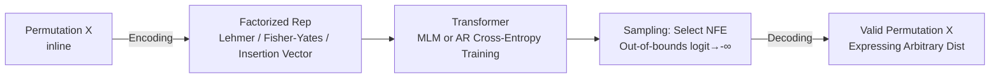

# Learning Distributions over Permutations and Rankings with Factorized Representations

**Conference**: ICLR 2026  
**OpenReview**: [https://openreview.net/forum?id=aE1VU6Ui4M](https://openreview.net/forum?id=aE1VU6Ui4M)  
**Code**: To be confirmed  
**Area**: Probabilistic Methods / Learning Distributions over Permutations  
**Keywords**: Permutation Distributions, Lehmer Code, Fisher-Yates, Insertion Vector, Masked Language Modeling, Learning to Rank  

## TL;DR
By replacing permutations with "factorized representations" (Lehmer code / Fisher-Yates / Insertion vectors) that correspond one-to-one with the symmetric group, the model can use standard masked language modeling or autoregressive cross-entropy to learn **arbitrary** permutation distributions. These models **always generate valid permutations** during sampling and can trade off expressivity for inference speed (NFE) without retraining.

## Background & Motivation
- **Background**: Learning distributions over permutation spaces is a cornerstone for ranking, combinatorial optimization, structured prediction, and data association. Classical approaches use parametric distributions like Plackett-Luce or Mallows, or their mixtures. Recent work utilizes neural networks combined with diffusion (SymDiff) or continuous relaxations (Gumbel-Sinkhorn) for approximation.
- **Limitations of Prior Work**: Parametric families have restricted expressivity (e.g., Plackett-Luce cannot represent delta distributions), while mixture models rely on expensive variational inference. Neural methods either depend on complex diffusion reverse processes or use continuous relaxations to force discrete problems into continuous spaces, which do not guarantee valid permutations during sampling.
- **Key Challenge**: When performing masked modeling directly on the "inline representation" of a permutation (i.e., $X=[x_1,\dots,x_n]$, where each position takes a unique value from $[n]$), the support sets of different positions must be non-overlapping to ensure validity. This collapses the model into only being able to represent delta distributions in a single forward pass (1 NFE), meaning **expressivity drops sharply as the number of forward passes decreases**.
- **Goal**: Find a permutation representation where "validity constraints" are naturally built-in, enabling training with standard language model cross-entropy and a free trade-off between computation (number of forward passes) and expressivity.
- **Key Insight**: **[Representation Replacement]** Instead of modeling the inline representation, the model operates on factorized representations bijective to the symmetric group. Each component of these representations has its own independent range; values can "overlap" across components while still decoding into a valid permutation, thereby avoiding the expressivity collapse of inline representations.

## Method

### Overall Architecture
A Transformer (Masked Language Modeling MLM or Autoregressive NTP) is used to perform next-token or masked-token prediction on a **factorized representation** $R(X)$ of the permutation, trained via cross-entropy. During training, the model only sees valid permutations; for each position, out-of-bounds logits are set to $-\infty$ to automatically learn the value domains. During inference, users choose the number of forward passes (NFE) as needed. Multiple tokens within a block can be sampled in parallel (as they are conditionally independent), and finally, the inline permutation is recovered in $O(n)$ using the corresponding decoding algorithm.

### Key Designs

**1. Capacity Ceiling of Inline Representations: Explaining "Why change representations".** A masked model can be written as $P_X^{(S)}=\prod_i \prod_{j\in S_i} P_{X_j\mid X_{S_{<i}}}$, where the number of blocks in the partition $S=(S_1,\dots,S_k)$ equals the NFE $k$. To guarantee valid permutations, the support sets of different positions within the same step must be disjoint, leading to the entropy upper bound $H(P_X^{(S)})\le \sum_i \log(n-|S_{\le i}|+1)$. When $k=1$ (full factorization, $S_1=[n]$), the right side is $0$, meaning the inline model **can only express delta distributions**. This is the root cause for why inline models fail to generate valid permutations at low NFE.

**2. Three Factorized Representations: Built-in Validity and Computational Trade-offs.** The Lehmer code $L(X)_i$ counts inversions to the left/right of the $i$-th element, with the $i$-th component range being $[n-i+1)$. It is bijective to the factorial number system, and $\sum_i L(X)_i$ is exactly the Kendall's tau distance. Fisher-Yates (FY) sampling $FY(X)$ is a sequence of swaps starting from the identity; restricting $FY_i > 0$ generates only cyclic permutations (Sattolo algorithm). Insertion vectors $V(X)$ define a generative process relative to a reference $X_{\text{ref}}$, inserting elements into slots $V_i$. The key commonality is that component ranges vary by position and can overlap without compromising validity, allowing 1 NFE models to express non-trivial distributions.

**3. Representation Choice as an Expressivity/Compute Knob and Subsuming Classical Models.** MLM over partitions is equivalent to a mixture model. AR with $S_i=\{i\}$ (full NFE) can express the full entropy of $\log(n!)$. Crucially, factorized representations allow the model to **directly subsume classical families**: on Lehmer codes, when the condition follows $P_{L_j\mid L_{<i}}\propto \phi^{\,\omega_j\cdot \ell_j}$, it recovers the Weighted Mallows model because $\sum_{j\in S_i}\omega_j\ell_j$ is the weighted Kendall's tau (Remark 4.1). On insertion vectors, it recovers RIM when insertion probabilities are independent of the order of observed elements (Remark 4.2). Thus, the same framework can degrade into interpretable classical distributions or approximate any distribution at full NFE.

**4. Fast Batch Encoding/Decoding for Insertion Vectors.** While Lehmer and Fisher-Yates have existing $O(n)$ batch algorithms, insertion vectors do not have an obvious one. The paper proves (Theorem 4.3) that insertion vectors relate to the left Lehmer code of the inverse permutation via $V(X)_k = k - L(X^{-1})_k$, reducing insertion vector encoding/decoding to existing batch Lehmer algorithms for efficient conditional ranking.

## Key Experimental Results

### Main Results: CIFAR-10 Puzzle (Delta Target Distribution)
All models have approximately 3M parameters, matching the SymDiff setup. The metric is the proportion of correctly restored puzzles (higher is better).

| Method | 2×2 | 3×3 | 4×4 |
|---|---|---|---|
| SymDiff (Zhang 2024) | High | — | 43.59 |
| Gumbel-Sinkhorn | High | — | 34.69 / 25.31 |
| Ours (MLM 1 NFE / AR, various reps) | ~82–94% | Significantly Higher | Significantly Higher & stable across sizes |

Key takeaway: Ours, across all representations and losses, comprehensively outperforms diffusion and differentiable relaxation baselines. Baselines collapse as puzzle size increases, whereas Ours remains robust. MLM at 1 NFE is sufficient (as the target is delta) and significantly outperforms AR.

### New Benchmark I: Uniform Distribution over Cyclic Permutations ($n=10$, Non-trivial Target)
Using Sattolo to generate all $(n-1)!$ cyclic permutations, taking 20% as the training set. Metrics: Unique/Valid/Cyclic percentages.

| Representation (MLM) | Validity @ Low NFE | Expresses Non-trivial @ 1 NFE |
|---|---|---|
| Inline | Collapses as NFE drops | No (Only delta) |
| Lehmer / Insertion | 100% Valid | Yes (1 NFE still covers parts of cyclic perms) |
| Fisher-Yates | 100% Valid | **Perfectly models target dist at any NFE** |

The advantage of Fisher-Yates stems from its structural alignment with the Sattolo algorithm.

### New Benchmark II: MovieLens32M Re-ranking (Conditional Distribution)
Movies with $\ge 1000$ ratings were filtered to a set of 1000. For $n=50$, this involves ~18 million ratings from 174k users. Results show AR and MLM(1 NFE) **simultaneously outperform** both baselines (Popularity-based and Uniform RIM) across all settings ($n=10, 20, 50$ and various $k$ for NDCG@k).

### Key Findings
- The failure of inline representations under low computation is a **theoretical necessity** (entropy bound of 0), not an engineering flaw.
- "Single-solution" benchmarks like puzzles fail to test distribution learning (target is delta); cyclic permutations and MovieLens reveal the gap between methods on non-trivial distributions.
- Fisher-Yates has a structural advantage for cyclic tasks, suggesting that "representation choice" should match the task symmetries.

## Highlights & Insights
- Entirely translates "permutation distribution learning" into "standard language modeling": Cross-entropy + Transformer, with no need for variational inference, diffusion reverse processes, or continuous relaxations.
- Use of the entropy bound $H \le \sum_i \log(n-|S_{\le i}|+1)$ clearly explains why inline models at 1 NFE can only represent delta distributions, framing "validity constraints $\implies$ expressivity collapse" as an information-theoretic fact.
- The property of "NFE as an expressivity knob without retraining" is a practical deployment advantage.
- Theorem 4.3 reducing insertion vector complexity to Lehmer code provides a clean engineering acceleration.

## Limitations & Future Work
- The model does not utilize semantic features of users/items; on MovieLens, information comes strictly from historical rankings.
- Different representations have structural preferences (e.g., Fisher-Yates for cyclic permutations); how to **automatically select** or hybridize representations remains a research question.
- Experimental scale is small-to-medium ($n \le 50$, ~3M parameters); scalability and training stability for larger vocabularies or longer permutations are not fully verified.

## Related Work & Insights
- **Classical Permutation Distributions**: Plackett-Luce, Mallows, RIM/GRIM—this paper proves they are special sub-cases of its framework under specific conditions.
- **Neural Permutation Learning**: SymDiff (discrete diffusion + riffle shuffle) and Gumbel-Sinkhorn—Ours distinguishes itself with "built-in validity + standard cross-entropy."
- **Insight**: When a discrete structure has a bijective encoding to an algebraic object (e.g., symmetric group $\leftrightarrow$ factorial number system), moving the learning problem to that encoding often transforms hard constraints into free parameterization—a strategy applicable to trees, matchings, and graphs.

## Rating
- **Novelty**: ⭐⭐⭐⭐ — The perspective of using factorized representations to reduce permutation learning to standard NLP is very clear. Subsuming classical models and the entropy bound derivation are solid contributions.
- **Experimental Thoroughness**: ⭐⭐⭐⭐ — Three task types (delta/uniform cyclic/conditional reranking) reveal distribution learning capabilities step-by-step.
- **Writing Quality**: ⭐⭐⭐⭐ — The motivation-theory-method-experiment chain is tight, and illustrations (Fig. 2/3) make abstract representations intuitive.
- **Value**: ⭐⭐⭐⭐ — Provides a simple, fast, validity-guaranteed, and compute-adjustable unified modeling tool for ranking and combinatorial optimization.

<!-- RELATED:START -->

## Related Papers

- [\[ICLR 2026\] Learning Survival Distributions with Individually Calibrated Asymmetric Laplace Distribution](learning_survival_distributions_with_individually_calibrated_asymmetric_laplace_.md)
- [\[ICLR 2026\] RADAR: Learning to Route with Asymmetry-aware Distance Representations](radar_learning_to_route_with_asymmetry-aware_distance_representations.md)
- [\[ICLR 2026\] Bayesian Post Training Enhancement of Regression Models with Calibrated Rankings](bayesian_post_training_enhancement_of_regression_models_with_calibrated_rankings.md)
- [\[ICML 2026\] Continual Learning of Domain-Invariant Representations](../../ICML2026/others/continual_learning_of_domain-invariant_representations.md)
- [\[ICLR 2026\] Do We Really Need Permutations? Impact of Model Width on Linear Mode Connectivity](do_we_really_need_permutations_impact_of_model_width_on_linear_mode_connectivity.md)

<!-- RELATED:END -->
