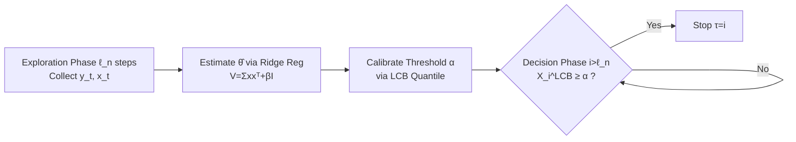

# Learning in Prophet Inequalities with Noisy Observations

**Conference**: ICLR 2026  
**OpenReview**: [https://openreview.net/forum?id=TOyf8Z4y22](https://openreview.net/forum?id=TOyf8Z4y22)  
**Code**: [https://github.com/junghunkim7786/LearningProphetInequalityNoisyObservation](https://github.com/junghunkim7786/LearningProphetInequalityNoisyObservation)  
**Area**: Learning Theory / Online Decision Making / Optimal Stopping  
**Keywords**: prophet inequality, optimal stopping, online learning, noisy observations, LCB threshold, competitive ratio  

## TL;DR
In a prophet inequality setting with unknown distributions and "linear contextual rewards" observed with noise, the authors achieve optimal competitive ratios of $1-1/e$ (i.i.d.) and $1/2$ (non-i.i.d.) without offline samples by employing a "learn-as-you-stop" LCB threshold policy.

## Background & Motivation
**Background**: The prophet inequality is a classic problem in optimal stopping where a gambler sequentially observes $n$ rewards and must irrevocably "accept and stop" or "reject and continue." The goal is to maximize expected reward relative to a "prophet" index $E[\max_i X_i]$. With known distributions, single-threshold policies achieve optimal ratios of $1/2$ for non-i.i.d. cases (Samuel-Cahn 1984) and $1-1/e$ for i.i.d. cases (Hill & Kertz 1982).

**Limitations of Prior Work**: In practice, distributions are rarely known. Known negative results are stringent: without information, online learning on a single sequence yields a maximum ratio of only $1/e \approx 0.368$ (the classic secretary algorithm). Achieving $1-1/e$ or $1/2$ typically requires either $\Theta(n)$ offline samples or repeating the decision problem over many independent rounds (regret minimization), both of which are often unavailable.

**Key Challenge**: Compounding the issue, the gambler in this setting only observes noisy signals $y_i = X_i + \eta_i$. The authors prove (Proposition 4.1) that with noisy observations alone, even if the distribution is fully known, instances can be constructed where the competitive ratio collapses to $0$. This explains why previous work (Assaf et al. 1998) could only provide guarantees against a weaker Bayesian prophet.

**Goal**: Restore optimal competitive ratios of $1-1/e$ and $1/2$ against the standard (not weakened) prophet benchmark $E[\max_i X_i]$ under the most restrictive conditions: unknown distribution, no offline samples, single sequence, and noisy observations.

**Key Insight**: **Breaking the barrier through structure.** Assuming rewards follow a linear contextual model $X_i = x_i^\top\theta$, the gambler observes features $x_i$ and knows their distribution $D_x$, despite not seeing $X_i$ or knowing $\theta$. "Exploration" serves both to accumulate $(y_i, x_i)$ pairs for estimating $\theta$ and to wait for better opportunities. The authors couple estimation with an **Lower Confidence Bound (LCB) threshold** rule, using the LCB to proactively hedge against estimation uncertainty and avoid the collapse caused by noise.

## Method

### Overall Architecture
All algorithms share a skeleton of "Exploration for estimating $\theta \to$ Decision using LCB thresholds": initial exploration of length $\ell_n=o(n)$ collects $(y_t, x_t)$ to estimate $\hat\theta = V^{-1}\sum_t y_t x_t$ via ridge regression (where $V=\sum_t x_t x_t^\top + \beta I_d$). During the decision phase, for each arriving $x_i$, the lower confidence bound $X_i^{\mathrm{LCB}}=x_i^\top\hat\theta-\xi(x_i)$ is calculated. Stopping occurs once this LCB exceeds a pre-calibrated threshold $\alpha$. Crucially, $\alpha$ is calibrated based on the quantiles of the LCB (rather than point estimates), which explicitly absorbs noise and estimation error into the decision process, controlling the competitive ratio loss within a residual $\varepsilon_n$ that vanishes as $\ell_n$ increases.

This framework is extended to three variants: $\varepsilon$-Greedy spreads exploration across the timeline with dynamic threshold recalibration; the non-i.i.d. case replaces the threshold with "half of the expected maximum"; and window access allows a single look-back at the end of exploration to align with the standard prophet.

Notation Overview:
- $X_i = x_i^\top\theta$: True reward at step $i$, $\theta$ is the unknown latent parameter, $x_i\sim D_{x,i}$ are visible features.
- $y_i = X_i+\eta_i$: Observable signal, $\eta_i$ is $\sigma$-sub-Gaussian noise.
- $\hat\theta=V^{-1}\sum_t y_t x_t$: Ridge regression estimate, $V=\sum_t x_t x_t^\top+\beta I_d$.
- $\xi(x_i)=\sqrt{x_i^\top V^{-1}x_i}\,(\sigma\sqrt{d\log(\cdot)}+\sqrt{S\beta})$: Confidence radius (ellipsoid norm).
- $\lambda=\lambda_{\min}(E[xx^\top])$: Minimum eigenvalue of feature covariance, requires $\lambda>0$ for non-degeneracy.
- $\mathrm{OPT}=E[\max_i X_i]$: Prophet benchmark.

### Key Designs
**1. LCB Threshold: Embedding "Uncertainty Penalty" in Stop Rules.** Instead of using the point estimate $x_i^\top\hat\theta$ directly, the policy subtracts an ellipsoidal confidence radius to obtain the pessimistic estimate $X_i^{\mathrm{LCB}}$. This conservatism ensures the algorithm is not misled by noisy "high" rewards into stopping prematurely. The threshold $\alpha$ is calibrated by the quantile of the LCB under $D_x$. For the i.i.d. case, setting $P_{z\sim D_x}(Z^{\mathrm{LCB}}\le\alpha)=1-\tfrac1n$ replicates the optimal single-quantile threshold behavior. Theorem 4.2 establishes a competitive ratio $\ge 1-1/e-\varepsilon_n$, where $\varepsilon_n=O\big(\tfrac{1}{\mathrm{OPT}}\sqrt{L(\sigma^2 d+S)\log(Ln)/(\lambda\ell_n)}\big)$.

**2. OPT Non-degeneracy Condition: Making Learning "Reachable" under Noise.** Proposition 4.1 shows that without extra assumptions, the ratio can collapse to 0 if $\mathrm{OPT}=E[\max_i X_i]$ is too small, as noise dwarfs the reward signal. The authors introduce a mild scale condition: by setting $\ell_n=\tfrac{L(\sigma^2 d+S)}{\lambda}f(n)\log(Ln)$, if $\mathrm{OPT}=\omega(1/\sqrt{f(n)})$ (e.g., $f(n)=n^{2/3}$), then $\varepsilon_n\to0$. Corollary 4.3 thus recovers $1-1/e$. This framework allows the support and variance to diverge with $n$ (e.g., $L=\sqrt n$), offering broader applicability than prior fixed-domain results.

**3. $\varepsilon$-Greedy Variant: Distributing Exploration.** Unlike Explore-then-Decide (ETD), which clusters exploration at the beginning, $\varepsilon$-Greedy flips a coin with $\varepsilon=\sqrt{\ell_n/n}$ at each step. If 1, it explores and updates $\hat\theta_i, V_i$; if 0, it uses a **dynamic threshold** $\alpha_i$ (re-calibrated in real-time) for decision-making. Theorem 4.4 proves this achieves the same $1-1/e$ ratio while dispersing decision points uniformly.

**4. Non-i.i.d. Case: Relaxed Benchmark + Window Access.** In non-i.i.d. settings, Proposition 5.2 indicates that some initial rewards must be sacrificed to learn $\theta$. Theorem 5.1 achieves a ratio of $1/2$ against the **relaxed prophet** $E[\max_{i>\ell_n}X_i]$ using $\alpha=\tfrac12 E[\max_s z_s^\top\hat\theta]$. To recover performance against the **standard prophet**, "window access" is introduced: at step $\ell_n+1$, the gambler is granted a one-time look-back window of size $\ell_n+1$, allowing them to select any index from the first $\ell_n+1$ steps. Theorem 5.4 reaches the optimal $1/2$ with this minimal relaxation.

## Key Experimental Results
Synthetic data with Gaussian noise $\sigma^2$, $d=2$, $\ell_n=n^{2/3}$, $\beta=1$. The Gusein-Zade rule (skip first $n/e$ steps, stop at the first reward exceeding the prefix maximum, guaranteeing $1/e$) serves as the baseline.

### Main Results (i.i.d., $n=100,000$)

| Algorithm | Targeted Ratio | Performance |
| :--- | :--- | :--- |
| ETD-LCBT(iid) (Alg. 1) | $1-1/e$ | Consistently exceeds $1-1/e \approx 0.632$ |
| $\varepsilon$-Greedy-LCBT (Alg. 2) | $1-1/e$ | Consistently exceeds $1-1/e$ |
| Gusein-Zade (Baseline) | $1/e$ | Significantly lower than Ours |

### Non-i.i.d. Case ($n=30,000$)

| Algorithm | Targeted Ratio | Performance |
| :--- | :--- | :--- |
| ETD-LCBT-WA (Alg. 3, Window Access) | $1/2$ | Exceeds $1/2$, consistent with Theorem 5.4 |
| ETD-LCBT (non-iid) (Alg. 1) | Relaxed $1/2$ | Also exceeds $1/2$ against standard OPT empirically |
| Gusein-Zade (Baseline) | — | Lower than Ours |

### Key Findings
- **Ours** significantly outperforms the Gusein-Zade baseline in all settings. **As noise $\sigma^2$ increases, the performance gap widens**, demonstrating that LCB-based pessimism makes the method more robust to observation noise.
- ETD-LCBT-WA (Window Access) consistently outperforms the relaxed version, validating that a single look-back is sufficient to bridge the gap between relaxed and standard prophets.
- Even ETD-LCBT (non-iid), which only has theoretical guarantees for the relaxed benchmark, empirically crosses the $1/2$ threshold for the **standard** prophet.

## Highlights & Insights
- **Leveraging structure to bypass impossibility**: While $1/e$ is a hard upper bound for unknown distributions in a single sequence, this work pushes the ratio to $1-1/e$ using linear contextual structures without requiring offline reward samples.
- **Pessimism (LCB) as the right tool for noisy stopping**: Subtracting the confidence radius prevents being deceived by noise while aligning the quantile thresholds with optimal strategies from known distribution theory.
- **Precise attribution of competitive ratio collapse**: By linking ratio decay to the scale of $\mathrm{OPT}$, the authors reconcile operational guarantees (Cor 4.3) with theoretical negative bounds (Prop 4.1).
- **Minimal relaxation for maximal gain**: The "one-time window access" is a low-cost compromise that recovers optimal non-i.i.d. performance.

## Limitations & Future Work
- **Strong Structural Assumption**: The requirement for rewards to be strictly linear $X_i=x_i^\top\theta$ and for the feature distribution $D_x$ to be samplable is restrictive. Extending this to generalized linear or non-parametric models is a future direction.
- **Synthetic Experiments Only**: Evaluations are limited to small-scale ($d=2$) simulations without validation on real-world advertising or recruitment datasets.
- **Asymptotic Guarantees**: Primary conclusions focus on $n\to\infty$. The practical sample complexity and behavior of the $\varepsilon_n$ residual for finite $n$ remain largely theoretical.
- **Non-degeneracy Requirement**: While mild, the $\mathrm{OPT}$ condition provides no meaningful guarantee in scenarios where $\mathrm{OPT}\to0$, which remains an inherent difficulty of noisy settings.

## Related Work & Insights
- **Known Distribution Prophet**: Samuel-Cahn (1984) and Hill & Kertz (1982) provide the $1/2$ and $1-1/e$ benchmarks that this work recovers under noisy/unknown conditions.
- **Unknown Distribution Prophet**: Correa et al. (2019a) proved the $1/e$ single-sequence limit. This work bypasses the need for $\Theta(n)$ samples found in Rubinstein et al. (2019) by utilizing structural information.
- **Noisy Observations**: Unlike Assaf et al. (1998) who targeted a weaker Bayesian prophet, this work addresses the classic prophet benchmark.
- **Insight**: Bridging Online Learning (LCB/UCB) with Optimal Stopping provides a framework for any problem involving "exploration alongside irrevocable decisions," such as dynamic pricing or real-time bidding.

## Rating
- **Novelty**: ⭐⭐⭐⭐⭐ High. Formulating the "linear structure + noisy observation + single sequence" combination and using LCB to break the $1/e$ barrier is innovative.
- **Experimental Thoroughness**: ⭐⭐⭐ Moderate. Clear verification of theory, but lacks real-world data and high-dimensional tests.
- **Writing Quality**: ⭐⭐⭐⭐ Logical progression from negative results to positive guarantees; clear motivation.
- **Value**: ⭐⭐⭐⭐ Solid contribution to online decision theory and mechanism design.

<!-- RELATED:START -->

## Related Papers

- [\[ICLR 2026\] Noisy-Pair Robust Representation Alignment for Positive-Unlabeled Learning](noisy-pair_robust_representation_alignment_for_positive-unlabeled_learning.md)
- [\[CVPR 2026\] Debiased Sample Selection for Learning with Noisy Labels](../../CVPR2026/others/debiased_sample_selection_for_learning_with_noisy_labels.md)
- [\[CVPR 2026\] Bootstrapping Multi-view Learning for Test-time Noisy Correspondence](../../CVPR2026/others/bootstrapping_multi-view_learning_for_test-time_noisy_correspondence.md)
- [\[ICCV 2025\] Joint Asymmetric Loss for Learning with Noisy Labels](../../ICCV2025/others/joint_asymmetric_loss_for_learning_with_noisy_labels.md)
- [\[ECCV 2024\] Foster Adaptivity and Balance in Learning with Noisy Labels](../../ECCV2024/others/foster_adaptivity_and_balance_in_learning_with_noisy_labels.md)

<!-- RELATED:END -->
