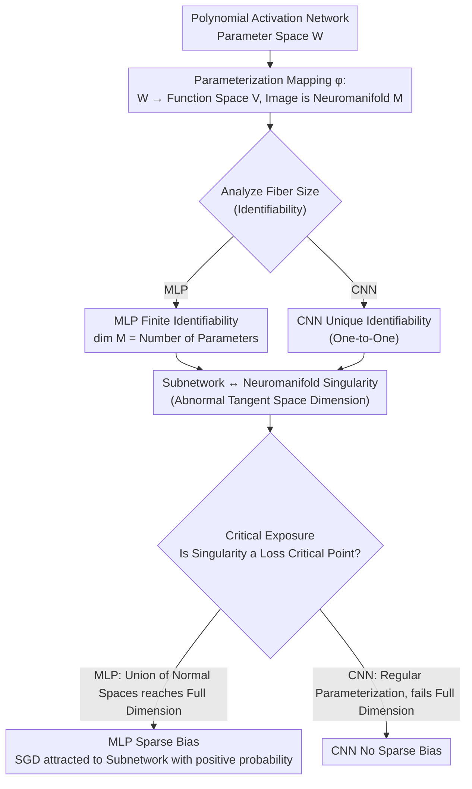

# Learning on a Razor's Edge: Identifiability and Singularity of Polynomial Neural Networks

**Conference**: ICLR 2026  
**arXiv**: [2505.11846](https://arxiv.org/abs/2505.11846)  
**Code**: None  
**Area**: Deep Learning Theory / Algebraic Geometry  
**Keywords**: Identifiability, Neuromanifold Singularity, Polynomial Neural Networks, Sparse Bias, Algebraic Geometry

## TL;DR

This paper utilizes algebraic geometry tools to systematically analyze MLPs and CNNs with polynomial activations: it proves the finite identifiability of MLPs and the unique identifiability of CNNs, reveals that sparse subnetworks correspond to singularities on the neuromanifold, and provides a geometric explanation for the sparse bias in MLPs through the lens of "critical exposure"—a property that CNNs do not possess.

## Background & Motivation

- **Background**: Neural networks parameterize a function space known as the "neuromanifold." Geometric properties of this manifold—dimension, identifiability, and singularities—directly influence the model's expressive power, training dynamics, and generalization. Existing identifiability analyses are largely limited to specific activations like Tanh, Sigmoid, and ReLU.
- **Limitations of Prior Work**: (1) There is a lack of systematic proof for the identifiability of general activation functions (the redundancy where different parameters correspond to the same function); (2) The complete characterization of neuromanifold singularities is restricted to linear networks and monomial CNNs; (3) The "sparse bias" observed during training (where networks tend to drop neurons and converge to sparse subnetworks) lacks a theoretical explanation at the geometric level.
- **Key Challenge**: While it is empirically believed that MLPs possess discrete parameter symmetries (from neuron permutations), formal proofs only exist for specific activations like Tanh/Sigmoid. Although progress has been made on the identifiability of monomial activations, they possess infinite fibers (due to neuron-wise scaling), which cannot be directly generalized.
- **Goal**: To uniformly prove the identifiability and dimension formulas for MLP/CNN with "sufficiently general" polynomial activations, characterize the relationship between singularities and subnetworks, and explain the geometric origins of sparse bias.
- **Key Insight**: Polynomial activation $\rightarrow$ the neuromanifold is a semi-algebraic variety $\rightarrow$ algebraic geometry tools (Zariski topology, fiber dimension theorem, toric geometry) become applicable $\rightarrow$ the proven conclusions hold for "generic" polynomials $\rightarrow$ can be generalized to general activations via polynomial approximation.
- **Core Idea**: Sparse subnetworks (networks where some neurons are set to zero) constitute exactly the singularities on the neuromanifold; for MLPs, these singularities are also critical points of the loss function (with positive probability), attracting SGD—this provides a geometric explanation for the "Lottery Ticket Hypothesis" and sparse bias.

## Method

### Overall Architecture

This is a purely theoretical work. The main logic treats MLPs/CNNs with polynomial activations as an algebraic mapping $\varphi$ from the parameter space $\mathcal{W}$ to the function space $\mathcal{V}$, where the image is the neuromanifold $\mathcal{M}_{\mathbf{d},\sigma}$. The study sequentially addresses three points: the size of the fiber determines identifiability, where the tangent space dimension is abnormal determines singularities, and "critical exposure" connects singularities to critical points of the loss function, thereby relating to optimization dynamics. The argumentation is conducted separately for MLPs and CNNs, branching at the "sparse bias" conclusion, and both are built on the irreducibility of the Zariski topology—if a property is verified at a generic point, it holds on a dense open set.

### Key Designs

**1. MLP Finite Identifiability (Theorem 4.1): "Cutting" Scaling Symmetry into Finite Solutions**

The goal is to prove that for generic polynomial activations with a sufficiently large degree $r$, the generic fiber of the MLP parameterization mapping is finite, meaning a single function corresponds to only finitely many parameter sets. The key to the proof is constructing a sparse polynomial activation $\sigma(x) = \sum_{i=1}^{L} x^{\beta_i}$ that allows the MLP output to be decomposed into a sum of monomial MLPs (Lemma B.1). Since the fiber structure of monomial MLPs is known (neuron permutation plus diagonal scaling), the identifiability problem is reduced to a system of polynomial equations $\lambda_{L,1}^{\beta_{L-1}^{L-2}} \cdots \lambda_{L,L-1} = 1$. Using Smith normal form and toric geometry, it is proven that this system has only finitely many solutions. Consequently, $\dim(\mathcal{M}_{\mathbf{d},\sigma}) = \sum_{i=1}^{L} d_i d_{i-1}$, resolving the dimension conjecture by Kileel et al. (2019). Monomial activations fail this because they only have infinite fibers from scaling symmetry; the multiple non-zero coefficients of polynomials provide additional constraint equations that eliminate the scaling degrees of freedom.

**2. CNN Unique Identifiability (Theorem 4.4): Weight Sharing for One-to-One Mapping**

This proves that the CNN parameterization is regular (full-rank Jacobian) on $\mathcal{W} \setminus \varphi^{-1}(0)$ and generically one-to-one. Weight sharing in convolutions makes Jacobian analysis much simpler than in MLPs. By using a logarithmic derivative trick in Lemma C.1, constructing an auxiliary function $P(x) = x\sigma'(x)/\sigma(x)$, and performing asymptotic expansion, it is proven that any scaling factors $\lambda_i$ that make two parameterizations coincide must be 1, thus no redundancy exists. The root cause of this stronger conclusion compared to MLPs is that weight sharing eliminates the discrete symmetry of neuron permutations—a difference that is further amplified in singularity types and sparse bias.

**3. Subnetworks and Singularities (Theorems 4.2, 4.6): Sparse Structure ↔ Geometric Singularity**

This design establishes a precise correspondence between sparse subnetworks (where some neurons are set to zero) and singularities of the neuromanifold. For MLPs, at a subnetwork parameter $\mathbf{W}$, rows corresponding to zeroed neurons can be varied freely without changing $f_\mathbf{W}$. The partial derivatives of $\varphi$ with respect to these "dead" parameters $\frac{\partial \varphi}{\partial W_{i+2}[k,j]}$ yield a family of tangent vectors whose span exceeds $\dim(\mathcal{M})$ as free parameters change, which is by definition a singularity. For CNNs, Theorem 4.6 provides a complete characterization: singularities correspond exactly to "appropriate" subnetworks—where filters are padded with zeros at the left or right ends, and the recurrence $\tilde{t}_i = t_i + \tilde{t}_{i-1}/s_{i-1}$ satisfies an integrality condition. The geometric forms differ: MLPs have cusp-type singularities (Jacobian rank deficiency), while CNNs have node-type singularities (self-intersection where parameterization remains regular).

**4. Critical Exposure (Theorem 4.3, Proposition 4.5): Linking Singularities to SGD Attractors**

Finally, the concept of "critical exposure" is introduced to explain why MLPs fall into sparse subnetworks while CNNs do not. A set $S$ is critically exposed if $U_S = \{u \in \mathcal{V} \mid \exists \mathbf{W} \in S, \nabla(\mathcal{L}_u \circ \varphi)(\mathbf{W}) = 0\}$ has a non-empty interior in $\mathcal{V}$; geometrically, $U_S = \bigcup_{\mathbf{W} \in S} f_\mathbf{W} + \mathrm{im}(J_\mathbf{W}\varphi)^\perp$ is a union of affine subspaces. For MLPs, the Jacobian at a strict subnetwork has zero columns corresponding to dead parameters, causing the union of these normal spaces to reach full dimension $\dim(\mathcal{V})$. For CNNs, the parameterization is regular (no zero columns), and the image of the algebraic set cannot reach full dimension. Full dimension implies that for randomly sampled data targets $u$, loss critical points exist at the subnetwork with positive probability, meaning SGD is attracted to sparse subnetworks with positive probability—this provides a purely geometric explanation for the sparse bias in MLPs and highlights its absence in CNNs.

### Loss & Training

The study employs the standard Mean Squared Error (MSE) loss $\mathcal{L}_\mathcal{D}(f) = \sum_{(x,y) \in \mathcal{D}} \|f(x) - y\|^2$. The key is to rewrite it as $\mathcal{L}_u(f) = Q(f - u)$, where $Q$ is a quadratic form on $\mathcal{V}$ and $u \in \mathcal{V}$ is determined by the dataset. By the chain rule, $\mathbf{W}$ is a critical point of $\mathcal{L}_u \circ \varphi$ if and only if $f_\mathbf{W} - u$ is orthogonal to the image of the Jacobian of the parameterization mapping—it is this geometric equivalence that supports all optimization-related arguments.

## Key Experimental Results

### Case Studies (Appendix D)

As this is a purely theoretical paper, there are no large-scale experiments. However, small-scale validations through explicit calculation are provided in the appendix:

| Architecture | Activation Function | Parameter Space | Neuromanifold Equation | Singularity |
|------|----------|---------|----------------|--------|
| MLP (2,2,1) | $\sigma(x) = x^3 + x^2$ | $\mathbb{R}^6$ | Hypersurface $F = 0 \subset \mathbb{R}^7$ | $\nabla F = 0$ corresponds exactly to subnetworks |
| CNN stride=2, $k_1=3, k_2=2$ | $\sigma(y) = y^2 + y$ | $\mathbb{R}^5$ | — | Regular + almost everywhere injective |

### Main Results Comparison

| Property | MLP | CNN |
|------|-----|-----|
| Generic Identifiability | Finite Fiber (finite parameters per function) | Unique (one-to-one mapping) |
| Neuromanifold Dimension | $= \sum d_i d_{i-1}$ (Number of parameters) | $= \sum k_i$ (Sum of filter sizes) |
| Subnetwork is Singularity? | Yes (under bottleneck conditions) | Yes (complete characterization, iff) |
| Singularity Type | Cusp-type (Jacobian rank deficiency) | Node-type (self-intersection) |
| Critically Exposed? | Yes | No |
| Sparse Bias? | Yes (Geometric explanation) | No (Consistent with empirical findings) |

### Ablation: Degree $r$ Requirements

| Condition | Requirement |
|------|------|
| MLP Identifiability | $r > (6m)^{2(L-1)^{L-1}}$, $m = 2\max\{d_1, \ldots, d_{L-1}\}$ |
| MLP Singularity | Number of non-zero coefficients of $\sigma > \dim(\mathcal{M}) + 1$ |
| CNN Identifiability | $r \gg 0$ (depends on $L$), $\sigma(0) = 0$ |

### Key Findings

- The dimension of the MLP neuromanifold equals the number of parameters, resolving the dimension conjecture of Kileel et al. (2019).
- Sparse subnetworks of MLPs are singularities of the neuromanifold and critical points of the MSE loss (with positive probability)—SGD is attracted to these points.
- While sparse subnetworks of CNNs are also singularities, they are not critically exposed; thus, CNNs do not exhibit the same sparse bias—consistent with experimental findings in Blumenfeld et al. (2020).
- The singularity types are fundamentally different: MLPs are cusp-type (Jacobian rank deficiency), while CNNs are node-type (self-intersection, parameterization remains regular).

## Highlights & Insights

- **From Empiricism to Theorem**: The Lottery Ticket Hypothesis and sparse bias have long been empirical observations. This paper provides a rigorous causal chain: sparse subnetwork $\rightarrow$ neuromanifold singularity $\rightarrow$ loss function critical point (critical exposure) $\rightarrow$ SGD attraction (dynamical stability). This offers a brand-new geometric perspective for understanding implicit regularization in neural networks.
- **Deep Differences between MLP and CNN**: CNN weight sharing eliminates neuron permutation symmetry, changing the parameterization from "many-to-one" to "one-to-one" and the singularity type from "cusp" to "node," thereby losing critical exposure. This illustrates that subtle architectural differences lead to profound differences in learning behavior—not just in expressivity, but in optimization dynamics.
- **Power of Algebraic Geometry Tools**: The irreducibility of the Zariski topology (where a non-empty open set is a dense set) makes the argument "verifying one example implies the generic case" possible. Toric geometry and Smith normal forms are precisely used to resolve scaling symmetries. This demonstrates the immense potential of the field of neuroalgebraic geometry.

## Limitations & Future Work

- **Complete Characterization of MLP Singularities**: Theorem 4.2 only proves that subnetworks produce singularities, but does not rule out the existence of other singularities. A complete characterization remains an open problem beyond small examples.
- **Types of Critical Points Unfinished**: This paper only analyzes whether a point is a critical point, without distinguishing between local minima, maxima, and saddles. Only local minima are true attractors of gradient flow, which is crucial for understanding the strength of sparse bias.
- **Large Degree Requirements**: The degree $r$ requirement in Theorem 4.1 is extremely loose. While polynomial approximation can argue for the applicability of these results, a rigorous functional analysis argument is still needed (Remark 4.1 is only a sketch).
- **Single-Channel CNN Limitation**: This work only considers single-channel CNNs and does not handle more complex architectures like multi-channel convolutions or Multi-Head Attention.

## Related Work & Insights

- **vs Identifiability of Monomial Activations (Finkel et al., 2024; Usevich et al., 2025)**: MLPs with monomial $\sigma(x) = x^r$ have infinite fibers (from neuron-wise scaling) and can only prove dimension equality. This paper uses the multiple non-zero coefficients of polynomial activations to provide extra constraints, "cutting" infinite fibers into finite sets.
- **vs Singular Learning Theory (Watanabe, 2009)**: In SLT, singularities are points in the parameter space where the Fisher Information Matrix degenerates. The singularities here are algebraic geometric singularities of the neuromanifold itself. The concepts are different, but both point to the core insight that "singular structures influence learning."
- **vs Sparse Bias Research (Chen et al., 2023; Woodworth et al., 2020)**: Previous work analyzed implicit sparse regularization in simple models (like deep diagonal linear networks) based on dynamical systems theory. This paper starts from geometry rather than dynamics and is applicable to more general deep polynomial networks.

## Rating

- Novelty: ⭐⭐⭐⭐⭐ Simultaneously resolves the dimension conjecture and provides a geometric explanation for sparse bias, introducing "critical exposure."
- Experimental Thoroughness: ⭐⭐ Purely theoretical work, with only small-scale symbolic computation validations in the appendix.
- Writing Quality: ⭐⭐⭐⭐⭐ Mathematically rigorous, clear definitions, with logically linked theorems and proof sketches that help readers grasp core ideas.
- Value: ⭐⭐⭐⭐ Provides a deep theoretical foundation for understanding neural network learning processes; the geometric explanation of MLP vs CNN differences is insightful for architectural design.

<!-- RELATED:START -->

## Related Papers

- [\[ICLR 2026\] On the Lipschitz Continuity of Set Aggregation Functions and Neural Networks for Sets](on_the_lipschitz_continuity_of_set_aggregation_functions_and_neural_networks_for.md)
- [\[ICLR 2026\] Improving Set Function Approximation with Quasi-Arithmetic Neural Networks](improving_set_function_approximation_with_quasi-arithmetic_neural_networks.md)
- [\[ICLR 2026\] Online Pseudo-Zeroth-Order Training of Neuromorphic Spiking Neural Networks](online_pseudo-zeroth-order_training_of_neuromorphic_spiking_neural_networks.md)
- [\[ICLR 2026\] A Brain-Inspired Gating Mechanism Unlocks Robust Computation in Spiking Neural Networks](a_brain-inspired_gating_mechanism_unlocks_robust_computation_in_spiking_neural_n.md)
- [\[ICLR 2026\] A Scalable Inter-edge Correlation Modeling in CopulaGNN for Link Sign Prediction](a_scalable_inter-edge_correlation_modeling_in_copulagnn_for_link_sign_prediction.md)

<!-- RELATED:END -->
