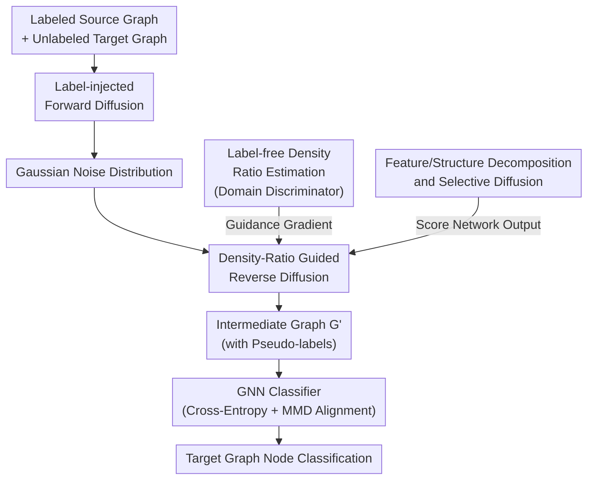

# Learning Structure-Semantic Evolution Trajectories for Graph Domain Adaptation

**Conference**: ICLR 2026  
**arXiv**: [2602.10506](https://arxiv.org/abs/2602.10506)  
**Code**: [DiffGDA](https://github.com/chenwei23/DiffGDA)  
**Area**: Other  
**Keywords**: Graph Domain Adaptation, Diffusion Model, SDE, Continuous Evolution, Domain-Aware Guidance

## TL;DR

This paper proposes DiffGDA—the first method to introduce diffusion models into Graph Domain Adaptation (GDA). It models the joint continuous-time structure-semantic evolution from source graphs to target graphs using Stochastic Differential Equations (SDEs), driven by a density-ratio-based domain-aware guidance network toward the target domain. Theoretically proven to converge to the optimal adaptation path, it outperforms SOTA methods across 14 transfer tasks on 8 real-world datasets.

## Background & Motivation

**Problem Definition**: Graph Domain Adaptation (GDA) aims to transfer knowledge from labeled source graphs to unlabeled target graphs to solve cross-domain distribution shifts. This paper focuses on node-level GDA tasks.

**Existing Paradigms**: There are two main GDA paradigms: (1) Model-oriented methods (learning domain-invariant representations via MMD, adversarial training), which assume limited structural changes and fail under large structural discrepancies; (2) Data-oriented methods (constructing intermediate graphs to bridge the structural gap), which rely on discrete alignment steps and are limited by a fixed number of steps.

**Limitations of Prior Work**: The structure of real-world graphs is driven by complex processes such as social dynamics, citation growth, and knowledge diffusion, making evolution continuous and non-linear. Fixed-step discrete alignment cannot approximate the actual transformation process, especially when facing unlabeled graphs where structure and semantics lack explicit anchors for alignment.

**Key Insight**: Continuous-time modeling (1) represents structural changes as smooth temporal trajectories, flexibly adapting to non-linear heterogeneous topologies; (2) allows semantic information to evolve continuously along the transformation path, enabling the model to automatically learn the optimal alignment trajectory.

**Core Idea**: Diffusion models have achieved great success in capturing complex distribution transformations. The SDE framework can represent cross-graph transfer as a continuous probability flow—naturally unifying structure and semantic adaptation.

**Background**: Existing graph diffusion models primarily focus on symmetric diffusion processes (generative tasks). GDA requires asymmetric diffusion (directional transfer from source to target domain), a direction previously unexplored in the GDA field.

## Method

### Overall Architecture

DiffGDA reformulates "transferring from source to target graphs" as a continuous-time stochastic evolution: first, a forward SDE gradually noises the labeled source graph into a Gaussian distribution; then, a reverse SDE samples back from the noise. Crucially, the reverse process does not recover the source graph but is steered by a domain-aware guidance network toward the target domain distribution, resulting in an intermediate graph $\mathbf{G}'$ with pseudo-labels. Finally, a GNN classifier is trained on this intermediate graph (using cross-entropy + MMD alignment), with joint optimization of diffusion and classification parameters to apply adapted knowledge to unlabeled target nodes. The pipeline consists of three stages: "Forward Noising → Guided Reverse Sampling → Intermediate Graph Classification," where reverse sampling is steered by a density-ratio guidance network and implemented by a decomposed score network:

### Key Designs

**1. Label-injected Forward Diffusion: Creating inherently labeled intermediate graphs**

Standard graph diffusion only noises features/structures, losing source labels after sampling and requiring additional label propagation. DiffGDA concatenates node features $\mathbf{X}^{\mathcal{S}}$ and labels $\mathbf{Y}^{\mathcal{S}}$ along the channel dimension into augmented features $\tilde{\mathbf{X}}^{\mathcal{S}} = [\mathbf{X}^{\mathcal{S}} \,\|\, \mathbf{Y}^{\mathcal{S}}] \in \mathbb{R}^{N_{\mathcal{S}} \times (F+C)}$. Subjection labels and features to forward SDE $\mathrm{d}\mathbf{G}^{\mathcal{S}}_t = \mathbf{f}_t(\mathbf{G}^{\mathcal{S}}_t)\mathrm{d}t + g_t(\mathbf{G}^{\mathcal{S}}_t)\mathrm{d}\mathbf{w}$ allows them to be recovered together. Thus, the sampled intermediate graph $\mathbf{G}'=(\mathbf{X}',\mathbf{A}',\mathbf{Y}')$ directly carries label dimensions, eliminating the need for separate label propagation and providing existing anchors for subsequent supervision.

**2. Domain-Aware Guided Reverse Diffusion: Steering evolution instead of target generation**

The challenge lies in the lack of alignment anchors in the unlabeled target domain; simple reverse recovery returns to the source distribution. DiffGDA’s reverse SDE injects an additional guidance force toward the target domain alongside the standard score term. According to Theorem 1, the optimal diffusion network for the target graph satisfies:

$$\mathbb{P}(\boldsymbol{\ell}^{\star}) = \nabla_{\mathbf{G}_t^{\mathcal{S}}} \log p_t(\mathbf{G}_t^{\mathcal{S}}) + \nabla_{\mathbf{G}_t^{\mathcal{S}}} \log \mathbb{E}_{p(\mathbf{G}_0^{\mathcal{S}}|\mathbf{G}_t^{\mathcal{S}})} \frac{q(\mathbf{G}_0^{\mathcal{T}})}{p(\mathbf{G}_0^{\mathcal{S}})}$$

The first term is the source graph's score function (estimated by score network $\mathbb{P}(\boldsymbol{\ell})$ as $\nabla\log p_t$), and the second is the log-gradient of the target/source density ratio $q/p$—the guidance signal that pushes the trajectory toward the target domain, learned by guidance network $\mathbb{Q}(\boldsymbol{\delta})$. This decomposition allows starting from the source graph and retaining its labels while continuously evolving toward the target domain based on density ratio gradients.

**3. Label-free Density Ratio Estimation: Using domain discriminators instead of unknown true densities**

The density ratio $q/p$ involves the true target distribution, which is not directly computable. DiffGDA trains a GNN classifier $\mathcal{C}_{\text{gnn}}$ to distinguish whether a node belongs to the source or target domain. Its output probability $\mathbf{y}(\mathbf{x})$ approximates the density ratio as $q/p \approx (1-\mathbf{y}(\mathbf{x}))/\mathbf{y}(\mathbf{x})$. This simplifies the difficult task of estimating the ratio of two high-dimensional distributions into a binary classification problem trainable with unlabeled samples.

**4. Feature/Structure Decomposition and Selective Diffusion: Balancing accuracy and computation**

Graphs contain both continuous node features and discrete adjacency structures, which are difficult for a single network to manage. DiffGDA splits the score network into $\mathbb{P}(\boldsymbol{\ell}_1)$ (node feature score, using MLP+GNN) and $\mathbb{P}(\boldsymbol{\ell}_2)$ (adjacency score, using MLP+Graph Multi-Head Attention GMH). Similarly, the guidance network is split into feature-domain estimation $\mathbb{Q}(\boldsymbol{\delta}_1)$ and structure-domain estimation $\mathbb{Q}(\boldsymbol{\delta}_2)$ (both lightweight MLPs). Additionally, a hyperparameter $\alpha$ controls the diffusion ratio, applying diffusion only to a subset of nodes to balance information retention with memory/time overhead—allowing it to run twice as fast as comparable graph generation methods.

### Loss & Training

After obtaining the labeled intermediate graph $\mathbf{G}'=(\mathbf{X}',\mathbf{A}',\mathbf{Y}')$, the GNN classifier applies MMD alignment in addition to cross-entropy supervision to pull intermediate representations closer to target representations:

$$\mathcal{L}_{\text{GNN}} = \mathcal{L}_{\text{CE}}(\text{GNN}(\mathbf{X}', \mathbf{A}'), \mathbf{Y}') + \eta \mathcal{L}_{\text{MMD}}(\text{GNN}(\mathbf{X}', \mathbf{A}'), \text{GNN}(\mathbf{X}^{\mathcal{T}}, \mathbf{A}^{\mathcal{T}}))$$

where $\eta$ balances the terms. The diffusion networks and GNN parameters are optimized end-to-end, allowing the evolution trajectory and downstream classification to mutually calibrate.

## Key Experimental Results

### Main Results

#### Table 1: 6 Transfer Tasks in the Citation Domain (Mi-F1/Ma-F1)

| Method | A→C | A→D | C→A | C→D | D→A | D→C | Average |
|------|-----|-----|-----|-----|-----|-----|------|
| GCN | 70.82 | 65.05 | 65.44 | 69.46 | 59.92 | 66.83 | 64.83 |
| UDAGCN | 80.68 | 74.66 | 73.46 | 76.97 | 69.36 | 77.81 | 75.03 |
| A2GNN(AAAI'24) | 80.93 | 75.94 | 75.09 | 77.16 | 73.21 | 79.72 | 75.97 |
| TDSS(AAAI'25) | 80.41 | 74.04 | 72.88 | 77.23 | 72.38 | 79.04 | 75.72 |
| GAA(ICLR'25) | 80.03 | 73.32 | 73.15 | 76.04 | 68.32 | 78.27 | 72.65 |
| **Ours (DiffGDA)** | **82.28** | **76.70** | **75.75** | **78.11** | **74.55** | **80.71** | **77.58** |

#### Table 2: 6 Transfer Tasks in the Airport Domain (Mi-F1/Ma-F1)

| Method | U→B | U→E | B→U | B→E | E→U | E→B | Average |
|------|-----|-----|-----|-----|-----|-----|------|
| AdaGCN | 65.65 | 50.63 | 46.87 | 54.44 | 48.62 | 73.74 | 56.17 |
| GraphAlign(KDD'24) | 62.54 | 52.18 | 50.33 | 55.23 | 54.35 | 71.02 | 56.39 |
| TDSS(AAAI'25) | 67.43 | 52.05 | 47.62 | 51.80 | 46.08 | 55.73 | 49.24 |
| **Ours (DiffGDA)** | **71.76** | **54.18** | **54.37** | **57.15** | **56.20** | **74.81** | **60.75** |

#### Runtime Comparison (Table 3)

| Method | A→D Total (s) | A→D Mi-F1 | A→C Total (s) | A→C Mi-F1 |
|------|-------------|-----------|-------------|-----------|
| UDAGCN | 83.19 | 67.52 | 104.91 | 72.64 |
| GraphAlign | 269.65 | 70.14 | 297.15 | 76.62 |
| **DiffGDA** | **126.73** | **73.41** | **125.41** | **80.23** |

DiffGDA reduces runtime by over 50% compared to GraphAlign (also a generative method) while achieving superior performance.

## Key Findings

1. **Continuous Superior to Discrete**: DiffGDA consistently outperforms methods based on discrete intermediate graphs (GraphAlign, GGDA) in all 14 tasks, proving the fundamental advantage of continuous-time evolution in capturing non-linear structural differences.
2. **Guidance is Crucial**: Ablation studies (Figure 2) show that removing the domain-aware guidance network leads to the largest performance drop, as unguided diffusion cannot automatically steer toward the target domain.
3. **Complementary Components**: The guidance network stabilizes the diffusion path, MMD promotes cross-domain alignment, and adjacency constraints maintain structural dependencies—all three are essential.
4. **Robust Diffusion Steps**: Convergence is achieved with T=40-80 steps; excessive T yields diminishing returns. The sampling ratio $\alpha$ should be adjusted according to graph size.
5. **Clearer Representation Space**: t-SNE visualizations (Figure 5) show that DiffGDA generates more compact and well-separated clusters, effectively eliminating domain-irrelevant noise.

## Highlights & Insights

- **"First Introduction of Diffusion to GDA"**: A pioneering work using SDE diffusion processes to unify structure and semantic adaptation.
- **Density-Ratio Guidance**: Instead of generating from noise, it starts from the source graph and uses density-ratio gradients to steer evolution while preserving source labels.
- **Label-Injected Diffusion**: Concatenating labels with features allows the generated intermediate graph to inherently possess labels, bypassing extra label propagation.
- **Theory + Practice**: Provides a theoretical proof of optimal convergence (Theorem 1) while achieving SOTA results across 14 tasks.
- **Selective Diffusion**: Diffusing only a fraction of nodes (controlled by $\alpha$) balances efficiency with information retention.

## Limitations & Future Work

- **Scalability**: Constrained by GPU memory on large graphs, requiring small sampling ratios ($\alpha$). OOM occurred in the Airport domain when $\alpha > 50\%$.
- **MMD Overhead**: The necessity of MMD alignment post-diffusion suggests that diffusion alone may not fully eliminate the domain gap.
- **Weight Sensitivity**: Performance declines as $\eta$ increases, indicating that overly strong alignment leads to over-regularization.
- **Task Generalization**: Only validated on node classification; generalization to graph classification or link prediction remains untested.

## Related Work & Insights

| Dimension | GraphAlign(KDD'24) | DiffGDA |
|------|-------------------|---------|
| Alignment | Discrete Intermediate Graphs | SDE Continuous Evolution |
| Paradigm | Data-oriented (Fixed Steps) | Generative (Continuous Time) |
| Citation Avg | 67.41 | **77.58** |
| Runtime | Slowest (High Generation Cost) | 50%+ Reduction |

| Dimension | A2GNN(AAAI'24) | DiffGDA |
|------|---------------|---------|
| Core Idea | Adversarial + Attention | Diffusion + Domain Guidance |
| Paradigm | Model-oriented | Generative (Data-oriented) |
| Citation Avg | 75.97 | **77.58** |
| Airport Avg | 49.57 | **60.75** |
| Structure Gap Adaptation | Moderate | Strong (Continuous/Non-linear) |

| Dimension | GAA(ICLR'25) | DiffGDA |
|------|-------------|---------|
| Core Idea | Graph Augmentation + Alignment | SDE Diffusion + Domain Guidance |
| Citation Avg | 72.65 | **77.58** |
| Airport Avg | 51.98 | **60.75** |

## Rating

- **Novelty**: ⭐⭐⭐⭐⭐ First to introduce diffusion models to GDA; pioneering use of SDE for continuous evolution.
- **Experimental Thoroughness**: ⭐⭐⭐⭐⭐ Comprehensive evaluation on 8 datasets and 14 tasks with 16 baselines and significance tests (p < 0.05).
- **Writing Quality**: ⭐⭐⭐⭐ Clear mathematical derivations, intuitive framework diagrams, and consistent notation.
- **Value**: ⭐⭐⭐⭐ Opens a new paradigm for continuous graph domain adaptation, though large-scale scalability needs improvement.

<!-- RELATED:START -->

## Related Papers

- [\[ICLR 2026\] Learning Adaptive Distribution Alignment with Neural Characteristic Function for Graph Domain Adaptation](learning_adaptive_distribution_alignment_with_neural_characteristic_function_for.md)
- [\[ICLR 2026\] Distributionally Robust Classification for Multi-Source Unsupervised Domain Adaptation](distributionally_robust_classification_for_multi-source_unsupervised_domain_adap.md)
- [\[ICLR 2026\] Robust Equation Structure Learning with Adaptive Refinement (RESTART)](robust_equation_structure_learning_with_adaptive_refinement.md)
- [\[ICLR 2026\] Noise-Aware Generalization: Robustness to In-Domain Noise and Out-of-Domain Generalization](noise-aware_generalization_robustness_to_in-domain_noise_and_out-of-domain_gener.md)
- [\[AAAI 2026\] LeanRAG: Knowledge-Graph-Based Generation with Semantic Aggregation and Hierarchical Retrieval](../../AAAI2026/others/leanrag_knowledge-graph-based_generation_with_semantic_aggregation_and_hierarchi.md)

<!-- RELATED:END -->
