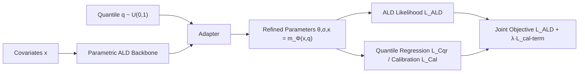

# Learning Survival Distributions with Individually Calibrated Asymmetric Laplace Distribution

**Conference**: ICLR 2026  
**OpenReview**: [https://openreview.net/forum?id=frv3s3AtUD](https://openreview.net/forum?id=frv3s3AtUD)  
**Code**: [https://github.com/demingsheng/ICALD](https://github.com/demingsheng/ICALD)  
**Area**: Survival Analysis / Probabilistic Methods / Uncertainty Calibration  
**Keywords**: Survival Analysis, Individual Calibration, Asymmetric Laplace Distribution, Quantile Regression, pinball loss, PAIC  

## TL;DR
This paper proposes ICALD, which reinterprets the pinball loss of quantile regression as the negative log-likelihood (NLL) of the Asymmetric Laplace Distribution (ALD). This allows a parametric framework to simultaneously capture the smoothness of parametric methods and the flexibility of non-parametric methods. It theoretically proves that the resulting survival model is "Probably Approximately Individually Calibrated" (PAIC) and outperforms 12 baselines across accuracy, concordance, and especially fine-grained calibration.

## Background & Motivation
**Background**: Survival analysis models time-to-event (e.g., patient survival, equipment failure). Methods are typically categorized by distributional assumptions into parametric (Exponential/Weibull/Log-normal/ALD), semi-parametric (Cox proportional hazards), or non-parametric (RSF, GBM, DeepHit, CQRNN). Recently, neural network variants (DeepSurv, DeepHit, CQRNN) have significantly increased expressive power, but evaluation focuses almost exclusively on **prediction accuracy** and **concordance** (risk ranking).

**Limitations of Prior Work**: Calibration (whether predicted survival probabilities are trustworthy) has been severely neglected, particularly **fine-grained individual calibration**. Calibration can be divided into three levels: average calibration (matching the entire test set), group calibration (matching sub-groups), and individual calibration (matching the predicted CDF for each patient $x$). Individual calibration is critical for high-stakes decisions, such as determining if a specific patient qualifies for high-risk intervention, yet it is the most difficult to achieve.

**Key Challenge**: Existing ALD routes have distinct drawbacks. **Non-parametric quantile regression (CQRNN)**: Each head estimates a single quantile $y_q$; sparse quantile grids lead to approximation errors, while dense grids require training multiple independent models, which is expensive and lacks global consistency, often resulting in "quantile crossing" (where higher quantile predictions are lower than lower ones, violating $\tilde y_{q_1} \ge \tilde y_{q_2}$). **Parametric ALD**: Closed-form PDF/survival functions provide smoothness and efficiency, but fitting a single ALD to the entire distribution is too rigid, leading to tail approximation errors or "distribution mismatch"—where the estimated distribution systematically deviates from the truth.

**Goal**: To retain the smooth closed-form benefits of parametric methods while gaining the per-quantile flexibility of non-parametric methods, providing theoretical guarantees for individual calibration.

**Core Idea**: **`Probabilistic reparameterization from pinball loss to ALD`** — First, prove that pinball loss is essentially the NLL of the ALD in its quantile form. Thus, quantile regression and parametric ALD are two sides of the same coin. Next, make the ALD parameters dependent on a randomly sampled quantile $q$, transforming the model into a "continuous mixture of ALDs" and using a quantile regression loss to enforce individual calibration.

## Method

### Overall Architecture
ICALD uses a **parametric ALD backbone** to ensure a globally continuous and smooth distribution, supplemented by an **adapter module** that takes a quantile $q$ as input. The adapter outputs refined ALD parameters $\{\theta,\sigma,\kappa\}=m_\Phi(x,q)$. During training, $q \sim U(0,1)$ is randomly sampled for each instance, and the model optimizes a "Full-distribution ALD likelihood" combined with the "quantile regression loss at $q$." At inference, averaging over 2000 sampled $q$ values is equivalent to a continuous mixture of ALDs. This framework supports both **pre-calibration** and **post-calibration** deployment with two equivalent loss functions.

### Key Designs

**1. pinball loss = ALD NLL: Unifying Parametric and Non-parametric:** This is the probabilistic foundation. The pinball loss used in quantile regression, $L_{\text{pinball}}(y;\Phi,q)=(y-m_{\Phi,q}(x))(q-\mathbb{I}[m_{\Phi,q}(x)>y])$, is proved to be equal (up to a constant) to the NLL of the ALD quantile form $\mathrm{AL}(\theta=\tilde y_q,\sigma=1,q)$. This relationship allows "pointwise quantile estimation" to be seamlessly upgraded to "parametric distribution estimation" using the asymmetric form $\mathrm{AL}(\theta,\sigma,\kappa)$ (where $q=\kappa^2/(1+\kappa^2)$). The loss becomes the negative log-likelihood with censoring $L_{\text{ALD}}=-\sum_{D_O}\log f_{\text{ALD}}-\sum_{D_C}\log S_{\text{ALD}}$.

**2. Quantile-Conditioned Continuous Mixture of ALDs:** To escape the rigidity of a single ALD and the independence of multi-head models, ICALD passes $q$ to the adapter to produce $m_\Phi(x,q)$. The training objective is $L_{\text{ALD+Cqr}}(y;\Phi)=L_{\text{ALD}}(y;\Phi)+\lambda L_{\text{Cqr}}(y;\Phi,q)$. The ALD likelihood captures the overall shape of the conditional distribution, while the quantile regression term performs local calibration at each random $q$. Marginalizing over $q$ yields a continuous mixture $\int dq\,p(q)f_{\text{ALD}}(y;m_\Phi(x,q))$. While no longer a single ALD, its CDF remains closed-form.

**3. Equivalent Losses and PAIC Guarantees:** The authors introduce an equivalent calibration loss defined directly on the predicted CDF: $L_{\text{Cal}}(y;\Phi,q)=|F_\Phi(y|x,q)-q|$, leading to the objective $L_{\text{ALD+Cal}}=L_{\text{ALD}}+\lambda L_{\text{Cal}}$. By treating $q$ as an input, they evaluate calibration across all quantiles, extending PAIC to **Monotonic PAIC (MPAIC)**. Theorem 1 proves MPAIC is a sufficient condition for PAIC, showing that ICALD trained with these losses is $(\epsilon,\delta)$-MPAIC. Theorem 2 shows that increased sampling of $q$ improves the Monte Carlo approximation and individual calibration.

**4. Decoupled Pre-calibration and Post-calibration:** Pre-calibration may face "asynchronous convergence" between likelihood and calibration losses on heavy-tailed data; this is mitigated via warm-up training. **Post-calibration** is a lighter alternative, decoupling the base model $m_\Phi^{\text{Base}}(x)$ from a post-calibration adapter $m_\Phi^{\text{Post}}(x,q)$, where the adapter outputs element-wise scaling factors $\gamma \in \mathbb{R}^3$ for the ALD parameters. This post-calibrator is architecture-agnostic and can be applied to other models like RSF or DeepSurv as a universal calibrator.

## Key Experimental Results
Evaluation spans **14 synthetic and 7 real-world datasets** (healthcare/oncology), using 7 metrics across accuracy, concordance, and calibration. ICALD is compared against 9 strong baselines and 3 specialized calibration methods (X-CAL, CSD, CiPOT).

### Main Results (Pre-calibration ICALD, Win/Loss/Tie count, 56 pairwise comparisons)

| Comparison | better | worse | equal | Insight |
|---|---|---|---|---|
| $L^{\text{Pre}}_{\text{ALD+Cal}}$ vs $L_{\text{ALD}}$ | 22 | 0 | 34 | Calibration term never hurts; ~39% significantly better. |
| $L^{\text{Pre}}_{\text{ALD+Cal}}$ vs $L_{\text{Cqr}}$ | 23 | 1 | 32 | Almost universally outperforms pure quantile regression. |
| $L^{\text{Pre}}_{\text{ALD+Cal}}$ vs $L^{\text{Pre}}_{\text{ALD+Cqr}}$ | 36 | 0 | 20 | Cal loss wins 64.3%, significantly better than Cqr loss. |
| $L^{\text{Pre}}_{\text{ALD+Cal}}$ vs $L^{\text{Pre}}_{\text{X-CAL}}$ | 25 | 3 | 28 | Superior to pre-calibration baseline X-CAL in half the cases. |

### Post-calibration Results ($L^{\text{Post}}_{\text{ALD+Cal}}$ comparison)

| Comparison | better | worse | equal | Insight |
|---|---|---|---|---|
| vs $L^{\text{Post}}_{\text{ALD+Cqr}}$ (Avg Cal) | 16 | 1 | 4 | Cal loss post-calibration outperforms Cqr. |
| vs $L^{\text{Post}}_{\text{ALD+CSD}}$ (Avg Cal) | 14 | 5 | 2 | Superior to post-calibration baseline CSD. |
| vs $L^{\text{Post}}_{\text{ALD+CiPOT}}$ (Avg Cal) | 11 | 3 | 7 | Superior to post-calibration baseline CiPOT. |

### Key Findings
- **Calibration loss $L_{\text{Cal}}$ is superior to quantile regression loss $L_{\text{Cqr}}$**: Direct CDF optimization is consistently more effective.
- **Calibration does not sacrifice accuracy/concordance**: Accuracy and ranking metrics are often simultaneously improved.
- **Post-calibration is effective and simple**: It avoids training conflicts and outperforms specialized methods as a plug-and-play step.
- **Individual calibration is the primary beneficiary**: ICALD's design is most effective at the finest granularity of calibration.
- **Theoretical and empirical consistency**: The equivalence of the two loss functions is supported by the results.

## Highlights & Insights
- **Leveraging a single equivalence relationship**: Identifying pinball loss as ALD NLL bridges non-parametric and parametric routes elegantly.
- **MPAIC → PAIC Bridge**: Converting individual calibration into a monotone quantile problem via model inputs provides a clean theoretical loop.
- **Closed-form CDF for Mixture**: Maintains clinical utility by allowing direct calculation of survival curves and individual-level factor attribution via SHAP.
- **Universal Calibrator**: The post-calibration module is model-agnostic, potentially improving any survival model that outputs a CDF.

## Limitations & Future Work
- **Friction with Non-parametric Models**: Applying the post-calibrator to models like RSF requires continuous interpolation and non-crossing constraints.
- **Asynchronous Convergence**: Heavy-tailed data can still pose challenges for joint optimization of likelihood and calibration.
- **Inference Cost**: Evaluating continuous mixtures via 2000 samples increases computational overhead.
- **Monotonicity Assumptions**: Relies on the model being monotonic relative to $q$, which may require sorting corrections.
- **Dataset Scale**: Primarily focused on tabular data; scalability to high-dimensional inputs (images/text) remains to be fully explored.

## Related Work & Insights
- **Parametric Survival**: Improves upon previous ALD and DSM approaches by solving the distribution mismatch problem.
- **Calibration Theory**: Builds upon PAIC definitions (Zhao et al. 2020) and hierarchical calibration levels (Gneiting et al. 2007).
- **Insight**: The paradigm of "interpreting a loss as a distribution's NLL" is a powerful tool for bridging different methodological camps and is transferable to other uncertainty quantification tasks.

## Rating
- **Novelty**: ⭐⭐⭐⭐ — The pinball-ALD equivalence and MPAIC bridging are significant conceptual contributions.
- **Experimental Thoroughness**: ⭐⭐⭐⭐ — Comprehensive across many datasets and baselines; primarily tabular.
- **Writing Quality**: ⭐⭐⭐⭐ — Logical flow from theory to deployment is clear.
- **Value**: ⭐⭐⭐⭐ — Strong potential for clinical application due to focus on individual calibration.

<!-- RELATED:START -->

## Related Papers

- [\[ICLR 2026\] Learning Distributions over Permutations and Rankings with Factorized Representations](learning_distributions_over_permutations_and_rankings_with_factorized_representa.md)
- [\[ICLR 2026\] Learning Adaptive Distribution Alignment with Neural Characteristic Function for Graph Domain Adaptation](learning_adaptive_distribution_alignment_with_neural_characteristic_function_for.md)
- [\[ICLR 2026\] Bayesian Post Training Enhancement of Regression Models with Calibrated Rankings](bayesian_post_training_enhancement_of_regression_models_with_calibrated_rankings.md)
- [\[ICCV 2025\] Joint Asymmetric Loss for Learning with Noisy Labels](../../ICCV2025/others/joint_asymmetric_loss_for_learning_with_noisy_labels.md)
- [\[ICLR 2026\] DA-AC: Distributions as Actions — A Unified RL Framework for Diverse Action Spaces](distributions_as_actions_a_unified_framework_for_diverse_action_spaces.md)

<!-- RELATED:END -->
