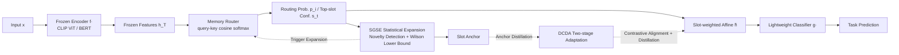

# MaRS: Memory-Adaptive Routing for Reliable Capacity Expansion and Knowledge Retention

**Conference**: ICLR 2026  
**OpenReview**: [https://openreview.net/forum?id=GGrLeik2qo](https://openreview.net/forum?id=GGrLeik2qo)  
**Code**: To be confirmed  
**Area**: Continual Learning / Lifelong Learning, Parameter-Efficient Fine-Tuning  
**Keywords**: continual learning, frozen pre-trained models, slot routing, statistical expansion, knowledge distillation  

## TL;DR
MARS attaches a slot memory router to a frozen large-scale backbone, employing statistical hypothesis testing (SGSE) to decide "when to expand" and a two-stage contrastive-distillation process (DCDA) to determine "how to merge." It balances plasticity and stability without replaying original data, offering formalized guarantees for both expansion and forgetting.

## Background & Motivation
- **Background**: Large Pre-trained Models (LPMs) such as CLIP and BERT have become universal backbones for vision and language tasks. The mainstream approach in Continual Learning (CL) involves freezing the backbone and fine-tuning only lightweight task modules (Adapters, Prompts, LoRA) to save computation and preserve generalization.
- **Limitations of Prior Work**: The stability-plasticity contradiction is amplified under a frozen backbone—adaptation occurs only in shallow modules, limiting plasticity, while the fixed backbone exacerbates catastrophic forgetting. Existing methods have inherent flaws: replay methods raise privacy and storage concerns; regularization methods suffer from signal decay over cumulative tasks; dynamic expansion relies on heuristic triggers leading to unconstrained growth; and prototype-based methods are fragile under distribution shifts.
- **Key Challenge**: While existing CL methods on frozen LPMs have proven feasible, they **lack principled and guaranteed mechanisms for expansion and retention**—the timing and scale of expansion and the prevention of forgetting rely on ad-hoc rules.
- **Goal**: To equip the questions of "when to expand" and "how to merge new capacity" with statistically and theoretically provable mechanisms, allowing slot routing to be controllable while retaining old knowledge.
- **Key Insight**: **[Decoupling Representation and Capacity]** Decouple "stable representation" (frozen encoder) from "adaptive capacity" (expandable slots), shifting CL control to the routing layer; **[Statistical Expansion]** Model expansion as a statistical decision with guaranteed false alarm rates and detection latency; **[Replay-free Retention]** Use slot anchors as compressed proxies for old knowledge to perform distillation, bypassing the need for original sample replay.

## Method

### Overall Architecture
MARS consists of three components: a frozen encoder $f(\cdot)$ providing stable features $h_T=f(x)$; a slot-based memory router that dynamically assigns inputs to expandable memory slots, where each slot is a set of affine parameters $(\gamma_i,\beta_i)$ acting as an independent adapter (initialized as identity mappings $\gamma_i=1,\beta_i=0$); and a lightweight classifier $g(\cdot)$ for predictions. Two mechanisms are integrated: SGSE manages "when and where to expand slots," and DCDA manages "how to integrate new slots without forgetting."

### Key Designs

**1. Router and Slot-weighted Affine: Shifting CL control to the routing layer.** Given an input $x_t$, the query $q(x_t)=W_qh_T$ is computed, followed by a cosine-softmax over normalized slot keys $\hat k_i$ to obtain routing probabilities $p_i(x_t)=\frac{\exp(\langle\hat q,\hat k_i\rangle/\tau_r)}{\sum_j \exp(\langle\hat q,\hat k_j\rangle/\tau_r)}$ ($\tau_r=0.07$). The top-slot confidence $s_t=\max_i p_i(x_t)$ measures the "certainty" of the router: covered inputs yield $s_t\approx 1$, while novel inputs yield low $s_t$ due to probability dispersion. The slot outputs are probability-weighted and transformed via $\tilde h=\big(\sum_i p_i\gamma_i\big)\odot\mathrm{LN}(h_T)+\big(\sum_i p_i\beta_i\big)$. Prop.1 proves that $s_t$ is strictly monotonic with respect to the optimal slot similarity $c_t$ given fixed competitive similarity, making $s_t$ a **calibrated local novelty statistic** rather than a heuristic threshold.

**2. SGSE: Statistical testing for "when to expand" with false alarm guarantees.** Direct thresholding of $s_t$ is unreliable due to noise and non-stationarity. SGSE uses exponential smoothing to track the $(1-\epsilon)$ quantile of recent confidence: $Q_t=\beta Q_{t-1}+(1-\beta)q_t$ ($\beta=0.9, w=10, \epsilon=0.1$). Thm.1 proves $Q_t$ converges to the long-term quantile in the $L^2$ sense, with a predictable detection latency of $O((1-\beta)^{-1})$. Success rates $\hat p_t$ of Bernoulli trials $\{s_t\ge Q_t\}$ are monitored; expansion occurs only when the **one-sided Wilson confidence lower bound** drops below a threshold: $\mathrm{LB}(\hat p_t;n,z)$ ($n=20, z=1.645$, 95% one-sided). Cor.1 ensures the probability of erroneous expansion in each test is $\le\alpha$, making expansion data-driven rather than noise-triggered.

**3. DCDA: Two-stage contrastive-distillation for integration and retention.** Adaptation is split into two steps. **Stage 1 (Memory Update Only)** freezes the classifier $g$ and updates $(W_q,K,\gamma,\beta)$ using a supervised contrastive loss $L_{\text{supcon}}$ to separate classes, combined with a smoothing term $L_{\text{smooth}}=\frac1N\sum\|\tilde h_i-h_{T,i}\|_2^2$ to suppress feature drift: $L^{(1)}=L_{\text{supcon}}+\lambda_{\text{smooth}}L_{\text{smooth}}$ ($\lambda_{\text{smooth}}=0.3$). **Stage 2 (Classifier Update Only)** fixes memory and trains $g$ with cross-entropy, plus two distillation terms: LwF distillation $L_{\text{LwF}}$ on current inputs and anchor distillation $L_{\text{anchor}}$ on slot anchors ($T=3$): $L^{(2)}=L_{\text{CE}}+\lambda_{\text{LwF}}L_{\text{LwF}}+\lambda_{\text{anchor}}L_{\text{anchor}}$.

**4. Anchor Mechanism and Retention Guarantee: Compressed proxies instead of raw replay.** Slot statistics are maintained via routing-weighted EMA for $\mu_i, c_i$. Anchors are defined as $a_i=\gamma_i\odot\big(\mu_i/\max(c_i,\varsigma)\big)+\beta_i$, serving as compressed proxies for old distributions. Thm.2 uses Pinsker's inequality and classifier Lipschitz continuity to prove that if anchors approximate old features within a $\delta$-ball and distillation ensures anchor prediction consistency within $\eta$, the prediction bias for old classes is bounded by $O(\sqrt\eta+L\delta/T)$—providing **provable retention without original replay**. Prop.2/Thm.3 further prove that when the true number of novelties $N_T$ grows sublinearly, computation and memory also grow sublinearly ($E[S_T]\le S_0+N_T+\alpha M$), avoiding unbounded expansion.

## Key Experimental Results

### Main Results
Evaluated on CIFAR-100, Tiny-ImageNet (10 tasks each, class-incremental), and 19 ASC sentiment classification datasets. CLIP ViT-B/16 (frozen) is used for vision and BERT-base (frozen) for NLP. Average Accuracy $\bar A_T$ over 3 seeds is reported. Baselines are compared in "standard" (trainable backbone) and "frozen" settings.

| Algorithm | CIFAR-100 (Frozen) | Tiny-ImageNet (Frozen) | ASC (Frozen) |
|------|------|------|------|
| Fine-tune | 30.26 | 28.27 | 61.30 |
| EWC | 47.60 | 36.38 | 70.66 |
| DER++ | 51.72 | 40.87 | 75.91 |
| LDC | 53.95 | 43.41 | 75.49 |
| PASS++ | 52.92 | 42.53 | 75.22 |
| **MARS (Ours)** | **57.50** | **49.46** | **79.85** |

MARS leads across the board: it outperforms replay/regularization methods by ~3–5% on CIFAR-100/Tiny-ImageNet, with a significant relative gain (~+20%) over DER++ on Tiny-ImageNet. The gap between standard and frozen settings is typically only 1–2%, indicating that gains stem from capacity allocation and retention rather than backbone updates.

### Ablation Study (Tiny-ImageNet)

| Variant | Final Accuracy | Conclusion |
|------|------|------|
| Default | ~High | Complete MARS |
| No-SGSE | ~41% | Removing statistical expansion causes a sharp drop → Expansion is key for capacity. |
| No-Anchor | ~42% | Removing anchors causes a large drop → Anchors are vital for replay-free retention. |
| No-Stage1 | Decrease | Removing contrastive adaptation harms discriminativeness. |
| No-Stage2 | Decrease | Removing classifier distillation weakens retention. |

Hyperparameter sensitivity: $S_0=32$ is optimal; $\beta=0.9$ is the most stable ($\beta=0.5$ triggers expansion too early; $\beta=0.99$ is too slow).

### Key Findings
- Statistical expansion (SGSE) and replay-free anchor retention (DCDA) are the two pillars; removing either collapses performance to around 41–42%.
- Gains are independent of backbone trainability, confirming that "capacity allocation and retention" is the decisive factor for CL on frozen LPMs.

## Highlights & Insights
- **Upgrade from Heuristics to Statistical Testing**: Transforming "when to expand" into a hypothesis test using quantile tracking and Wilson lower bounds provides formal guarantees for false alarms ($\le\alpha$) and detection latency ($O((1-\beta)^{-1})$). This is a substantial advancement over ad-hoc dynamic expansion methods.
- **Provable Retention without Replay**: Anchors act as compressed proxies for old distributions. Combined with Pinsker and Lipschitz bounds, MARS limits the accuracy drop of old classes to $O(\sqrt\eta+L\delta/T)$, which is highly attractive for privacy-sensitive scenarios.
- **Controllable Complexity**: Compute and memory grow sublinearly relative to true novelty, theoretically avoiding the unbounded expansion seen in heuristic-based models.

## Limitations & Future Work
- The routing layer shifts control to shallow slot affines while the backbone remains frozen—the upper bound of expressivity is still constrained by the frozen backbone, which may struggle with domains significantly different from the pre-training distribution.
- While recommended values are provided for key hyperparameters ($S_0, \beta, \tau_r, \lambda$, and Wilson's $n, z$), the theoretical guarantees rely on i.i.d./stationary assumptions. Robustness under real-world non-stationary long-stream data needs further validation.
- Evaluation scale is moderate (10–19 tasks). Expansion behavior and memory growth curves over longer horizons and larger class counts warrant further empirical testing.

## Related Work & Insights
- **Replay/Regularization**: iCaRL, GEM, and DER++ rely on replay; EWC, SI, LwF, and MAS rely on constrained updates. MARS replaces replay with anchor distillation and replaces fixed regularization with statistical triggers.
- **Dynamic Expansion/Prototypes**: Progressive Nets, DEN, and CEAT lack principled "if/how much" expansion rules; prototype methods like PASS++ are fragile under drift. SGSE provides a guaranteed expansion criterion.
- **CL on Frozen LPMs**: L2P, DIKI, and CoLeCLIP demonstrate the value of frozen backbones + PEFT, but retention often relies on heuristic replay. MARS introduces bounded guarantees for retention.
- **Insight**: A promising paradigm is to rewrite long-standing empirical threshold decisions in CL (like expansion/retention) as sequential statistical tests with false alarm and latency guarantees.

## Rating
- **Novelty**: ⭐⭐⭐⭐ Modeling slot expansion as a statistical test with Wilson bounds and providing Pinsker-type retention bounds for anchors is highly original.
- **Experimental Thoroughness**: ⭐⭐⭐ Covers vision/NLP and standard/frozen settings with complete ablations; however, task sequences are of moderate scale, lacking stress tests for extremely long horizons.
- **Writing Quality**: ⭐⭐⭐⭐ Clear structure with a strong correspondence between methods, theorems, and takeaways. Math and guarantees are formally stated.
- **Value**: ⭐⭐⭐⭐ Provides a practical "controllable expansion + provable replay-free retention" framework for CL on frozen large models, with high potential for privacy-sensitive and streaming scenarios.

<!-- RELATED:START -->

## Related Papers

- [\[CVPR 2026\] DREAM: Document Recognition with Explicit Adaptive Memory](../../CVPR2026/others/dream_document_recognition_with_explicit_adaptive_memory.md)
- [\[ICLR 2026\] Forget Forgetting: Continual Learning in a World of Abundant Memory](forget_forgetting_continual_learning_in_a_world_of_abundant_memory.md)
- [\[ICLR 2026\] Adaptive Conformal Guidance for Learning under Uncertainty](adaptive_conformal_guidance_for_learning_under_uncertainty.md)
- [\[ICLR 2026\] Hippoformer: Integrating Hippocampus-inspired Spatial Memory with Transformers](hippoformer_integrating_hippocampus-inspired_spatial_memory_with_transformers.md)
- [\[ACL 2025\] Adaptive Retrieval without Self-Knowledge? Bringing Uncertainty Back Home](../../ACL2025/others/adaptive_retrieval_without_self-knowledge_bringing_uncertainty_back_home.md)

<!-- RELATED:END -->
