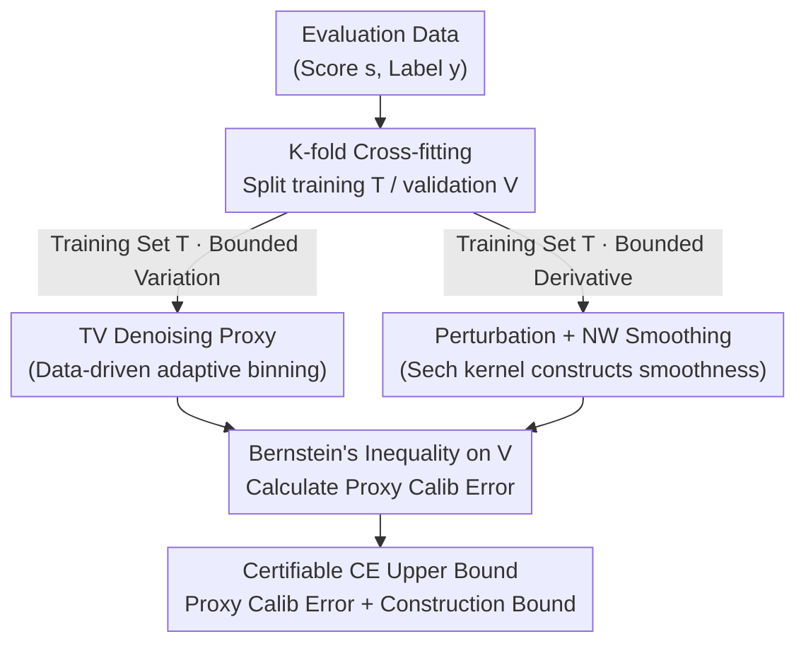

# Measuring Uncertainty Calibration

**Conference**: ICLR 2026  
**arXiv**: [2512.13872](https://arxiv.org/abs/2512.13872)  
**Code**: [GitHub](https://github.com/spotify-research/calibration)  
**Area**: Machine Learning Theory / Calibration  
**Keywords**: Calibration Error, Finite-sample Bound, Distribution-free, Bounded Variation, Kernel Estimation

## TL;DR

Addressing the finite-sample estimation problem of $L_1$ calibration error for binary classifiers, this work proposes the first non-asymptotic, distribution-free certifiable upper bounds under two structural assumptions: bounded variation and bounded derivatives. The latter is constructively guaranteed by applying minor perturbations to classifier outputs. Experiments demonstrate that the calibration error upper bound can be controlled at approximately 0.02 with $10^7$ samples.

## Background & Motivation

**Background**: Whether the output probabilities of machine learning models match real event probabilities—known as calibration—is critical for decision-making tasks. The most common metric, ECE (Expected Calibration Error), is estimated by binning model outputs and calculating the mean error within each bin. However, this method is highly sensitive to the choice of binning scheme, where different bin counts and partitioning strategies yield drastically different estimates.

**Limitations of Prior Work**: Existing calibration measurement methods face a fundamental dilemma. If binning is treated as a post-hoc plugin, the estimate is unreliable and entirely dependent on the bin configuration (confirmed by Arrieta-Ibarra et al., 2022). If binning is an integral part of the classifier, performance suffers because gradients cannot backpropagate through discrete bin boundaries during training. Another class of methods (e.g., KS test, Kuiper test) models calibration as frequentist hypothesis testing; while statistically powerful, they only determine "perfect calibration" and cannot quantify the degree of miscalibration, and their theoretical guarantees rely on asymptotic analysis. Fundamentally, Lee et al. (2023) proved that even assuming the calibration function is continuous is insufficient for consistent estimation of calibration error from finite samples.

**Key Challenge**: Calibration error estimation requires structural assumptions on the calibration function $\eta(s) = \mathbb{E}[Y|S=s]$. If the assumptions are too strong, the method's applicability is limited; if too weak, sample efficiency is poor and bounds are loose. How can one achieve a proper balance between assumption strength and estimation precision?

**Goal**: To provide computable, theoretically guaranteed upper bounds for calibration error that satisfy three core requirements: (1) non-asymptotic—holding for any finite sample size, (2) distribution-free—not restricting the form of the score distribution, and (3) practically feasible—producing meaningful bounds under reasonable computation and data volumes.

**Key Insight**: The authors observe that while estimating calibration error for arbitrary $\eta$ is impossible, guarantees can be provided under two realistic and verifiable structural assumptions. The first is Bounded Variation (weak but general), and the second is Bounded Derivative (stronger but constructively guaranteed via perturbation).

**Core Idea**: By constructing a proxy $\hat{\eta}$ for the calibration function (via TV denoising or Nadaraya-Watson kernel smoothing), the calibration error is decomposed into "proxy calibration error + proxy construction error," both of which can be calculated from data and upper-bounded using Bernstein's inequality.

## Method

### Overall Architecture

To calculate a certifiable upper bound for the calibration error $\text{CE} = \mathbb{E}_s[|s - \eta(s)|]$, the fundamental obstacle is that the calibration function $\eta(s) = \mathbb{E}[Y|S=s]$ is unobservable and cannot be consistently estimated from finite samples. The strategy here is to construct a **computable proxy $\hat{\eta}$** and use the triangle inequality to split the CE into two terms—one calculable from data and one with a theoretical bound:

$$\text{CE} = \mathbb{E}_s[|s - \eta(s)|] \leq \underbrace{\mathbb{E}_s[|\hat{\eta}(s) - s|]}_{\text{Proxy Calibration Error}} + \underbrace{\mathbb{E}_s[|\hat{\eta}(s) - \eta(s)|]}_{\text{Proxy Construction Error}}$$

The workflow: evaluation data is split into a training set $T$ and validation set $V$ (K-fold cross-fitting is used for independence without wasting data); $\hat{\eta}$ is constructed on $T$; the first term (proxy calibration error) is computed on $V$ using Bernstein's inequality, and the theoretical upper bound for the second term (proxy construction error) is added. The choice of proxy $\hat{\eta}$ depends on the structural assumption: TV denoising for **bounded variation** or NW kernel smoothing for **bounded derivative** (guaranteed via perturbation).

### Key Designs

**1. TV Denoising under Bounded Variation: Generalization with the Weakest Structural Assumption**  
Targeting the difficulty of estimation under thin assumptions, this route selects bounded variation $\text{TV}(\eta, [0,1]) \leq V$. After sorting the training set, the method solves a TV denoising optimization problem to construct a piecewise constant proxy:

$$\hat{\eta}_T = \arg\min_{v \in [0,1]^{|T|}} \frac{1}{2|T|}\|y_T - v\|_2^2 + \lambda\|Dv\|_1$$

Where $D$ is the first-order difference matrix and $\lambda = \sqrt{\frac{1}{8|T|}\ln\frac{4(|T|-1)}{\delta_1}}$. This $\hat{\eta}$ is essentially data-driven adaptive binning, bypassing the ECE binning sensitivity. The reconstruction error is derived from Hütter & Rigollet (2016), combined with a population transfer bound (PTB). Any monotonic function on $[0,1]$ has a total variation $\leq 1$, making $V=1$ a reasonable default.

**2. Perturbation + NW Kernel Smoothing under Bounded Derivative: "Free" Smoothness via Construction**  
To obtain tighter bounds, the second route uses a stronger bounded derivative assumption. Instead of assuming properties for the original classifier, the method actively applies minor random perturbation to the output $s_{\text{orig}}$ using a hyperbolic secant kernel to sample the perturbed score $s \in [0,1]$:

$$k(s\mid s_{\text{orig}}) = \frac{1}{Z}\,\text{sech}\!\left(\frac{s_{\text{orig}} - s}{h}\right)$$

A core lemma proves that no matter the original $\eta_{\text{orig}}$, the perturbed $\eta$ must have bounded first-order ($\leq \frac{1}{2h}$) and second-order ($\leq \frac{3}{2h^2}$) derivatives. With derivative bounds, the Nadaraya-Watson kernel smoother $\hat{\eta}(s') = \sum_{i \in T} w_i(s') y_i$ is used. This improves the theoretical convergence rate from $n^{-1/4}$ to $n^{-1/3}$. The sech kernel is chosen over truncated Gaussians for its simpler closed-form derivative bounds.

**3. K-fold Cross-fitting: Maintaining Independence without Data Waste**  
The proxy $\hat{\eta}$ must be fitted on a training set independent of the validation points to satisfy concentration inequality requirements. K-fold cross-fitting is utilized: every point is scored by a proxy fitted on the folds excluding it. This preserves independence while using the entire dataset for evaluation.

### Loss & Training

When using the perturbation method, its impact must be considered during training. The training loss is modified so the model optimizes performance knowing that perturbation will be applied at inference time. Experiments show this incurs near-zero additional training cost.

## Key Experimental Results

### Main Results: Convergence Rates on Synthetic Data

Bounding quality vs. sample size evaluated on four synthetic calibration functions with ground truth:

| Method | Empirical Rate | Theoretical Rate | Assumptions | Synthetic Performance |
|------|-------------|---------|---------|-------------|
| NW (Kernel) | $[-0.406, -0.213]$ | $-1/3$ | Bounded Derivative | Tightest bound on all functions |
| TV (Denoising) | $[-0.423, -0.164]$ | $-1/4$ | Bounded Variation | Consistent but looser |
| Lip+Bkt | $[-0.574, -0.346]$ | $-1/3$ | Lipschitz | Rate like NW but larger constant |
| ECE (Heuristic) | Inconsistent | N/A | None | Fails completely on 4th function |

The NW method provides the tightest bounds across all synthetic functions. ECE fails to converge to the true value on the fourth function, highlighting the risk of heuristic methods.

### Ablation Study: Impact of Perturbation Bandwidth on Performance

| Dataset | Model | $h = 2^{-6}$ AUROC Change | $h = 2^{-4}$ AUROC Change | Bound at $h = 2^{-6}$ |
|--------|------|----------------------|----------------------|-------------------------|
| IMDB | BERT | $< 0.001$ decrease | Significant decrease | ~0.02 ($10^7$ samples) |
| Spam Detection | BERT | $< 0.001$ decrease | Significant decrease | ~0.02 ($10^7$ samples) |
| CIFAR | ViT | $< 0.001$ decrease | Significant decrease | ~0.02 ($10^7$ samples) |

### Key Findings

- **ECE is Unreliable**: On the fourth synthetic function, ECE does not converge to the true value even with infinite samples.
- **NW's Constant Advantage**: While NW and Lipschitz binning share the same theoretical rate ($n^{-1/3}$), NW's constant term is significantly smaller.
- **Low Cost of Perturbation**: A bandwidth $h = 2^{-6}$ affects AUROC by less than 0.001 but is sufficient to enable the NW method.
- **Computational Efficiency**: Methods have at most log-linear complexity; the NW sliding window implementation is linear.
- **Statistical Significance**: Results are highly stable across 64 iterations with negligible confidence intervals.

## Highlights & Insights

- **Guarantees through Perturbation** is the most elegant idea. Smoothness is constructed rather than assumed.
- **TV Denoising as Adaptive Binning** provides a formal theoretical foundation for binning, where boundaries are optimized by data rather than fixed manually.
- **Mathematical Elegance of the Sech Kernel**: Its properties on $[0,1]$ and simple derivative bounds make the theoretical results cleaner compared to Gaussian alternatives.

## Limitations & Future Work

- **Binary Classification Only**: The theory is currently limited to binary classifiers; extension to multi-class (top-1 or classwise) is an open problem.
- **High Sample Demand**: Approximately $10^7$ samples are needed to reach an upper bound of ~0.02, which is unrealistic for small evaluation sets.
- **Retraining Requirement**: The perturbation method requires adding a term to the training loss, which is not applicable to pre-deployed models without retraining.
- **Bounds Orientation**: Focuses primarily on upper bounds; while lower bounds are technically possible, their practical utility was not deeply explored.

## Related Work & Insights

- **vs. ECE Binning**: Traditional ECE is heuristic and lacks guarantees. This work provides certifiable probability bounds.
- **vs. KS/Kuiper Tests**: KS-based methods are for "perfect calibration" testing. This work quantifies the amount of miscalibration non-asymptotically.
- **vs. Lipschitz Methods**: Prior works assumed Lipschitz properties without verification. This work ensures them constructively and provides tighter constants via NW smoothing.

## Rating

- Novelty: ⭐⭐⭐⭐
- Experimental Thoroughness: ⭐⭐⭐⭐
- Writing Quality: ⭐⭐⭐⭐⭐
- Value: ⭐⭐⭐⭐

<!-- RELATED:START -->

## Related Papers

- [\[CVPR 2025\] Uncertainty Weighted Gradients for Model Calibration](../../CVPR2025/others/uncertainty_weighted_gradients_for_model_calibration.md)
- [\[ICLR 2026\] Adaptive Conformal Guidance for Learning under Uncertainty](adaptive_conformal_guidance_for_learning_under_uncertainty.md)
- [\[ICLR 2026\] Consistency-Driven Calibration and Matching for Few-Shot Class Incremental Learning](consistency-driven_calibration_and_matching_for_few-shot_class_incremental_learn.md)
- [\[ICLR 2026\] TabStruct: Measuring Structural Fidelity of Tabular Data](tabstruct_measuring_structural_fidelity_of_tabular_data.md)
- [\[ICLR 2026\] Frozen Priors, Fluid Forecasts: Prequential Uncertainty for Low-Data Deployment with Pretrained Generative Models](frozen_priors_fluid_forecasts_prequential_uncertainty_for_low-data_deployment_wi.md)

<!-- RELATED:END -->
