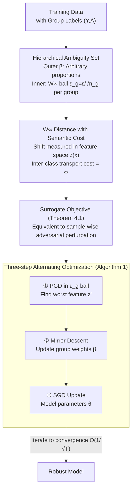

# Mitigating Spurious Correlation via Distributionally Robust Learning with Hierarchical Ambiguity Sets

**Conference**: ICLR 2026  
**arXiv**: [2510.02818](https://arxiv.org/abs/2510.02818)  
**Code**: None  
**Area**: LLM Evaluation  
**Keywords**: Spurious Correlation, Distributionally Robust Optimization, Hierarchical Ambiguity Sets, Wasserstein Distance, Minority Shift

## TL;DR
A hierarchical DRO framework is proposed to capture both group proportion shifts and intra-group distributional shifts. By defining intra-group ambiguity sets using the $W_\infty$ distance in semantic space, the method achieves SOTA performance on standard benchmarks. Furthermore, it maintains strong robustness in newly designed minority distribution shift settings where existing methods fail.

## Background & Motivation
ERM suffers from severe performance degradation on minority groups (e.g., waterbirds on a land background) when trained on data with spurious correlations. Group DRO alleviates this by minimizing the worst-case group loss; however, it implicitly assumes that the training distribution of each group reliably represents the true distribution.

In reality, minority group samples are extremely scarce, leading to a significant gap between the training and true distributions. This "intra-group distributional shift" has been largely ignored in existing research on spurious correlations. Even SOTA methods collapse under such settings.

Ours addresses this problem through hierarchical ambiguity sets: the first layer allows arbitrary changes in group proportions (identical to Group DRO), while the second layer allows for distributional shifts within each group within a $W_\infty$ radius. Defining the cost function in the semantic space ensures that intra-group shifts are both meaningful and computable.

## Method

### Overall Architecture
To address the issue where minority groups (e.g., "waterbirds + land background") have too few samples for their training distribution to represent the true distribution—causing even robust methods like Group DRO to fail—the proposed approach follows a three-step logic. First, the uncertainty set of Group DRO is extended into a two-layer nested **hierarchical ambiguity set**. The outer layer allows arbitrary changes in group proportions, while the inner layer allows the true distribution to deviate from the training distribution within a Wasserstein ball for each group. Second, an equivalence theorem is used to transform the problem of "worst-case optimization over unknown distributions" into sample-wise bounded adversarial perturbations in the feature space. Finally, a three-step alternating minimax algorithm is employed for training. Formally, the optimized worst-case risk is defined over the hierarchical ambiguity set $\mathcal{Q}=\{\sum_g \beta_g Q_g : \beta\in\Delta,\ W_\infty(Q_g, P_g)\le \varepsilon_g\}$, enabling the model to withstand both "amplified minority group proportions" and "internal distribution shifts within groups."

### Key Designs

**1. Hierarchical Ambiguity Sets: Incorporating Inter-group and Intra-group Shifts**

Standard Group DRO only optimizes for the worst-case group proportions, assuming each training distribution $P_g$ equals the true distribution. This assumption fails when minority samples are scarce. Ours constructs a two-layer uncertainty set: the outer layer uses $\rho=\infty$ to allow arbitrary group proportion shifts (retaining the property of Group DRO), and the inner layer assigns a $W_\infty$ ball with radius $\varepsilon_g=\varepsilon/\sqrt{n_g}$ to each group. When $\rho=\infty$ and $\varepsilon_g=0$, it reduces exactly to Group DRO, making it a strict generalization. Crucially, the radius scales inversely with the sample size $n_g$, providing larger protection zones for scarcer groups, aligning with the intuition that they are least likely to be faithfully represented by the training set.

**2. $W_\infty$ Distance with Semantic Cost: Meaningful and Computable Intra-group Shifts**

Measuring distributional distances directly in pixel space causes "shifts" to degenerate into meaningless noise. Instead, this work defines the transport cost using the feature $z(x)$ from the penultimate layer. Finite distances exist only between samples with the same label, while inter-class transport costs are set to infinity (ensuring perturbations do not change the class). Selecting the infinite-order $W_\infty$ over $f$-divergences (e.g., KL, TV) is justified because $f$-divergences require absolute continuity, which restricts them to reweighting observed samples. $W_\infty$ allows support shifts, moving probability mass to semantic neighborhoods not present in the training set, which matches the goal of handling unseen minority group manifestations at test time.

**3. Surrogate Objective: Reducing Hierarchical DRO to Feature-space Adversarial Perturbations**

Optimizing over distribution families directly is intractable. Theorem 4.1 proves that the hierarchical problem can be upper-bounded by a surrogate objective involving sample-wise bounded adversarial perturbations in feature space followed by worst-case group proportion optimization:

$$\inf_{\theta}\ \max_{\beta\in\Delta}\ \sum_g \beta_g\, \mathbb{E}_{P_g}\Big[\max_{z':\,\lVert z'-z(x)\rVert\le \varepsilon_g} \mathcal{L}\big(f_L^\theta(z'), y\big)\Big]$$

where $f_L^\theta$ is the sub-network from features to output. This step translates "robustness to unknown distributions" into "robustness to worst-case features within a radius $\varepsilon_g$ for each point," enabling gradient-based solutions. While this upper bound might be loose if the feature mapping $z(\cdot)$ is not surjective to the $\varepsilon_g$ ball, it is approximately tight for embeddings in modern deep networks.

**4. Three-step Alternating Optimization: Perturbation, Weights, and Parameters**

The surrogate objective is a min-max problem. Algorithm 1 decomposes it into three alternating coordinate blocks: first, a Projected Gradient Ascent (PGD) step finds the worst-case feature $z'$ within the $\varepsilon_g$ ball; second, Mirror Descent (or exponential gradient) updates the group weights $\beta$; third, SGD updates the model parameters $\theta$. The overall convergence rate is $O(1/\sqrt{T})$ under convex assumptions. The baseline radius $\varepsilon$ is selected via a heuristic (Appendix G), and the method is relatively insensitive to its specific value.

## Key Experimental Results

### Main Results

| Method | Waterbirds WGA | CelebA WGA | CMNIST WGA |
|------|--------------|-----------|-----------|
| ERM | 72.6% | 47.2% | 27.1% |
| Group DRO | 91.4% | 88.9% | 89.3% |
| **Ours (Hierarchical DRO)** | **92.8%** | **89.5%** | **91.2%** |

### Minority Shift Setting (Key Challenge)

| Method | Waterbirds (shifted) | CelebA (shifted) | Description |
|------|---------------------|-----------------|------|
| Group DRO | Collapsed | Collapsed | Assumes fixed intra-group distribution |
| JTT | Collapsed | Collapsed | Same as above |
| **Ours (Hierarchical DRO)** | **Stable** | **Stable** | Intra-group sets provide robustness |

### Ablation Study

| Configuration | WGA | Description |
|------|-----|------|
| ε=0 (Pure Group DRO) | 91.4% | No intra-group robustness |
| ε=0.5 | 92.3% | Moderate intra-group perturbation |
| ε=1.0 | **92.8%** | Optimal |
| ε=2.0 | 92.1% | Overly conservative |
| Input space cost (non-semantic) | 90.1% | Semantic space is more effective |

### Key Findings
- Hierarchical DRO slightly outperforms Group DRO in standard settings.
- The critical distinction lies in the minority shift setting; simply changing train/test partitions (without artificial noise) exposes the vulnerability of Group DRO.
- The design $\varepsilon_g = \varepsilon/\sqrt{n_g}$ is intuitively correct: minority groups require larger protection radii.
- $W_\infty$ versus $f$-divergence: The former allows support shifts, which is more natural for intra-group deviations.

## Highlights & Insights
- Reveals an important failure mode overlooked in spurious correlation literature—intra-group distributional shifts of minority groups.
- The hierarchical ambiguity set provides an elegant unification of Group DRO and standard DRO.
- The new evaluation setting itself is a significant contribution to the community.

## Limitations & Future Work
- The surrogate objective is an upper bound; its tightness depends on the surjectivity of the feature mapping $z$.
- The choice of $\varepsilon$ still relies on heuristics—adaptive $\varepsilon$ selection is a potential direction for improvement.
- Computational overhead is slightly higher than Group DRO due to the additional $z'$ optimization step.

## Related Work & Insights
- A natural combination of Group DRO and Wasserstein DRO, but the organization and motivation are novel.

## Rating
- Novelty: ⭐⭐⭐⭐ Hierarchical set design + new evaluation setting
- Experimental Thoroughness: ⭐⭐⭐⭐ Dual validation on standard and new settings
- Writing Quality: ⭐⭐⭐⭐ Mathematically rigorous
- Value: ⭐⭐⭐⭐ Meaningful improvement for robust learning

<!-- RELATED:START -->

## Related Papers

- [\[ICLR 2026\] Distributionally Robust Classification for Multi-Source Unsupervised Domain Adaptation](distributionally_robust_classification_for_multi-source_unsupervised_domain_adap.md)
- [\[ICLR 2026\] Regulating Internal Alignment Flows for Robust Learning Under Spurious Correlations](regulating_internal_alignment_flows_for_robust_learning_under_spurious_correlati.md)
- [\[ICLR 2026\] Spurious Correlation-Aware Embedding Regularization for Worst-Group Robustness](spurious_correlation-aware_embedding_regularization_for_worst-group_robustness.md)
- [\[ICML 2026\] DISCO: Mitigating Bias in Deep Learning with Conditional Distance Correlation](../../ICML2026/others/disco_mitigating_bias_in_deep_learning_with_conditional_distance_correlation.md)
- [\[ICML 2026\] Variable Clustering via Distributionally Robust Nodewise Regression](../../ICML2026/others/variable_clustering_via_distributionally_robust_nodewise_regression.md)

<!-- RELATED:END -->
