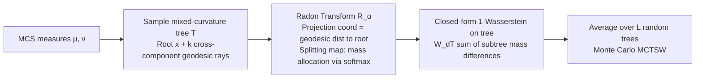

# Mixed-Curvature Tree-Sliced Wasserstein Distance

**Conference**: ICLR 2026  
**OpenReview**: [https://openreview.net/forum?id=e439wJl5sT](https://openreview.net/forum?id=e439wJl5sT)  
**Code**: Attached in supplementary materials  
**Area**: Optimal Transport / Riemannian Geometric Representation Learning  
**Keywords**: Mixed-Curvature Spaces, Tree-Sliced Wasserstein, Radon Transform, Optimal Transport, Geodesics  

## TL;DR
The authors extend the Tree-Sliced Wasserstein framework to Mixed-Curvature Spaces (MCS), which are formed by the Cartesian product of Euclidean, spherical, and hyperbolic components. By utilizing "geodesic trees growing across subspaces" as the projection domain, they derive MCTSW—a distribution distance that preserves geometric and topological structures while providing a closed-form solution and remaining parallelizable.

## Background & Motivation
**Background**: The manifold hypothesis suggests that real-world data often concentrates on low-dimensional surfaces, which a single Euclidean geometry fails to characterize. Spherical spaces are suitable for directional or periodic data (e.g., text embeddings, panoramas), while hyperbolic spaces are ideal for hierarchical and graph structures. Recent Mixed-Curvature Spaces (MCS) combine Euclidean, spherical, and hyperbolic components via Cartesian products to represent heterogeneous structures simultaneously, showing advantages in VAEs, GNNs, decision forests, and continual learning.

**Limitations of Prior Work**: Computational tools for "comparing two probability distributions" on MCS are scarce. KL divergence is not a true metric and fails on non-overlapping supports. Standard Optimal Transport (OT) has hyper-cubic complexity, making it difficult to scale. Sliced-Wasserstein (SW) achieves closed-form solutions by projecting measures onto 1D subspaces, but 1D slices lose the geometric and topological complexity of curved spaces. Tree-Sliced Wasserstein (TSW) replaces 1D lines with "tree metrics," providing richer projection geometry while maintaining closed-form $W_1$; however, it has remained restricted to Euclidean settings, with **no existing tree systems successfully implemented in mixed-curvature spaces**.

**Key Challenge**: MCS requires a distribution distance that respects heterogeneous geometries (different curvatures across components). Existing sliced methods either project to 1D, losing structure, or treat components independently via a "product space" approach, which fails to transport mass jointly across subspaces.

**Goal**: To construct a structure-preserving, closed-form, and parallelizable distribution distance on MCS.

**Key Insight**: **[Tree as a Bridge for Heterogeneous Geometry]** Construct a "mixed-curvature tree" originating from a common root, where each edge grows along a geodesic within a specific component. The edges of this tree naturally span subspaces of different curvatures. Transporting mass along the tree allows the transport path to pass through Euclidean, spherical, and hyperbolic regions simultaneously, thereby jointly characterizing heterogeneous geometry, while the tree metric ensures a closed-form solution for $W_1$.

## Method

### Overall Architecture
MCTSW elevates the TSW pipeline ("Sample 1D directions → Project → Compute closed-form $W_1$ → Monte Carlo average") to mixed-curvature manifolds. It first defines a **mixed-curvature tree system** (a set of edges growing from a common root $x$ along geodesic rays) and its associated tree metric. Then, a **tree-oriented Radon transform** is defined to project measures from the manifold onto the tree. Finally, the closed-form $W_1$ on the tree is averaged over randomly sampled trees to obtain the MCTSW distance via Monte Carlo estimation and GPU parallelization.

### Key Designs

**1. Mixed-Curvature Tree System: Spanning Multiple Curvature Components**  
Given a root $x$ in MCS $\mathcal{M}=\prod_{j=1}^m C^{d_j}_{K_j}$, define a geodesic ray from $x$ in the direction of $y$ as $r^y_x:=\bigsqcup_{t>0}\mathrm{Exp}^{\mathcal{M}}_x(t\cdot\mathrm{Log}^{\mathcal{M}}_x(y))$. Each point can be uniquely represented by $(t,r^y_x)$. By selecting $k$ points $y_i$ equidistant from the root $d_{\mathcal{M}}(x,y_i)=\epsilon$, $k$ rays are generated and joined at the root via an equivalence relation to form the quotient space $T^{y_1,\dots,y_k}_x$. The tree metric is: distance between points on the same ray is $|t_i-t_j|$, while distance between points on different rays is $t_i+t_j$ (routing through the common root $x$). Routing through the root connects paths belonging to different curvature components—making the root the hub for heterogeneous geometry.

**2. Radon Transform on Trees: Geodesic Distance Projection + Softmax Mass Splitting**  
Mapping manifold density to the tree requires a projection function and a splitting map. The projection function maps any point $z$ to its coordinate $d_{\mathcal{M}}(z,x)$ (geodesic distance to root). The splitting map determines how the mass of $z$ is distributed among the $k$ rays using a softmax of geodesic distances:

$$\alpha(z,T)_i=\frac{\exp(-d_{\mathcal{M}}(z, \overline{r^{y_i}_x}))}{\sum_{j=1}^k\exp(-d_{\mathcal{M}}(z, \overline{r^{y_j}_x}))},$$

where $d_{\mathcal{M}}(z, \overline{r^{y_i}_x})$ is the distance to the $i$-th full geodesic. Thus, the Radon transform $\left(R_\alpha f\right)_T(t,r^{y_i}_x)=\int_{\mathcal{M}} f(z)\,\alpha(z,T)_i\,\delta(t-d_{\mathcal{M}}(x,z))\,d\sigma(z)$ distributes mass based on ray proximity. The authors prove its well-definedness, linearity, and injectivity in the appendix (injectivity is key to MCTSW being a true metric).

**3. Closed-form Tree Wasserstein + Simplified Sampling for Parallelization**  
The 1-Wasserstein distance under a tree metric has a standard closed-form solution: $W_{d_T,1}(\mu,\nu)=\sum_{e\in T} w_e\,|\mu(\Gamma(v_e))-\nu(\Gamma(v_e))|$, where quality differences in subtrees $\Gamma(v_e)$ are weighted by edge lengths $w_e$. To enable parallelization, two constraints are introduced: each edge differs from the root in exactly one component, and all components share the same dimension $d$. Sampling then reduces to picking a root $x$ from a Wrapped Normal, assigning each ray to a component, and sampling directions on a sphere. Since coordinates within a tree share a single sort after projection, the complexity is $O(Ln\log n+Ldmnk)$, making it highly efficient on GPUs.

## Key Experimental Results

### Main Results

**Gradient Flow (Learning target distribution from 6 WND mixtures, lower is better):**

| Method | log $W_2$ ↓ |
|------|------|
| SW$_{\text{ambient}}$ | 0.33 |
| Prod-TSW | 0.34 |
| Prod-SW | 0.31 |
| **MCTSW (Ours)** | **−3.65** |

**Graph Self-Supervised Learning (Cora Test Accuracy, higher is better):**

| Method | Accuracy ↑ |
|------|------|
| SSGE | 79.55 ± 0.35 |
| E-TSW-SSGE (Euclidean) | 77.85 ± 0.32 |
| H-TSW-SSGE (Hyperbolic) | 75.10 ± 0.22 |
| S-TSW-SSGE (Spherical) | 78.33 ± 0.15 |
| **MCTSW-SSGE** | **79.86 ± 0.45** |

**Mixed-Curvature VAE (CIFAR-10 Test BCE, lower is better):**

| Latent Space | Method | Regularizer | Test BCE ↓ |
|------|------|------|------|
| Euclidean | VAE | KL | 0.6423 ± 0.0008 |
| Euclidean | SWAE | SW | 0.6043 ± 0.0005 |
| Spherical | S-VAE | KL | 0.6285 ± 0.0004 |
| Spherical | STSW-VAE | STSW | 0.6026 ± 0.0009 |
| Hyperbolic | H-VAE | KL | 0.6402 ± 0.0005 |
| Hyperbolic | HSW-VAE | HSW | 0.6012 ± 0.0006 |
| MCS | M-VAE | KL | 0.6419 ± 0.0008 |
| **MCS** | **MCTSW-VAE** | **MCTSW** | **0.6000 ± 0.0002** |

### Ablation Study
Ablations comparing "Mixed-Curvature vs. Constant Curvature" were conducted across tasks:

| Dimension | Comparison | Conclusion |
|------|------|------|
| Distance Design (Gradient Flow) | MCTSW vs. Prod-TSW/Prod-SW | Joint transport across subspaces (−3.65) significantly outperforms component-wise methods (~0.31). |
| Latent Geometry (Cora) | MCS vs. Single E/H/S | MCS (79.86) > Spherical (78.33) > Euclidean (77.85) > Hyperbolic (75.10). |
| Regularizer + Geometry (VAE) | MCTSW-VAE vs. M-VAE (KL) | MCTSW 0.6000 outperforms both the KL-based MCS version and all constant-curvature sliced variants. |

### Key Findings
- In gradient flow, MCTSW reduces log $W_2$ from baseline values (~0.31) to −3.65. This order-of-magnitude difference suggests that 1D slices or product spaces severely underestimate distribution differences in MCS, whereas tree-based transport can truly converge to the target.
- Two independent gains are additive: "Switching to MCTSW distance" and "Switching to MCS latent space" both provide improvements. MCTSW-VAE outperforms both M-VAE (using KL) and constant-curvature SW variants, validating their complementary nature.
- Gains on Cora relative to SSGE were modest (79.86 vs. 79.55), indicating that benefits in downstream graph tasks may be less pronounced than in tasks with explicit geometric targets like gradient flow or VAEs.

## Highlights & Insights
- **Precise Geometric Insight**: Linking the "trees as richer projection domains" idea with "mixed-curvature as heterogeneous geometry stitching" is effective—routing through the tree root naturally mirrors the hub required for transport between curvature components.
- **Complete Theoretical Loop**: The paper provides rigorous proofs for the metric properties of the tree distance, the well-definedness/linearity/injectivity of the Radon transform, and the metricity of MCTSW.
- **Engineering Feasibility**: By introducing constraints (single-component edge changes + equal dimensions), the tree space is factorized, allowing sort-reuse and cross-component parallelism, maintaining near-linear complexity relative to support points.

## Limitations & Future Work
- **Gyrovector Overhead**: The authors acknowledge that mixed-curvature operators (Möbius addition, Exponential/Logarithmic maps) introduce runtime overhead and numerical stability issues.
- **Limited Downstream Gains**: The modest lead on Graph SSL suggests that benefits diminish in tasks where geometric structures are less explicit.
- **Strong Simplification Assumptions**: Parallelization depends on specific constraints on edge variations and component dimensions; maintaining closed-form structures while relaxing these remains an open question.
- **Small Experimental Scale**: Evaluations are concentrated on 6-WND mixtures, Cora, and CIFAR-10, lacking validation on large-scale heterogeneous datasets.

## Related Work & Insights
This work sits at the intersection of Sliced-Wasserstein (and its manifold variants), Tree-Sliced Wasserstein (dynamic tree systems), and Mixed-Curvature Representation Learning. The primary insight is that when geometric priors involve multiple structures, the distribution distance's projection domain should be a structure that "spans those geometries" rather than a 1D line or a single-curvature manifold. Trees are a natural choice for connecting heterogeneous geometries while preserving closed-form OT.

## Rating
- **Novelty**: ⭐⭐⭐⭐ First rigorous adaptation of tree-sliced frameworks and Radon transforms to MCS.
- **Experimental Thoroughness**: ⭐⭐⭐ Covers various tasks but lacks large-scale validation; graph task gains are minor.
- **Writing Quality**: ⭐⭐⭐⭐ Logical progression from background to theory with clear geometric intuition.
- **Value**: ⭐⭐⭐⭐ Provides a practical, closed-form, and parallelizable tool for comparing distributions in heterogeneous latent spaces.

<!-- RELATED:START -->

## Related Papers

- [\[ACL 2025\] S2WTM: Spherical Sliced-Wasserstein Autoencoder for Topic Modeling](../../ACL2025/others/s2wtm_spherical_sliced-wasserstein_autoencoder_for_topic_modeling.md)
- [\[ICML 2025\] Lightspeed Geometric Dataset Distance via Sliced Optimal Transport](../../ICML2025/others/lightspeed_geometric_dataset_distance_via_sliced_optimal_transport.md)
- [\[ICLR 2026\] RADAR: Learning to Route with Asymmetry-aware Distance Representations](radar_learning_to_route_with_asymmetry-aware_distance_representations.md)
- [\[ICML 2026\] Decision Tree Learning on Product Spaces](../../ICML2026/others/decision_tree_learning_on_product_spaces.md)
- [\[ICML 2026\] Cascaded Flow Matching for Heterogeneous Tabular Data with Mixed-Type Features](../../ICML2026/others/cascaded_flow_matching_for_heterogeneous_tabular_data_with_mixed-type_features.md)

<!-- RELATED:END -->
