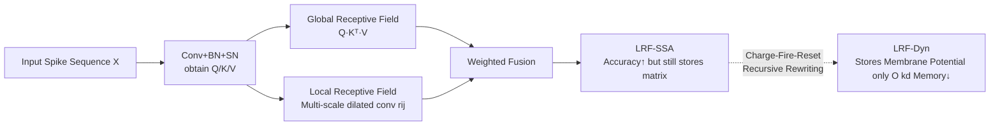

# Neural Dynamics Self-Attention for Spiking Transformers

**Conference**: ICLR 2026  
**OpenReview**: [https://openreview.net/forum?id=jJedqisfOt](https://openreview.net/forum?id=jJedqisfOt)  
**Code**: To be confirmed  
**Area**: Spiking Neural Network / Energy-Efficient Vision Transformer  
**Keywords**: Spiking Neural Network, Spiking Transformer, Self-Attention, Local Receptive Field, Neuronal Dynamics, Energy-Efficient Vision  

## TL;DR
This paper analyzes the bottlenecks of Spiking Self-Attention (SSA) from two perspectives: "lack of local modeling capability" and "high storage overhead of attention matrices." It proposes LRF-Dyn: first, it re-incorporates local bias into SSA using a Local Receptive Field (LRF) to improve accuracy; then, it rewrites the attention calculation into a recursive form that only requires storing membrane potentials by leveraging "charge-fire-reset" neuronal dynamics. This significantly reduces inference memory while pushing the accuracy of Spiking Transformers close to that of ANNs.

## Background & Motivation
**Background**: Combining Spiking Neural Networks (SNNs) and Transformers is a promising path to balance energy efficiency and performance, particularly for edge vision. A series of Spiking Transformers, such as Spikformer, QKFormer, and Spike-Driven-V3, replace standard softmax attention with "Spiking Self-Attention" (SSA). By utilizing event-driven sparse spikes to avoid redundant multiply-accumulate operations, these models achieve very low energy consumption.

**Limitations of Prior Work**: Compared to ANNs of similar scale, Spiking Transformers have consistently faced two issues: (i) a significant gap in accuracy; and (ii) surprisingly high memory overhead during inference. This paper attributes both problems to SSA itself through theoretical analysis and visualization:

- **Lack of Local Bias**: To remain spike-friendly, SSA removes the softmax operation, resulting in nearly uniformly distributed attention scores. Visualizations show that while the Vanilla Self-Attention (VSA) in ViT concentrates 76.8% of attention in neighborhoods with short Manhattan distances (low entropy, focused), SSA exhibits an almost uniform attention distribution (high-entropy), failing to emphasize critical regions. This is the root cause of the accuracy gap.
- **Storage of Large Attention Matrices**: Although SSA reduces computational complexity to $O(Nd^2)$ via matrix associativity, inference still requires storing Q/K/V and intermediate KV results. This incurs an additional $O(d^2)$ memory cost (especially severe when $d=512$), hindering deployment on resource-constrained devices like neuromorphic chips.

**Key Challenge**: It is difficult to simultaneously achieve low energy consumption (SNN), low memory usage, and high accuracy—removing softmax benefits energy efficiency but sacrifices local modeling, while matrix associativity reduces computation but increases memory usage.

**Goal**: Restore local modeling capabilities and reduce inference memory while maintaining the event-driven low energy consumption of SNNs.

**Core Idea**: **Biological Vision Inspiration**—Drawing on the local receptive fields (LRF) of biological visual neurons and the temporal dynamics of membrane potentials. First, "inject" local bias back into SSA using LRF; then, approximate the attention aggregation as a neuronal "charge-fire-reset" process, replacing explicit attention matrix storage with recursive membrane potentials.

## Method

### Overall Architecture
The approach progresses in two steps: first, developing the more accurate **LRF-SSA** (injecting LRF into SSA), and then rewriting it as the memory-efficient **LRF-Dyn** (replacing matrix storage with neuronal dynamics recursion). Both can serve as plug-and-play units for existing Spiking Transformers without modifying the rest of the framework.

### Key Designs

**1. Injecting LRF into SSA (LRF-SSA): Restoring the missing local bias.** After removing softmax in SSA, the output for the $n$-th token only contains the global receptive field term $q_n[t]\times\sum_{j} k_j[t]^\top v_j[t]$, and neighborhood information is averaged out. The authors add a parallel LRF term $\sum_d\sum_{i,j\in\Omega_d} r_{ij}^d V_{\rho k}$, using two $3\times3$ depth-wise separable convolutions (dilation factors $d=3,5$) to re-weight neighborhoods with very few parameters (<0.2M per architecture). Theoretically, by defining the fusion weight as $\alpha_{ij}^{\text{lrf-ssa}}=(1-\lambda)\alpha_{ij}^{\text{ssa}}+\lambda r_{ij}$: Theorem 1 proves that the expected receptive field $E[\Delta]=(1-\lambda)\mu_{\text{ssa}}+\lambda\mu_r$ contracts because $\mu_r\le\mu_{\text{ssa}}$, restoring VSA-like local focus. Theorem 2 further proves that the information entropy $H(p^{\text{lrf-ssa}})\le H(p^{\text{ssa}})$, pulling the high-entropy uniform distribution of SSA back toward the low-entropy focused distribution of VSA—providing the theoretical basis for accuracy improvement.

**2. Rewriting Attention via Neuronal Dynamics (LRF-Dyn): Replacing matrix storage with membrane potential recursion.** LRF-SSA still needs to store Q/K/V and attention matrices per timestep (extra $O(d^2)$). The authors rewrite Equation (8) in a causal manner as $\text{sattn}_n[t]'=q_n[t]\times\underbrace{\sum_{j=1}^{n-1}k_j[t]^\top v_j[t]}_{\text{Membrane Potential}}+\underbrace{k_n[t]^\top v_n[t]+\sum_d\sum_{i,j\in\Omega_d}r_{ij}^d v_{\rho k}[t]}_{\text{Presynaptic Input}}$. Thus, one only needs to cumulatively store $\sum_{j=1}^{n-1}k_j^\top v_j$, reducing $O(Nd^2)$ to $O(d^2)$. This structure corresponds exactly to the charge-fire-reset of a spiking neuron: the first term is membrane potential memory, and the second is the current presynaptic input.

**3. Dendritic Parametrization of Dynamics: Enabling efficient training of recursion.** The core recursion of LRF-Dyn is written as $X_n[t]=A\odot X_{n-1}[t]+\Gamma\,\text{Token}_n[t]$, and the output is $\text{sattn}_n'[t]=X_n[t]+\sum_d\sum_{i,j\in\Omega_d}r_{ij}^d\cdot X_{\rho k}[t]$. The decay factor $A$ and capacitance constant $\Gamma$ are inspired by the multi-timescale behavior of photoreceptor neurons, parametrized in a "dendritic" form (a tri-diagonal matrix $A$ characterizing coupling $\beta$ between adjacent tokens and individual decay $1/\tau$). Different dendritic branches produce different responses to the same token, which are integrated by the soma into a spike sequence. Since $A$ is time-invariant, the whole process can be written as a convolution $K(t)=\Gamma C\sum_{m=1}^{n-m}A$ and trained efficiently in parallel using the Fast Fourier Transform $H=\mathcal{F}^{-1}\{\mathcal{F}(K)*\mathcal{F}(X)\}$ (the paper uses $n=8$ dendrites). During final inference, only the membrane potential at each position needs to be stored, reducing storage complexity to $O(kd)$, where $k$ is the number of dendrites.

## Key Experimental Results

### Main Results: ImageNet-1K Image Classification
SSA is replaced with LRF-SSA / LRF-Dyn across Spikformer, QKFormer, and SDT-V3 backbones. SR denotes inference storage complexity.

| Method | Architecture | Storage Complexity (SR) | Params (M) | Acc. (%) |
|------|------|------|------|------|
| Spikformer | Spikformer-8-512 | $O(d^2)$ | 29.68 | 73.38 |
| Spikformer + **LRF-SSA** | Spikformer-8-512 | $O(d^2)$ | 29.71 | 74.62 (↑1.24) |
| Spikformer + **LRF-Dyn** | Spikformer-8-512 | $O(kd)$ | 29.71 | 74.51 (↑1.13) |
| QKFormer | HST-10-512 | $O(d^2)$ | 29.08 | 82.04 |
| QKFormer + **LRF-SSA** | HST-10-512 | $O(d^2)$ | 29.18 | 82.52 (↑0.48) |
| QKFormer + **LRF-Dyn** | HST-10-512 | $O(kd)$ | 29.18 | 82.48 (↑0.44) |
| SDT-V3 | Eff-Transformer-S | $O(d^2)$ | 5.11 | 75.30 |
| SDT-V3 + **LRF-SSA** | Eff-Transformer-S | $O(d^2)$ | 5.24 | 76.22 (↑0.92) |
| SDT-V3 + **LRF-Dyn** | Eff-Transformer-S | $O(kd)$ | 5.24 | 76.12 (↑0.82) |

LRF-SSA focuses on accuracy, yielding stable improvements across three backbones with almost no extra parameters. LRF-Dyn maintains accuracy while reducing storage complexity from $O(d^2)$ to $O(kd)$.

### Semantic Segmentation (ADE20K)

| Model | Params (M) | T | MIoU (%) |
|------|------|------|------|
| SDT-V3 | 5.1+1.4 | 4 | 33.6 |
| SDT-V3 + **LRF-SSA** | 5.1+1.4 | 4 | 36.2 (↑2.6) |
| SDT-V3 + **LRF-Dyn** | 5.24+1.4 | 4 | 36.3 (↑2.7) |
| SDT-V3 (19M) + **LRF-SSA** | 10.0+1.4 | 4 | 43.5 (↑2.2) |
| SDT-V3 (19M) + **LRF-Dyn** | 19.25+1.4 | 4 | 43.1 (↑1.8) |

Gains are more pronounced in segmentation (2–2.7%), and LRF-Dyn outperforms the attention-free ResNet baseline even without attention storage.

### Ablation Study (CIFAR-100, Spikformer Backbone)

| Method | w/o LRF | $\Omega\le1$ | $\Omega\le3$ | $\Omega\le5$ |
|------|------|------|------|------|
| LRF-SSA | 77.86 | 78.26 | 78.52 | 78.64 |
| LRF-Dyn | 77.78 | 78.16 | 78.50 | 78.57 |
| Caused SSA† | 74.30 | 75.30 | 76.20 | 76.50 |

Without LRF, LRF-SSA reverts to the original SSA. Increasing the local convolution kernel coverage ($\Omega$) leads to continuous performance gains, proving the contribution of the local receptive field.

### Key Findings
- On Spikformer-8-512, compared to SSA, the method **increases accuracy by 1.13% while reducing inference memory by 49.4%**.
- Effective Receptive Field (ERF) visualizations show that both LRF-SSA and LRF-Dyn restore ViT-like local focus, with attention distributions becoming sparser and more concentrated on salient regions.

## Highlights & Insights
- **Problem diagnosis supported by theory**: The two chronic issues of Spiking Transformers are cleanly attributed to "removing softmax → high-entropy uniform attention → lack of local bias" and "KV associativity → requirement for intermediate matrix storage," substantiated by two theorems (RF contraction + entropy ordering).
- **Biological inspiration translated to computable structures**: LRF and membrane potential dynamics are not just slogans; they correspond to dilated depthwise convolutions and tri-diagonal dendritic dynamics, with time-invariant $A$ allowing for parallel training via Fourier convolution.
- **One design with two orientations**: LRF-SSA prioritizes accuracy, while LRF-Dyn prioritizes memory. Both are plug-and-play and can be embedded into mainstream Spiking Transformers.

## Limitations & Future Work
- **Representation and formula presentation**: Several parts of the paper exhibit rough formatting and confusing notation for formulas (e.g., definitions of $A$, $\Gamma$, and the Fourier convolution in Equation 15). Some dendritic dynamics definitions require the Appendix for clarity, leading to a high reproduction threshold.
- **Experiments limited to vision classification/segmentation**: Tasks like detection, video, or non-visual modalities are not covered. Energy efficiency advantages are shown indirectly through complexity analysis and memory comparisons rather than physical measurements on neuromorphic chips.
- **Hyperparameter dependency**: The stability of results regarding the number of dendrites $n=8$, dilation factors, and fusion coefficient $\lambda$ remains under-discussed.
- **Future Work**: Implementing and testing energy consumption on neuromorphic hardware like Loihi/Tianjic and extending the work to temporal and multi-modal tasks will be necessary to realize the full "low-memory + low-energy" potential.

## Related Work & Insights
- **Spiking Transformer lineage**: Spikformer introduced SSA, SpikingResformer introduced ResNet to reduce parameters, and Spike-Driven-V3 added Spike Frequency Approximation (SFA)—this work performs a targeted "surgery" on attention distribution quality and inference memory within this lineage.
- **Softmax-free / Linear Attention**: Models like Linear/Performer use kernel approximations to reduce complexity from $O(N^2)$ to $O(N)$. This paper adopts the matrix associativity idea but goes further by rewriting it as neuronal dynamics to eliminate matrix storage entirely.
- **Insights**: For any attention variant that removes softmax for efficiency, this paper suggests a general perspective: removing softmax often removes local bias and low-entropy focus, which need to be explicitly restored. Rewriting linear attention accumulation as RNN/neuronal recursion is an effective means of trading computation for inference memory.

## Rating
- Novelty: ⭐⭐⭐⭐ Successfully integrates "LRF + membrane potential dynamics" into spiking attention and quantifies intuition with two theorems.
- Experimental Thoroughness: ⭐⭐⭐⭐ Comprehensive results across three backbones and multiple tasks (classification + segmentation + ablation + visualization), though lacking real neuromorphic hardware energy evaluation.
- Writing Quality: ⭐⭐⭐ Solid reasoning and motivation, but formula formatting and dendritic dynamics descriptions are somewhat cluttered.
- Value: ⭐⭐⭐⭐ Simultaneously closes the accuracy gap and reduces inference memory by nearly half, providing practical value for edge/neuromorphic vision Transformers.

<!-- RELATED:START -->

## Related Papers

- [\[ICLR 2026\] QUEST: A Robust Attention Formulation Using Query-Modulated Spherical Attention](quest_a_robust_attention_formulation_using_query-modulated_spherical_attention.md)
- [\[ICLR 2026\] Hilbert-Guided Sparse Local Attention](hilbert-guided_sparse_local_attention.md)
- [\[ICLR 2026\] Fractional-Order Spiking Neural Network](fractional-order_spiking_neural_network.md)
- [\[ICLR 2026\] The Counting Power of Transformers](the_counting_power_of_transformers.md)
- [\[NeurIPS 2025\] Recurrent Self-Attention Dynamics: An Energy-Agnostic Perspective from Jacobians](../../NeurIPS2025/others/recurrent_self-attention_dynamics_an_energy-agnostic_perspective_from_jacobians.md)

<!-- RELATED:END -->
