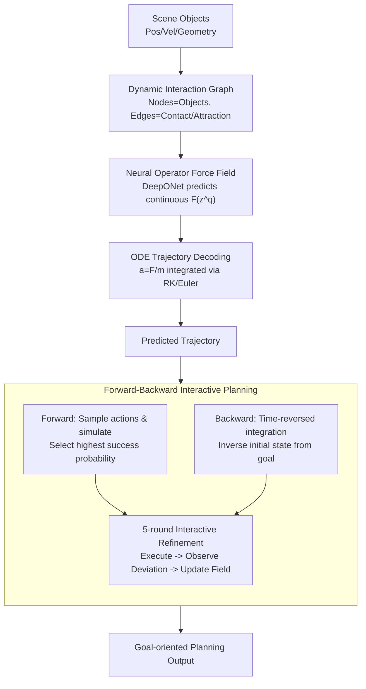

# Neural Force Field: Few-shot Learning of Generalized Physical Reasoning

**Conference**: ICLR 2026  
**arXiv**: [2502.08987](https://arxiv.org/abs/2502.08987)  
**Code**: [Project Page](https://neuralforcefield.github.io/)  
**Area**: Others  
**Keywords**: neural force field, Neural ODE, few-shot physical reasoning, ODE solver, interactive planning

## TL;DR

Proposes Neural Force Field (NFF), which models object interactions as continuous force fields. By learning force functions via neural operators and decoding trajectories with an ODE integrator, it achieves few-shot SOTA on I-PHYRE (100 trajectories), N-body (200 trajectories), and PHYRE (0.012M data, 267x less than previous SOTA). It reduces cross-scenario RMSE by 32-64% and achieves near-human performance in planning tasks.

## Background & Motivation

**Background**: Physical reasoning is a core capability of AI. Humans can quickly abstract core principles from a few physical phenomena and generalize them to new environments, but existing AI models struggle in OOD (Out-of-Distribution) scenarios even when trained on massive datasets.

**Limitations of Prior Work**:

- Existing GNN/Transformer methods (e.g., IN, SlotFormer) represent object interactions using implicit latent vectors. These tend to overfit observed trajectories rather than capturing physical principles, leading to poor OOD generalization.
- Discrete latent space decoding cannot explain how objects move through obstacles (e.g., a green ball passing through a black wall), resulting in physical inconsistency.
- Higher risk of overfitting exists in few-shot settings, requiring stronger physical inductive biases.
- Interactive reasoning requires active experimentation and feedback adaptation; current methods lack backward planning capabilities.

**Key Challenge**: There is a need for a physical representation that can learn from extremely few samples and generalize to OOD scenarios—this requires the representation itself to encode physical principles rather than statistical patterns.

**Goal**: To develop agents with human-like few-shot physical learning capabilities that achieve robust generalization across diverse environments.

**Key Insight**: Force fields are the natural abstractions of physics—force is the causal reason for changes in motion. Representing interactions as force fields rather than state transitions is naturally composable and generalizable.

**Core Idea**: Use neural operators to learn continuous force field functions and ensure physical consistency through ODE integration. The low dimensionality of force fields makes few-shot learning possible.

## Method

### Overall Architecture

NFF aims to learn physical dynamics from minimal samples that generalize to OOD scenarios. It anchors the entire prediction chain in physics: first, every object in the scene is treated as a node and contact/attraction relationships as edges to form a time-varying dynamic interaction graph. Then, a neural operator reads the object interactions from the graph to output the continuous force field $\mathbf{F}(\mathbf{z}^q(t))$ acting on each object at that moment. Finally, instead of directly predicting the next frame's coordinates, Newton's second law $\mathbf{a}=\mathbf{F}/m$ is fed into an ODE integrator (Runge-Kutta/Euler) to step-wise integrate velocity and displacement, yielding physically consistent trajectories. Since the entire chain is differentiable and reversible, the same force field can be used for both forward simulation (forward planning) and calculating initial conditions from goals (backward planning), coupled with multi-round interactive refinement. During training, long trajectories are segmented for autoregressive prediction to minimize MSE.

### Key Designs

**1. Neural Operator Force Field: Modeling "Interactions" as a Low-dimensional Force Function**

A major pain point is that high-dimensional latent representations easily overfit observed trajectories. NFF shifts the abstraction level—it does not learn "how states change" but "how much force objects exert on each other." Specifically, it adopts the DeepONet operator learning framework, where the force felt by a query object $q$ is defined as the accumulation of its interactions with neighbors:

$$\mathbf{F}(\mathbf{z}^q(t)) = \sum_{i \in \mathcal{G}(q)} \mathbf{W}\big(f_\theta(\mathbf{z}^i(t)) \odot f_\phi(\mathbf{z}^q(t))\big) + \mathbf{b}$$

Where $\mathcal{G}(q)$ is the set of neighbors, $f_\theta$ encodes the acting object, $f_\phi$ encodes the affected object, and the element-wise product $\odot$ of the two features is mapped to the 2D/3D force space by $\mathbf{W} \in \mathbb{R}^{d_\text{hidden} \times d_\text{force}}$. This enables few-shot learning because the force itself is low-dimensional—it is far easier to recover a 2D force vector from dozens of trajectories than to fit high-dimensional latent vectors. The functional generalization of operator learning allows the learned force patterns to transfer to unseen interaction graph structures.

**2. ODE Integrator Trajectory Decoding: Replacing Discrete Prediction with Physical Integration**

A force field alone is insufficient; how force becomes a trajectory determines physical consistency. NFF does not let the network directly output the next frame's coordinates. Instead, it explicitly integrates the second-order ODE of Newton's second law into the decoding—acceleration is determined by force and mass:

$$\mathbf{a}^q(t) = \frac{d^2 x^q(t)}{dt^2} = \frac{\mathbf{F}(\mathbf{z}^q(t))}{m^q}$$

Runge-Kutta or Euler integrators then derive velocity and displacement: $\mathbf{v}(t) = \mathbf{v}(0) + \int_0^t \frac{\mathbf{F}(\mathbf{z}^q(t))}{m^q}\,dt$, and $\mathbf{x}(t) = \mathbf{x}(0) + \int_0^t \mathbf{v}(t)\,dt$. Because trajectories are derived via continuous integration, an object cannot simply "teleport" through a wall as it might in discrete decoding. Using high-precision integration steps (e.g., $1e\text{-}3$) allows for fine-grained modeling of force changes during collisions.

**3. Forward-Backward Interactive Planning: Using One ODE for Dual-Direction Inference**

Physical reasoning requires both prediction and goal-oriented planning. The reversibility of ODEs makes this efficient. In forward planning, NFF acts as a "mental simulator": it samples 500 candidate actions, rolls out future trajectories using the force field, and selects the sequence with the highest success probability. Backward planning reverses the time direction of the ODE, integrating backward from the target state to solve for the required initial conditions:

$$\mathbf{x}(0) = \mathbf{x}(t) + \int_t^0 \mathbf{v}(t)\,dt$$

Compared to iterative optimization for initial values, this backward integration is significantly more efficient. This is wrapped in a 5-round interactive learning protocol—executing an action, observing deviations, updating the force field based on deviations, and re-planning—simulating the human trial-and-error process.

### Loss & Training

Training utilizes MSE loss to minimize the difference between predicted and ground-truth trajectories. A key technique involves cutting long trajectories into small segments for autoregressive training, preventing errors from accumulating over time as they might under teacher forcing. During evaluation, the model is given only the initial state to predict the entire future sequence.

## Key Experimental Results

### Main Results: Trajectory Prediction (RMSE↓ as main metric)

| Benchmark | Setting | IN | SlotFormer | SEGNO | **Ours (NFF)** | Gain |
|------|------|-----|-----------|-------|---------|------|
| I-PHYRE | Within | 0.124 | 0.067 | 0.203 | **0.048** | 28%↓ vs SlotFormer |
| I-PHYRE | Cross | 0.194 | 0.206 | 0.314 | **0.131** | 32%↓ vs IN |
| N-body | Within [0,T] | 0.200 | 0.214 | 0.079 | **0.097** | — |
| N-body | Cross [0,3T] | 6.942 | 2.533 | 2.759 | **1.226** | 52%↓ vs SlotFormer |
| PHYRE | Cross AUCCESS↑ | — | 21.04 | — | **49.22** | +134% vs SlotFormer |

### Ablation Study (N-body Cross RMSE↓)

| Configuration | Cross RMSE | Description |
|------|-----------|------|
| NFF (1e-3 precision) | 1.226 | Full model |
| NFF (5e-3 precision) | 1.251 | Lower precision -> Performance drop |
| NFF (Adaptive) | 1.788 | Adaptive integration worse than fixed high precision |
| w/o ODE (Degraded to IN) | 3.518 | ODE grounding is critical |
| w/o NOL (Replace DeepONet with MLP) | 1.347 | Neural operator improves generalization |

### Key Findings

- **Startling Data Efficiency**: Only 100 trajectories for I-PHYRE (10 games × 10 samples), 200 for N-body, and 12K for PHYRE (267x less than RPIN's 3.2M).
- **Force Field Visualization**: Learned gravitational fields match ground truth (Fig 5b); collision, sliding, and friction fields are correctly captured (Fig 5a).
- **ODE Grounding is Critical**: Removing the ODE increased Cross RMSE from 1.226 to 3.518 (a 2.87x increase).
- **Human-level Planning**: In I-PHYRE interactive planning, NFF's cumulative success probability after 5 rounds approaches human levels, while IN and SlotFormer perform worse than random sampling.
- **Object Consistency**: In PHYRE vision tasks, RPIN incorrectly deforms a gray cup into a gray ball and SlotFormer exhibits object disappearance; NFF maintains object consistency.

## Highlights & Insights

- **"Force Field = The Correct Abstraction of Physics"**: Instead of learning "how states transform," learn "why they transform"—force is the causal driver. Causal representations generalize naturally.
- **Continuous vs. Discrete**: Discrete decoding fails to explain physical barriers. Continuous ODE integration naturally prevents physical inconsistencies like wall clipping.
- **Physical Intuition in Few-Shot**: Humans extract physical laws from minimal experience (e.g., infant intuitive physics); NFF’s low-dimensional force field representation mimics this cognitive process.
- **Elegance of Backward Planning**: Reversing the ODE time direction to solve for initial conditions is orders of magnitude more efficient than gradient-based iterative optimization.

## Limitations & Future Work

- Tested only on synthetic or abstract reasoning datasets; has not been verified in real-world physical scenes.
- Assumes a deterministic rigid-body environment; has not explored stochastic environments or soft/fluid matter.
- Challenges may arise from varying friction and elasticity when training a single model.
- The visual input version depends on object masks and does not yet achieve end-to-end learning from pixels to force fields.

## Related Work & Insights

- **vs IN (Battaglia et al., 2016)**: IN uses latent vectors and discrete transitions; its Cross RMSE is 2.87x higher than NFF, and its planning is worse than random sampling.
- **vs SlotFormer (Wu et al., 2023)**: SlotFormer uses Transformers and slot attention; its AUCCESS in PHYRE Cross is only 21.04 (vs. NFF's 49.22), and it suffers from object disappearance.
- **vs SEGNO (Liu et al., 2024b)**: SEGNO also uses ODEs but lacks a force field representation; its within-distribution performance is sometimes better than NFF, but its Cross generalization is poor (2.759 vs 1.226).
- **vs Kofinas et al. (2023)**: Also uses the "field" concept but learns a latent field rather than an explicit force field; NFF is more physically grounded.

## Rating

- Novelty: ⭐⭐⭐⭐⭐ Introducing force fields to learning systems with ODE integration is a paradigm shift in physical reasoning representation learning.
- Experimental Thoroughness: ⭐⭐⭐⭐ 3 benchmarks (I-PHYRE/N-body/PHYRE) + prediction/planning setups + detailed ablations + force field visualization.
- Writing Quality: ⭐⭐⭐⭐⭐ Excellent integration of physical intuition and method design; clear illustrations (especially the continuous vs. discrete comparison in Fig 2) with strong motivation.
- Value: ⭐⭐⭐⭐ Fundamental contributions to physical reasoning, cognitive AI, and few-shot learning; the force field representation may inspire broader physical world model research.

## Related Papers

- [\[ICLR 2026\] Consistency-Driven Calibration and Matching for Few-Shot Class Incremental Learning](consistency-driven_calibration_and_matching_for_few-shot_class_incremental_learn.md)
- [\[CVPR 2026\] Data-Centric Meta-Learning for Robust Few-Shot Generalization](../../CVPR2026/others/data-centric_meta-learning_for_robust_few-shot_generalization.md)
- [\[CVPR 2026\] Graph Attention Prototypical Network for Robust Few-Shot Classification](../../CVPR2026/others/graph_attention_prototypical_network_for_robust_few-shot_classification.md)
- [\[CVPR 2026\] Hyperbolic Defect Feature Synthesis for Few-Shot Defect Classification](../../CVPR2026/others/hyperbolic_defect_feature_synthesis_for_few-shot_defect_classification.md)
- [\[ICML 2026\] Amortized Simulation-Based Inference in Generalized Bayes via Neural Posterior Estimation](../../ICML2026/others/amortized_simulation-based_inference_in_generalized_bayes_via_neural_posterior_e.md)

<!-- RELATED:END -->

<!-- RELATED:START -->

## Related Papers

- [\[ICLR 2026\] Consistency-Driven Calibration and Matching for Few-Shot Class Incremental Learning](consistency-driven_calibration_and_matching_for_few-shot_class_incremental_learn.md)
- [\[CVPR 2026\] Data-Centric Meta-Learning for Robust Few-Shot Generalization](../../CVPR2026/others/data-centric_meta-learning_for_robust_few-shot_generalization.md)
- [\[ICLR 2026\] A Federated Generalized Expectation-Maximization Algorithm for Mixture Models with an Unknown Number of Components](a_federated_generalized_expectation-maximization_algorithm_for_mixture_models_wi.md)
- [\[ICLR 2026\] Learning on a Razor's Edge: Identifiability and Singularity of Polynomial Neural Networks](learning_on_a_razors_edge_identifiability_and_singularity_of_polynomial_neural_n.md)
- [\[CVPR 2026\] Hyperbolic Defect Feature Synthesis for Few-Shot Defect Classification](../../CVPR2026/others/hyperbolic_defect_feature_synthesis_for_few-shot_defect_classification.md)

<!-- RELATED:END -->
