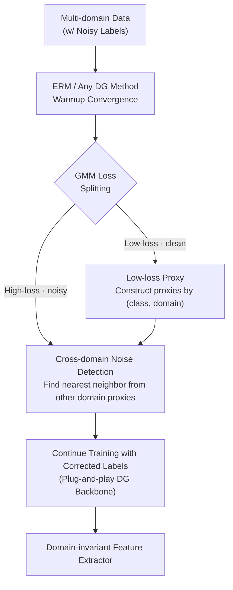

# Noise-Aware Generalization: Robustness to In-Domain Noise and Out-of-Domain Generalization

**Conference**: ICLR 2026  
**arXiv**: [2504.02996](https://arxiv.org/abs/2504.02996)  
**Code**: [GitHub](https://github.com/SunnySiqi/Noise-Aware-Generalization)  
**Area**: Robust Learning / Domain Generalization  
**Keywords**: Noise-Aware Generalization, Domain Generalization, Learning with Noisy Labels, Cross-Domain Noise Detection, DL4ND

## TL;DR

First formalizes the Noise-Aware Generalization (NAG) problem—simultaneously pursuing in-domain robustness and out-of-domain generalization under label noise—and proposes the DL4ND method to detect noisy labels through cross-domain comparison, achieving an improvement of up to 12.5% across 7 datasets.

## Background & Motivation

**Background**: Domain Generalization (DG) methods train models to generalize from multiple source domains to unseen target domains by learning domain-invariant features. Learning with Noisy Labels (LNL) methods improve model performance by detecting and handling noisy labels. Both fields have achieved significant progress but are typically studied independently.

**Limitations of Prior Work**:
1. **DG methods ignore label noise**: Label noise is prevalent in real-world datasets (including DG benchmarks themselves), but DG methods suffer severe performance degradation in its presence.
2. **LNL methods do not consider domain shift**: LNL methods detect noise within a single domain, but when facing multi-domain data, they may misidentify domain shift as label noise, leading to overfitting to "easy-to-learn" domains.
3. **Difficulty in distinguishing domain shift from noise shift**: When using feature distance or loss value analysis, the distribution shifts from domain shift and label noise highly overlap in the feature space (as shown in Figure 1).

**Key Challenge**: The core assumption of LNL noise detection—"noisy samples are far from class centers"—fails in multi-domain scenarios because domain shift makes the sources of distribution shift (noise vs. domain) indistinguishable through simple feature distances. Naively combining DG and LNL methods also fails because over 20% of support vectors fall into the overlapping regions of both shifts; these samples are critical to the decision boundary.

**Goal**: Propose the NAG (Noise-Aware Generalization) problem definition and design the DL4ND (Domain Labels for Noise Detection) method. **Key Insight**: Similar noise samples within a domain reveal differences when compared across domains—since domain-specific spurious correlations (e.g., color) do not exist in other domains, cross-domain comparison forces the model to rely on intrinsic features. DL4ND constructs $(class, domain)$ proxy representations using high-confidence, low-loss samples, then relabels high-loss samples using cross-domain comparison.

## Method

### Overall Architecture

DL4ND embeds "noise detection" into multi-domain training: given a multi-domain dataset $\mathcal{D} = \{\mathcal{D}_1, \ldots, \mathcal{D}_m\}$ where each domain $\mathcal{D}_i = \{(x_{i,j}, \tilde{y}_{i,j})\}$ (labels $\tilde{y}$ may contain noise), it first performs a warmup using ERM or any DG method to let the model converge on clean samples. A Gaussian Mixture Model (GMM) then splits the loss distribution into low-loss (clean) and high-loss (noisy) clusters. Low-loss samples are grouped by $(class, domain)$ to construct low-loss proxy representations $\bar{g}_{c,i}$. High-loss samples are then sent for cross-domain noise detection and relabeling. Finally, training continues with corrected labels. This cleaning-relabeling module is backbone-agnostic and can be integrated into any DG method. The goal of the entire process remains learning a feature extractor $f_\theta(\cdot)$ that is robust across all source and unseen target domains.

### Key Designs

**1. Low-loss Proxy: Making Domain Shift and Noise Shift Separable by Distance**

The core dilemma of NAG is that domain shift and label noise highly overlap in the feature space, making them indistinguishable by feature distance alone. The paper provides a sufficient condition for separability—the distance between the same class across domains should be smaller than the distance between different classes within the same domain:

$$d(f_\theta(G_{c,\hat{i}}), \bar{g}_{c,i}) < d(f_\theta(G_{\hat{c},i}), \bar{g}_{c,i}), \quad i \neq \hat{i}, \; c \neq \hat{c}$$

The key to satisfying this condition lies in how the proxy $\bar{g}_{c,i}$ is calculated—defined as the mean feature of all samples in a $(class, domain)$ group. In RotatedMNIST, using **all samples** to build class proxies results in heavily overlapping distance distributions. However, using only **low-loss samples identified by GMM** yields clear separation. This is because low-loss samples are almost exclusively clean in early training stages, making their proxies more representative of intrinsic features. This step also explains why overlapping samples cannot simply be discarded: analysis shows over 20% of samples in the overlap are SVM support vectors, essential for the final decision boundary, thus requiring relabeling rather than removal.

**2. Cross-domain Comparison Relabeling: Exploiting Inter-domain Differences for Intrinsic Features**

Intra-domain spurious correlations (e.g., lions always in warm-yellow tones in a "photo" domain) only hold within that domain. By comparing a suspected noisy sample against proxies from **other domains**, the model is forced to rely on intrinsic class features rather than shortcuts like color or background. For each high-loss suspected noisy sample $x_i$ (from domain $\hat{i}$), DL4ND finds the nearest neighbor class among proxies of **all other domains**:

$$\hat{y_i} = \arg\min_{\forall g_{c,\hat{i}}} d(f_\theta(x_i), \bar{g}_{c,i}), \quad i \neq \hat{i}$$

The constraint $i \neq \hat{i}$ forbids comparison with the sample's own domain proxy, forcing cross-domain evaluation. The paper verifies that intra-domain comparison (finding neighbors in the same domain, identical to traditional single-domain LNL) causes noisy samples to be misidentified as clean due to shared spurious features. Moving to cross-domain comparison improves relabeling accuracy on OfficeHome/TerraIncognita by up to 10% (Table 6). Relabeling is performed once during training—on RotatedMNIST, label accuracy increases from 75% to 98% without extra data or learning overhead.

**3. Plug-and-Play: A Noise Cleaning Module for Any DG Method**

The combined steps function as a label detection and correction module that is backbone-agnostic. It integrates seamlessly with methods like ERM, ERM++, SAGM, or SWAD by inserting "GMM splitting → Proxy construction → Cross-domain relabeling" into their existing training loops. Since the DG method focuses on domain-invariant features while DL4ND handles label cleaning, their roles are complementary. Experiments show this combination outperforms standalone DG or LNL methods in most settings.

## Key Experimental Results

### Main Results

Evaluated on 7 datasets, covering real-world noise and controlled noise experiments.

**RotatedMNIST (30% Asymmetric Noise)**:

| Method | Label Accuracy | ID Acc | OOD Acc |
|------|:---:|:---:|:---:|
| Baseline (Intra-domain) | 75.7 | 87.7 | 87.9 |
| **DL4ND (Ours)** | **98.1** | **98.1** | **97.8** |

**OfficeHome (60% Symmetric Noise)**:

| Method | ID Acc | OOD Acc | AVG |
|------|:---:|:---:|:---:|
| ERM | 45.8 | 40.5 | 43.2 |
| ERM + DL4ND | 47.9 | 49.9 | 48.9 |
| SAGM | 48.6 | 40.3 | 44.4 |
| SAGM + DL4ND | 52.0 | 52.6 | 52.2 |
| ERM++ | 56.7 | 48.7 | 52.7 |
| **ERM++ + DL4ND** | **60.3** | **59.4** | **59.8** |

Maximum gain reaches **12.5%** (ERM++ OOD from 48.7% to 59.4% in symmetric noise settings).

**PACS (Real-world Noise)**:

| Method | ID Acc | OOD Acc | AVG |
|------|:---:|:---:|:---:|
| SAGM | 96.3 | 85.3 | 90.8 |
| SAGM + DL4ND | 97.3 | 88.8 | 93.1 |
| ERM++ | 96.7 | 89.2 | 92.9 |
| **ERM++ + DL4ND** | **96.5** | **90.1** | **93.3** |

### Ablation Study

Ablation of DL4ND components across datasets:

| Configuration | VLCS ID/OOD | CHAMMI-CP ID/OOD | OfficeHome (40% asym) AVG |
|----------|:---:|:---:|:---:|
| w/o relabel | - 2-3% | - 1-2% | Lower than full model |
| w/o cross-domain | - 2-4% | - 2-4% | Accuracy drops significantly |
| w/o small-loss proxy | - 2-4% | - 2-3% | Proxy quality degrades |
| **DL4ND (Full)** | **Best** | **Best** | **Best** |

Each component contributes 2-4% to performance. The cross-domain comparison ablation shows its relabeling accuracy boost (Table 6) directly explains the final performance gain.

## Highlights & Insights

1.  **Valuable Problem Definition**: NAG naturally unifies DG and LNL, two independent fields, reflecting real-world application scenarios more closely.
2.  **Solid Theoretical Analysis**: Mathematical modeling of separability and SVM support vector analysis clearly illustrate the unique challenges of NAG.
3.  **Novel Cross-domain Comparison**: The observation that inter-domain differences can eliminate spurious correlations is simple but effective.
4.  **Extensive Validation**: Tested with 12 SOTA methods, 20 combinations, and 7 datasets, providing comprehensive coverage.

## Limitations & Future Work

1.  Dependence on GMM for splitting low/high-loss samples may fail if the two-cluster assumption does not hold at extreme noise ratios.
2.  The cross-domain comparison assumes disparate spurious features across domains; if all domains share identical biases (e.g., the same color bias), the method may be less effective.
3.  While single-pass relabeling is effective, the impact of multiple iterative relabeling cycles lacks in-depth analysis.

## Rating

⭐⭐⭐⭐ — The problem definition is practical and significant, the method is concise and effective, and the experiments extensively cover various noise types and datasets. This work significantly advances the intersection of DG and LNL.

<!-- RELATED:START -->

## Related Papers

- [\[CVPR 2025\] Gradient-Guided Annealing for Domain Generalization](../../CVPR2025/others/gradient-guided_annealing_for_domain_generalization.md)
- [\[CVPR 2026\] Bridging Domain Expertise and Generalization for Performance Estimation](../../CVPR2026/others/bridging_domain_expertise_and_generalization_for_performance_estimation.md)
- [\[ICML 2025\] Set-Valued Predictions for Robust Domain Generalization](../../ICML2025/others/set_valued_predictions_for_robust_domain_generalization.md)
- [\[ICML 2025\] FEDTAIL: Federated Long-Tailed Domain Generalization with Sharpness-Guided Gradient Matching](../../ICML2025/others/fedtail_federated_long-tailed_domain_generalization_with_sharpness-guided_gradie.md)
- [\[ICLR 2026\] Distributionally Robust Classification for Multi-Source Unsupervised Domain Adaptation](distributionally_robust_classification_for_multi-source_unsupervised_domain_adap.md)

<!-- RELATED:END -->
