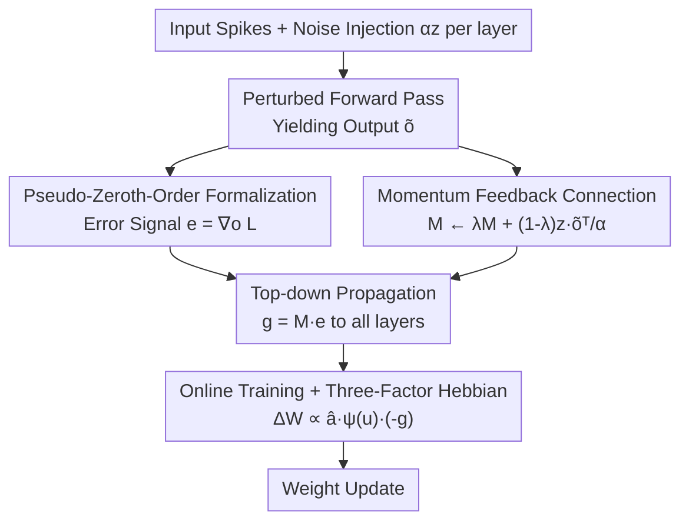

# Online Pseudo-Zeroth-Order Training of Neuromorphic Spiking Neural Networks

**Conference**: ICLR 2026  
**OpenReview**: [https://openreview.net/forum?id=6ZietpbPoB](https://openreview.net/forum?id=6ZietpbPoB)  
**Code**: To be confirmed  
**Area**: Neuromorphic Computing / Spiking Neural Networks / Biologically Plausible Training  
**Keywords**: Spiking Neural Networks, Zeroth-Order Optimization, Spatial Credit Assignment, Online Training, Three-Factor Hebbian Learning

## TL;DR
This paper proposes OPZO (Online Pseudo-Zeroth-Order training), which completes spatial credit assignment in spiking neural networks using only a single noisy forward propagation plus top-down direct feedback. It avoids the weight symmetry and multi-phase execution problems of spatial backpropagation, while suppressing the massive variance of zeroth-order methods through a "pseudo-zeroth-order" formulation and momentum feedback connections. It eventually approaches the accuracy of spatial BP on neuromorphic and static datasets with lower estimated on-chip training overhead.

## Background & Motivation
**Background**: Using Spiking Neural Networks (SNNs) for neuromorphic computing is considered a low-power direction, as neuromorphic hardware (e.g., Loihi) naturally supports sparse event-driven, on-chip parallel operations. The current mainstream for training deep SNNs is "surrogate gradient + spatio-temporal backpropagation (BP)": using surrogate gradients to solve the non-differentiable spike problem and performing BP along both temporal and hierarchical dimensions to complete credit assignment.

**Limitations of Prior Work**: Spatio-temporal BP is incompatible with neuromorphic hardware and biological plasticity. Spatial BP requires weight transport, necessitates separate forward and backward phases, and is accompanied by update locking. Temporal BP is even more unfeasible for spiking neurons with "online" characteristics. Online training methods (e.g., OTTT, e-prop) have already decoupled temporal dependencies using eligibility traces to achieve forward-in-time learning, but **spatial** credit assignment still mainly relies on spatial BP or retreats to Direct Feedback Alignment (DFA), which has weak guarantees and poor accuracy.

**Key Challenge**: To be "biologically plausible and hardware-friendly" (unidirectional local synapses, single forward pass, direct top-down modulation), spatial BP must be abandoned. However, once BP is discarded, existing alternatives either use fixed random feedback like DFA (lacking theoretical guarantees and suffering significant performance drops) or fail to train general networks due to variance explosion in zeroth-order (ZO)/forward gradient methods. How to obtain performance comparable to BP without performing spatial BP remains an open problem.

**Goal**: Design a **global** learning algorithm that satisfies three criteria: requires only a single forward pass, uses direct top-down feedback for spatial credit assignment, and approaches the performance of spatial BP—all while being compatible with online training for on-chip SNN implementation.

**Key Insight**: The authors note that classic zeroth-order methods (SPSA, single-point ZO) treat the loss as a black-box scalar $L$, with the feedback signal being a scalar along a random direction $z$; the lack of information leads to massive variance. However, in practice, the gradient of the **loss function** has a closed-form solution (MSE is $o-y$, cross-entropy is $\sigma(o)-y$). Only the **model** $f$ requires zeroth-order treatment due to non-differentiable spikes or biological constraints. Thus, one can "decouple the model and the loss," using first-order methods for the loss and maintaining zeroth-order for the model.

**Core Idea**: Propose a "pseudo-zeroth-order" formalization—treating the first-order gradient of the loss as a high-information vector error signal, and using momentum feedback connections to approximate the expectation of the model Jacobian to propagate this error, thereby significantly reducing ZO variance while maintaining a single forward pass.

## Method

### Overall Architecture
The core problem OPZO solves is providing a reliable error (gradient) signal to each hidden layer neuron without spatial BP. Overall, it splits the problem of "obtaining error signals" into two halves: **using first-order for the loss** to get the output layer error vector $e=\nabla_o L$, and **using zeroth-order for the model** to estimate a feedback matrix $M$ that projects $e$ back to the hidden layers.

Specifically, in one iteration: a random noise $\alpha z$ is injected into each layer during forward propagation to obtain perturbed outputs $\tilde{o}$; momentum-based updates are applied to the feedback connection $M$ using $z$ and $\tilde{o}$ (approximating the expectation of the model Jacobian transpose $\mathbb{E}_x[J_f^\top]$); the closed-form gradient of the loss yields $e$; $e$ is sent directly to neurons in various layers via $M$ to obtain the error $g$ for each neuron; finally, $g$ is multiplied by the pre-synaptic trace $\hat{a}$ tracked by online training, forming a weight update isomorphic to three-factor Hebbian learning. The entire process involves only **one** noisy forward pass, and error propagation and $M$ updates for all layers can be performed in parallel.

### Key Designs

**1. Pseudo-Zeroth-Order Formalization: Recovering first-order info for loss, keeping ZO only for the model**

The root of variance explosion in ZO methods is treating the entire $L\circ f$ as a black box, using only a single scalar function value multiplied by a random direction $z$. The observation here is: the gradient of the loss $L(\cdot)$ usually has a closed-form solution; only the model $f(\cdot;\theta)$ is "non-differentiable/black-box." By decoupling them—for input $x$, the model outputs $o=f(x;\theta)$, then the loss $L(o,y_x)$ is computed. While $f$ maintains a ZO form, the loss gradient $e=\nabla_o L(o,y_x)$ (e.g., $o-y_x$ for MSE) is used as the feedback error signal. This upgrades feedback from "a scalar" to "a vector carrying category direction information," providing a handle for variance reduction. This is the starting point distinguishing OPZO from pure ZO methods like MeZO/SPSA.

**2. Momentum Feedback Connection: Estimating Jacobian expectation in one pass to suppress variance**

With the error vector $e$, a "feedback connection" is needed to send it back from the output layer. From the two-point estimate directional gradient, Taylor expansion gives:
$$\nabla_\theta^{ZO} L \approx \frac{\langle \nabla_o L,\ \tilde{o}-o\rangle}{\alpha} z = \frac{z\,\Delta o^\top}{\alpha}\nabla_o L,$$
where $\Delta o=\tilde{o}-o$. This suggests that $\frac{z\Delta o^\top}{\alpha}$ is a connection weight projecting back the error $\nabla_o L$, serving as a stochastic estimate of the model Jacobian transpose expectation $\mathbb{E}_x[J_f^\top]$. Since single-pass random direction $z$ has high variance, the authors use **momentum across iterations** to accumulate estimates:
$$M_k := \lambda M_{k-1} + (1-\lambda)\frac{z\,\tilde{o}^\top}{\alpha},\qquad \nabla_\theta^{PZO} L = M_k\,\nabla_o L,$$
using the **single-point** form $z\tilde{o}^\top/\alpha$ (requiring one forward pass, unbiased for the smoothed $f_\alpha$ Jacobian, and valid for non-differentiable spikes). Proposition 4.1 shows that PZO can compress variance to a level comparable to BP. It uses node perturbation, which has lower variance than weight perturbation, and resembles DFA but with estimated Jacobians instead of fixed random matrices.

**3. Integration with Online Training: Plugging estimated gradients into three-factor Hebbian updates**

The first two designs solve spatial credit assignment, but "neuromorphic friendliness" also requires solving the temporal dimension. OPZO is built on online training like OTTT, which uses tracked pre-synaptic traces $\hat{a}_l[t]=\sum_{\tau\le t}\lambda^{t-\tau}s_l[\tau]$ for temporal credit assignment. OPZO **replaces** the instantaneous gradient (originally from spatial BP) with the top-down estimated $g$. The weight update is:
$$\Delta W_{i,j}\propto \hat{a}_i[t]\,\psi(u_j[t])\,(-g_j^t),$$
where $\hat{a}_i[t]$ is the pre-synaptic activity trace, $\psi(u_j[t])$ is the local surrogate derivative, and $g_j^t$ is the global top-down error modulation. This exactly matches the three-factor Hebbian learning form. It tolerates propagation delays $\Delta t$ and allows parallel error propagation and feedback connection updates.

### Loss & Training
The objective remains standard supervised loss (MSE or Cross-Entropy). Noise $z$ is sampled from Gaussian, Rademacher ($\pm 1$), or unit sphere distributions. Perturbations are applied to neural activity (node perturbation) or membrane potentials. Dual noise ($z$ and $-z$) can further reduce variance. Local learning (LL) and intermediate global learning (IGL) can be added to enhance deep networks.

## Key Experimental Results

### Main Results
Using the OTTT online training framework with identical settings for spatial credit assignment comparison:

| Method | N-MNIST | DVS-Gesture | DVS-CIFAR10 | CIFAR-10 | CIFAR-100 |
|------|---------|-------------|-------------|----------|-----------|
| Spatial BP | 98.15 | 95.72 | 75.43 | 90.00 | 64.82 |
| DFA | 97.98 | 91.67 | 60.60 | 79.90 | 49.50 |
| DKP | 97.87 | 60.53 | 37.70 | 81.84 | 53.27 |
| ZOsp (Single-point ZO) | 72.90 | 23.73 | 31.67 | 49.04 | 22.26 |
| **OPZO** | **98.27** | **94.33** | **72.77** | **85.74** | **60.93** |
| **OPZO (w/ LL)** | / | **96.06** | **77.47** | **89.42** | **64.77** |

Pure ZOsp fails to train effectively (22% on CIFAR-100), whereas OPZO pulls it to 61%, approaching BP. OPZO significantly outperforms DFA. With local learning, OPZO (w/ LL) matches or even exceeds BP on neuromorphic datasets.

### Ablation Study

| Configuration | Key Metric | Description |
|------|---------|------|
| Noise distribution/position | 84.0–86.0 | Robust to Gaussian/Unit Sphere/Rademacher across pre/post-neuron perturbation |
| 9-layer OPZO (w/ LL&IGL) | DVS-G: 96.88 / C100: 66.13 | Matches/exceeds spatial BP and significantly outperforms DFA |
| ImageNet fine-tuning ResNet-34 | OPZO 60.96 | Successful fine-tuning where DFA (54.59) and ZOsp (30.32) struggle |
| Gradient Variance | Comparable to BP | OPZO reduces variance by orders of magnitude compared to ZOsp |

### Key Findings
- **Variance reduction is key**: ZOsp fails because its variance is orders of magnitude larger than BP; OPZO matches BP accuracy once variance is reduced.
- **Robustness to noise**: OPZO is robust to noise distributions, allowing hardware-friendly implementations like Rademacher.
- **Depth dependency**: Pure OPZO relies more on residual structures than BP; adding LL/IGL is necessary to scale to 9 layers or ImageNet.
- **Lower estimated on-chip overhead**: Top-down feedback memory and computation are $O(Nmn)$ ($m \ll n$) and parallelizable, lower than spatial BP's $O((N-1)n^2+mn)$.

## Highlights & Insights
- **The decoupling of model and loss is precise**: It identifies that ZO methods waste the "free lunch" of the loss gradient, which has a closed-form solution. Upgrading feedback from scalar to vector is the prerequisite for variance reduction.
- **Momentum feedback = Learned Jacobian feedback**: While DFA uses fixed random matrices, OPZO uses single-point ZO + momentum to approximate the real Jacobian expectation. This retains DFA's hardware friendliness while recovering theoretical guarantees.
- **Isomorphism with three-factor Hebbian**: It maps a gradient estimation algorithm to a biologically plausible rule (pre-synaptic $\times$ local surrogate $\times$ global modulation), making it directly applicable to neuromorphic chips supporting local updates.

## Limitations & Future Work
- Approximating the Jacobian expectation over data $x$ introduces bias due to non-linearity, a common issue in direct feedback methods.
- Pure OPZO's scalability to depth is weaker than BP, requiring residual connections or LL/IGL for deep networks.
- The low overhead is currently an **estimate based on potential neuromorphic hardware**; GPU implementations do not currently reflect these energy advantages.
- ImageNet results are limited to "noisy fine-tuning" rather than training from scratch.

## Related Work & Insights
- **vs. Spatial BP**: BP uses symmetric weights and sequential phases; OPZO uses single forward pass + direct feedback with comparable accuracy and lower parallel overhead.
- **vs. DFA / DKP**: DFA uses fixed random matrices. OPZO uses an estimated Jacobian, leading to much smaller performance drops in convolutional networks.
- **vs. MeZO / SPSA**: These treat the whole pipeline as a black box and usually require two passes; OPZO decouples the loss gradient and needs only one pass with much lower variance.

## Rating
- Novelty: ⭐⭐⭐⭐⭐ Decoupling loss/model plus momentum Jacobian approximation is a theoretically grounded solution.
- Experimental Thoroughness: ⭐⭐⭐⭐ Covers various datasets and architectures; however, ImageNet is limited to fine-tuning.
- Writing Quality: ⭐⭐⭐⭐ Clear motivation and logical progression of propositions.
- Value: ⭐⭐⭐⭐⭐ Provides a realistic path for biologically plausible, hardware-friendly on-chip training for SNNs.

<!-- RELATED:START -->

## Related Papers

- [\[ICLR 2026\] Fractional-Order Spiking Neural Network](fractional-order_spiking_neural_network.md)
- [\[ICLR 2026\] A Brain-Inspired Gating Mechanism Unlocks Robust Computation in Spiking Neural Networks](a_brain-inspired_gating_mechanism_unlocks_robust_computation_in_spiking_neural_n.md)
- [\[ICLR 2026\] Training Deep Normalization-Free Spiking Neural Networks with Lateral Inhibition](training_deep_normalization-free_spiking_neural_networks_with_lateral_inhibition.md)
- [\[ICML 2026\] Bullet Trains: Parallelizing Training of Temporally Precise Spiking Neural Networks](../../ICML2026/others/bullet_trains_parallelizing_training_of_temporally_precise_spiking_neural_networ.md)
- [\[ICLR 2026\] Breaking Gradient Temporal Collinearity for Robust Spiking Neural Networks](breaking_gradient_temporal_collinearity_for_robust_spiking_neural_networks.md)

<!-- RELATED:END -->
