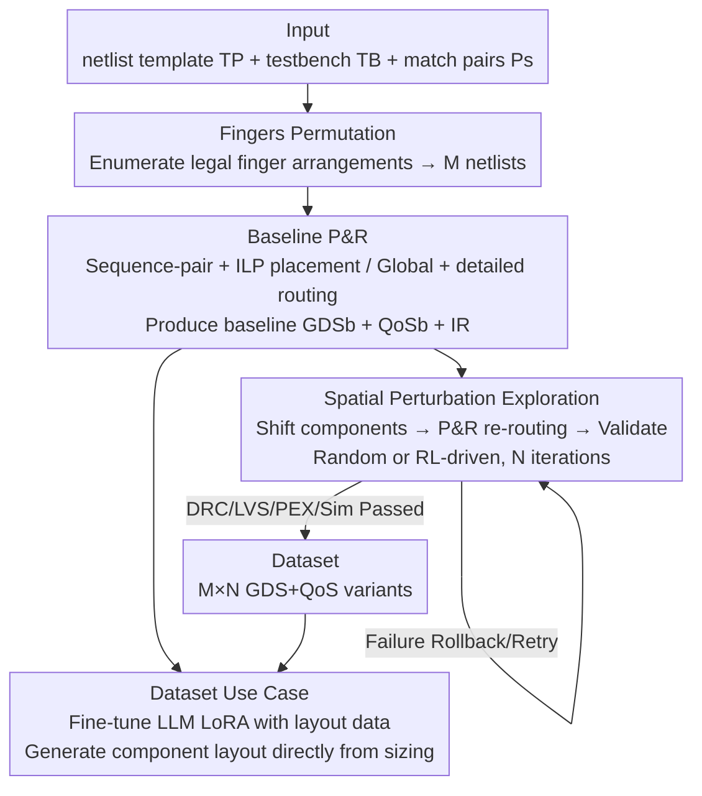

# OSIRIS: Bridging Analog Circuit Design and Machine Learning with Scalable Dataset Generation

**Conference**: ICLR 2026  
**OpenReview**: [https://openreview.net/forum?id=TIDaHgj0Yj](https://openreview.net/forum?id=TIDaHgj0Yj)  
**Code**: https://huggingface.co/datasets/hardware-fab/osiris  
**Area**: Datasets and Benchmarks / ML for EDA  
**Keywords**: Analog circuits, Layout automation, Parasitic effects, Dataset generation, Reinforcement learning

## TL;DR
OSIRIS is a scalable dataset generation pipeline for analog integrated circuit **back-end layouts**. By systematically enumerating transistor finger arrangements and component position perturbations, it automatically produces a large-scale dataset of DRC-clean, LVS-verified layouts with parasitic-aware performance annotations. It releases a dataset of 87,100 layout variants alongside a reinforcement learning-based layout optimization baseline.

## Background & Motivation

**Background**: Digital IC design has long been highly automated and increasingly driven by ML, while analog IC design remains predominantly manual. The analog design flow is divided into two phases: the front-end (topology selection and device sizing at the schematic level) and the back-end (translating the verified schematic into a manufacturable physical layout, including placement, routing, and DRC/LVS/PEX verification). Current ML-for-EDA research focuses primarily on the **front-end**, using GNNs (CktGNN), LLMs (AnalogCoder, LaMAGIC, AnalogGenie), and RL (AutoCircuit-RL) for topology generation and sizing.

**Limitations of Prior Work**: The back-end layout phase has been severely neglected. This is because the back-end is extremely sensitive to parasitic effects—minute geometric changes can alter matching, introduce parasitic capacitance/resistance, and destroy critical symmetries. Furthermore, it is tightly coupled with specific Process Design Kits (PDKs) and subject to complex manufacturability constraints. Existing back-end frameworks (BAG, ALIGN, MAGICAL) are mostly **single-pass automation** tools: they produce a layout once for a given netlist without the closed-loop capability of "iterative exploration—evaluation—re-optimization."

**Key Challenge**: To truly integrate ML into the analog back-end, large-scale, parasitic-aware, and physically valid layout datasets are required for training and benchmarking. However, existing open datasets (CktGNN: 60k, AnalogGenie: 3350, AMSNet: 824, ALIGN: 23) consist almost entirely of **front-end netlists** without parasitic information or physical validity checks. Layout data is extremely scarce. Without data, ML methods can neither be trained nor horizontally compared.

**Goal**: To build a scalable back-end layout dataset generation infrastructure capable of mass-producing physically valid, parasitic-aware layouts while supporting iterative design space exploration (rather than single-pass automation).

**Key Insight**: The authors observe that for a fixed circuit logic function (where aspect ratios and connectivity remain unchanged), two "degrees of freedom" can be systematically explored at the layout level: ① the **finger count** of each transistor (affecting layout topology, parasitic capacitance, and matching); ② the **spatial position** of each component within its "halo" bounding box. By fixing the function and varying only these two dimensions, one can generate vast quantities of physical variants without altering circuit semantics and measure their parasitic differences.

**Core Idea**: Utilize the two layers of freedom—"finger arrangement + component position perturbation"—combined with a complete P&R + DRC/LVS/PEX/simulation verification chain to transform the analog back-end layout design space into an enumerable, annotatable, and optimizable data generation problem.

## Method

### Overall Architecture

The input to OSIRIS consists of three items provided by the user: a circuit netlist template `TP` (describing connectivity and device sizing), a simulation testbench `TB` (AC small-signal simulation, 1 kHz–1 GHz), and matched transistor pairs `Ps` (specifying transistors that must remain identical, such as current mirrors or differential pairs). The output is a dataset where each layout variant consists of a physical layout file `GDS` and a Quality of Service report `QoS`.

The pipeline runs in two serial stages: **Fingers Permutation** (outer layer, enumerating finger arrangements to produce M netlists) → **Variants Generation** (inner layer, performing Baseline P&R on each netlist followed by N random or RL-driven spatial perturbations to produce variants). For each template, M×N layout variants are eventually generated. Each variant undergoes a complete classical analog design verification chain (DRC is guaranteed by construction in P&R, LVS uses Netgen, PEX uses Magic, and simulation uses Ngspice). Only layouts that pass verification are included in the dataset.

### Key Designs

**1. Two-dimensional design space: Finger arrangement + component displacement within halos**

OSIRIS constrains the analog layout exploration space to two orthogonal degrees of freedom that do not change the "circuit logic function," which is the prerequisite for bulk, legal dataset generation. The first dimension is the **transistor finger count**: a finger is a gate segment sharing source/drain regions. A transistor can be split into multiple parallel segments to increase compactness, reduce parasites, and improve matching. Given a fixed width/length ratio, each transistor can take several legal finger values. A finger arrangement is **legal** if it satisfies two constraints: matching requirements (matched pairs must have identical finger counts) and PDK-defined minimum gate dimensions. The second dimension is **component position**: each component (transistor, resistor, capacitor) is enveloped by a bounding box called a **halo**, within which it can move freely. By fixing functionality and varying only these two dimensions, every generated variant remains electrically equivalent to the original netlist but differs in parasitics and area—providing exactly the supervision signal ML needs: "same function, different physical implementations."

**2. Fingers Permutation + Baseline P&R: Enumerating legal netlists and synthesizing baseline layouts**

The Fingers Permutation stage receives `TP` and `Ps`, **exhaustively enumerating all legal finger combinations**. Each combination is annotated onto the template to generate a netlist $NL_i$ ($i=0,\dots,M$), resulting in M functionally identical but structurally distinct netlists. For each $NL_i$, Baseline P&R executes a full placement and routing flow: placement uses **sequence-pair** encoding, deriving constraints and solving them with geometric ILP. An outer **Simulated Annealing** meta-heuristic perturbs the sequence-pair to minimize Half-Perimeter Wire Length (HPWL). Routing is handled in two steps: global routing via Dijkstra and detailed routing via A* to resolve local congestion. This step produces three objects: a baseline layout $GDS_i^b$, a corresponding quality report $QoS_i^b$, and an internal representation $IR_i^b$ recording coordinates and types for each component. The baseline serves both as a variant in the dataset and as the starting point for subsequent spatial perturbations.

**3. Spatial Perturbation Exploration: Iterative variant generation via Random + RL strategies**

Based on $IR_i^b$, N incremental perturbations are performed, where the result of iteration j serves as the baseline for j+1 ($IR_i^0 = IR_i^b$). The Random Exploration version uses a three-step loop per round: **Shift** (randomly selecting a component and a direction, then updating the IR) → **P&R** (re-routing according to new coordinates to restore electrical connectivity) → **Validate** (running DRC/LVS/PEX/Simulation to confirm logical equivalence and estimate behavior). If a round fails verification, it rolls back and retries until N successful iterations are reached. The RL version upgrades this to a **two-level reinforcement learning loop**: the outer **FinPerm Search** uses a fully connected agent to receive the "finger count per transistor" vector and output probabilities for discrete actions, trained via REINFORCE. The inner **RL Place** uses an actor-critic agent on the "type + coordinate" vector to decide which component to move, trained via PPO. The outer reward takes the maximum value from all inner iterations:

$$R_i = \max_{j=1,\dots,N}\ \alpha\cdot(pscore_i^j - pscore_i^b) + \beta\cdot(area_i^j - area_i^b)$$

The inner step reward is $r_j = \alpha\cdot(pscore_i^j - pscore_i^b) + \beta\cdot(area_i^j - area_i^b)$, where $\alpha, \beta$ are trade-off coefficients. Unlike the random version, the RL version does **not retry** on failure; it terminates the episode and penalizes the agent, forcing it to learn to avoid actions that lead to illegal layouts, thereby converging to high-quality solutions faster than pure randomness.

**4. Parasitic-aware Quality Metric: pex score and area**

The dataset "labels" are defined by two QoS metrics (both **lower is better**). The first is the **pex score (pscore)**, quantifying performance degradation introduced by layout parasitics. It is defined as the Root Mean Square Error (RMSE) between the pre-layout (schematic level) and post-layout simulation trajectories:

$$pscore = \sqrt{\frac{1}{K}\sum_{i=1}^{K}(pre_i - post_i)^2}$$

where K is the number of sampling points per simulation trajectory. The pscore directly characterizes the impact of parasitics on critical analog metrics like gain, bandwidth, noise, and stability. The second is **area**, defined as the sum of bounding boxes of all components $area = \sum_{t=0}^{T} W_t\cdot H_t$, acting as a proxy for manufacturing cost. There is typically a trade-off between pscore and area, which the RL reward balances via $\alpha$ and $\beta$.

### A Complete Example

Taking an amplifier circuit as an example: the user provides a Miller amplifier netlist template (5 nmos + 4 pmos + 1 cap + 1 res), testbench, and matched pairs. Fingers Permutation enumerates 146 legal finger arrangements (146 netlists). For each netlist, Baseline P&R synthesizes a baseline layout, followed by 100 spatial perturbations → resulting in 100 variants per netlist, or 14,600 layouts for the single circuit. Each layout's pscore and area are measured alongside DRC/LVS/PEX/Simulation. The entire exploration for the Miller circuit takes approximately 195 hours (averaging 48 seconds per layout). Across five circuits (Miller, Ahuja, Feed Forward, 5-Transistors, LPF), the dataset totals 871 finger arrangements and 87,100 variants, totaling ~5 GB. Total collection took ~37 days using only CPUs (Intel Xeon 32-core).

## Key Experimental Results

### Dataset Scale and Comparison

The dataset covers five common analog circuits implemented using the open-source Skywater 130nm PDK.

| Circuit | Explored Netlists | Variants per Netlist | Total Layouts | Avg pscore (V) | Generation per Layout (s) |
|------|------|------|------|------|------|
| Miller | 146 | 100 | 14,600 | 0.0794 | 48 |
| Ahuja | 143 | 100 | 14,300 | 0.1693 | 48 |
| Feed Forward | 224 | 100 | 22,400 | 0.1044 | 25 |
| 5-Transistors | 129 | 100 | 12,900 | 0.0674 | 45 |
| LPF | 229 | 100 | 22,900 | 0.3201 | 29 |

Compared to existing analog datasets, OSIRIS is the first large-scale dataset targeting the **back-end layout** with physical validity checks and parasitic awareness:

| Dataset | Design Phase | Data Type | Scale | Physical Validity | Parasitic-aware |
|------|------|------|------|------|------|
| CktGNN | Front-end | Netlist | 60,000 | N.A. | ✗ |
| AnalogGenie | Front-end | Netlist | 3,350 | N.A. | ✗ |
| AMSNet | Front-end | Netlist | 824 | N.A. | ✗ |
| ALIGN | Back-end | Netlist | 23 | ✓ | ✗ |
| **Ours (OSIRIS)** | **Back-end** | **Layout** | **87,100** | **✓** | **✓** |

### RL Baseline vs. Single-pass Baselines (pscore / area / time)

RL exploration is compared against single-pass generators MAGICAL and ALIGN, as well as OSIRIS's random exploration (lower pscore and area are better):

| Circuit | MAGICAL pscore | ALIGN pscore | Random pscore | RL pscore | RL area (µm²) |
|------|------|------|------|------|------|
| Miller | 0.2739 | 0.142 | 0.0012 | **0.00069** | 1,733 |
| Ahuja | 0.5184 | 0.315 | 0.120 | **0.120** | 1,797 |
| Feed Forward | 0.2087 | 0.210 | 0.037 | **0.024** | 768.5 |
| 5-Transistors | 0.2554 | 0.093 | 0.050 | **0.047** | 444.5 |
| LPF | – | 0.501 | 0.102 | **0.064** | 6,635 |

### Dataset Use Case: Fine-tuning LLM for Component Layout Generation

The authors use ~10,000 capacitor layout samples from the OSIRIS dataset to fine-tune **Qwen3-14B** via LoRA. The goal is to generate DRC-free, LVS-verified capacitor layouts directly from sizing targets in SkyWater 130nm. Results: The fine-tuned model produced **100% legal output with perfect sizing accuracy**, whereas the original Qwen3-14B lacked geometric capability and could not generate valid layouts. Fine-tuning was completed on a single H100 (96 GB).

### Key Findings

- **RL achieves the lowest pscore across all benchmarks**: In Miller and Feed Forward, RL pscore is more than an order of magnitude lower than ALIGN/MAGICAL, indicating that learned placement guidance better suppresses parasitics.
- **Area is generally comparable or smaller, but trade-offs exist**: In the 5-Transistor OTA, the RL area (444.5 µm²) is slightly larger than the baseline, but the pscore is lower—RL sacrifices area for electrical performance.
- **RL converges faster than random exploration**: Running time on Miller and Ahuja was reduced by nearly 50% compared to Random; RL had the shortest collection time across all benchmarks because it explores the solution space more efficiently.
- **Broad coverage**: On the LPF, RL obtained both the smallest area and lowest pscore, while MAGICAL failed to generate a valid layout entirely.

## Highlights & Insights

- **Transforming back-end layout exploration into an enumerable data generation problem**: By locking functionality and varying only fingers and positions, the authors enable the automatic mass-production of legal variants—a fundamental solution to back-end data scarcity rather than just another single-pass generator.
- **The pscore metric (pre/post-sim RMSE) is highly pragmatic**: It converts abstract "parasitic degradation" into a differentiable scalar suitable for RL rewards, directly linked to real analog metrics.
- **The dataset structure is tailor-made for ML**: Paired pre/post simulations, fine-grained parasitic degradation, and spatial movement metadata natively support tasks like parasitic prediction, ML-guided placement, and component-level layout synthesis.
- **The LLM fine-tuning use case provides a transferable paradigm**: Fine-tuning a general LLM with structured layout data endows it with "geometric/layout" capabilities it naturally lacks, a strategy applicable to other PDK-related tasks.

## Limitations & Future Work

- **Acknowledged Limitations**: The current release covers only five circuits and a single process node (Skywater 130nm). Development is underway for more circuit families, richer perturbation operators, and cross-PDK transfer learning.
- **High Generation Cost**: Exploration for a single circuit takes 156–195 hours; total collection took ~37 days. The bottleneck is the full DRC/LVS/PEX/Sim chain for every variant. Costs will rise as circuits grow larger.
- **Relatively Simple RL Baseline**: The two-level REINFORCE/PPO structure is a "sufficient baseline" rather than a groundbreaking method. The reward only considers linear combinations of pscore and area, and $\alpha, \beta$ require manual tuning.
- **Simple Perturbation Operators**: Currently, only discrete shifts are used. Lack of rotation, mirroring, and symmetric group placement—common expert practices—may limit the upper bound of layout quality explored.

## Related Work & Insights

- **vs. Single-pass Back-end Frameworks (BAG / ALIGN / MAGICAL)**: These treat layout as a one-time optimization problem reliant on templates and expert tuning. OSIRIS differs by supporting **iterative, performance-driven design space exploration** and capturing all legal variants as learnable data.
- **vs. Front-end Datasets (CktGNN / AnalogGenie / AMSNet)**: These provide netlist-level data without parasitic info, which cannot support back-end ML. OSIRIS fills this gap with physical validity and parasitic annotations.
- **vs. Closed-loop Sizing Methods (DNN-Opt / Bayesian + MAGICAL)**: Those methods treat the layouter as a black box and tune transistor sizing. OSIRIS is orthogonal—it optimizes the **layout itself** and can serve as a generator or data source for such methods.

## Rating
- Novelty: ⭐⭐⭐⭐☆ First large-scale, parasitic-aware, physically valid layout dataset + iterative exploration pipeline; fills a clear gap.
- Experimental Thoroughness: ⭐⭐⭐⭐☆ 87,100 variants across five circuits, comprehensive comparisons with SOTA generators, and an LLM use case; however, circuit and PDK variety remains limited.
- Writing Quality: ⭐⭐⭐⭐☆ Pipeline, dataset structure, and metrics are clearly defined; tables and figures are complete.
- Value: ⭐⭐⭐⭐⭐ Provides much-needed open-source infrastructure for ML-for-EDA back-end research; significant for community benchmarking and reproducibility.

<!-- RELATED:START -->

## Related Papers

- [\[ICLR 2026\] CircuitNet 3.0: A Multi-Modal Dataset with Task-Oriented Augmentation for AI-Driven Circuit Design](circuitnet_30_a_multi-modal_dataset_with_task-oriented_augmentation_for_ai-drive.md)
- [\[ICLR 2026\] An Information-Theoretic Framework For Optimizing Experimental Design To Distinguish Probabilistic Neural Codes](an_information-theoretic_framework_for_optimizing_experimental_design_to_disting.md)
- [\[ICLR 2026\] A Scalable Inter-edge Correlation Modeling in CopulaGNN for Link Sign Prediction](a_scalable_inter-edge_correlation_modeling_in_copulagnn_for_link_sign_prediction.md)
- [\[ICLR 2026\] Stable and Scalable Deep Predictive Coding Networks with Meta-Prediction Errors](stable_and_scalable_deep_predictive_coding_networks_with_meta-prediction_errors.md)
- [\[ICLR 2026\] Oversmoothing, Oversquashing, Heterophily, Long-Range, and More: Demystifying Common Beliefs in Graph Machine Learning](oversmoothing_oversquashing_heterophily_long-range_and_more_demystifying_common_.md)

<!-- RELATED:END -->
