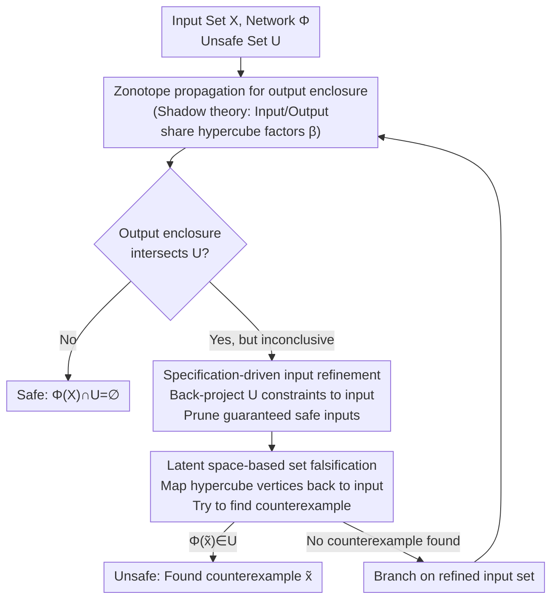

# Out of the Shadows: Exploring a Latent Space for Neural Network Verification

**Conference**: ICLR 2026  
**arXiv**: [2505.17854](https://arxiv.org/abs/2505.17854)  
**Code**: [CORA toolbox](https://cora.in.tum.de/) (MATLAB implementation)  
**Area**: Neural Network Verification / Formal Methods  
**Keywords**: Neural Network Verification, Latent Space, Zonotope, Branch-and-Bound, Reachability Analysis

## TL;DR

By treating a zonotope as a "projection (shadow)" of a high-dimensional hypercube, it is discovered that the input set and the output enclosure share the same latent space. Based on this, a specification-driven input refinement method is proposed to back-propagate unsafe constraints from the output to thin the input space, reducing the number of branch-and-bound subproblems by 60-65%. All operations are matrix-based to achieve efficient GPU acceleration, reaching performance comparable to top-tier tools like $\alpha$-$\beta$-CROWN across eight VNN-COMP'24 benchmarks.

## Background & Motivation

**Background**: Neural networks (NNs) are widely deployed in safety-critical domains such as autonomous driving and airborne collision avoidance systems. However, they are sensitive to infinitesimal input perturbations (adversarial examples). Thus, formal verification is required before deployment—proving that all outputs for a given input set satisfy safety specifications. Mainstream verification methods fall into two categories: (1) encoding the problem for SMT/MIP solvers (e.g., Reluplex, Marabou); (2) using reachability analysis or abstract interpretation to conservatively bound the NN output set (e.g., DeepPoly/CROWN, zonotope propagation).

**Limitations of Prior Work**: The core bottleneck of reachability analysis is **conservatism**. Due to over-approximation of non-linear activation functions (e.g., ReLU), output enclosures are often too large, leading to "inconclusive" safety results. To improve precision, branch-and-bound (B&B) is used to recursively split the problem into smaller subproblems, but the number of subproblems grows **exponentially** with the number of branches. Furthermore, many SOTA methods (e.g., $\alpha$-$\beta$-CROWN) rely on operations (linear programming, optimization solvers) that are difficult to batch efficiently on GPUs.

**Key Challenge**: The fundamental trade-off between precision and efficiency—reducing conservatism requires more branches, but the resulting branch explosion makes computation infeasible. Existing methods mainly focus on "smarter branching" but overlook a critical point: **most inputs are inherently safe, and including them in branching is wasteful.**

**Goal**: How to pre-exclude safe input regions before branching to reduce the number of subproblems from the source?

**Key Insight**: The authors observe an elegant geometric fact—a zonotope $Z = c + G\beta$ ($\beta \in [-1,1]^q$) is essentially the "shadow" of a $q$-dimensional hypercube projected onto a lower-dimensional space via matrix $G$. When a zonotope propagates through affine layers of an NN, only the projection matrix $G$ is modified, while the hypercube (the domain of factors $\beta$) remains unchanged. This implies that the **input zonotope and the output zonotope are different projections of the same high-dimensional hypercube**, naturally linked through a shared latent space.

**Core Idea**: Leverage the shared latent space of the input-output zonotopes to back-map unsafe output constraints into input constraints, iteratively pruning the input set so it only encloses potentially unsafe inputs.

## Method

### Overall Architecture

Given an NN $\Phi$, an input set $X$, and an unsafe output set $U$, verification seeks to either prove $\Phi(X) \cap U = \emptyset$ (Safe) or find a counterexample $x \in X$ such that $\Phi(x) \in U$ (Unsafe). The method is wrapped in a Branch-and-Bound (B&B) loop: first, use zonotopes to conservatively bound the network output, then check the intersection between this enclosure and the unsafe set $U$. If they do not intersect, it is safe; if a point is found in the intersection, it is unsafe. For "inconclusive" cases, rather than blindly branching in the input space, the authors employ two novel strategies based on the "shadow" theory. **Specification-driven input refinement** back-projects unsafe constraints to prune safe inputs, and **latent space-based set falsification** attempts to construct counterexamples directly on the vertices of the shared hypercube.

### Key Designs

**1. Latent Space and "Shadow" Theory: Linking Input and Output to the Same Hypercube**

Input refinement relies on a geometric fact: a zonotope $Z = \langle c, G \rangle_Z$ is a "shadow" of a high-dimensional hypercube $B^q = [-1,1]^q$ projected via the affine transformation $c + G\beta$. During propagation through an affine layer $W_k h + b_k$, the new zonotope becomes $\langle W_k c + b_k, W_k G \rangle_Z$—only the generator matrix $G$ is updated; the factor domain $[-1,1]^q$ remains the same. Nonlinear layers (ReLU) introduce extra error generators via linear approximation, expanding the dimension of $\beta$ from $q_0$ to $q_\kappa$, but the first $q_0$ factors are still shared with the input. Thus, for any input $x$ and its corresponding output $y$, there exists a shared set of $\beta$ satisfying $x = c_x + G_x \beta_{[q_0]}$ and $y = c_y + G_y \beta_{[q_\kappa]}$. The shared latent space acts as a bridge for bidirectional constraint flow.

**2. Specification-Driven Input Refinement (Proposition 2): Back-Projecting Unsafe Constraints**

Traditional B&B branches blindly in the input space, even though many inputs cannot reach the unsafe region. Using the shared latent space, one can back-calculate which inputs are potentially dangerous. Specifically, if the unsafe set is $U = \{y \mid Ay \leq b\}$, substituting $y = c_y + G_y\beta$ transforms $Ay \leq b$ into linear constraints on $\beta$. Since $q_\kappa > q_0$ due to ReLU approximations, the extra dimensions are eliminated using upper bounds for the worst case, leaving constraints only on the first $q_0$ factors:

$$C = A\,G_{y(\cdot,[q_0])}, \qquad d = b - A c_y + \big|A\,G_{y(\cdot,[q_\kappa]\setminus[q_0])}\big|\,\mathbf{1}.$$

This constructs a constrained zonotope $X|_{C\beta \leq d} \subseteq X$ that strictly encloses inputs leading to unsafe outputs, excluding safe regions. This process can be iterated to tighten the enclosure further, significantly reducing the number of branches.

**3. Latent Space-Based Set Falsification: Finding Counterexamples on Hypercube Vertices**

When results are inconclusive, the method attempts to construct a counterexample. Utilizing the shared latent space, for each half-space normal $A_{(i,\cdot)}$ of the unsafe set, a boundary factor $\tilde{\beta}_i = \text{sign}(A_{(i,\cdot)} G_y)$ is selected. This identifies the hypercube vertex that "pushes" furthest into that half-space. Mapping this back gives $\tilde{x} = c_x + G_x \tilde{\beta}_{[q_0]}$. If $\Phi(\tilde{x}) \in U$, a counterexample is found. This gradient-free set-theoretic attack bypasses vanishing gradient issues common in methods like FGSM.

### Loss & Training

This is a deterministic formal verification method; no training is involved. All operations—zonotope affine mappings, Minkowski sums, constraint projections, and branching—are implemented via matrix multiplications and element-wise operations without solving optimization problems or LPs. This allows the algorithm to process multiple subproblems in batches, fully utilizing GPU parallelism. The tool is implemented in the CORA toolbox (MATLAB).

## Key Experimental Results

### Main Results

Comparison with top-5 tools on 8 standardized benchmarks from VNN-COMP'24. Metric: %Solved (percentage of instances verified or falsified).

| Benchmark | CORA (Ours) | $\alpha$-$\beta$-CROWN | NeuralSAT | PyRAT | Marabou | nnenum |
|------|------------|-----------|-----------|-------|---------|--------|
| acasxu | **99.5%** (138/47) | 100.0% (139/47) | 98.9% (138/46) | 98.9% (137/47) | 96.2% (134/45) | 99.5% (139/46) |
| collins-rul-cnn | **100.0%** (30/32) | 100.0% (30/32) | 100.0% (30/32) | 93.5% (30/28) | 100.0% (30/32) | 100.0% (30/32) |
| cora | 81.1% (18/128) | **87.8%** (24/134) | 87.2% (23/134) | 83.3% (22/128) | 86.7% (22/134) | 14.4% (20/6) |
| dist-shift | **98.6%** (63/8) | 98.6% (63/8) | 98.6% (63/8) | 98.6% (63/8) | 95.8% (62/7) | – |
| linearizenn | **100.0%** (59/1) | 100.0% (59/1) | 100.0% (59/1) | 100.0% (59/1) | 100.0% (59/1) | 98.3% (59/0) |
| meta-room | 97.0% (90/7) | **98.0%** (91/7) | 98.0% (91/7) | 97.0% (91/6) | 53.0% (46/7) | 46.0% (44/2) |
| safenlp | 89.2% (311/652) | **100.0%** (421/659) | 90.5% (327/650) | 79.9% (277/586) | 62.5% (300/375) | 89.2% (321/642) |
| tllverify-bench | **100.0%** (15/17) | 100.0% (15/17) | 100.0% (15/17) | 100.0% (15/17) | 93.8% (13/17) | 56.2% (2/16) |

CORA matches the best performance on 4/8 benchmarks and remains highly competitive with $\alpha$-$\beta$-CROWN.

### Ablation Study

**Effect of Input Refinement**:

| Configuration | acasxu Avg Subproblems↓ | acasxu Max Time↓ | safenlp Avg Subproblems↓ | safenlp Max Time↓ | safenlp %Solved↑ |
|------|-------------------|----------------|---------------------|-----------------|---------------|
| w/o Refinement | 1611.2 (max 133438) | 32.5s | 4401.8 (max 293304) | 19.9s | 80.8% |
| **w/ Refinement** | **651.5** (max 36134) | **15.1s** | **1529.2** (max 114065) | **12.4s** | **89.2%** |
| Reduction | **59.6%** | **53.5%** | **65.3%** | **37.7%** | +8.4pp |

**GPU Acceleration**:

| Computation | acasxu Max Time | acasxu %Solved | safenlp Max Time | safenlp %Solved |
|---------|---------------|-------------|----------------|--------------|
| CPU (batch=1) | 40.1s | 95.7% | 14.7s | 83.1% |
| GPU (batch=128) | 7.3s | 99.5% | 2.0s | 86.8% |
| GPU (batch=1024) | **6.9s** | **99.5%** | **1.5s** | **89.2%** |

GPU acceleration reaches 82.8% for acasxu and 89.8% for safenlp.

**Falsification Comparison** (safenlp, first 50 iterations):

| Method | Counterexamples Found | Percentage |
|------|----------|------|
| FGSM | 257 | 23.8% |
| Latent Space Falsification | **647** | **59.9%** |

Latent space falsification finds **60.3%** more counterexamples than FGSM without gradient calculations.

### Key Findings

- **Input refinement is the primary contributor**: On safenlp, subproblems were reduced from 4402 to 1529 (-65.3%), leading to an 8.4 percentage point increase in solving rate.
- **GPU acceleration depends on pure matrix implementation**: Traditional methods using LP cannot fully utilize GPUs; the matrix-centric design allows nearly 10x speedup with batch=1024.
- **Latent falsification >> FGSM**: Locating boundary points via latent geometry is more stable and efficient than gradient-based methods.
- **Near-perfect on small networks (acasxu)** but lags behind $\alpha$-$\beta$-CROWN by 10.8% on deeper benchmarks (safenlp) due to the cumulative conservatism of zonotopes in deep architectures.

## Highlights & Insights

- **Elegance of the "Shadow" Insight**: Reinterpreting zonotope propagation as projections of the same hypercube is highly intuitive. The input refinement method derives naturally from this observation.
- **"Specification-Driven" replaces "Blind Branching"**: Unlike traditional B&B which branches uniformly, this strategy prunes safe regions first—a "subtraction before addition" approach.
- **Value of Pure Matrix Design**: Consciously restricting operations to matrix math sacrifices some flexibility but grants immediate GPU acceleration and batching capabilities, addressing a common lack of GPU support in verification tools.

## Limitations & Future Work

- **Conservatism Accumulation**: Each ReLU layer introduces extra error generators, increasing latent dimensionality and conservatism in deep networks.
- **Elemental Activation Support**: While the paper claims support for sigmoid/tanh, experiments are limited to ReLU networks.
- **MATLAB Realization**: Implementation in the CORA toolbox (MATLAB) limits integration with the Python/PyTorch ecosystem.
- **Convergence of Refinement**: The paper does not extensively discuss the convergence rate or termination conditions of iterative refinement.
- **Multi-output Joint Constraints**: Current methods handle half-spaces of the unsafe set independently, ignoring potential joint relationships between half-spaces.

## Related Work & Insights

- **vs $\alpha$-$\beta$-CROWN**: $\alpha$-$\beta$-CROWN uses DeepPoly/CROWN relaxation with gradient-optimized bounds and neuron splitting. Ours uses zonotopes with latent space refinement and input splitting. Ours is simpler and competitive on small networks.
- **vs Marabou/NeuralSAT**: These are SMT-based and slower. Ours avoids expensive symbolic reasoning and excels in speed on GPUs.
- **vs nnenum**: Both use reachability analysis, but nnenum’s performance is inconsistent across benchmarks. Our refinement and GPU acceleration make the zonotope approach significantly more competitive.
- **Preimage Computation**: The latent space approach can be extended to preimage calculation, as Proposition 2 provides a closed-form enclosure for preimages, useful for safety region labeling and controller verification.

## Rating

- Novelty: ⭐⭐⭐⭐ — The "shadow" perspective for refinement is a fresh contribution, though the components (zonotope, B&B) are existing.
- Experimental Thoroughness: ⭐⭐⭐⭐⭐ — Coverage of 8 VNN-COMP'24 benchmarks and comprehensive ablations.
- Writing Quality: ⭐⭐⭐⭐⭐ — The "shadow" metaphor is clear, and mathematical derivations are rigorous.
- Value: ⭐⭐⭐⭐ — Provides a new direction for the formal verification community, though direct impact on the broader ML community may be specialized.

<!-- RELATED:START -->

## Related Papers

- [\[ICLR 2026\] Exploring State-Space Models for Data-Specific Neural Representations](exploring_state-space_models_for_data-specific_neural_representations.md)
- [\[ICLR 2026\] Fractional-Order Spiking Neural Network](fractional-order_spiking_neural_network.md)
- [\[AAAI 2026\] Learning Compact Latent Space for Representing Neural Signed Distance Functions with High-fidelity Geometry Details](../../AAAI2026/others/learning_compact_latent_space_for_representing_neural_signed_distance_functions_.md)
- [\[CVPR 2026\] HypeVPR: Exploring Hyperbolic Space for Perspective to Equirectangular Visual Place Recognition](../../CVPR2026/others/hypevpr_exploring_hyperbolic_space_for_perspective_to_equirectangular_visual_pla.md)
- [\[ICLR 2026\] Noise-Aware Generalization: Robustness to In-Domain Noise and Out-of-Domain Generalization](noise-aware_generalization_robustness_to_in-domain_noise_and_out-of-domain_gener.md)

<!-- RELATED:END -->
