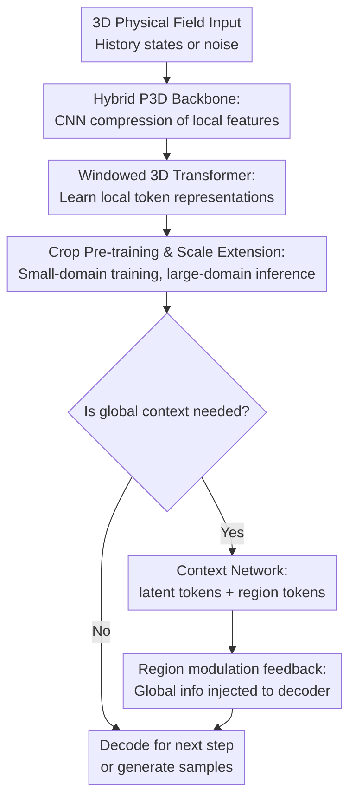

# P3D: Highly Scalable 3D Neural Surrogates for Physics Simulations with Global Context

**Conference**: ICLR 2026  
**OpenReview**: [https://openreview.net/forum?id=8UdCE5nhFl](https://openreview.net/forum?id=8UdCE5nhFl)  
**Code**: https://github.com/tum-pbs/P3D  
**Area**: Scientific Machine Learning / Physics Simulation Surrogates  
**Keywords**: 3D Physics Simulation, PDE Surrogate Models, Turbulence Modeling, Global Context, CNN-Transformer  

## TL;DR
P3D utilizes a hybrid CNN-Transformer backbone, crop-based pre-training, and an optional global context network to scale neural surrogate models for 3D PDE and turbulence simulations to the $512^3$ level, achieving superior accuracy, speed, and memory efficiency across both deterministic prediction and probabilistic generation tasks.

## Background & Motivation
**Background**: Common neural surrogates in scientific machine learning employ CNNs, Fourier Neural Operators, or Transformers to replace expensive numerical PDE solvers. These models have demonstrated effective short-term predictions on low-dimensional, 2D, or relatively smooth systems. However, practical surrogate models for scenarios like fluid dynamics, climatology, energy, and biomedicine must process high-resolution 3D volume data representing physical quantities (velocity, pressure, concentration) evolving over time.

**Limitations of Prior Work**: The cost of 3D simulation scales cubically rather than linearly with spatial resolution. Directly feeding $128^3$ or $512^3$ volume data into global attention mechanisms leads to an immediate explosion in token count and memory usage. Conversely, models relying solely on local convolutions or independent processing of sub-domain crops tend to lose long-range dependencies and global boundary information, resulting in structural errors, particularly in wall-bounded turbulence, non-uniform grids, or scenarios requiring absolute positioning.

**Key Challenge**: High-resolution 3D surrogates must simultaneously achieve three objectives: sufficient local accuracy, preservation of long-range context, and low training/inference costs. Traditional CNNs excel at local features and equivariance but possess limited deep representation capabilities; Transformers are adept at token representation and dependency modeling but global attention is prohibitively expensive in 3D; pure crop-based training saves memory but renders dynamic boundary conditions outside the crop as unknown variables.

**Goal**: The authors aim to construct a general backbone that is efficient for training on small crops yet scalable for inference on large 3D domains. This backbone must support simultaneous supervised learning of multiple PDEs as well as probabilistic generation of turbulence velocity/pressure fields. Furthermore, it should provide a controllable finetuning strategy to integrate global context into the decoder in a memory-efficient manner.

**Key Insight**: The observation in this study is that many short-range dynamics in 3D physical fields exhibit translation equivariance, which can be initially learned via convolutions and local window attention within crops. The primary difficulty lies in aggregating information across crops and providing context, such as "where I am in the global domain," back to each region. Consequently, P3D decouples the local backbone from an optional sequential context model: the former handles scalable local representations, while the latter manages global communication only at the bottleneck token layer.

**Core Idea**: A hierarchical architecture consisting of "convolutional local encoding + 3D window attention + crop-level context tokens" is proposed to treat high-resolution 3D PDE simulation as a locally learnable and globally coordinated surrogate modeling problem.

## Method

### Overall Architecture
The input to P3D can be a sequence of past states $u_{in}=[u_{t-P\Delta t},\ldots,u_{t-\Delta t}]$ and a condition vector $c$, leading to the output of the next-step physical field $u_t$. In probabilistic generation tasks, the input state may be empty, and the model generates velocity/pressure fields satisfying specific conditions from noise via flow matching. Structurally, P3D first uses a convolutional encoder to compress the 3D volume data into multi-scale local features, followed by a 3D window Transformer to learn token representations. When global information is required, bottleneck tokens are fed into a context network for sequential modeling alongside region tokens. Finally, global information is injected into the decoder through skip connections and adaptive instance normalization.

This diagram highlights three primary contribution layers: the hybrid P3D backbone for transforming 3D data into computable local representations, crop pre-training & scale extension for reducing training costs and enabling transfer to larger domains, and the context network & region modulation for addressing long-range dependencies and absolute position information. Input, output, and standard decoding serve as procedural scaffolding rather than standalone key designs.

### Key Designs
**1. Hybrid P3D Backbone: Reducing 3D token pressure with CNNs and enhancing representation with window attention**

Directly flattening $p\times p\times p$ 3D patches into tokens leads to excessively high information density per token, while the complexity of global self-attention scales quadratically with the number of tokens. P3D avoids the standard 2D ViT patchification by using a 3D convolutional encoder for learnable compression of the local field, retaining U-Net-like skip connections, and then applying windowed multi-head self-attention on the compressed space. Thus, convolutions handle inexpensive and stable local feature extraction, while the Transformer develops deeper token representations within local windows.

This design involves a clear trade-off: local interactions in physical simulations are strong, making convolutional translation equivariance a useful inductive bias; however, pure convolution is inflexible for long-range dependencies and conditional expressions. P3D inherits the advantages of PDE-Transformer, Swin Transformer, DiT, and U-Net, while introducing key modifications for 3D: replacing linear patch tokenizers with large convolutional encoder/decoders, using log-spaced relative positions for intra-window encoding, and removing window shifting as it provided no significant gain for this task.

**2. Crop Pre-training & Scale Extension: Converting high-res training into reusable small-domain learning**

The main challenge in high-resolution 3D simulation is not the single forward pass, but the prohibitive memory and computational cost during training. P3D's strategy is to first train on smaller crops—e.g., learning 3D PDE dynamics on $128^3$ local blocks—and then extend the same model to a larger input domain during inference. The notation $\langle x|y\rangle$ denotes "training crop resolution $x^3$, internal inference resolution $y^3$": for instance, $\langle128|512\rangle$ means the model is trained on $128^3$ crops but run on a $512^3$ global domain.

This approach leverages the P3D backbone's independence from absolute position encoding. For isotropic, periodic, or approximately translation-equivariant simulations, local dynamics learned on small crops extend naturally to larger domains. Compared to partitioning a $512^3$ domain into 64 independent $128^3$ blocks, running directly on the full domain reduces uncertainty and discontinuities at crop boundaries. This is demonstrated in forced isotropic turbulence: $\langle128|512\rangle$ achieves more stable results than independent crop inference without requiring finetuning on $512^3$.

**3. Context Network & Region Modulation: Global communication at the bottleneck with feedback to regions**

A translation-equivariant local backbone is not always sufficient. Wall-bounded turbulence is a prime example: local crops of the same size have vastly different statistical structures depending on whether they are near the wall or in the channel center. Without absolute positions and global information, the model treats various regions as interchangeable blocks, leading to incorrect global flow fields. P3D addresses this with a context network: bottleneck representations from the Transformer encoder are mapped to latent tokens, supplemented with frequency-based 3D absolute position encoding. Simultaneously, a learnable region token is added for each spatial region, acting as a messenger to collect global context within the sequence model.

After processing latent and region tokens, the latent tokens are added back to the Transformer decoder via skip connections, while region tokens are transformed into region embeddings to modulate the scale and shift of adaptive instance normalization (AdaIN) in the decoder. In other words, rather than performing expensive global attention on the original $512^3$ grid, P3D communicates in the compressed bottleneck token space, allowing the decoder for each region to adopt different modulations based on its own token. This mechanism preserves the scalability of crop-level training while informing the model of the "position and role of this local block within the global structure."

**4. Layered Finetuning Strategy: Trading controllable backpropagation for global coordination**

Even with the context network, full backpropagation across encoders, contexts, and decoders for all crops remains memory-intensive. The paper compares several training/inference settings: full-domain training, crop training, full finetuning with context, randomly disabling specific encoder/decoder gradients, and decoder-only finetuning. The most aggressive decoder-only setting freezes or pre-computes encoder bottleneck representations, training only the context network and decoder, and backpropagating through only a subset of decoder blocks.

This strategy separates "learning local physics" and "learning global coordination" into two phases. The first phase cheaply learns general 3D representations on small crops, while the second phase adds inter-region relationships using few epochs or minimal VRAM. In turbulence channel flow experiments, while decoder-only finetuning requires more epochs, it reduces VRAM from 15.8 GB (full finetuning) to 6.0 GB, approaching or exceeding full-domain P3D in statistical accuracy after 500 epochs.

### Loss & Training
For deterministic surrogates, P3D uses a supervised MSE loss to directly regress the next state:

$$
L_S=\mathbb{E}\left[\|M_\Theta(u_{in},c)-u_{out}\|_2^2\right].
$$

In multi-PDE and isotropic turbulence experiments, the model is evaluated for long rollout stability by iteratively using predictions as the next input. In multi-PDE setups, the external boundary conditions for an input crop are invisible to the model; thus, crop-based training is not strictly deterministic, and the model effectively learns the optimal MSE prediction for the next crop state given all possible external conditions.

For probabilistic generation, flow matching is used. Given a real sample $u_{out}$ and noise $\epsilon\sim\mathcal{N}(0,I)$, an interpolation between noise and data is constructed:

$$
x_t=t u_{out}+[1-(1-\sigma_{min})t]\epsilon,
$$

The model is then trained to regress the velocity field that pushes $x_t$ toward the data distribution:

$$
L_{FM}=\mathbb{E}\left[\|M_\Theta(u_{in},x_t,c,t)-u_{out}+(1-\sigma_{min})\epsilon\|_2^2\right].
$$

During inference, starting from Gaussian noise, the ODE is integrated using explicit Euler steps to obtain velocity and pressure field samples satisfying conditions such as the Reynolds number. In the paper, $\sigma_{min}=10^{-4}$, and 100 inference steps are used for turbulence channel flow generation.

## Key Experimental Results

### Main Results
The paper presents three sets of experiments: multi-PDE joint learning, $512^3$ isotropic turbulence scale extension, and probabilistic generation of turbulence channel flow. The main results for multi-PDE joint learning (measured in average nRMSE across all PDEs, lower is better) are shown below:

| Method | crop $32^3$ | crop $64^3$ | crop $128^3$ | Conclusion |
|------|------------|-------------|--------------|------|
| TFNO | 8.46 | 8.37 | - | Fourier methods work on small crops but do not scale to the largest |
| FactFormer | 6.24 | 4.62 | - | Lower than most CNN/FNO, but lags behind P3D |
| UNetGenCFD | 7.61 | 8.04 | 8.27 | Purely convolutional generative backbone is unstable in this setting |
| Swin3D | 7.92 | 7.04 | 5.03 | 3D Transformer baseline improves as crop size increases |
| AFNO | 9.95 | 4.98 | 4.79 | Good performance on medium crops, but weaker than P3D on large ones |
| P3D-S (Ours) | 6.27 | 3.76 | 3.33 | Small model already significantly leads most baselines |
| P3D-B (Ours) | 4.69 | 3.03 | 2.52 | Larger models yield consistent gains |
| P3D-L (Ours) | 4.13 | 2.49 | 2.08 | Best across all three crop scales |

In isotropic turbulence, P3D demonstrates true large-domain extension capabilities. The model is trained only on $128^3$ crops but can be applied directly to a $512^3$ global domain.

| Setting | Train Crop | Inference Domain | Test RMSE $(\times10^{-2})$ | Note |
|------|-----------|--------|-----------------------------|------|
| P3D-S $\langle128|128\rangle$ | $128^3$ | Independent $128^3$ blocks | 1.90 | Blocks handled independently; boundary discontinuities are more apparent |
| P3D-S $\langle128|256\rangle$ | $128^3$ | $256^3$ | 1.68 | Boundary-to-volume ratio decreases as domain grows |
| P3D-S $\langle128|512\rangle$ | $128^3$ | $512^3$ | 1.60 | Scales to full domain without finetuning |
| P3D-B $\langle128|128\rangle$ | $128^3$ | Independent $128^3$ blocks | 1.38 | Larger models are more accurate |
| P3D-B $\langle128|256\rangle$ | $128^3$ | $256^3$ | 1.24 | $512^3$ for B-configuration not reported |

### Ablation Study
The structure ablation shows that P3D's advantages are not accidental but stem from the combined effect of convolutional compression, Transformer representation, conditioning, and appropriate window sizes.

| Configuration | crop $32^3$ MSE $(\times10^{-3})$ | crop $64^3$ MSE $(\times10^{-3})$ | crop $128^3$ MSE $(\times10^{-3})$ | Note |
|------|----------------------------------|-----------------------------------|------------------------------------|------|
| P3D-S-conv | 8.33 | 5.40 | 3.25 | Significantly worse without Transformer; pure local convolution is insufficient |
| P3D-S-patch | 6.48 | 3.78 | 2.16 | A 3D PDE-Transformer variant with linear patch tokenizer |
| P3D-S-no-c | 5.69 | 2.94 | 1.41 | Learnable without PDE type condition, but weaker than full model |
| P3D-S-shift | 5.41 | 2.84 | 1.37 | Window shifting results in minimal difference |
| P3D-S | 5.44 | 2.77 | 1.35 | Default window $w=4$ full configuration is best or near-best |
| P3D-S $w=2$ | 5.68 | 2.96 | 1.49 | Oversmall windows lose representation capability |
| P3D-S $w=8$ | 5.44 | 2.90 | 1.32 | No consistent gain from larger windows |

Turbulence channel flow experiments further validate the role of the context network and region tokens, using $L_2$ errors of the mean velocity profile and variance (lower is better).

| Model | Mean $L_2$ $(\times10^{-5})$ | Variance $L_2$ $(\times10^{-5})$ | VRAM | Epochs | Note |
|------|------------------------------|----------------------------------|------|----------|------|
| UNetGenCFD full domain | 132.38 | 17.66 | 17.4 GB | 400 | Mean stats significantly weaker than P3D |
| AFNO full domain | 28.73 | 1849.3 | 3.4 GB | 400 | Low VRAM, but variance statistics failed |
| P3D-L full domain | 3.02 | 13.20 | 14.9 GB | 400 | Best stats, but high cost |
| P3D-L $\langle48|192\rangle$ | 5862.81 | 233.77 | 2.8 GB | 2000 | Pure crop extension fails due to lack of absolute position |
| finetune w/o region tokens | 4541 ± 495 | 2026 ± 267 | 15.8 GB | 20 | Difficult for context to feedback to regions without tokens |
| finetune | 23.6 ± 21.4 | 40.4 ± 49.4 | 15.8 GB | 20 | Limited full finetuning restores statistical structure |
| finetune, decoder only | 16.8 ± 5.0 | 24.1 ± 17.2 | 6.0 GB | 500 | Lower VRAM; very low statistical error after longer training |

### Key Findings
- P3D-L performed best across all three crop scales in the 14-class multi-PDE joint learning. As the crop size increased, average nRMSE decreased from 4.13 to 2.08, suggesting that larger visible regions reduce uncertainty introduced by unknown boundaries.
- In isotropic turbulence, P3D-S $\langle128|512\rangle$ maintained a low enstrophy spectrum error over 50 autoregressive rollout steps, whereas independent crop inference $\langle128|128\rangle$ rapidly developed discontinuities at crop boundaries.
- For turbulence channel flow, simply extending a crop-pre-trained model to the full domain failed. Introducing the context network and region tokens allowed the model to comprehend each crop's position relative to the walls, resulting in velocity profiles close to DNS references.
- Structural ablations showed that P3D-S achieved relative improvements of 16.0%, 26.7%, and 37.5% over the 3D PDE-Transformer patch variant on $32^3$, $64^3$, and $128^3$ crops respectively, proving that the "convolutional compression + window attention" combination is crucial for large 3D crops.

## Highlights & Insights
- The most ingenious aspect of P3D is its avoidance of global Transformer operations on the raw 3D grid, delaying global communication to the bottleneck token layer instead. This bypasses the attention explosion of $512^3$ volume data while maintaining necessary long-range coordination.
- The combination of crop pre-training and full-domain inference is highly practical. Many physical simulations exhibit local translation equivariance. Learning local dynamics in small domains and adding global context only when necessary is a feasible engineering path.
- The region token acts like an "identity card" for each crop. It not only enables the context model to read region information but also directly influences the scale/shift of the corresponding decoder via adaptive instance normalization, allowing global information to affect the final local texture and statistical structure.
- Validating both deterministic surrogates and probabilistic generation under a single backbone is significant. It demonstrates that P3D is a general backbone for 3D physical field modeling rather than a specialized network for a single benchmark.
- An insight for other tasks: If high-resolution data has strong local laws yet a few critical global constraints, consider a decomposition of "local backbone + bottleneck context model + region modulation" rather than modeling all dependencies directly at the highest resolution.

## Limitations & Future Work
- P3D currently relies heavily on regular grids. Adapting it to unstructured grids, complex geometric boundaries, moving boundaries, or arbitrary meshes would require re-designing convolutions, window partitioning, PixelShuffle3D, and region tokens.
- Finetuning the context network may still produce discontinuities at crop boundaries. The authors acknowledge that even when statistical values are close to references in turbulence channel flow, visible discontinuities remain at region boundaries in generated samples.
- While the multi-PDE data represents many types, it primarily involves PDEs on regular periodic domains. A gap remains between this and real-world engineering CFD with complex boundaries, obstacles, and control inputs.
- The probabilistic generation experiments focus on statistical profiles and some visualizations. Science discovery or engineering design would require more rigorous uncertainty calibration, conservation law validation, and long-term stability assessments.
- Future work could integrate P3D with geometric deep learning, neural operators, or adaptive meshes to move beyond regular rectangular crops. Adding physical constraints or conservation-aware tokens to the context network could also reduce region-stitching artifacts.

## Related Work & Insights
- **vs PDE-Transformer**: PDE-Transformer established that Transformers are suitable for physics surrogates, but its 3D extension faces challenges with token density and computational cost if relying on linear patch tokenization. P3D replaces this with a convolutional encoder/decoder and introduces crop-scale context, making it more suitable for high-res 3D volumes.
- **vs Swin3D**: Swin3D also uses window attention but is more of a 3D version of a general vision Transformer. P3D embeds window attention within a U-shaped surrogate architecture and adapts it for PDE evolution via conditioning, physical parameter embeddings, and global context.
- **vs FNO/AFNO/TFNO**: Fourier neural operators are natural for regular-grid PDEs and efficient in inference, but the frequency-domain token mixers did not consistently outperform P3D in these multi-PDE and turbulence experiments. P3D's advantage lies in simultaneously preserving local spatial structure and stronger hierarchical representation.
- **vs 3D UNet/GenCFD**: Purely convolutional UNets are common in generative fluid modeling with strong local modeling but lack Transformer token expression and explicit global context. P3D's experiments indicate that in high-res 3D surrogates, convolution isn't the problem; it simply needs to be supplemented with scalable representation and context channels.
- **vs full-domain training**: Full-domain training is straightforward and yields strong statistical results in channel flow but is costly and hard to scale. P3D's crop pre-training + context finetuning offers a compromise: learn local laws cheaply first, then use minimal global training to calibrate inter-region relationships.

## Rating
- Novelty: ⭐⭐⭐⭐☆ Combines CNN-Transformer, crop extension, and region-token context into a 3D physics surrogate; components aren't entirely new, but the system design is well executed.
- Experimental Thoroughness: ⭐⭐⭐⭐⭐ Covers 14 PDEs, $512^3$ turbulence, probabilistic generation, and multiple ablations, reporting accuracy, memory, GFLOPs, throughput, and statistical metrics.
- Writing Quality: ⭐⭐⭐⭐☆ Clear structure with ample supporting figures; some training details and appendix tables require careful cross-referencing.
- Value: ⭐⭐⭐⭐⭐ Highly relevant for high-resolution 3D scientific ML, especially for scenarios requiring local learning to scale to large-domain simulations.

<!-- RELATED:START -->

## Related Papers

- [\[CVPR 2026\] Global Underwater Geolocation from Time-Lapse Polarization Imagery](../../CVPR2026/others/global_underwater_geolocation_from_time-lapse_polarization_imagery.md)
- [\[NeurIPS 2025\] Scalable Inference of Functional Neural Connectivity at Submillisecond Timescales](../../NeurIPS2025/others/scalable_inference_of_functional_neural_connectivity_at_submillisecond_timescale.md)
- [\[NeurIPS 2025\] Learning to Condition: A Neural Heuristic for Scalable MPE Inference](../../NeurIPS2025/others/learning_to_condition_a_neural_heuristic_for_scalable_mpe_inference.md)
- [\[ICLR 2026\] A Scalable Inter-edge Correlation Modeling in CopulaGNN for Link Sign Prediction](a_scalable_inter-edge_correlation_modeling_in_copulagnn_for_link_sign_prediction.md)
- [\[ICLR 2026\] Stable and Scalable Deep Predictive Coding Networks with Meta-Prediction Errors](stable_and_scalable_deep_predictive_coding_networks_with_meta-prediction_errors.md)

<!-- RELATED:END -->
