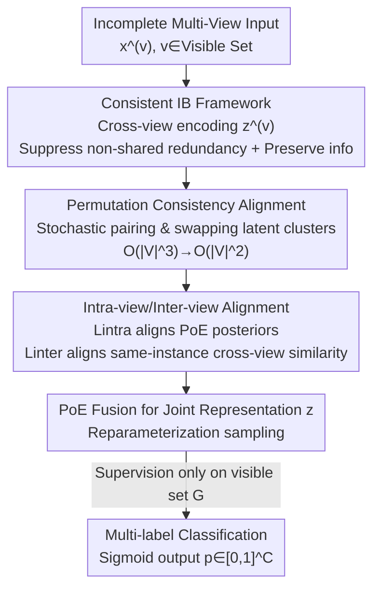

# Permutation-Consistent Variational Encoding for Incomplete Multi-View Multi-Label Classification

**Conference**: ICLR2026  
**OpenReview**: [https://openreview.net/forum?id=y4LyiOIOUn](https://openreview.net/forum?id=y4LyiOIOUn)  
**Code**: TBD  
**Area**: Multi-View Multi-Label Learning  
**Keywords**: Incomplete Multi-View, Missing Multi-Labels, Information Bottleneck, Variational Encoding, Permutation Consistency

## TL;DR
Addressing the "dual missingness" of views and labels in multi-view multi-label classification (iM3C), this paper proposes the PCVE framework. Under an Information Bottleneck objective, it utilizes cross-view variational encoders to learn shared semantic distributions for each view, further aligned via a "permutation consistency" regularization. The method consistently outperforms 9 strong baselines even under 50% view and 50% label missingness.

## Background & Motivation
**Background**: Multi-view multi-label learning jointly models multiple heterogeneous sources of the same object (e.g., image-text, multi-sensor, multi-modal medical records), leveraging inter-view complementarity and redundancy to improve semantic coverage and reduce ambiguity. Prevailing approaches for missing views include low-rank matrix/tensor completion, shared-private decomposition, or contrastive/consistency learning. For missing labels, label dependency modeling and self-training are used to extrapolate unobserved labels. However, work simultaneously handling "missing views + missing labels" (DICNet, AIMNet, NAIM3L, etc.) has only recently emerged.

**Limitations of Prior Work**: The core goal of multi-view learning is the **sufficiency** of the representation—the joint embedding should preserve as much shared task-relevant information between views as possible while discarding view-specific noise. Non-probabilistic deep methods (contrastive/InfoMax) rely on specific architectures and estimators, offering no sufficiency guarantees. Existing information-theoretic methods mostly focus on "univariate consistency" by maximizing pairwise dependencies or aligning raw data with cross-view representations in a shared latent space. Such scalar constraints are too coarse, failing to guarantee sufficiency or prevent pollution from poorly trained/low-quality views.

**Key Challenge**: When certain views are insufficiently trained, traditional Product-of-Experts (PoE) or Mixture-of-Experts (MoE) fusion can be dominated by strong views, overwhelming the weak ones. This leads to information redundancy or learning collapse in the joint representation. The root cause is that cross-view consistency constraints are placed at the **fusion stage** (too late), and a single variable $z$ represents the entire joint encoding, implicitly assuming that "the component of $z$ attributed to view $v$ originates only from $x^{(v)}$." This one-to-one mapping is fragile under view imbalance.

**Goal**: To learn compact and sufficient shared representations under arbitrary view and label missingness patterns, enabling the prediction of missing views without explicit imputation. This is decomposed into two sub-problems: (1) how to **advance** cross-view alignment to the encoding stage to suppress non-shared redundancy without collapse; and (2) how to make the consistency constraint complexity scalable.

**Key Insight**: The authors start from a "semantic consistency hypothesis"—different views of the same sample describe the same object, and task-relevant semantics should be consistent, i.e., $I(x^{(1)};y)=I(x^{(2)};y)=\cdots=I(x^{(m)};y)$. This leads to the proposition: if a joint representation $z$ contains exactly and only the shared information of all views, then $z$ is sufficient for predicting $y$.

**Core Idea**: The joint representation is explicitly decomposed into view-specific components $\{z^{(v)}\}$. Under an Information Bottleneck (IB) framework, "early alignment" is performed—maximizing $I(z^{(v)};x^{(v)})$ to preserve valid information while minimizing $I(x^{(u)};z^{(v)}\mid x^{(v)})$ to suppress non-shared redundancy. A **permutation consistency** regularization is used to align different view distributions encoding the same target semantics.

## Method

### Overall Architecture
The input to PCVE is a set of potentially missing views $x=\{x^{(v)}\}_{v\in\mathcal{V}}$ and a partially observed label set $\mathcal{G}$; the output is the multi-label prediction probability $p\in[0,1]^C$. The pipeline consists of two stages: the first half learns "multi-view shared information + reconstruction," and the second half performs "cross-view fusion + multi-label classification."

Specifically, each view $x^{(v)}$ does not merely encode its own latent variable. Instead, a set of stochastic encoders $\{r^n_v(z^{(n)}\mid x^{(v)})\}_{n=1}^m$ generates a cluster of latent distributions $\mathcal{C}_v$ from source view $v$ to each target view $n$. These cross-view distributions are fused via PoE to obtain a view-level posterior $r_v(z^{(v)}\mid x^{(v)})$ approximating $p(z^{(v)}\mid x^{(v)})$. The Information Bottleneck objective (reconstruction + permutation consistency terms) aligns the shared semantics at this level. Subsequently, posteriors of all visible views are fused via another PoE into a joint posterior $q(z\mid\{x^{(v)}\})$. Reparameterized samples $\bar z$ are then fed into a small MLP + Sigmoid to obtain multi-label probabilities, with supervision accumulated only on the visible label set $\mathcal{G}$.

### Key Designs

**1. Consistent Information Bottleneck: Advancing Cross-View Alignment to Encoding**

To address the issue where alignment at the fusion stage is easily dominated by strong views, PCVE moves the constraints to view-level distribution modeling. Based on the chain decomposition of conditional mutual information: for any view pair $u\ne v$, $I(x^{(u)};z\mid x^{(v)})=\big[I(z;x^{(u)})-I(x^{(v)};x^{(u)})\big]+I(x^{(v)};x^{(u)}\mid z)$. The first part represents "minimality" and the second "sufficiency." If $z$ contains exactly and only shared information, both terms are 0, achieving minimal sufficiency (Corollary 3.1). Applying this to view components yields the unconstrained objective with Lagrange coefficient $\beta$:

$$\max\ \frac{1}{|\mathcal{V}|}\sum_{v\in\mathcal{V}}I\big(z^{(v)};x^{(v)}\big)\ -\ \beta\cdot\frac{1}{|\mathcal{V}|}\sum_{u\ne v}I\big(x^{(u)};z^{(v)}\mid x^{(v)}\big)$$

The first term maximizes $I(z^{(v)};x^{(v)})$ to retain valid information and prevent collapse; the second term minimizes conditional mutual information to enforce cross-view consistency. These are derived into optimizable lower/upper bounds: $I(z^{(v)};x^{(v)})$ is converted into a reconstruction term $\mathcal{L}_{re}$ via a variational decoder $q_v(x^{(v)}\mid z^{(v)})$; the conditional mutual information term is relaxed into a KL divergence $D_{KL}\big(p(z^{(v)}\mid x^{(v)})\,\|\,r_v(z^{(v)}\mid x^{(u)})\big)$, forming the permutation consistency term $\mathcal{L}_{pc}$. This transforms the abstract "sufficient and minimal" goal into a trainable $\mathcal{L}_{ib}=\mathcal{L}_{re}+\beta\mathcal{L}_{pc}$.

**2. Cross-View Distribution Cluster Decomposition + PoE: Decoupling View Posteriors**

Traditional methods use a single MLP to directly model $p(z^{(v)}\mid x^{(v)})$, binding the view and latent component one-to-one. PCVE instead learns a cluster of stochastic encoders $\{r^1_v,\dots,r^m_v\}$ for each source view $v$, modeling the direction "$v\to n$". These are multiplied via PoE to approximate the view posterior:

$$p(z^{(v)}\mid x^{(v)})\approx r_v(z^{(v)}\mid x^{(v)}):=r(z^{(v)})\prod_{n=1}^m r^n_v(z^{(v)}\mid x^{(n)})$$

where the prior $r(z^{(v)}):=\mathcal{N}(0,I)$. Thus, the latent representation of a view no longer carries only its own information but is required to represent "the semantics of all target views it can explain." Even if a view is missing, direction encoders from other views can fill its component, supporting inference for missing views without explicit imputation.

**3. Stochastic Permutation Prior Alignment: Reducing Complexity from $O(|\mathcal{V}|^3)$ to $O(|\mathcal{V}|^2)$**

$\mathcal{L}_{pc}$ requires the latent posterior of view $v$ to approach a posterior constructed by another view $u$. A naive implementation iterating through all ordered pairs $(u,v)$ results in $O(|\mathcal{V}|^3)$ complexity per batch. PCVE introduces permutation consistency: each iteration **randomly matches exactly one** $u\ne v$ for each view $v$, reducing complexity to $O(|\mathcal{V}|^2)$ while retaining the regularization intent. Formally, define the distribution cluster of view $v$ as $\mathcal{C}_v=\{z^{(v\to n)}\sim r^n_v(z^{(n)}\mid x^{(v)})\}_{n=1}^m$; Proposition 3.3 states: after randomly swapping corresponding sub-variables across different clusters, the distributions should remain consistent, i.e., $D_{KL}\big(z^{(v\to n)}\,\|\,z^{(\pi_n\to n)}\big)=0$. Here $\pi$ is a random view index sequence of length $m$, constrained such that $|\{\pi_i\}|=|\mathcal{V}|$ (sampling without replacement from the visible set). This forces the network to encode consistent semantics from all visible views, ensuring alignment while enhancing parallelism.

**4. Intra/Inter-view Dual Alignment: Component and Instance Level Consistency**

To further enhance semantic consistency and robustness, PCVE adds two complementary alignments. **Intra-view alignment** $\mathcal{L}_{intra}$ pulls the output of each source encoder $r^n_v$ toward the PoE-fused posterior $r_v$: $\mathcal{L}_{intra}=\frac{1}{|\mathcal{V}|}\sum_n\sum_v D_{KL}\big(r^n_v(z^{(v)}\mid x^{(v)})\,\|\,r_v(z^{(v)}\mid x^{(v)})\big)$, preventing view-specific drift. **Inter-view alignment** $\mathcal{L}_{inter}$ uses softmax-weighted cosine similarity for contrastive learning between same-instance cross-view pairs: for $\ell_2$-normalized mean $\tilde\mu^{(v)}_i$, temperature-scaled similarity is $s^{(v,u)}_{i,j}=\langle\tilde\mu^{(v)}_i,\tilde\mu^{(u)}_j\rangle/\tau$. The goal is to maximize probability mass for same-instance view pairs and minimize it for different instances, summed only over visible views to naturally handle missingness.

### Loss & Training
The total objective aggregates the task loss and regularization terms:

$$\mathcal{L}=\mathcal{L}_{ce}+\alpha\,\mathcal{L}_{ib}+\gamma\,\mathcal{L}_{inter}+\lambda\,\mathcal{L}_{intra}$$

where $\mathcal{L}_{ce}$ is the multi-label cross-entropy accumulated only on the visible label set $\mathcal{G}$ (unknown labels are excluded). $\mathcal{L}_{ib}=\mathcal{L}_{re}+\beta\mathcal{L}_{pc}$ balances information compression and preservation via $\beta$, while $\alpha$ controls the IB strategy's weight. For convenience, $\gamma$ and $\lambda$ are set to 0.1. Implementation details include a latent dimension of 512, batch size 128, SGD with initial learningrate 0.001, and 10 samples per latent variable per mini-batch for robust estimation.

## Key Experimental Results

### Main Results
Experiments were conducted on five standard multi-view multi-label benchmarks: Corel5k, Pascal07, ESPGame, IAPRTC12, and MIRFLICKR. All were set to 50% view missingness and 50% label missingness uniformly, with 6 views per sample (GIST/HSV/DenseHue/DenseSift/RGB/LAB) and a 70%/15%/15% split. Comparisons include 9 strong baselines (CDMM, DM2L, LVSL, iMVWL, NAIM3L, DICNet, DIMC, MSLPP, SIP). Six metrics (AP, AUC, 1-RL, 1-HL, 1-OE, 1-Cov) were used (higher is better).

| Dataset | Metric | PCVE | Runner-up SIP | Gain |
|--------|------|------|----------|------|
| Corel5k | AP | **0.421** | 0.418 | +0.003 |
| Corel5k | 1-RL | 0.910 | **0.911** | Parity |
| Corel5k | 1-OE | **0.493** | 0.489 | +0.004 |
| Corel5k | 1-Cov | **0.790** | 0.787 | +0.003 |
| Pascal07 | AP | **0.559** | 0.555 | +0.004 |
| Pascal07 | 1-HL | **0.934** | 0.931 | +0.003 |
| Pascal07 | 1-RL | **0.834** | 0.830 | +0.004 |
| Pascal07 | AUC | **0.857** | 0.850 | +0.007 |

PCVE matches or exceeds the best baselines across all datasets and metrics. It shows statistically consistent improvements over the previous strongest baseline (SIP), particularly in ranking-based metrics (AUC, 1-RL) and coverage-based metrics (1-Cov).

### Ablation Study
The roles of various components are identified:

| Configuration | Function | Note |
|------|------|------|
| Full ($\mathcal{L}_{ce}+\alpha\mathcal{L}_{ib}+\gamma\mathcal{L}_{inter}+\lambda\mathcal{L}_{intra}$) | Complete model | SOTA under dual missingness |
| w/o $\mathcal{L}_{pc}$ (Permutation Consistency) | Early alignment fails | Reverts to univariate consistency; vulnerable to weak view pollution |
| w/o $\mathcal{L}_{re}$ (Reconstruction) | Loses view-valid info | $z^{(v)}$ collapses into a non-informative representation |
| w/o $\mathcal{L}_{intra}/\mathcal{L}_{inter}$ | Removes dual alignment | Weakened component/instance-level consistency |

### Key Findings
- **Permutation Consistency ($\mathcal{L}_{pc}$)** is the key to "advancing" alignment. It prevents PoE fusion from being dominated by strong views and reduces complexity from $O(|\mathcal{V}|^3)$ to $O(|\mathcal{V}|^2)$ via stochastic pairing.
- **Reconstruction is essential**: Compression without preservation leads to information collapse in $z^{(v)}$, justifying the dual "sufficient" and "minimal" goals of the IB objective.
- **Missing view inference without explicit imputation**: By encoding a full cluster of cross-view direction distributions for each view, components of missing views can be recovered from the remaining views.

## Highlights & Insights
- **"Early Alignment" Philosophy**: Moving cross-view consistency from the fusion stage to the encoding stage is a targeted solution for view imbalance in PoE/MoE, proved more thorough than post-hoc constraints.
- **Engineering-Theoretic Win with Permutation Consistency**: Using stochastic sampling without replacement to approximate "all ordered pair" regularization provides an ideal $D_{KL}=0$ characterization while slashing cubic complexity to quadratic. This "regularization equivalence + complexity reduction" trick is transferable to other multi-view/multi-modal scenarios requiring pairwise consistency.
- **Distribution Cluster Decomposition**: Encoding "all-to-all" direction distributions integrates missing view inference and representation alignment into a single encoder set—an elegant approach to missingness without imputation.

## Limitations & Future Work
- Main experiments focus on a fixed 50%/50% missingness rate on five image benchmarks. Generalization to higher missingness or heterogeneous scenarios (text, multi-modal medical records) requires further validation.
- Full ablation studies and missingness ratio sweeps are located in the appendix; the main text alone makes it difficult to assess the exact numerical contribution of each regularization term.
- Stochasticity in permutations might introduce training variance. While 10-sample averaging is used, the permutation strategy itself (e.g., whether more structured pairing is needed) remains an area for exploration.
- $\gamma$ and $\lambda$ were fixed at 0.1 for simplicity, lacking a sensitivity analysis for these alignment weights.

## Related Work & Insights
- **vs. DICNet (Multi-view Contrastive + iM3C)**: DICNet introduced multi-view contrastive learning to iM3C. PCVE adopts an information-theoretic variational approach, using the IB objective for sufficiency and advancing alignment to the encoding stage rather than performing contrast in the representation space.
- **vs. NAIM3L (Dual Index Missingness)**: NAIM3L mitigates missingness via dual-index information; PCVE utilizes cross-view distribution clusters + PoE for inference without explicit imputation.
- **vs. SIP / Univariate Info-Theoretical Methods**: Existing methods often perform only univariate consistency (maximizing pairwise dependency), which is coarse and lacks sufficiency guarantees. PCVE decomposes the goal into view components and adds permutation consistency, consistently outperforming SIP across benchmarks.

## Rating
- Novelty: ⭐⭐⭐⭐ Combining "early-aligned" IB with low-complexity permutation consistency for iM3C is a clear and effective angle.
- Experimental Thoroughness: ⭐⭐⭐⭐ Solid results across nine baselines on five benchmarks, though missingness sweeps are in the appendix.
- Writing Quality: ⭐⭐⭐⭐ Complete variational derivations with a logical progression of motivation; some notation is dense.
- Value: ⭐⭐⭐⭐ Missingness inference without imputation and complexity reduction are valuable for real-world multi-view deployments.

<!-- RELATED:START -->

<!-- RELATED:END -->

## Related Papers

- [\[CVPR 2026\] EXOTIC: External Vision-driven Incomplete Multi-view Classification](../../CVPR2026/others/exotic_external_vision-driven_incomplete_multi-view_classification.md)
- [\[CVPR 2026\] DF²-VB: Dual-level Fuzzy Fusion with View-specific Boosting for Multi-view Multi-label Classification](../../CVPR2026/others/df2-vb_dual-level_fuzzy_fusion_with_view-specific_boosting_for_multi-view_multi-.md)
- [\[ICLR 2026\] Aligning Collaborative View Recovery and Tensorial Subspace Learning via Latent Representation for Incomplete Multi-View Clustering](aligning_collaborative_view_recovery_and_tensorial_subspace_learning_via_latent_.md)
- [\[CVPR 2026\] Prototype-based Causal Intervention for Multi-Label Image Classification](../../CVPR2026/others/prototype-based_causal_intervention_for_multi-label_image_classification.md)
- [\[AAAI 2026\] Deep Incomplete Multi-View Clustering via Hierarchical Imputation and Alignment](../../AAAI2026/others/deep_incomplete_multi-view_clustering_via_hierarchical_imputation_and_alignment.md)

<!-- RELATED:END -->
