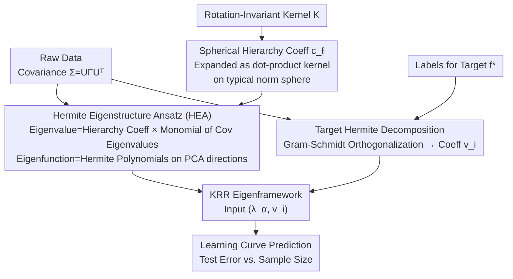

# Predicting Kernel Regression Learning Curves from Only Raw Data Statistics

**Conference**: ICLR 2026  
**arXiv**: [2510.14878](https://arxiv.org/abs/2510.14878)  
**Code**: [https://github.com/JoeyTurn/hermite-eigenstructure-ansatz](https://github.com/JoeyTurn/hermite-eigenstructure-ansatz)  
**Area**: Theory / Learning Theory / Kernel Methods  
**Keywords**: Kernel Regression Learning Curves, Hermite Eigenstructure, Anisotropic Data, Kernel Ridge Regression, Feature Learning

## TL;DR
The authors propose the Hermite Eigenstructure Ansatz (HEA), which enables analytical prediction of learning curves (test error vs. sample size) for rotation-invariant kernels on real image datasets (CIFAR-5m, SVHN, ImageNet) using only two statistics: the data covariance matrix and the Hermite decomposition of the target function. The paper proves this ansatz holds for Gaussian data and demonstrates that MLPs in the feature-learning regime learn Hermite polynomials in the order predicted by HEA.

## Background & Motivation

**Background**: Kernel Ridge Regression (KRR) serves as an important proxy for understanding neural networks (via NTK equivalence). An established eigenframework can predict test error from the eigensystem (eigenvalues and eigenfunctions) of a kernel relative to the data distribution.

**Limitations of Prior Work**: While the eigenframework is theoretically complete, practical application requires constructing and diagonalizing the kernel matrix to obtain the eigensystem, which is computationally expensive for high-dimensional real data and lacks analytical interpretability. More importantly, most existing theories rely on simplified data assumptions (e.g., isotropic spherical distributions) that do not apply to real anisotropic datasets.

**Key Challenge**: Real data distributions are too complex for full analytical descriptions, yet learning behavior is profoundly shaped by data structure. Predicting behavior on actual data requires a balance between a "parsimonious description of data" and "prediction accuracy."

**Goal**: (a) Can a "parsimonious description" of data be found that is simple enough to predict kernel regression learning behavior? (b) Can learning curves be predicted directly from data statistics without constructing the kernel matrix?

**Key Insight**: The authors observe that for Gaussian data, the eigenfunctions of rotation-invariant kernels are naturally multidimensional Hermite polynomials. Since real image data is "Gaussian enough" (coordinatewise marginals are approximately Gaussian), they hypothesize that this structure approximately holds for real data.

**Core Idea**: The eigensystem of rotation-invariant kernels on anisotropic data is approximately equal to the Hermite eigensystem—eigenfunctions are Hermite polynomials along the PCA directions of the data, and eigenvalues are monomials of the covariance eigenvalues multiplied by the kernel's hierarchy coefficients.

## Method

### Overall Architecture

To understand the learning behavior of KRR on a specific dataset, the existing KRR eigenframework can compute the test error vs. sample size curve from "kernel eigenvalues + eigenfunctions + target coefficients in this basis." However, this traditionally requires kernel matrix diagonalization. This paper fills the missing link: it analytically derives the entire eigensystem from two raw statistics—the data covariance matrix $\Sigma = U \Gamma U^\top$ and the Hermite decomposition of the target function $f_*$—along with the kernel function form, without ever touching the kernel matrix. Specifically, the kernel is expanded as a dot-product kernel on the typical norm sphere to obtain hierarchy coefficients $c_\ell$; HEA then combines $(\Gamma, c_\ell)$ to derive the Hermite eigensystem $(\lambda_\alpha, \phi_\alpha)$; simultaneously, target coefficients $v_i$ are estimated from labels via Gram-Schmidt; finally, $(\lambda_\alpha, v_i)$ are fed into the KRR eigenframework to output the learning curve.

### Key Designs

**1. Hermite Eigenstructure Ansatz (HEA): Compressing the Eigensystem into an Analytical Formula**

The most critical step is bypassing high-dimensional kernel matrix diagonalization. HEA asserts that for anisotropic data, the eigensystem has a closed-form: for any multi-index $\alpha \in \mathbb{N}_0^d$, eigenvalues are $\lambda_\alpha = c_{| \alpha |} \cdot \prod_{i=1}^d \gamma_i^{\alpha_i}$ and eigenfunctions are multidimensional Hermite polynomials $h_\alpha^{(\Sigma)}$ on PCA directions, where $c_\ell$ are hierarchy coefficients on the typical norm sphere and $\gamma_i$ are covariance eigenvalues. 

The authors substantiate this with two theorems for Gaussian data. Theorem 1 (Wide Gaussian Kernel) shows the true eigensystem converges to the Hermite eigensystem as width $\sigma \to \infty$. Theorem 2 (Fast-decaying Dot-product Kernel) uses perturbation theory to show linear convergence to HEA when $c_{\ell+1} \leq \epsilon \cdot c_\ell$. HEA performs best when hierarchy coefficients decay rapidly, effective data dimension is high ($d_\text{eff} \gg 1$), and data is "Gaussian enough"—interestingly, complex images often satisfy this better than simple datasets like MNIST due to central limit effects.

**2. Spherical Hierarchy Coefficients: Treating Any Rotation-Invariant Kernel as a Dot-Product Kernel**

To use the formula, one needs $c_\ell$. On the sphere of typical norm $r = \text{Tr}[\Sigma]^{1/2}$, the kernel is expanded as a dot-product kernel $K(x,x') = \sum_\ell \frac{c_\ell}{\ell!}(x^\top x')^\ell$. For a Gaussian kernel, $c_\ell = e^{-r^2/\sigma^2} \cdot \sigma^{-2\ell}$. While not all kernels are dot-product kernels globally (e.g., Laplace), high-dimensional data norms concentrate near $r$, making this approximation valid.

**3. Target Function Hermite Decomposition: Estimating Coefficients from Finite Labels**

To find the target coefficients $v_i$, the authors address the slight non-Gaussianity of real data which makes Hermite bases not perfectly orthogonal. They perform Gram-Schmidt orthogonalization on sampled Hermite polynomials $h_i^{(\text{GS})} = \text{unitnorm}(h_i - \sum_{j<i} \langle h_j^{(\text{GS})}, h_i \rangle h_j^{(\text{GS})})$ before projecting $\hat{v}_i = \langle h_i^{(\text{GS})}, y \rangle$. This step is kernel-independent and can be reused for any kernel on the same dataset.

## Key Experimental Results

### Main Results: Learning Curve Prediction

| Dataset | Kernel | Target Type | HEA Prediction | Note |
|--------|--------|---------|----------|------|
| CIFAR-5m | Gaussian (σ=6) | Synthetic $h_1(z_1)$ | Exact match | Accuracy across linear/quadratic/cubic complexities |
| CIFAR-5m | Gaussian (σ=6) | vehicles vs. animals | Good match | Accurate for binarized real labels |
| CIFAR-5m | Laplace (σ=8√2) | domesticated vs. wild | Good match | Requires ZCA to increase $d_\text{eff}$ |
| SVHN | Gaussian (σ=6) | even vs. odd | Good match | Validation across different datasets |
| ImageNet-32 | ReLU NTK | Synthetic poly | Exact match | NTK kernel + high-res real data |
| ImageNet-32 | ReLU NTK | Power-law target | Exact match | Accurate across source exponents $\beta$ |

### Eigenstructure Verification

| Kernel/Data | $d_\text{eff}$ | Eigenvalue Match | Subspace Overlap | Note |
|------------|----------|-----------|---------------------|------|
| Gaussian + Gaussian | ~7 | Exact | Diagonal concentration | Theoretically guaranteed setting |
| Gaussian + CIFAR-5m | ~9 | Good | Diagonal concentration | Natural images also satisfy |
| Laplace + SVHN (ZCA) | ~21 | Good | Diagonal concentration | Requires $d_\text{eff} \geq 20$ |
| ReLU NTK + ImageNet | ~40 | Good | Diagonal concentration | Replaces wide-kernel condition |

### Key Findings
- HEA performs better on complex image datasets than on simple ones (MNIST) due to the "blessing of dimensionality" making coordinates more Gaussian.
- For non-smooth kernels (Laplace), $c_\ell$ grows superexponentially; truncation at $\ell \in [5,10]$ provides a valid asymptotic expansion.
- Gram-Schmidt orthogonalization for target decomposition is vital for accuracy due to data non-Gaussianity.
- The "kernel-independence" of the target decomposition significantly reduces the computational cost for multi-kernel evaluation.

## Highlights & Insights

- **Proof of Concept for End-to-End Analytical Theory**: This work is potentially the first to achieve a complete analytical pipeline from "data structure → model performance" on real datasets without constructing kernel matrices.
- **Parsimonious Description of Data**: Using the covariance matrix and Hermite coefficients as a "reduced description" effectively captures the information relevant to kernel learners.
- **Applicability to MLPs**: Despite being a kernel theory, experiments show MLPs in the feature-learning regime learn Hermite polynomials in the sequence predicted by HEA, suggesting HEA might reflect a more general learning law.
- **Blessing of Dimensionality**: High dimensionality is usually a curse, but here it helps satisfy HEA as coordinates of complex high-dimensional images tend toward Gaussianity.

## Limitations & Future Work

- **Rotation-Invariant Kernels Only**: The theory does not currently apply to non-rotation-invariant kernels like learned NTKs or attention kernels.
- **Quantification of "Gaussian Enough"**: There is no formal quantitative threshold for the degree of Gaussianity required; failures on MNIST suggest this condition is non-trivial.
- **Divergence of Hierarchy Coefficients**: For non-smooth kernels, $c_\ell$ grows too fast, requiring manual truncation. More elegant asymptotic treatments are needed.
- **Empirical MLP Connection**: The link between feature-learning MLPs and HEA is currently purely empirical without a formal theoretical explanation.

## Related Work & Insights

- **Vs. KRR Eigenframework (Simon et al. 2021)**: Previous work mapped eigensystems to risk but required numerical diagonalization; this work provides the analytical link from raw statistics to the eigensystem.
- **Vs. Wortsman & Loureiro (2025)**: Contemporaneous work studied dot-product kernels on anisotropic Gaussian data but focused on eigenvalue bounds. HEA provides a more direct theoretical justification for replacing kernels with Hermite bases.
- **Vs. Ghorbani et al. (2020)**: While they provided results on products of spheres, HEA generalizes this to continuous anisotropic settings.

## Rating
- Novelty: ⭐⭐⭐⭐⭐ 
- Experimental Thoroughness: ⭐⭐⭐⭐ 
- Writing Quality: ⭐⭐⭐⭐⭐ 
- Value: ⭐⭐⭐⭐ 

<!-- RELATED:START -->

## Related Papers

- [\[ICLR 2026\] When to Retrain after Drift: A Data-Only Test of Post-Drift Data Size Sufficiency](when_to_retrain_after_drift_a_data-only_test_of_post-drift_data_size_sufficiency.md)
- [\[ICML 2026\] Spatial Priors via Space Filling Curves for Small and Limited Data Vision Transformers](../../ICML2026/others/spatial_priors_via_space_filling_curves_for_small_and_limited_data_vision_transf.md)
- [\[ICML 2025\] Curvature Enhanced Data Augmentation for Regression](../../ICML2025/others/curvature_enhanced_data_augmentation_for_regression.md)
- [\[ICLR 2026\] Probabilistic Kernel Function for Fast Angle Testing](probabilistic_kernel_function_for_fast_angle_testing.md)
- [\[ICLR 2026\] GoR: A Unified and Extensible Generative Framework for Ordinal Regression](gor_a_unified_and_extensible_generative_framework_for_ordinal_regression.md)

<!-- RELATED:END -->
