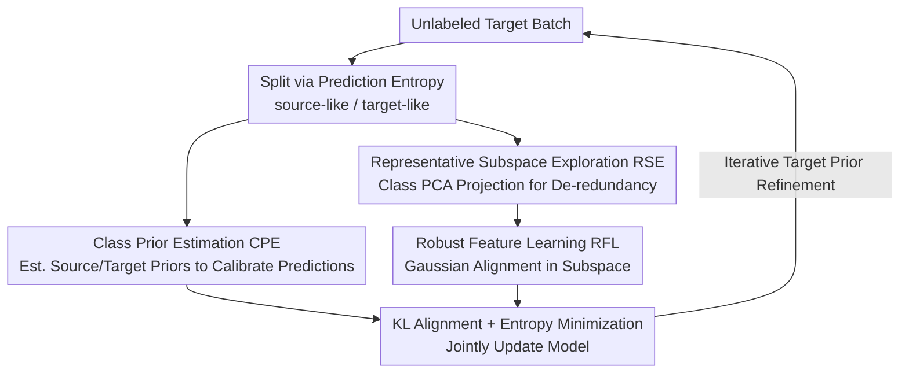

# Prior-Free Tabular Test-Time Adaptation

**Conference**: ICLR 2026  
**OpenReview**: [https://openreview.net/forum?id=BgSDPE24pa](https://openreview.net/forum?id=BgSDPE24pa)  
**Code**: https://github.com/rundohe/PFT3A  
**Area**: Tabular Data / Test-Time Adaptation / Distribution Shift  
**Keywords**: Tabular Data, Test-Time Adaptation, Label Shift, Feature Shift, prior-free

## TL;DR
PFT3A addresses test-time adaptation for tabular data under the stringent setting of **no access to source data and no knowledge of any source domain priors**. By employing three modules (Class Prior Estimation, Robust Feature Learning, and Representative Subspace Exploration), it simultaneously mitigates label shift and feature shift, consistently outperforming existing SOTA methods across five TableShift datasets and three backbones.

## Background & Motivation
**Background**: Deep learning models have become primary tools for tabular tasks such as fraud detection and medical diagnosis. However, deployment often encounters distribution discrepancies between training (source) and testing (target) data—temporal drifts, geographic differences, and sampling biases can significantly degrade accuracy. Test-time adaptation (TTA), which updates the model during inference using unlabeled test data, is a popular solution for distribution shift, represented by methods like Tent and EATA.

**Limitations of Prior Work**: Existing TTA methods are almost exclusively designed for the visual modality. Directly applying them to tabular data often results in **performance worse than no adaptation**—Figure 2(a) shows TENT achieving an average accuracy of 58% and ODS 57.56%, both lower than the 60.77% of Non-Adaptation. Meanwhile, methods specifically designed for tabular data have their own dependencies: AdapTable and TabLog require access to source training data; although FTAT does not require source data, it still relies on **class priors** obtained from the source distribution. Without access to these priors, the accuracy of FTAT drops significantly on HELOC, Health Ins., and ASSIST.

**Key Challenge**: Real-world scenarios often involve **neither source data nor any domain priors**, yet tabular shifts simultaneously include two types—TableShift classifies them as feature shift (change in input distribution) and label shift (change in category distribution). Existing methods either only treat label shift or bypass feature shift by "filtering low-confidence samples." However, filtering discards samples that carry target domain characteristics, pulling the model back to the source domain and harming generalization.

**Goal**: To define and solve a new problem—prior-free tabular TTA: simultaneously mitigating both label shift and feature shift without accessing source data, using any priors, or filtering test data.

**Key Insight**: The authors observe that a model trained on source data predicts with higher confidence when encountering "source-like" samples and with higher uncertainty for "target-like" samples. Consequently, **prediction entropy can be used to split an unlabeled target batch into source-like and target-like groups**. These can serve as proxy distributions for the source/target domains, allowing for prior estimation and feature alignment even in the absence of source data.

**Core Idea**: Construct source/target proxy distributions using prediction entropy → Estimate class priors to calibrate predictions and mitigate label shift → Align the two proxy distributions in a representative subspace to mitigate feature shift, without ever touching source data or priors.

## Method

### Overall Architecture
PFT3A runs online on each arriving unlabeled target batch $D_t^j$, consisting of three sequential modules: First, prediction entropy is used to split the batch into a source-like set $\hat{S}^j$ and a target-like set $\hat{T}^j$; **Class Prior Estimation (CPE)** utilizes these sets to estimate source/target class priors and scales model predictions to counteract label shift; **Robust Feature Learning (RFL)** fits the two sets of features into Gaussians and minimizes their KL divergence to align feature distributions and counteract feature shift; however, tabular features (especially in binary classification) are highly redundant with many dimensions having zero variance. Thus, **Representative Subspace Exploration (RSE)** first identifies the most informative subspace using class-based PCA and projects features into it before alignment. Finally, a joint optimization of feature alignment loss and entropy minimization loss updates the model for the current batch prediction, while the target prior is iteratively refined for the next batch.

### Key Designs

**1. Class Prior Estimation (CPE): Estimating Class Priors Without Source Data to Fix Label Shift**

To calibrate for label shift, traditional methods requires knowing the source class prior $p_S$, which is unavailable in the prior-free setting. CPE uses the model's own "confidence" to distinguish source/target proxy data unsupervised: for each sample in the $j$-th batch, it calculates the predicted probability $\hat{p}_i = f_{\theta_{j-1}}(x_i)$ and entropy $H(\hat{p}_i) = -\sum_k \hat{p}_i^{(k)} \log \hat{p}_i^{(k)}$, using a threshold $\epsilon$ to split them into $\hat{S}^j = \{x_i \mid H(\hat{p}_i) < \epsilon\}$ (low entropy, source-like) and $\hat{T}^j = \{x_i \mid H(\hat{p}_i) > \epsilon\}$ (high entropy, target-like). The source prior is estimated using only the source-like set of the **first batch** $\hat{p}_S = \frac{1}{N_{\hat{S}^1}} \sum_{i\in\hat{S}^1} \hat{p}_i$, as the model at that point has not been "contaminated" by target data and retains the most complete source knowledge.

The initial target prior is similarly obtained from $\hat{T}^1$, but since the model has not seen target data, the initial estimate is biased. It is refined iteratively: $\hat{p}_T^j = \mathrm{Norm}(\hat{p}_T^{j-1} - \hat{C}_j^{-1}\tilde{p}_S^j)$, where $\hat{C}_j$ is the covariance matrix of the $j$-th batch and $\tilde{p}_S^j$ is the current batch's source-like mean, with $\hat{C}_j^{-1}\tilde{p}_S^j$ acting as a bias correction term. With $\hat{p}_S$ and $\hat{p}_T^j$, predictions are calibrated via channel-wise scaling: $\tilde{f}_{\theta_{j-1}}(x_i) = f_{\theta_{j-1}}(x_i) \circ \frac{\hat{p}_T^j}{\hat{p}_S}$, correcting the class distribution bias from source training to the target domain, directly addressing label shift. Removing CPE causes the most significant performance drop in ablation studies, indicating its primary contribution.

**2. Robust Feature Learning (RFL): Aligning Distributions Instead of Filtering Samples to Fix Feature Shift**

Feature shift stems from inconsistent source/target feature distributions. Existing methods bypass this by "filtering low-confidence samples," but these samples precisely carry target domain characteristics. Discarding them biases the model back to the source domain. RFL adopts proactive alignment: passing $\hat{S}^j$ and $\hat{T}^j$ through feature extractor $g$ yields two groups of features. Assuming they follow Gaussian distributions, it calculates the mean $\mu_S^j$ and variance $(\sigma^2)_S^j$ for the source proxy and $\mu_T^j$, $(\sigma^2)_T^j$ for the target proxy (calculated element-wise), then minimizes the KL divergence between the two Gaussians:

$$\mathcal{L}_{KL} = \mathrm{KL}\big(\mathcal{N}(\mu_S^j,(\sigma^2)_S^j) \,\|\, \mathcal{N}(\mu_T^j,(\sigma^2)_T^j)\big).$$

The Gaussian assumption allows for a closed-form solution of KL, ensuring computational efficiency. This pulls source and target features into the same distribution, learning domain-invariant features and bridging the gap mechanistically rather than deleting target-specific samples, leading to better generalization.

**3. Representative Subspace Exploration (RSE): Aligning Only Informative Subspaces to Prevent Noise**

TableShift datasets are mostly binary classification problems where features are less rich than in multi-class problems, containing many dimensions with zero variance and redundant information. Directly calculating KL for RFL in the full dimension poses two issues: variance terms in redundant dimensions cause numerical instability, and a large number of invalid dimensions dilute the alignment effect. RSE uses class-based PCA: calculating the covariance matrix $\Sigma_S^j = \frac{1}{N_{\hat{S}^j}} \sum (\hat{z}_i - \hat{\mu}_S^j)(\hat{z}_i - \hat{\mu}_S^j)^T$ for source-like features, it takes the eigenvectors corresponding to the top $m$ largest eigenvalues to form a projection matrix $V_S \in \mathbb{R}^{m\times d}$. Features are projected into the subspace $z_i^{proj} = V_S g_{\phi_{j-1}}(x_i)$, where mean and variance are recalculated for KL alignment.

This does not just remove non-discriminative redundant dimensions and suppress spurious correlations; the paper also argues that features in the subspace are closer to Gaussian (Central Limit Theorem) and that dimensions are decoupled after PCA, making the "Gaussian assumption + closed-form KL" more robust.

### Loss & Training
In addition to the feature alignment loss $\mathcal{L}_{KL}$ within the subspace, a standard TTA entropy minimization loss $\mathcal{L}_{ent} = -\sum_k \hat{p}_i^{(k)} \log \hat{p}_i^{(k)}$ is used to increase prediction certainty. The total objective is:

$$\mathcal{L}_{all} = \beta_1 \mathcal{L}_{KL} + \beta_2 \mathcal{L}_{ent},$$

where $\beta_1$ and $\beta_2$ balance the terms; $\zeta$ (related to entropy threshold $\epsilon$) controls the source/target split, and $m$ controls subspace dimensionality. Data arrives online in batches, and the model is updated batch-by-batch while iteratively refining the target prior.

## Key Experimental Results

### Main Results
5 TableShift datasets (HELOC, ANES, Health Ins., ASSIST, Hypertension), with sample sizes ranging from 10K to 5M and features from 26 to 365 dimensions; three backbones (MLP / TabTransformer / FT-Transformer), metrics used are Acc / BAcc / F1. The table below shows average results for the TabTransformer backbone:

| Method | Avg Acc | Avg BAcc | Avg F1 |
|------|---------|----------|--------|
| Non-Adaptation | 60.77 | 63.46 | 59.92 |
| TENT | 58.00 | 61.62 | 52.43 |
| EATA | 59.94 | 62.60 | 62.05 |
| ODS | 57.56 | 61.35 | 57.53 |
| FTAT | 64.25 | 65.57 | 66.38 |
| **Ours (PFT3A)** | **68.59** | **67.42** | **72.65** |

PFT3A improves over Non-Adaptation by 7.82 / 3.96 / 12.73 (Acc/BAcc/F1) and outperforms the previously strongest tabular method, FTAT, by an additional 4.34 / 1.85 / 6.27. Most visual TTA methods (TENT, ODS) perform worse than no adaptation, confirming that directly applying visual methods to tabular data is ineffective. Conclusions remain consistent across MLP and FT-Transformer backbones (e.g., average Acc 69.25 for MLP, 68.01 for FT-Transformer), demonstrating cross-architecture generalization.

### Ablation Study
Removing modules one by one under the TabTransformer backbone (Acc):

| Configuration | HELOC | Health Ins. | ASSIST | Note |
|------|-------|-------------|--------|------|
| w/o CPE | 60.46 | 58.29 | 53.14 | Removing prior estimation causes most drop |
| w/o RFL | 65.94 | 73.42 | 58.39 | Removing RFL |
| w/o RSE | 65.74 | 73.40 | 58.53 | Removing RSE |
| **PFT3A** | **66.17** | **74.13** | **59.29** | Full Model |

### Key Findings
- **CPE is the primary contributor**: Removing it drops accuracy on Health Ins. from 74.13 to 58.29 (−15.8 points) and HELOC from 66.17 to 60.46, indicating that label shift calibration is the main bottleneck for prior-free tabular TTA.
- Deleting RFL or RSE individually only leads to small drops, but their combination (removing redundancy before alignment) provides stable gains, supporting the analysis that "full-dimensional alignment is sub-optimal."
- Hyperparameters $\beta_1, \beta_2, \zeta, m$ all show a bell-curve effect; moderate tuning is required to balance modules, as values too large or too small harm performance.

## Highlights & Insights
- **Generating source/target proxy distributions for free via prediction entropy**: In the absence of source data, leveraging the property that "source models are more confident in source-like samples" to split unlabeled batches is the fulcrum of the entire method—providing material for both prior estimation and feature alignment.
- **Proactive alignment replacing filtering**: Replacing "discarding low-confidence samples" with "aligning source/target features" avoids the source domain bias caused by filtering. This idea could be transferred to source-free TTA in other modalities.
- **Subspace alignment tailored for tabular redundancy**: Performing Gaussian KL after PCA de-redundancy solves numerical instability and naturally makes the Gaussian assumption more plausible. This leverages tabular data characteristics rather than imitating visual methods.

## Limitations & Future Work
- The Gaussian assumption and entropy-based splitting both rely on the premise that "the source model is more confident on the source domain." If the source model is poorly calibrated (over- or under-confident), the source-like/target-like split may be distorted.
- Validation was mainly on TableShift's binary classification or low-diversity category data; whether RSE's de-redundancy remains significant in multi-class or feature-rich scenarios remains to be tested.
- Hyperparameters like threshold $\epsilon$ and subspace dimension $m$ require tuning. Since prior-free settings lack a validation set, robust parameter selection for actual deployment remains an open problem.

## Related Work & Insights
- **vs FTAT**: Both are source-free, but FTAT still relies on source class priors and uses filtering to handle feature shift; PFT3A removes prior dependence entirely and uses feature alignment, achieving approx. 4.3 points higher average Acc in the prior-free setting.
- **vs Visual TTA (TENT / EATA / CoTTA / SAR)**: These methods update BN layers or perform sample selection specifically for vision, without considering tabular feature redundancy and high-dimensional heterogeneity; they often underperform on tabular data, whereas PFT3A introduces alignment and prior estimation specifically for tabular characteristics.
- **vs AdapTable / TabLog**: These tabular methods require access to source training data; PFT3A does not, making it more suitable for real-world deployment constraints.

## Rating
- Novelty: ⭐⭐⭐⭐⭐ First to define and solve prior-free tabular TTA; the three-module design is highly targeted.
- Experimental Thoroughness: ⭐⭐⭐⭐ 5 datasets × 3 backbones + ablation + hyperparameter analysis provides comprehensive coverage.
- Writing Quality: ⭐⭐⭐⭐ Clear mapping from problem analysis (three limitations) to the method.
- Value: ⭐⭐⭐⭐ Highly practical as it fits real-world tabular deployment scenarios with no source data/priors.

<!-- RELATED:START -->

## Related Papers

- [\[ICLR 2026\] PriorGuide: Test-Time Prior Adaptation for Simulation-Based Inference](priorguide_test-time_prior_adaptation_for_simulation-based_inference.md)
- [\[ICLR 2026\] Articulation in Motion: Prior-Free Part Mobility Analysis for Articulated Objects](articulation_in_motion_prior-free_part_mobility_analysis_for_articulated_objects.md)
- [\[CVPR 2026\] Neural Collapse in Test-Time Adaptation](../../CVPR2026/others/neural_collapse_in_test-time_adaptation.md)
- [\[ICLR 2026\] Exposing Mixture and Annotating Confusion for Active Universal Test-Time Adaptation](exposing_mixture_and_annotating_confusion_for_active_universal_test-time_adaptat.md)
- [\[NeurIPS 2025\] Test-Time Adaptation by Causal Trimming](../../NeurIPS2025/others/test-time_adaptation_by_causal_trimming.md)

<!-- RELATED:END -->
