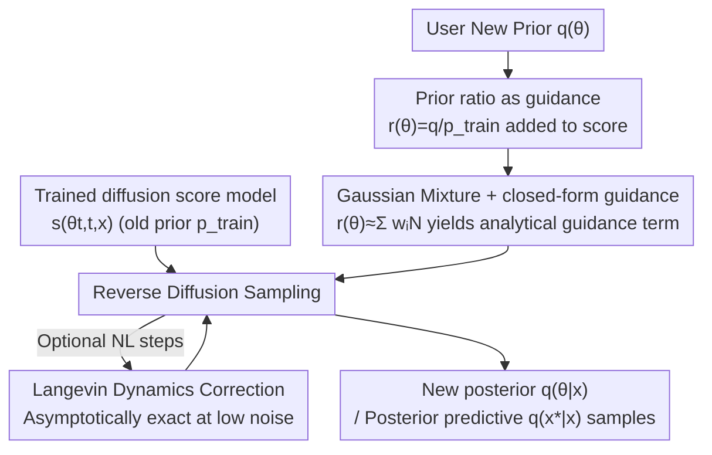

# PriorGuide: Test-Time Prior Adaptation for Simulation-Based Inference

**Conference**: ICLR 2026  
**OpenReview**: [https://openreview.net/forum?id=G4I23g5Ugh](https://openreview.net/forum?id=G4I23g5Ugh)  
**Code**: https://github.com/acerbilab/prior-guide  
**Area**: Probabilistic Methods / Simulation-Based Inference / Diffusion Models  
**Keywords**: Simulation-Based Inference (SBI), Amortized Bayesian Inference, Diffusion Guidance, Prior Adaptation, Test-Time Compute  

## TL;DR
PriorGuide enables a pre-trained diffusion-based amortized simulation-based inference model to adopt a new prior distribution at **test-time without retraining**. By transforming the prior adaptation into a guidance term added to the diffusion score and employing Gaussian mixture approximations for a closed-form solution, it allows for flexible injection of expert knowledge or prior sensitivity analysis.

## Background & Motivation

**Background**: Simulation-Based Inference (SBI) addresses scientific problems (engineering, neuroscience, epidemiology, etc.) where the **likelihood $p(x\mid\theta)$ is intractable, but sampling $x\sim p(x\mid\theta)$ from a forward model is possible**. Modern approaches favor **amortized inference**: training a diffusion model or Transformer once on a massive dataset of parameter-data pairs $(\theta, x)$, then instantly providing the posterior $p(\theta\mid x)$ or posterior predictive $p(x^\star\mid x)$ for any new observation $x$ without further simulator calls. For instance, Simformer uses a Transformer to model the score of joint variables $(\theta_t, x_t)$, switching conditions via masking.

**Limitations of Prior Work**: Posteriors in these methods are **strictly tied to the training prior $p_{\text{train}}(\theta)$**. To cover the parameter space, $p_{\text{train}}(\theta)$ is usually a wide uniform distribution; however, practitioners often possess specific domain knowledge (narrower, biased, or multimodal priors) they wish to utilize. More critically, **prior sensitivity analysis**—verifying the robustness of scientific conclusions against modeling assumptions—requires repeated inference under multiple priors. Changing priors in existing paradigms is extremely costly: non-amortized methods require new simulations for every prior, while amortized methods require **complete retraining**. Approximations like importance sampling fail when the gap between old and new priors is large.

**Key Challenge**: The "train-once, use-anywhere" benefit of amortization is coupled with the constraint of a "fixed prior." Attempts to pre-amortize all possible priors (meta-prior approaches like ACE using histogram encoding or DT using GMM priors) either support only specific prior families (e.g., factorized histograms, predefined GMMs) or are limited by the set of priors enumerated during training, essentially failing to scale.

**Goal**: To equip diffusion-based amortized SBI models with the ability to "switch to any new prior $q(\theta)$ at runtime" without **touching the original score model or retraining**, covering both posterior and posterior predictive tasks.

**Key Insight**: Drawing from the test-time compute paradigm—rather than enumerating all scenarios during training, specific requirements like "user-specified priors" should be absorbed via specialized computation during **inference**. The authors note that diffusion models inherently support **guidance mechanisms**, allowing external information to be added to the score during sampling.

**Core Idea**: Use the "prior ratio $r(\theta)=q(\theta)/p_{\text{train}}(\theta)$" to transform prior adaptation into an additional **guidance term** for the diffusion score. By approximating the ratio with a Gaussian mixture, the guidance term achieves a closed-form solution, gradually "shifting" samples from the old posterior to the new one during the reverse diffusion process.

## Method

### Overall Architecture

PriorGuide starts with a simple identity (Proposition 1): sampling from the posterior $q(\theta\mid x)\propto q(\theta)p(x\mid \theta)$ under a new prior $q(\theta)$ is equivalent to **importance weighting** the old posterior:

$$q(\theta\mid x)\propto \frac{q(\theta)}{p_{\text{train}}(\theta)}\,p_{\text{train}}(\theta)p(x\mid \theta)=r(\theta)\,p(\theta\mid x),\qquad r(\theta)\equiv\frac{q(\theta)}{p_{\text{train}}(\theta)}.$$

Thus, if the effect of the prior ratio $r(\theta)$ can be injected during sampling, retraining is unnecessary. Extending this to any time $t$ in the diffusion process, the score of the new posterior decomposes into the **original score model $s(\theta_t, t, x)$ (existing) + a prior guidance term**:

$$\nabla_{\theta_t}\log q(\theta_t\mid x)=s(\theta_t, t, x)+\nabla_{\theta_t}\log \mathbb{E}_{p(\theta_0\mid \theta_t, x)}\big[r(\theta_0)\big].$$

The workflow is: Given a trained diffusion score model $\rightarrow$ User provides new prior $q(\theta)$ $\rightarrow$ Fit the prior ratio $r(\theta)$ as a Gaussian mixture $\rightarrow$ Add the closed-form guidance term to the original score at each reverse step (optionally apply Langevin steps for correction) $\rightarrow$ Obtain samples from the new posterior/posterior predictive. The process **requires no simulator calls or retraining**, only minimal additional computation at test-time.

### Key Designs

**1. Prior Ratio as Guidance: Translating "Prior Change" to a Score Addition**

This design directly addresses the need for retraining. Starting from $q(\theta\mid x)\propto r(\theta)p(\theta\mid x)$, the authors write the marginal of the new posterior at time $t$ as an integral over $\theta_0$: $q(\theta_t\mid x)\propto\int r(\theta_0)p(\theta_0\mid x)p(\theta_t\mid \theta_0)\,d\theta_0$. By rewriting the joint density as $p(\theta_0\mid x)p(\theta_t\mid \theta_0, x)=p(\theta_0\mid \theta_t, x)p(\theta_t\mid x)$, they cleanly decouple the "original score" from the "new prior contribution," yielding $\nabla_{\theta_t}\log q(\theta_t\mid x)=s(\theta_t, t, x)+\nabla_{\theta_t}\log\mathbb{E}_{p(\theta_0\mid \theta_t, x)}[r(\theta_0)]$. This follows the same mathematics as classifier guidance or inverse problem guidance in image diffusion, but the "guidance signal" here is the **prior ratio**. The cost is evaluating an expectation over the reverse kernel $p(\theta_0\mid \theta_t, x)$, which is intractable.

> ⚠️ **Prior Coverage Prerequisite**: This method requires the new prior $q(\theta)$ to reside within regions where $p_{\text{train}}(\theta)$ has non-negligible mass. Otherwise: (a) the learned score $s$ is inaccurate in regions with sparse training data; (b) the prior ratio $r(\theta)$ may become arbitrarily large, causing instability. The authors note this is usually not restrictive since amortized models are trained on wide priors, and they provide OOD diagnostic checks (Appendix A.4). Within coverage, $q$ can be more concentrated, multimodal, or shifted compared to $p_{\text{train}}$.

**2. Dual Gaussian Approximation: Analytical Solutions for Guidance**

To solve the intractable expectation in Design 1, the authors use two Gaussian approximations. First, they **approximate the reverse transition kernel as a Gaussian** $p(\theta_0\mid \theta_t, x)\approx\mathcal{N}(\theta_0\mid \mu_{0\mid t}, \Sigma_{0\mid t})$, where the mean is given by Tweedie’s formula $\mu_{0\mid t}=\theta_t+\sigma(t)^2\nabla_{\theta_t}\log p(\theta_t\mid x)$, and the covariance follows a time-scaled form $\Sigma_{0\mid t}=\frac{\sigma(t)^2}{1+\sigma(t)^2}I$. Second, they represent the **prior ratio $r(\theta)$ as a generalized Gaussian Mixture Model (GMM)** $r(\theta)\approx\sum_{i=1}^K w_i\mathcal{N}(\theta\mid \mu_i, \Sigma_i)$. Note that since $r(\theta)$ is a ratio, weights $w_i$ need not be positive or sum to one, allowing for subtractive mixtures and flexible shapes. When $p_{\text{train}}$ is uniform, $r(\theta)\propto q(\theta)$, allowing $q(\theta)$ to be specified directly as a GMM. The convolution of two Gaussians yields an analytical integral, and the final correction to the reverse kernel mean is:

$$\mu^{\text{new}}_{0\mid t}=\mu_{0\mid t}+\sigma(t)^2\sum_i \tilde w_i\,(\mu_i-\mu_{0\mid t})^\top\widetilde\Sigma_i^{-1}\nabla_{\theta_t}\mu_{0\mid t},$$

where $\widetilde\Sigma_i = \Sigma_i + \Sigma_{0\mid t}$, and $\tilde w_i$ are reweighted coefficients based on the distance between mixture components and the current prediction.

**3. Langevin Correction: Asymptotically Exact MCMC Steps**

The dual Gaussian approximation is less accurate at high noise levels ($t$). Proposition 2 states that as $t, \sigma(t)\to 0$, the Gaussian reverse kernel approximation converges to the true $p(\theta_0\mid \theta_t)$, meaning the **guidance term is asymptotically correct at low noise**. Consequently, the authors insert $N_L$ **Langevin dynamics steps** after each diffusion step for MCMC correction. This transforms sampling into an annealed MCMC process, providing a **test-time compute vs. accuracy knob**: diffusion steps $N$ and Langevin steps $N_L\ge 0$, with total function evaluations $\text{NFE}=N\times(N_L+1)$.

**4. Seamless Generalization to Posterior Predictive**

The mechanism extends to **posterior predictive** tasks ($x^\star$) with zero modifications. Using a diffusion model trained for the joint posterior predictive $p(x^\star, \theta\mid x)$, the new joint posterior follows $q(x^\star, \theta\mid x)\propto r(\theta)\,p(x^\star, \theta\mid x)$. The decomposition remains the same for variables $\xi^\star_t\equiv(x^\star_t, \theta_t)$, enabling time-series forecasting or retrocasting.

### Loss & Training
PriorGuide **introduces no new training**. It reuses a diffusion score model (Simformer in experiments) pre-trained with the Denoising Score Matching (DSM) loss $\mathcal{L}_{\text{DSM}}=\mathbb{E}_{t, z_0, z_t}[\omega(t)\|s(z_t, t)-\nabla_{z_t}\log p(z_t\mid z_0)\|^2_2]$. The only "fitting" is representing $r(\theta)$ as a GMM via a simple gradient-based process (Appendix A.2). Hyperparameters are $N$ and $N_L$.

## Key Experimental Results

Evaluated on 6 SBI tasks: Two Moons, OUP, Turin radio propagation, Gaussian Linear 10D/20D, and Multi-sensory Perception (BCI), with Simformer as the backbone. Comparisons include base Simformer (no adaptation) and ACE (pre-trained amortized adaptation). Test priors: mild (Gaussian), strong (concentrated Gaussian), and mixture (bimodal Gaussian). Metrics: RMSE, C2ST, and MMTV.

### Main Results: Posterior Inference

| Task / Prior | Metric | Simformer | ACE | PriorGuide |
|------|------|------|------|------|
| Two Moons · strong | MMTV | 0.54 | 0.35 | **0.08** |
| Two Moons · strong | C2ST | 0.75 | 0.79 | **0.52** |
| OUP · strong | MMTV | 0.37 | 0.12 | **0.06** |
| Turin · strong | MMTV | 0.56 | 0.47 | **0.08** |
| Turin · mixture | RMSE | 0.23 | 0.19 | **0.13** |
| Gauss Linear 20D · mild | MMTV | 0.29 | 0.11 | **0.05** |
| BCI · strong | MMTV | 0.61 | 0.29 | **0.21** |

PriorGuide significantly outperforms base Simformer across all scenarios, especially under strong/mixture priors. C2ST values are consistently brought down to ~0.5, indicating indistinguishable posteriors from ground truth.

### Main Results: Posterior Predictive (OUP / Turin)

| Task / Prior | Metric | Simformer | ACE | PriorGuide |
|------|------|------|------|------|
| OUP · strong | RMSE | 0.39 | 0.22 | **0.21** |
| OUP · strong | MMDx | 0.54 | 0.30 | **0.29** |
| Turin · strong | RMSE | 0.14 | 0.16 | **0.13** |
| Turin · strong | MMDx | 0.49 | 0.61 | **0.46** |

PriorGuide matches or exceeds ACE in forecasting/retrocasting and significantly outperforms ACE in tasks like Turin where ACE's prior information was biased.

### Key Findings
- **High Gain for Strong Priors**: The more informative the prior, the greater the improvement over the base model.
- **Value of Test-Time Compute**: MMTV decreases along the Pareto frontier as NFE ($N$ and $N_L$) increases.
- **Robustness to $K$**: GMM components $K=20$ are sufficient; further increases yield marginal gains.
- **Coverage is Essential**: Guidance becomes unstable when the test prior deviates too far from the training prior (OOD).

## Highlights & Insights
- **The "Prior Change = Guidance" perspective is elegant**: Mapping a fundamental Bayesian problem to diffusion guidance leverages mature mathematics with near-zero training cost.
- **Negative weights in GMM**: Fitting the ratio rather than a distribution allows flexible shapes (via subtractive mixtures) while avoiding high-variance density ratio estimation from samples.
- **Test-time compute knob**: $N_L$ provides a continuous choice between accuracy and budget, backed by asymptotic correctness.

## Limitations & Future Work
- **Prior Coverage Constraint**: It cannot generalize to regions completely unobserved during training.
- **Gaussian Approximation in High Dimensions**: The isotropic covariance assumption is simplest but only perfectly accurate for standard Gaussian posteriors.
- **Inference Overhead**: Improving fidelity requires Langevin steps, increasing NFE.
- **GMM Parametrization**: Extremely non-Gaussian or heavy-tailed priors may require careful GMM fitting.

## Related Work & Insights
- **vs. Simformer**: Simformer's posterior is fixed to $p_{\text{train}}$. PriorGuide performs test-time guidance without weight updates.
- **vs. ACE / DT (Meta-prior routes)**: These require pre-training on a family of priors, often restricted to factorized or specific forms. PriorGuide is purely test-time and supports correlated, non-factorized priors.
- **vs. Importance Sampling**: Classical methods degrade when priors differ significantly; PriorGuide remains robust by integrating the ratio into the diffusion dynamics.

## Rating
- Novelty: ⭐⭐⭐⭐⭐ 
- Experimental Thoroughness: ⭐⭐⭐⭐ 
- Writing Quality: ⭐⭐⭐⭐⭐ 
- Value: ⭐⭐⭐⭐⭐ 

<!-- RELATED:START -->

## Related Papers

- [\[ICLR 2026\] Prior-Free Tabular Test-Time Adaptation](prior-free_tabular_test-time_adaptation.md)
- [\[ICLR 2026\] Exposing Mixture and Annotating Confusion for Active Universal Test-Time Adaptation](exposing_mixture_and_annotating_confusion_for_active_universal_test-time_adaptat.md)
- [\[CVPR 2026\] Neural Collapse in Test-Time Adaptation](../../CVPR2026/others/neural_collapse_in_test-time_adaptation.md)
- [\[ICML 2026\] TEMPORA: Characterising the Time-Contingent Utility of Online Test-Time Adaptation](../../ICML2026/others/tempora_characterising_the_time-contingent_utility_of_online_test-time_adaptatio.md)
- [\[ICML 2026\] Private and Stable Test-Time Adaptation with Differential Privacy](../../ICML2026/others/private_and_stable_test-time_adaptation_with_differential_privacy.md)

<!-- RELATED:END -->
